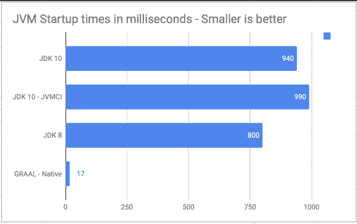
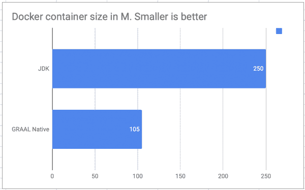
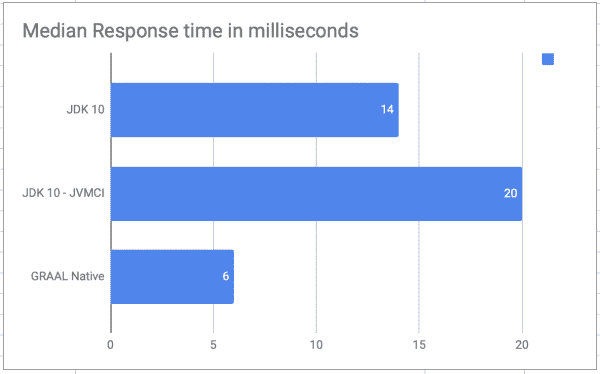

# 本机编译 Java 代码以获得更好的启动时间

> 原文：<https://developers.redhat.com/blog/2018/07/30/natively-compile-java-code-for-better-startup-time>

在大多数现代解决方案堆栈中，微服务和[无服务器架构](https://developers.redhat.com/topics/serverless-architecture)正在实施，或者是路线图的一部分。考虑到 Java 仍然是商业应用程序的主导语言，减少 [Java](https://developers.redhat.com/topics/enterprise-java) 启动时间的需求变得越来越重要。无服务器架构就是这样一个需要更快启动时间的领域，托管在容器平台上的应用程序，如 [Red Hat Openshift](https://www.openshift.com/) 可以受益于快速的 Java 启动时间和更小的 Docker 映像大小。

让我们看看 [GraalVM](https://www.graalvm.org) 如何在速度和大小改进方面对基于 Java 的程序有益。当然，这些优势并不局限于容器或无服务器架构，而是可以应用于各种用例。

GraalVM 允许您提前将程序编译成本机可执行文件。生成的程序不在 Java HotSpot VM 上运行，而是使用必要的组件，例如来自一个名为 Substrate VM 的虚拟机的不同实现的内存管理和线程调度。底层 VM 用 Java 编写，编译成本机可执行文件。与 Java VM 相比，生成的程序具有更快的启动时间和更少的运行时内存开销。(此定义参考自 Graal 网站)。

本文比较了以下指标:

*   使用 [GraalVM RC4](https://github.com/oracle/graal/releases) 对 [OpenJDK 10](http://jdk.java.net/10/) 的 JVM 启动时间
*   运行 uberjar 和本机二进制文件所需的最小 Docker 映像大小

这个练习的完整代码可以在这个[库](https://github.com/masoodfaisal/need4speed)中找到。库的 Netty 相关部分由 Codrut Stancu 通过他出色的[博客](https://medium.com/graalvm/instant-netty-startup-using-graalvm-native-image-generation-ed6f14ff7692)提供。

该项目使用以下工具:

*   [Graal](https://github.com/oracle/graal/releases)
*   [内蒂](http://netty.io/)
*   [Mongo 反应流](http://mongodb.github.io/mongo-java-driver-reactivestreams/1.9/)
*   [项目反应器](https://projectreactor.io/)
*   [贝吉塔](https://github.com/tsenart/vegeta)

我们先来对比一下启动时间。

## 启动时间

启动时间是程序启动和程序准备好接受请求之间的时间差。非常令人鼓舞的是，本地编译映像带给我们的平均启动时间为 17 毫秒，而 JVM 的平均启动时间为 850 毫秒。

这种改进保证了对需要快速启动时间的应用程序使用 Graal 本机映像，例如无服务器架构和容器。但是，本机编译有一些特定的限制，尤其是在反射和动态类加载的使用方面。这使得将所有应用程序迁移到原生二进制文件变得更加困难(至少目前如此)，但是随着 Graal 的每个版本，兼容性都在提高。

另一个值得注意的指标是本机映像的大小几乎是 uberjar 的两倍。uberjar 大约为 7.0MB，而本机二进制文件大约为 15MB。请记住，uberjar 需要 Java 运行时才能运行，正如您将在下面的“容器大小”一节中看到的那样，而使用本机映像时，Docker 容器的大小比使用 uberjar 容器时要小。

[](/sites/default/files/blog/2018/07/JVM-Startuptimes.png)

JVM 启动时间比较">

#### 设置

如果您想在本地运行这个应用程序，请确保设置了`MONGO_IP`(它定义了 MongoDB 数据库的 IP 地址)和`DIE`环境变量。如果`DIE`设置为任意值，该应用程序将在完全启动后立即终止。要运行该应用程序，您需要取消设置该变量。如果`DIE`变量未设置，应用程序将启动并接受请求。可以通过 http://localhost:8080/访问该应用程序。

要在本地运行应用程序，请执行以下操作:

```
$ git clone https://github.com/masoodfaisal/need4speed.git
$ cd netty-mongo-native
$ mvn clean install
$ export MONGO_IP=127.0.0.1
$ export DIE=true #or unset DIE if you want the application to stay alive
$ time java -jar target/netty-mongo-native-full.jar
```

通过以下命令可以获得应用程序的完整二进制文件。确保 Graal 在您的本地计算机上可用。

```
*native-image* -jar target/netty-mongo-native-full.jar \ 
-H:ReflectionConfigurationResources=netty_reflection_config.json \ 
-H:Name=netty-svm-http-server \ 
-H:+ReportUnsupportedElementsAtRuntime

```

启动时间是用 JDK 9 中新的 [JVM 编译器接口](http://openjdk.java.net/jeps/317) (JVMCI)选项来测量的。这里报告的测量时间是用以下 JVM 标志记录的:

```
-XX:+UnlockExperimentalVMOptions -XX:+EnableJVMCI -XX:+UseJVMCI
```

请注意，还没有通过[提前编译](http://openjdk.java.net/jeps/295) (AOTC)获得测量数据，看看 AOTC 会给组合带来什么变化会很有趣。

## 容器尺寸

本机编译工件的 Docker 映像还不到 JRE 容器大小的一半。原生编译极大地节省了 Docker 映像的大小，对于 Kubernetes 这样的容器环境来说，这可能是一个巨大的胜利。

[](/sites/default/files/blog/2018/07/Screen-Shot-2018-07-24-at-09.15.52.png)

集装箱尺寸比较">

#### 设置

[fedora-最小基础映像](https://registry.fedoraproject.org)被用作 JVM 和本地映像的运行时。以上度量中显示的尺寸是`docker images`命令的起始尺寸栏。

所有 Docker 文件都可以在源存储库中找到。使用以下命令构建映像:

```
$ docker build -t fedora-minimal:jvm --file DockerfileFedoraMinimalJVM .
$ docker build -t fedora-minimal:native --file DockerfileFedoraMinimalNative .
$ docker build -t fedora:jvm --file DockerfileFedoraJVM .
$ docker images
```

## 应用程序响应时间

响应时间表示每次执行的平均响应时间。这个练习并不是为了测量应用程序的性能，回购协议中提供的代码并没有针对性能进行优化。相反，重点是发现本机编译是否会给平均响应时间带来任何开销。从下面的数字可以看出，本机映像并没有给整体性能增加任何特定的开销。这个测试执行了不到一分钟，随着 Hotspot 的出现，JDK 响应时间可能会开始更接近本地响应时间。

[](/sites/default/files/blog/2018/07/Screen-Shot-2018-07-24-at-09.16.01.png)

响应时间比较">

#### 设置

[贝吉塔](https://github.com/tsenart/vegeta)，一个 HTTP 负载测试工具，用于在应用上施加 60 秒的负载。

测试使用了带有以下参数的`vegeta`:

```
*$ echo* "GET http://localhost:8080/" | \ 
  *./vegeta* attack -duration=60s -rate=200 -keepalive=false | \ 
  *tee* results.bin | \ 
  *./vegeta* report
```

一切都在配备英特尔酷睿 i7 处理器和 16GB 内存的笔记本电脑上运行。MongoDB 也在本地运行，没有对任何特定参数进行调优。

## 结论

无服务器架构可以受益于更快的启动时间。本文演示的配置展示了 GraalVM 如何减少基于 Java 的程序的启动时间和 Docker 映像大小。

对于托管在容器平台(如 [Red Hat OpenShift](https://developers.redhat.com/products/openshift/overview/) )上的 Java 应用程序，尝试使用 GraalVM 及其 AOTC 功能对它们进行本机编译，看看它们如何受益于更快的 Java 启动时间和更小的 Docker 映像大小。

*Last updated: January 17, 2022*