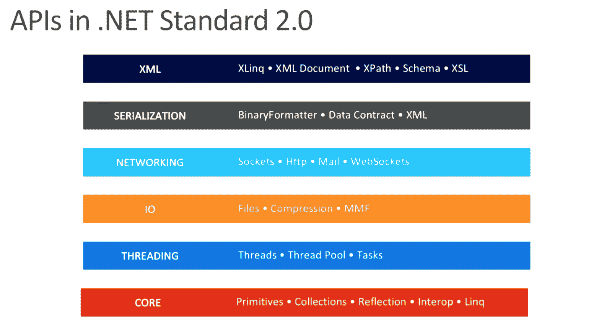

# 。NET Core 2.0 -常见问题

> 原文：<https://developers.redhat.com/articles/net-core-20-frequently-asked-questions>

## 介绍

1.  红帽宣布了什么？

    *   红帽已经宣布。NET Core 2.0 是一个开放源码的主要版本，对 1.0 和 1.1 版本进行了重大改进，现已普遍适用于 Red Hat Enterprise Linux、OpenShift 容器平台和相关平台。这个版本带来了。NET 核心更接近于与传统的。NET 框架，具有大量扩展的 API 支持。NET Standard 2.0 和对 NuGet 包更好的支持。此版本改进了创建便携的体验。跨 Windows、macOS 和 Linux 的. NET 服务器应用程序。
    *   这个版本遵循微软自己的。8 月 14 日网芯 2.0 公告。看他们在这个 9 频道[视频](https://learn.microsoft.com/en-us/shows/dotnet/net-core-20-released)的公告。

2.  为什么红帽制作？网芯 2.0 可用？

    *   。Red Hat 平台上的 NET Core 补充了企业中的 Java EE。现在。NET Core 是开源的，Red Hat 可以独一无二地提供完全开源的异构数据中心，这些数据中心已经在微服务和 Linux 容器上实现了标准化。

3.  怎么会？NET Core 2.0 适合红帽计划/产品组合吗？

    *   。NET Core 是开源开发工具和平台的巨大且不断增长的列表中的重要一员。
    *   。NET Core 在 Red Hat 平台上意味着客户可以选择开发和部署——无论是在本地还是在云中——并进一步支持 Red Hat 的开放式混合云战略。
    *   红帽的。NET Core 2.0 发行版将在 Linux 容器中交付，这使得微服务开发对。NET 开发人员。(我们也有 rpm 可用。)

## 这是给世卫组织的吗？

4.  为什么我要运行我的？红帽平台上的. NET 应用？

    *   容器和微服务是主要原因。红帽将能够区分。NET Core 在支持开放混合云策略的容器上本地运行。随着 OpenShift 容器平台扩展了容器的好处，也扩展了。设置、管理、开发运营等方面的净核心收益。

5.  为什么 IT/OPS 人员会关心。网芯 2.0？

    *   。NET Core 2.0 提供了在 Red Hat Enterprise Linux 或 OpenShift Container 平台上运行 Linux 容器的所有优势，同时允许。NET 开发人员可以自由地继续使用他们选择的语言和平台(如 Windows、macOS、Linux)进行开发。与。NET Core 2.0，现有代码更容易移植到 RHEL 的可能性也更大。
    *   已经喜欢 OpenShift 容器平台优势的 IT/运营人员将会喜欢部署它。网芯 2.0 在上面。

6.  请总结红帽的。NET Core 2.0 产品(短版)。

    *   Red Hat 提供了。NET Core 2.0，使开发人员能够创建 C#、F#和其他应用程序，并将它们作为 Linux 容器部署在 Red Hat Enterprise Linux、OpenShift 容器平台等上。免费的 Red Hat Enterprise Linux Developer 订阅是可用的，包括用于 Linux 容器开发的全套工具。访问网址:[RedHatLoves.NET](https://developers.redhat.com/products/dotnet/overview?utm_campaign=msbuild&utm_medium=vanityurl&utm_source=event&utm_term=redhatloves.net)。

7.  请总结红帽的。NET Core 2.0 产品(长版本)

    *   Red Hat 提供了。NET Core 2.0，使开发人员能够创建 C#、F#和其他应用程序，并将它们作为 Linux 容器部署在 Red Hat Enterprise Linux、OpenShift 容器平台等上。免费的 Red Hat Enterprise Linux Developer 订阅是可用的，包括用于 Linux 容器开发的全套工具。
    *   与。NET Core 2.0，开发人员会发现很容易部署他们现有的。NET 核心应用程序移植到 Red Hat 平台上，并获得 Linux 容器的横向扩展优势。当部署在基于云的 OpenShift 容器平台(公共或私有)上时，开发人员可以整合现代部署模型，包括蓝/绿、金丝雀(又名 AB)和/或断路器。访问网址:[RedHatLoves.NET](http://redhatloves.net)。

8.  我是一个【填空】，我为什么要在乎。网芯 2.0？

    *   IT/运营团队。NET Core 2.0 应用程序可以像其他基于容器的应用程序一样进行部署、扩展和管理。内部部署或云部署都是一样的。
    *   开发商。NET 开发人员可以自由地使用他们选择的语言和平台(如 Windows、macOS、Linux)进行开发。他们会想搬到。网芯来自。NET 框架，因为这是未来的方向——包括微服务和容器。
    *   开发管理-构建现代应用程序开发需要部署/扩展/管理的最新技术，此外，他们还需要引入诸如蓝/绿、金丝雀(又名 AB)和/或断路器等技术。
    *   管理人员-标准化开放式混合云，即使是传统的 Windows。NET 应用程序。使用 Linux 容器，迁移到 Red Hat 平台比以往任何时候都更容易。
    *   采购他们一如既往地购买相同的商品。已经包含了 NET Core。并且易于从 RHEL 升级到 OpenShift 产品。
    *   ISVs 端口，端口，端口他们传统的基于服务器或后端。NET 应用于 RHEL 和 OCP。他们的解决方案将受益于 Linux 容器的纵向扩展能力，并通过能够在内部或云中交付而脱颖而出。

## 开发和部署。网络核心

9.  对于移植有什么建议。NET 应用程序到红帽平台？

    为了做出明智的决定，我们建议您

    *   请看 Todd Mancini 的 Red Hat 博客文章:[关于从。NET 框架到。网芯](https://developers.redhat.com/blog/2016/12/08/observations-porting-from-net-framework-to-net-core/)。
    *   下面是微软对[的介绍。网标 2.0](https://devblogs.microsoft.com/dotnet/introducing-net-standard/) 。
    *   微软创建了 [API 端口](https://github.com/Microsoft/dotnet-apiport)来查看你的代码库与各种版本的兼容程度。净标准。
    *   看看微软的[。NET 标准文档](https://learn.microsoft.com/en-us/dotnet/standard/net-standard)来确保你能接触到对你来说重要的平台。

10.  我应该什么时候选择。NET 框架与。网芯？

    选择。NET Core 用于您的服务器应用程序，当:

    *   你想使用 Linux 容器和/或在 Red Hat Enterprise Linux、OpenShift 容器平台等上运行。
    *   您正在创建微服务。
    *   您需要更好的性能和可伸缩性。
    *   您需要的应用程序和版本隔离。NET 应用程序。

11.  我的应用程序可以从。NET 框架？

    *   对于基于服务器的应用程序来说，可能是这样，但是。需要网芯 2.0。70%的 NuGet 包都兼容。NET 标准 2.0。(那可是好多包啊。)
    *   兼容性垫片允许在中重用。NET 核心，无需编译。查看此微软[页面](https://github.com/dotnet/standard/tree/master/docs/netstandard-20#assembly-unification)了解更多信息。

12.  我试过了。NET Core 1.0，收效甚微。为什么会。网芯 2.0 更好？

    *   。网芯 2.0 是基于。NET Standard 2.0，比 1.0 多 20000 个 API。1.0 版本与其说是企业版，不如说是测试版。。NET 框架使用。NET 标准 2.0，因此功能和可移植性大大增强。
    *   看这个微软[介绍](https://devblogs.microsoft.com/dotnet/introducing-net-standard/)和单独[视频](https://www.youtube.com/watch?v=fOzcVwzkGP0)上。NET 标准 2.0 功能。这里还有一张截图。

1.  

    来源:斯科特·亨特幻灯片，来自 RH 峰会 2017 年会议，与唐·申克合作

13.  我如何得到？红帽的网芯 2.0？

    最初将提供两个图像(参见包装部分)

    *   registry.access.redhat.com/dotnet/dotnet-20-rhel7(源到图像生成器)和
    *   registry.access.redhat.com/dotnet/dotnet-20-runtime-rhel7(。NET Core 2.0 运行时映像)

    另外还有百胜安装的 rpm。查看更多关于红帽的信息。NET Core 2.0 入门指南。

14.  我可以在 RHEL 或 OCP 创建自己的 NuGet 服务器吗？

    *   不，NuGet 服务器目前只能在 Microsoft Windows 上运行。
    *   你可以从[nuget.org](https://www.nuget.org/)那里获得包裹。
    *   参见这篇博客文章，[nu get with 简介。RHEL 上的网芯](https://developers.redhat.com/blog/2017/08/16/introduction-to-nuget-with-net-core-on-rhel/)。

15.  是什么？NET Core 2.0 SDK 以及如何获取？

    *   的。NET SDK，传统上是。NET 框架平台捆绑在一起。NET Core 2.0 安装。红帽子。NET 核心发行版包括 SDK 和运行时。

16.  我可以使用 DevStudio/Eclipse IDE 进行。NET 开发？

    *   是的，但是没有像 VS Code 这样的 ide 所具有的基本特性。即将发布的 Eclipse 上游版本将包含对 Omnisharp 语言服务器的支持，这将解决这个问题。

## 包装

17.  微软已经声明这些是主要的。网络核心组件。红帽是如何包装他们的？

    *   红帽子。NET Core 2.0 将所有组件作为一个安装包含在内。

18.  是。RHEL 上有 NET Core 2.0 吗？

    *   是的。NET Core 2.0 将作为 rpm 提供，容器映像将在 Red Hat Registry 中提供。

19.  是。OpenShift 上可用的 NET Core 2.0？

    *   是的。最初，OpenShift 用户将手动加载 Red Hat 提供的图像流。NET Core 2.0 正式上市。
    *   在即将发布的版本中。NET Core 2.0 将与 OCP (imagestream)集成，并将取决于 OCP 的发布时间表。

20.  威尔怎么样？NET Core 2.0 为我们的客户打包？

    *   Red Hat 将分发 RPM 和 Linux 容器图像流。

21.  红帽子的。NET Core 2.0 实现拥有 Windows 和其他 Linux 发行版所拥有的一切？

    *   红帽的分布。NET Core 2.0 本质上与其他 Linux 发行版相同，但是我们也通过 Linux 容器提供它。
    *   Red Hat 发行版还不包括 ASP.NET，但是它对开发者来说是透明的。
    *   运行时包存储。包存储是一组组件(我们不提供)，它有助于使用户发布的工件变得更小。红帽的。NET Core 2.0 入门指南为此提供了解决方法。(更多信息可以在这里找到:[https://github.com/dotnet/designs/issues/8](https://github.com/dotnet/designs/issues/8)。因为我们的发行版中缺少它，我们预计一些独立的已发布应用程序会在运行时失败。微软在这里提供了一些替代方案:【https://github.com/dotnet/designs/issues/10】T2。)

## 库和标准

22.  是。与先前版本兼容的 NET Core 2.0 库。NET 标准版？

    *   是的。[根据微软](https://docs.microsoft.com/en-us/dotnet/standard/net-standard#net-platforms-support%20%22)，“。NET 标准版本在逻辑上是同心圆:更高的版本包含了以前版本的所有 API。版本之间没有重大变化。”

23.  我可以使用 2.0 之前的库吗？NET 标准版？

    *   使用 2.0 之前的版本。NET 标准版。不推荐使用 NET Core 2.0(也应该避免使用)。

24.  是。上面捆绑的 NET Standard 2.0？

    *   不可以。NET Standard 2.0 只是一个规范。用[。NET Standard 2.0 之后，应用程序的兼容性得到了改善。NET Core 2.0 和。NET Framework 4.6.1](https://github.com/dotnet/standard/blob/master/docs/versions.md) 。<

25.  我在哪里可以找到更多关于的信息。网标 2.0？

    *   微软的 github 网站在提供更多信息方面做得很好:[https://github.com/dotnet/standard/blob/master/docs/faq.md](https://github.com/dotnet/standard/blob/master/docs/faq.md)。

## 资源

26.  我在哪里可以找到更多关于红帽的信息。网芯 2.0？

    *   访问[RedHatLoves.NET](http://redhatloves.net)(这将重定向到的一般主题页面。网络核心:)
    *   红帽开发者计划[技术页面。网芯](https://developers.redhat.com/products/dotnet/overview/)。
    *   红帽[在博客](https://developers.redhat.com/search?t=.NET&f=type%7Earticle)上。网络核心:
    *   向 redhat DOT com 的 dotnet 发送电子邮件

*Last updated: January 9, 2023*