# Eclipse 2019-09 的 Red Hat code ready Studio 12 . 13 . 0 . ga 和 JBoss Tools 4.13.0.Final 中的新功能

> 原文：<https://developers.redhat.com/blog/2019/11/11/new-features-in-red-hat-codeready-studio-12-13-0-ga-and-jboss-tools-4-13-0-final-for-eclipse-2019-09>

[JBoss Tools 4.13.0](http://tools.jboss.org/documentation/whatsnew/jbosstools/4.13.0.Final.html) 和[Red Hat CodeReady Studio 12.13](https://developers.redhat.com/products/codeready-studio/overview)Eclipse 2019-09 在这里等你。在本文中，我将介绍新版本的亮点，并展示如何开始。

## 装置

Red Hat CodeReady Studio (之前被称为 Red Hat Developer Studio)的安装程序中预装了所有东西。只需从我们的 [Red Hat CodeReady Studio 产品页面](https://developers.redhat.com/products/codeready-studio/overview)下载并运行它，如下所示:

```
java -jar codereadystudio-<installername>.jar
```

JBoss Tools 或自带 Eclipse (BYOE) CodeReady Studio 需要更多。

这个版本至少需要 Eclipse 4.13 (2019-09)，但我们建议使用最新的 [Eclipse 4.13 2019-09 JEE 捆绑包](http://www.eclipse.org/downloads/packages/release/2019-09/r/eclipse-ide-java-ee-developers)，因为这样你就可以预装大多数依赖项。

一旦你安装了 Eclipse，你可以在 Eclipse Marketplace 的“JBoss Tools”或者“Red Hat CodeReady Studio”下找到我们

对于 JBoss 工具，您也可以直接使用我们的更新站点:

```
http://download.jboss.org/jbosstools/photon/stable/updates/
```

## 有什么新鲜事？

我们这次发布的主要焦点是对基于容器的开发和 bug 修复的改进。Eclipse 2019-06 本身有很多新的很酷的东西，但我将强调 Eclipse 2019-06 和 JBoss Tools 插件中我认为值得一提的几个更新。

### 红帽 OpenShift

#### OpenShift 容器平台 4.2 支持

随着新的 [OpenShift 容器平台(OCP) 4.2](https://developers.redhat.com/blog/2019/10/16/developer-tools-openshift/) 现已推出(参见[公告](https://www.redhat.com/en/about/press-releases/red-hat-expands-kubernetes-developer-experience-newest-version-red-hat-openshift-4))，即使这与 OCP 3 相比是一个重大转变，Red Hat CodeReady Studio 和 JBoss Tools 也以透明的方式与这个重大版本兼容。就像之前为 OCP 3 集群所做的那样，定义到基于 OCP 4.2 的集群的连接，并使用工具！

#### CodeReady Containers 1.0 服务器适配器

添加了新的服务器适配器来支持下一代 CodeReady Containers 1.0。尽管服务器适配器本身的功能有限，但它能够通过 crc 二进制文件启动和停止 CodeReady Containers 虚拟机。只需按 Ctrl+3(在 OSX 上是 Cmd+3)并键入`new server`，这将弹出一个设置新服务器的命令。


在过滤器文本框中输入`crc`。

您应该看到*Red Hat code ready Containers 1.0*服务器适配器。

[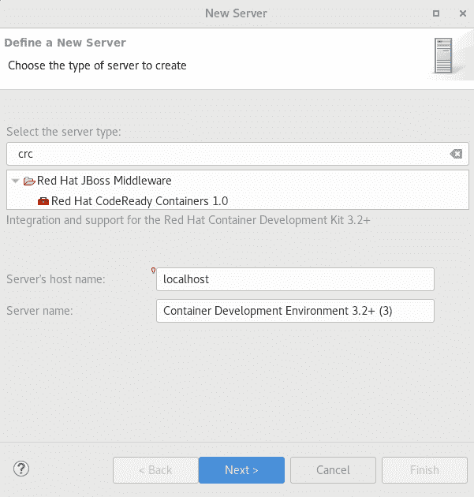](https://developers.redhat.com/blog/wp-content/uploads/2019/11/img_5dc28750dea1a.png)

选择*Red Hat code ready Containers 1.0*，点击*下一步*。

[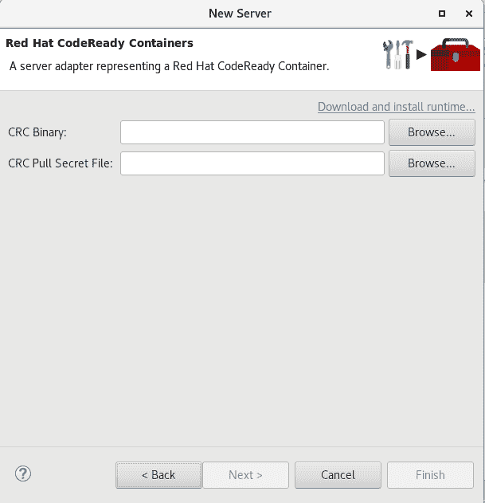](https://developers.redhat.com/blog/wp-content/uploads/2019/11/img_5dc2877a15c37.png)

你所要做的就是设置 CodeReady Containers crc 二进制文件的位置和 pull secret 文件的位置，可以从[https://cloud . red hat . com/open shift/install/CRC/installer-provisioned](https://cloud.redhat.com/openshift/install/crc/installer-provisioned)下载。

[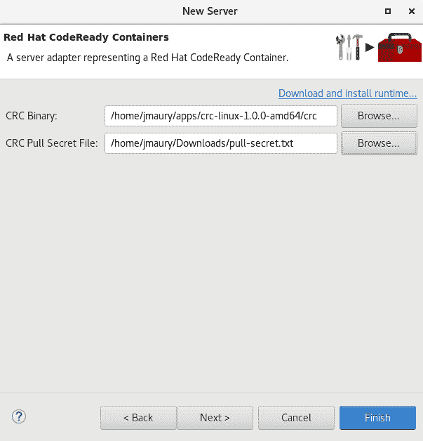](https://developers.redhat.com/blog/wp-content/uploads/2019/11/img_5dc28799cc391.png)

完成后，将会创建一个新的 CodeReady Containers 服务器适配器，并在 Servers 视图中可见。

[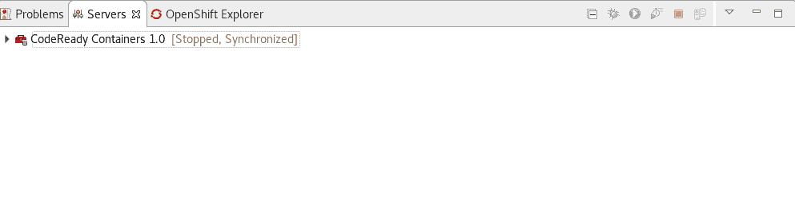](https://developers.redhat.com/blog/wp-content/uploads/2019/11/img_5dc287b585d64.png) 一旦服务器启动，一个新的 OpenShift 连接应该出现在 *OpenShift Explorer* 视图中，允许用户快速创建一个新的 OpenShift 应用程序，并开始在一个高度可复制的环境中开发他们的 AwesomeApp。

### [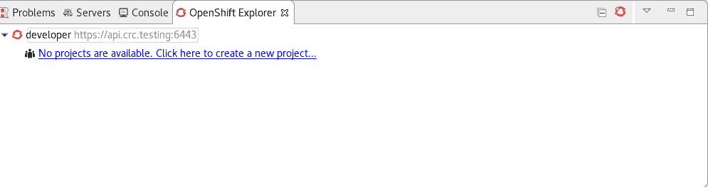](https://developers.redhat.com/blog/wp-content/uploads/2019/11/img_5dc287e49749c.png) 服务器工具

#### Wildfly 18 服务器适配器

一个服务器适配器已被添加到 Wildfly 18 中。它增加了对 Java EE 8 和 Jakarta EE 8 的支持。

#### EAP 7.3 Beta 服务器适配器

添加了一个服务器适配器，以便与 EAP 7.3 Beta 一起使用。

### 休眠工具

#### Hibernate 运行时提供程序更新

对可用的 Hibernate 运行时提供程序进行了大量的添加和更新。

Hibernate 5.4 运行时提供程序现在合并了 Hibernate 核心版本 5.4.7.Final 和 Hibernate 工具版本 5.4.7.Final。

Hibernate 5.3 运行时提供程序现在合并了 Hibernate 核心版本 5.3.13.Final 和 Hibernate 工具版本 5.3.13.Final。

### 平台

#### 视图、对话框和工具栏

##### 快速搜索

新的*快速搜索*对话框提供了一种方便、简单和快速的方式来运行整个工作区的文本搜索，并跳转到代码中的匹配项。该对话框提供了一个快速概览，快速显示匹配的文本行。它的更新速度和你打字的速度一样快，并且允许只使用键盘进行快速导航。典型的工作流从按下键盘快捷键 Ctrl+Alt+Shift+L(或者在 Mac 上按下 Cmd+Alt+Shift+L)开始。键入几个字母会在您键入时更新搜索结果。使用上下箭头键选择一个匹配项，然后按 Enter 键在编辑器中打开它。

[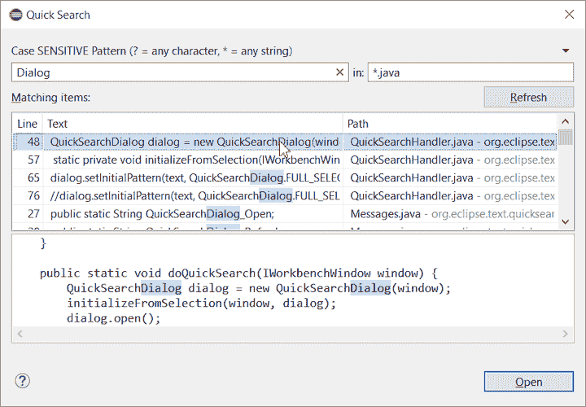](https://developers.redhat.com/blog/wp-content/uploads/2019/11/img_5dc288852cfb9.png)

##### 当项目浏览器获得焦点时保存编辑器

现在，即使项目浏览器拥有焦点，您也可以保存活动编辑器。在扩展为项目浏览器提供可保存项的情况下，扩展将被接受，项目浏览器上的保存操作将保存所提供的可保存项，而不是活动编辑器。

[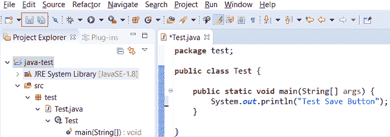](https://developers.redhat.com/blog/wp-content/uploads/2019/11/img_5dc288b0979ab.png)

##### 正常资源可用的“显示在”上下文菜单

在上下文菜单中的*显示现在对于*项目浏览器*上的资源项目中的元素是可用的。*

[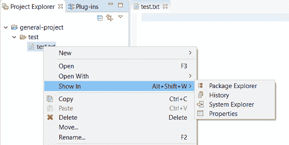](https://developers.redhat.com/blog/wp-content/uploads/2019/11/img_5dc288d81717c.png)

##### 在比较查看器中显示添加和删除的颜色

在没有合并和冲突的简单情况下，如双向比较或三向比较，*比较*查看器现在显示不同的颜色，这取决于文本是否被添加、删除或修改。默认颜色分别是绿色、红色和黑色。

[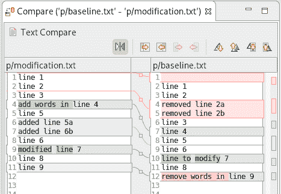](https://developers.redhat.com/blog/wp-content/uploads/2019/11/img_5dc288f9ed9e9.png)

可以通过通常的主题定制方法来定制颜色，包括使用颜色和字体首选项页面中的相关条目。

##### 编辑器状态行显示更多选择细节

文本编辑器的状态行现在显示光标位置，当编辑器选择了某个内容时，它还会显示所选内容中的字符数。这也适用于块选择模式。

这两个新增的状态行可以通过*通用>编辑器>文本编辑器*首选项页面禁用。

[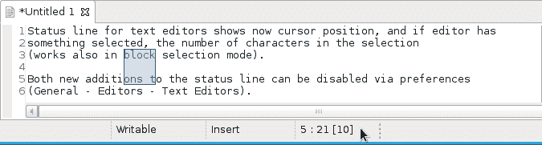](https://developers.redhat.com/blog/wp-content/uploads/2019/11/img_5dc2892891c5f.png)

[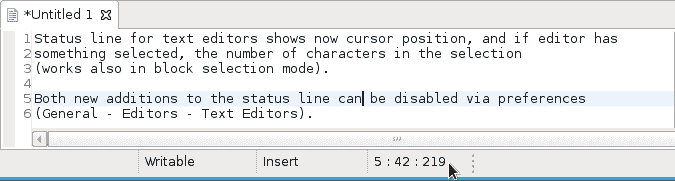](https://developers.redhat.com/blog/wp-content/uploads/2019/11/img_5dc2893cba375.png)

##### 较短的对话文本

几个对话文本被缩短了。这使您能够更快地捕捉重要信息。

前情提要:

[](https://developers.redhat.com/blog/wp-content/uploads/2019/11/img_5dc28962eb8b2.png)

现在:

[](https://developers.redhat.com/blog/wp-content/uploads/2019/11/img_5dc289809331d.png)

##### 通过中击关闭项目

在项目浏览器中，您现在可以使用鼠标中键关闭项目。

#### 调试

##### 改进了启动配置中环境选项卡的可用性

在*启动配置*对话框的*环境*选项卡中，您现在可以双击一个环境变量名或值，并直接从表中开始编辑它。

[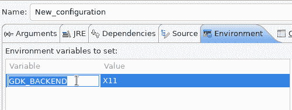](https://developers.redhat.com/blog/wp-content/uploads/2019/11/img_5dc289bbaa944.png)

右键单击环境变量表现在会打开一个上下文菜单，允许快速添加、删除、复制和粘贴环境变量。

[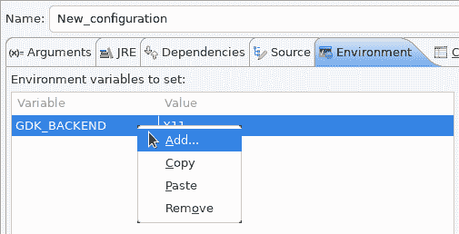](https://developers.redhat.com/blog/wp-content/uploads/2019/11/img_5dc289d4cbe63.png)

##### 显示外部程序启动的命令行

用于启动外部程序的*外部工具配置*对话框现在支持*显示命令行*按钮。

[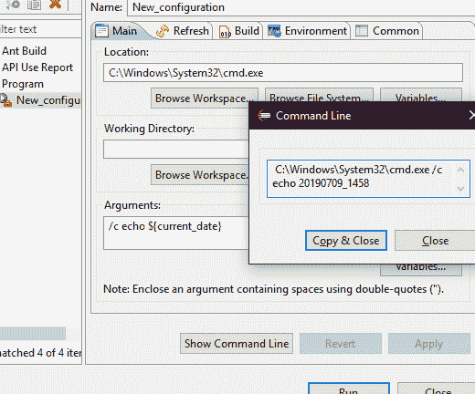](https://developers.redhat.com/blog/wp-content/uploads/2019/11/img_5dc289f8619f8.png)

#### 偏好；喜好；优先；参数选择

##### 当达到 99 个打开的编辑器时，自动关闭编辑器

默认情况下，现在会启用自动关闭编辑器的首选项。当你打开 99 个文件时，它就会被触发。如果您继续打开编辑器，旧的编辑器将被关闭，以保护您免受性能问题的影响。您可以通过*通用>编辑器>关闭*编辑器自动首选项，在*首选项*对话框中修改此设置。

##### 文本编辑器外观颜色选项的表内颜色预览

你现在可以从位于*首选项>常规>编辑器>文本编辑器*页面的*外观*颜色选项表中看到*文本编辑器*中当前使用的所有颜色。

[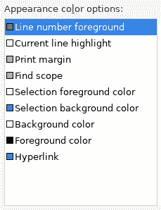](https://developers.redhat.com/blog/wp-content/uploads/2019/11/img_5dc28a2598121.png)

##### Eclipse SDK 中 UI 冻结的自动检测

Eclipse SDK 已经被配置为在新工作区的错误日志视图中默认显示 UI 冻结的堆栈跟踪。您可以使用这些信息来识别和报告 Eclipse IDE 中运行缓慢的部分。

[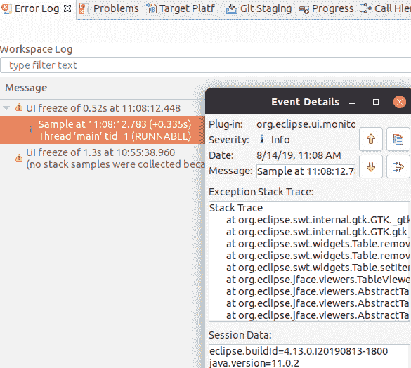](https://developers.redhat.com/blog/wp-content/uploads/2019/11/img_5dc28a6127521.png)

您可以通过如下所示的*常规> UI 响应监控*首选项页面中的选项禁用监控或调整其设置。

[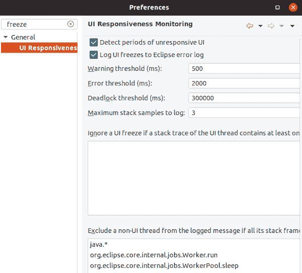](https://developers.redhat.com/blog/wp-content/uploads/2019/11/img_5dc28a7e4e8cf.png)

#### 主题和风格

##### 基于操作系统主题在黑暗主题中自动启动

在 Linux 和 Mac 上，当 OS 主题是黑暗的时候，Eclipse 现在可以在黑暗主题中自动启动。默认情况下，这是可行的，即在新的工作区中，或者当用户没有在 Eclipse 中显式设置或更改主题时。

##### 帮助内容的显示尊重操作系统主题

越来越多的操作系统提供了全系统的黑暗主题。当 Eclipse 帮助内容显示在外部浏览器中时，Eclipse 现在会考虑这种系统范围的主题设置。这样做的先决条件是有一个支持 preferred-color-scheme CSS 媒体查询的浏览器。

截至撰写本文时，以下浏览器版本支持它:

*   火狐 67 版
*   Chrome 版本 76
*   Safari 版本 12.1

[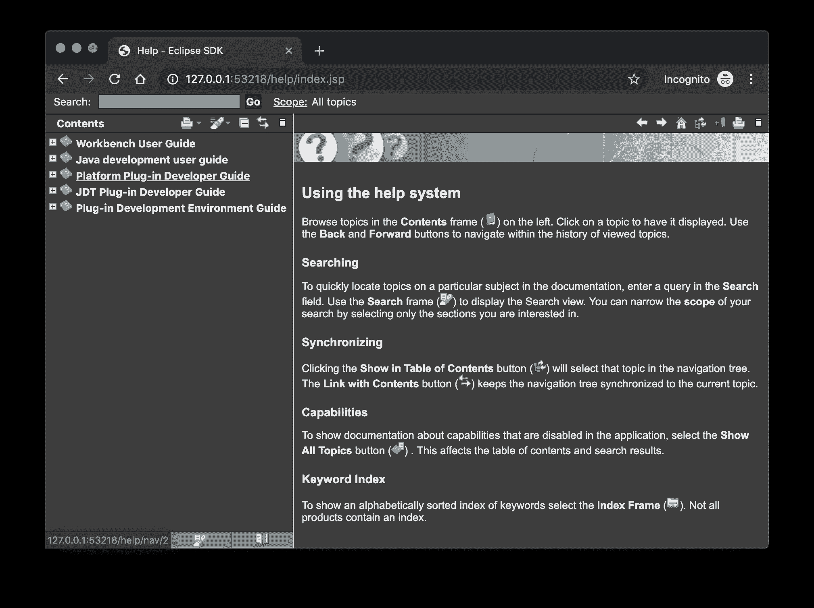](https://developers.redhat.com/blog/wp-content/uploads/2019/11/img_5dc28ac00ce7a.png) 帮助内容使用高分辨率图标。

帮助系统，以及 Eclipse 平台、Java 开发工具和插件开发环境的帮助内容，现在都使用高分辨率图标。它们现在在高分辨率显示器上很清晰，在黑暗主题下也看起来更好。

[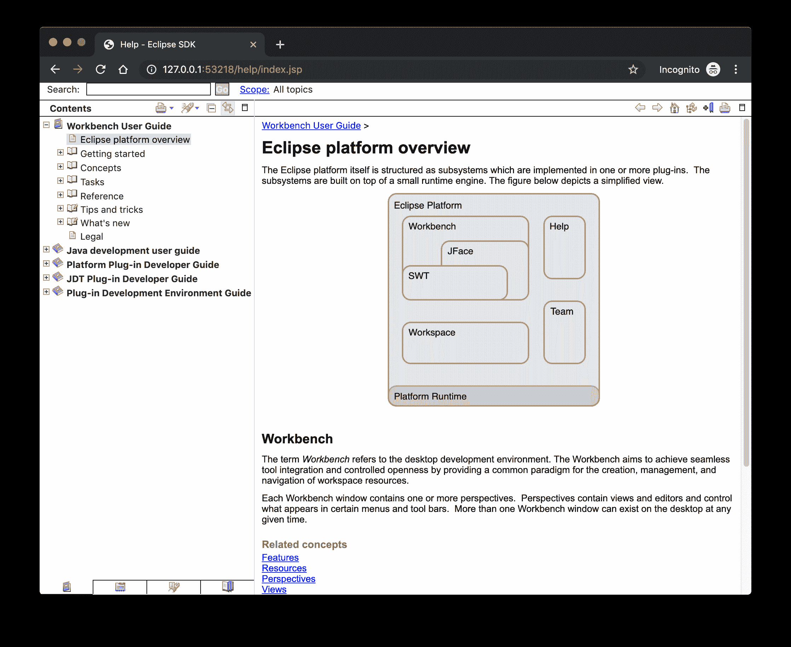](https://developers.redhat.com/blog/wp-content/uploads/2019/11/img_5dc28b01e109f.png)

##### 改进了 Windows 上的黑暗主题

现在，表单上的标签、部分、复选框、单选按钮、表单文本和框格在 windows 的深色模式下使用正确的背景颜色。

[](https://developers.redhat.com/blog/wp-content/uploads/2019/11/img_5dc28b336d5f5.png)

#### 常规更新

##### 互动表演

在这个版本中，交互性能得到了进一步的改进，并且修复了几个 UI 冻结问题。

##### 调用命令时显示键绑定

对于演示、截屏和学习目的，在调用命令时显示相应的键绑定非常有帮助。当命令被调用(通过按键绑定或菜单交互)时，按键绑定、命令的名称和描述显示在屏幕上。

[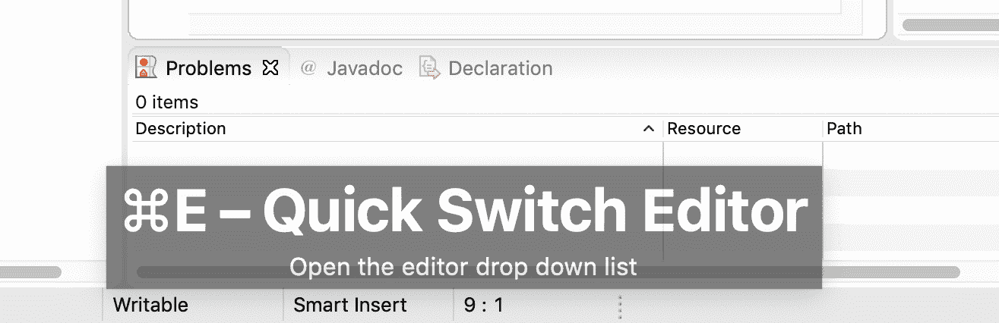](https://developers.redhat.com/blog/wp-content/uploads/2019/11/img_5dc28b754fce3.png)

您可以通过*通用>按键*首选项页面上的*显示调用命令时的按键绑定*复选框，在*首选项*对话框中激活此选项。要快速切换此设置，您可以使用*切换是否显示键绑定*命令(例如，通过快速访问)。

### java 开发工具 _jdt)

#### Java 13 支持

Java 13 出来了，Eclipse JDT 通过 Marketplace 支持 4.13 版的 Java 13。

该版本特别包括以下 Java 13 特性:

*   JEP 354:开关表达式(预览)。
*   JEP 355:文本块(预览)。

请注意，这些是预览语言功能；因此，*启用预览*选项应该打开。有关该支持的非正式介绍，请参考 [Java 13 示例 wiki](https://wiki.eclipse.org/Java13/Examples) 。

#### Java 视图和对话框

##### 在控制台中同步标准和错误输出

*Eclipse 控制台*视图目前不能确保混合标准和错误输出的显示顺序与运行进程产生的顺序相同。对于 Java 应用程序，launch configuration*Common*选项卡现在提供了一个合并标准和错误输出的选项。这确保了标准和错误输出以产生的相同顺序显示，但也禁用了错误输出的单独着色。

[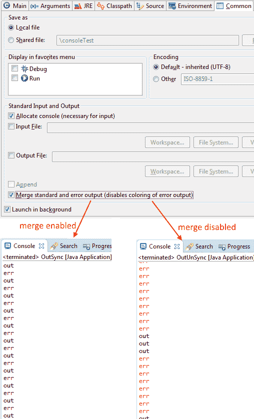](https://developers.redhat.com/blog/wp-content/uploads/2019/11/img_5dc28bcc0f373.png)

#### Java 编辑器

##### 使用集合转换为增强的“for”循环

Java quick fix/clean up*Convert to enhanced‘for’循环*现在在遍历集合的`for`循环中提供。循环必须引用`size`方法作为条件的一部分，如果访问主体中的元素，必须使用`get`方法。除了`isEmpty`之外的所有其他收集方法都会使提供的快速修复无效。

[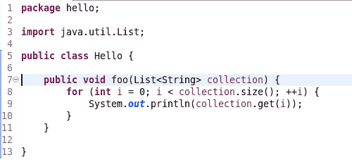](https://developers.redhat.com/blog/wp-content/uploads/2019/11/img_5dc28bf5d868d.png)

[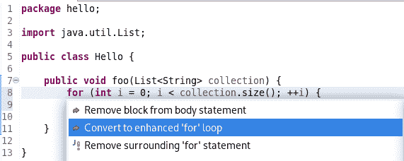](https://developers.redhat.com/blog/wp-content/uploads/2019/11/img_5dc28c0a94307.png)

[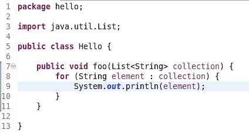](https://developers.redhat.com/blog/wp-content/uploads/2019/11/img_5dc28c25a78cf.png)

##### 初始化“最终”字段

现在提供了一个 Java quickfix 来初始化类构造函数中未初始化的`final`字段。该修复将把一个`String`初始化为空字符串，把一个数值基类型初始化为 0，对于类字段，它使用它们的默认构造函数初始化它们(如果有的话),如果没有默认构造函数，则使用`null`。

[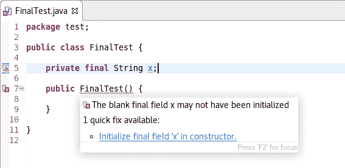](https://developers.redhat.com/blog/wp-content/uploads/2019/11/img_5dc28c4e3af01.png)

[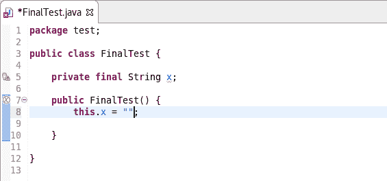](https://developers.redhat.com/blog/wp-content/uploads/2019/11/img_5dc28c5d5925e.png)

##### 自动装箱和拆箱

尽可能使用*自动装箱*和*拆箱*。只有 Java 5 和更高版本才支持这些特性。

[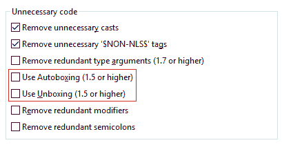](https://developers.redhat.com/blog/wp-content/uploads/2019/11/img_5dc28c83f066f.png)

##### 改进的冗余修改器移除

*移除多余的修饰符*现在也移除接口上无用的`abstract`修饰符。

[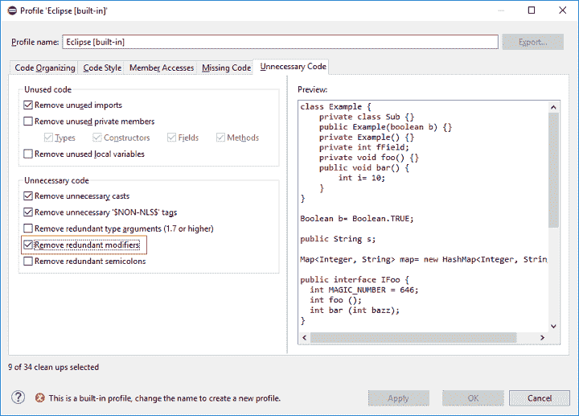](https://developers.redhat.com/blog/wp-content/uploads/2019/11/img_5dc28ce95318e.png)

对于给定的代码:

[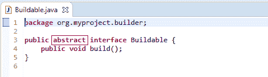](https://developers.redhat.com/blog/wp-content/uploads/2019/11/img_5dc28d0358ad7.png)

你得到这个:

[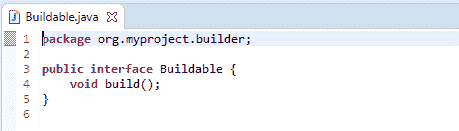](https://developers.redhat.com/blog/wp-content/uploads/2019/11/img_5dc28d1d55c4a.png)

##### 模块的 Javadoc 注释生成

向 Java 模块(module-info.java)添加 Javadoc 注释将导致根据新的模块注释首选项添加自动注释。

[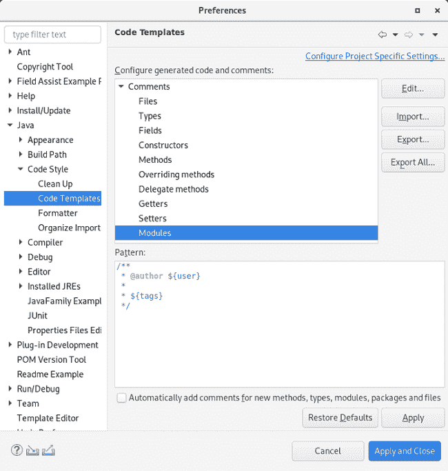](https://developers.redhat.com/blog/wp-content/uploads/2019/11/img_5dc28d4d0982d.png)

`$(tags)`指令将为所有用途添加`@uses`和`@provides`标签，并提供模块语句。

[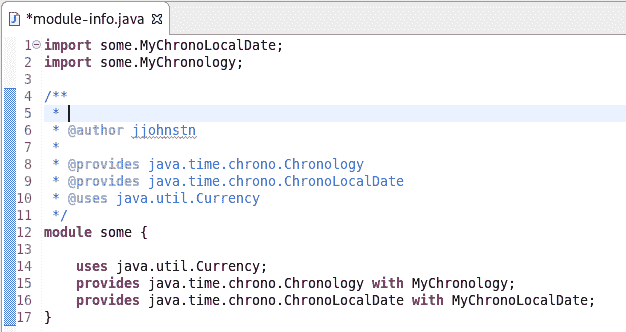](https://developers.redhat.com/blog/wp-content/uploads/2019/11/img_5dc28d68efcdf.png)

##### 链完成代码辅助

将提供“链模板提案”的代码帮助。这些将遍历可到达的局部变量、字段和方法，以产生一个链，其返回类型与特定上下文中的预期类型兼容。

可以在*内容助手* t 菜单组的*高级*子菜单中找到启用该功能的首选项(*首选项> Java >编辑器>内容助手>高级*)。

[](https://developers.redhat.com/blog/wp-content/uploads/2019/11/img_5dc28d8d75fbc.png)

#### Java 格式化程序

##### 删除多余的空行

现在可以配置*空白行*部分的所有设置来移除多余的空白行，有效地优先于*数量的空白行来保留*设置。每个设置都有自己的按钮来打开该功能，就在它的数字控制旁边。只有当选择的行数小于*要保留的空行数时，该按钮才可用；*否则，任何多余的行都会被删除。

[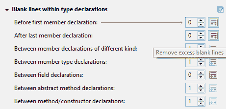](https://developers.redhat.com/blog/wp-content/uploads/2019/11/img_5dc28dbac187d.png)

##### 空行设置中的更改

格式化程序配置文件的*空行*部分有很多变化。

一些现有的子部分和设置现在以不同的方式表达，以更好地表达它们的功能:

*   类声明小节中的*空行现在是类型声明中的*空行。**
*   *在第一个声明之前*现在是*在第一个成员声明之前。*
*   *以前同类的声明*现在是不同类成员声明之间的*。*
*   *之前的成员类声明*现在是成员类型声明之间的*。*
*   字段声明前的*现在是字段声明间的*。
*   方法声明之前的*现在是方法/构造函数声明之间的*。

更重要的是，增加了一些新的设置来支持更多可以控制空行数量的地方:

*   *在类型中最后一个成员声明*之后(补充先前存在的*在第一个成员声明*设置之前)。
*   类型中的抽象方法声明之间的*(这些情况以前由方法/构造函数声明*之间的*处理)。*
*   *在方法/构造函数体*的末尾(补充先前存在的*在方法/构造函数体*设置的开头)。
*   *在代码块的开始*和*在代码块的结束。*
*   *带代码块的语句前*和*带代码块的语句后。*
*   *在“switch”中的语句组之间*

大多数新设置都放在方法/构造函数声明中的一个新的子部分*空行中。*

[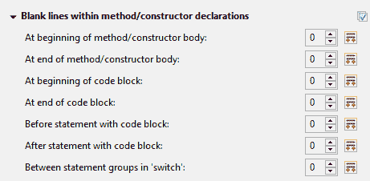](https://developers.redhat.com/blog/wp-content/uploads/2019/11/img_5dc28de77401f.png)

#### 朱尼特

##### JUnit 5.5.1

JUnit 5.5.1 已经发布，Eclipse JDT 已经更新为使用这个版本。

#### 调试

##### 增强了发布期间对修补程序模块的支持

Java 启动配置现在支持在启动期间通过不同的来源修补不同的模块。这可以在 Java 启动配置中的*依赖关系*选项卡的*覆盖依赖关系……*对话框中进行验证。

[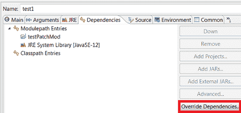](https://developers.redhat.com/blog/wp-content/uploads/2019/11/img_5dc28e37adacb.png)

[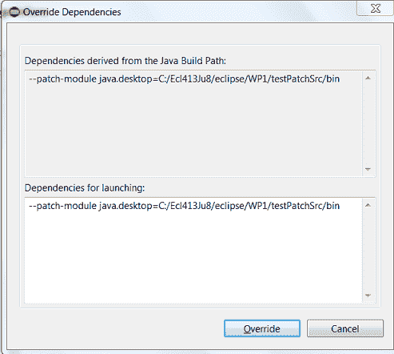](https://developers.redhat.com/blog/wp-content/uploads/2019/11/img_5dc28e47bb578.png)

#### Java 构建

##### 基于 JDT 核心首选项更改的完整构建

如果工作区自动构建打开，手动更改项目的设置文件`.settings/org.eclipse.jdt.core.prefs`将导致完整的项目构建。例如，从 git 存储库中提取不同的设置或者用工具生成设置，现在会触发一个构建。请注意，这包括时间戳更改，即使实际设置文件内容没有更改。

对于 4.13 版本，可以使用 VM 属性:`-Dorg.eclipse.disableAutoBuildOnSettingsChange=true`禁用这一新行为。计划在未来的版本中删除此 VM 属性。

### 还有更多…

您可以在本页的[中找到更多值得注意的更新。](https://tools.jboss.org/documentation/whatsnew/jbosstools/4.13.0.Final.html)

## 下一步是什么？

随着 JBoss Tools 4.13.0 和 Red Hat CodeReady Studio 12.13 的发布，我们已经在为 Eclipse 2019-12 的下一个版本工作。

*Last updated: July 1, 2020*