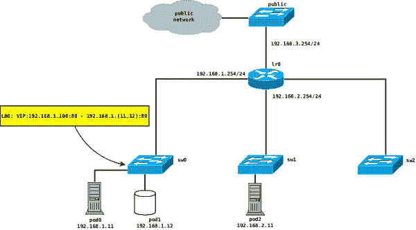

# 开放式虚拟网络捆绑

> 原文：<https://developers.redhat.com/blog/2020/01/27/open-virtual-network-unidling>

开放式虚拟网络(OVN)是作为[开放式虚拟交换机(OVS)](http://www.openvswitch.org/) 的子组件而诞生的项目，这是一种高性能、可编程、多平台的虚拟交换机。OVN 允许 OVS 用户通过引入虚拟网络抽象(如虚拟交换机和路由器)来本地创建覆盖网络。此外，OVN 还提供了设置访问控制列表(ACL)和 DHCP 等网络服务的方法。许多红帽产品，如[红帽 OpenStack 平台](https://www.redhat.com/en/technologies/linux-platforms/openstack-platform)、[红帽虚拟化](https://www.redhat.com/en/technologies/virtualization/enterprise-virtualization)和[红帽 OpenShift 容器平台](https://developers.redhat.com/products/openshift/overview)，都依赖 OVN 来配置网络功能。

在本文中，我将讨论 OVN *解链接*问题，以及如何使用建议的解决方案将事件转发到 CMS(例如 OpenStack 或 OpenShift)。

## Unidling 问题:OpenShift 用例

图 1 显示了一个简化的 OVN-库伯内特部署。覆盖网络通过本地网络端口(本例中为`ln-public`)连接到外部网络:

[](/sites/default/files/blog/2019/12/ovn-unidling.png)Figure 1: A simplified OVN-Kubernetes deployment.">

下面是相关的 OVN NB 数据库网络配置:

```
switch e2564770-8658-4086-8f41-9995d5ff0da2 (sw1)  
   port sw1-p0  
   addresses: ["00:00:00:00:00:33 192.168.2.11"]  
   port lrp1-attachment  
   type: router  
   addresses: ["00:00:00:ff:00:02"]  
   router-port: lrp1  
switch 512be578-1c95-4ac0-b196-8f5ef38a1517 (sw0)  
   port sw0-p0  
   addresses: ["00:00:00:00:00:11 192.168.1.11"]  
   port sw0-p1  
   addresses: ["00:00:00:00:00:12 192.168.1.12"]  
   port lrp0-attachment  
   type: router  
   addresses: ["00:00:00:ff:00:01"]  
   router-port: lrp0  
switch ee2b44de-7d2b-4ffa-8c4c-2e1ac7997639 (public)  
   port ln-public  
       type: localnet  
       addresses: ["unknown"]  
   port lrp2-attachment  
       type: router  
       addresses: ["00:00:00:00:ff:03"]  
       router-port: lrp2  
router 681dfe85-6f90-44e3-9dfe-f1c81f4cfa32 (lr0)  
   port lrp2  
       mac: "00:00:00:00:ff:03"  
       networks: ["192.168.3.254/24"]  
   port lrp1  
       mac: "00:00:00:00:ff:02"  
       networks: ["192.168.2.254/24"]  
   port lrp0  
       mac: "00:00:00:00:ff:01"  
       networks: ["192.168.1.254/24"]  

```

OVN 负载平衡器(LB)服务用于在运行的 pod 之间解复用流量。LB 配置存储在 OVN 诺斯德(OVN-NB)数据库的`Load_Balancer`表中:

```
_uuid               : 7381bdc2-cb26-40e9-93db-d7f733c8afbd  
external_ids        : {}  
health_check        : []  
ip_port_mappings    : {}  
name                : lb0  
protocol            : tcp  
vips                : {"192.168.1.100:80"="192.168.1.11:80,192.168.1.12:80"}  

```

但是，在非活动超时之后，可以通过 OpenShift 关闭给定的 pod，并且从负载平衡器配置中删除相关的后端，从而产生没有后端的虚拟 IP (VIP ):

```
_uuid               : f93bca28-87b4-4d98-9193-b49644f15ee6  
external_ids        : {}  
health_check        : []  
ip_port_mappings    : {}  
name                : lb0  
protocol            : tcp  
vips                : {"192.168.1.100:80"=""}  

```

因此，系统会导致死锁状态，因为如果没有正确的网络配置，OVN 不会将暂停服务的新数据包转发到相关的 pod。

## 建议的解决方案:`Controller_Event`

为了克服这种限制，已经提出了一种[解决方案](https://github.com/openvswitch/ovs/commit/f732a1ab9c574c1c17858a84cf7d25f294dfb151)，其中[将一个新表](https://github.com/ovn-org/ovn/blob/master/ovn-sb.ovsschema#L355)、`Controller_Event`添加到 OVN 南行数据库中。此外，新的`trigger_event`逻辑流已经被引入到 OVN 管道中，以便每当 OVN 接收到没有后端的 LB 规则的 IP 分组时，生成*控制器事件*:

```
 table=4 (ls_in_pre_lb       ), priority=130  , match=(ip4.dst == 192.168.1.100 && tcp && tcp.dst == 80), action=(trigger_event(event = "empty_lb_backends", meter = "event-elb", vip = "192.168.1.100:80", protocol = "tcp", load_balancer = "38350663-862f-4aae-94e7-c0149e11d293");)

```

OVN `trigger_event`动作将把未经请求的事件转换成`Controller_Event`表中的新行，允许 CMS 被通知关于“暂停”服务的请求:

```
_uuid               : c4d5493a-a630-47f8-adbb-e20a402e69de  
chassis             : 24852cd2-bea6-48fd-b77a-95d2e47c836c  
event_info          : {load_balancer="9d6542eb-6533-4d3c-b0a5-4e54826968b6", protocol=tcp, vip="192.168.1.100:80"}  
event_type          : empty_lb_backends  
seq_num             : 1

```

最近，控制器事件也被[整合到`ovn-kubernetes`](https://github.com/ovn-org/ovn-kubernetes/commit/7a789d00f89e90f29bdba3abfab8a797c242c8dc) 中。

## 未来的发展

由于所提出的框架并不仅仅局限于解除锁定场景，因此对所描述的方法的一个可能的未来增强可以是扩展`trigger_event`动作，以便向 CMS 报告更多未经请求的事件，从而允许 CMS 采取必要的动作。

## 额外资源

查看其他与 OVN 和 OVS 相关的文章:

*   [如何创建一个开放的虚拟网络分布式网关路由器](https://developers.redhat.com/blog/2018/11/08/how-to-create-an-open-virtual-network-distributed-gateway-router/)
*   [开放虚拟网络中的动态 IP 地址管理(OVN):第一部分](https://developers.redhat.com/blog/2018/09/03/ovn-dynamic-ip-address-management/)
*   [开放虚拟网络中的动态 IP 地址管理(OVN):第二部分](https://developers.redhat.com/blog/2018/09/27/dynamic-ip-address-management-in-open-virtual-network-ovn-part-two/)
*   [RHEL 无根开放式虚拟交换机](https://developers.redhat.com/blog/2018/03/23/non-root-open-vswitch-rhel/)
*   [打开 vSwitch-DPDK:多少 Hugepage 内存？](https://developers.redhat.com/blog/2018/03/16/ovs-dpdk-hugepage-memory/)
*   [打开 vSwitch: QinQ 性能](https://developers.redhat.com/blog/2017/06/27/open-vswitch-qinq-performance/)
*   [OVN 的 IP 包缓冲](https://developers.redhat.com/blog/2018/12/07/ip-packet-buffering-in-ovn/)

*Last updated: June 29, 2020*