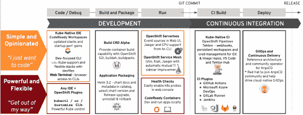

# OpenShift 4.5:用 Kubernetes 1.18 和更多的东西带给开发者快乐

> 原文：<https://developers.redhat.com/blog/2020/08/18/openshift-4-5-bringing-developers-joy-with-kubernetes-1-18-and-so-much-more>

自 2015 年第一个[红帽 OpenShift](https://developers.redhat.com/products/openshift/getting-started) 发布以来，红帽已经发布了无数基于 [Kubernetes](https://developers.redhat.com/topics/kubernetes) 的版本。五年后， [Kubernetes 迎来了它的第六个生日](https://www.openshift.com/blog/happy-6th-birthday-kubernetes)，上个月，我们宣布了 [Red Hat OpenShift 容器平台 4.5](https://www.openshift.com/blog/openshift-4.5-arrives-bringing-new-supported-installations) 的全面上市。在本文中，我提供了最新 OpenShift 版本及其基于 [Kubernetes 1.18](https://kubernetes.io/blog/2020/03/25/kubernetes-1-18-release-announcement/) 的技术和特性更新的高级视图。

尽管 OpenShift 4.5 本身带来了许多改进，但许多其他 Red Hat 贡献增强了开发人员对该版本的体验。图 1 显示了使用 OpenShift 4.5 时改善操作和开发体验的[额外技术更新](https://www.redhat.com/en/about/press-releases/red-hat-advances-kubernetes-across-cloud-native-toolchain-updated-developer-portfolio)的范围。

Figure 1: Additional technology updates that improve the operational and development experience using OpenShift 4.5.

**注**:没有两个开发者是一样的。开发人员有不同的技能、背景，并且喜欢不同的开发环境。一些开发人员希望关注平台细节，而一些不希望。在 Red Hat，我们专注于与开发人员会面，并在流行的开源项目中提供稳定性和体验改进，作为我们开发人员工具的一部分。

## 平台支持

OpenShift 4.5 包括 Kubernetes 1.18 版本，该版本专注于为大规模操作提供稳定性的装配和完成工作。OpenShift Container Platform 4.5 的开发人员体验改进包括 [web 控制台更新](https://developers.redhat.com/blog/2020/07/16/whats-new-in-the-openshift-4-5-console-developer-experience/)，一键式导航以将运行状况检查探针添加到您的部署中，虚拟机与您的容器的统一体验，以及在 web 终端中轻松访问命令行工具。图 2 显示了新的一键式导航工具，用于向部署添加运行状况检查。

Figure 2: One-click health checks for your OpenShift 4.5 deployments.

### OpenShift 无服务器

[OpenShift 无服务器 1.7.2](https://docs.openshift.com/container-platform/4.5/serverless/serverless-getting-started.html) 向 [Knative Serving](https://developers.redhat.com/topics/serverless-architecture) 0.13.3、Knative Eventing 0.13.0 以及相关的命令行界面(CLI)工具`kn` 0.13.2 提供更新。总之，这些更新提供了无服务器的自动缩放，灵活的流量路由，以及跨 Kubernetes 应用程序的安全连接。OpenShift web 控制台支持简单的事件源创建。

### OpenShift 服务网格

[OpenShift Service Mesh 1 . 1 . 5](https://docs.openshift.com/container-platform/4.5/service_mesh/service_mesh_arch/understanding-ossm.html)带来了对 [Istio 1.4.8](https://developers.redhat.com/topics/service-mesh) 的升级，通过 Kafka 支持 Jaeger 流，并从 open shift 的 web 控制台链接到 Kiali web 控制台。Istio 1.4 支持自动相互 TLS 边车改进。它还支持离线环境中的用户进行离线安装。

## 命令行工具

OpenShift 4.5 提供了对命令行工具的更新，如`odo`、Helm 和`oc new-app`命令。

### 奥多

[odo 2.0](http://odo.dev) 是面向在 OpenShift 上编写、构建和部署应用程序的开发人员的 CLI。它使用开发人员熟悉的`git push`风格的语法，包含在 OpenShift 中，并为开发人员提供了一种迭代代码的新方法。`odo` 2.0 版本支持 Kubernetes 和 OpenShift，并通过标准定义和快速迭代开发为工具提供开放模型。这种新模式和快速开发在技术预览版中可用于使用 [Quarkus](https://developers.redhat.com/products/quarkus/getting-started) 、 [Node.js](https://developers.redhat.com/blog/category/node-js/) 和 [Python](https://developers.redhat.com/blog/category/python/) 的 [Java](https://developers.redhat.com/topics/enterprise-java) 。OpenShift 的所有 IDE 扩展都利用了`odo`，将迭代开发和部署流程直接带给开发人员。

### 舵

Helm 3.2 是 Kubernetes 的一个包管理器，帮助开发人员创建名为*图表*的模板包，用于安装和更新应用程序。最新的更新包括在开发人员目录中显示丰富的图表描述，并通过直接在 OpenShift 控制台中升级和回滚等功能来管理 Helm 版本的生命周期。

### 新应用主管

`oc new-app`命令现在默认创建 Kubernetes 部署，也可以创建 OpenShift `DeploymentConfigs`。

## CI/CD

OpenShift 4.5 还提供了一系列 CI/CD 更新，从 OpenShift 管道到 Tekton Hub、Red Hat extensions for IDEs 和 Argo CD。

### OpenShift 管道

[OpenShift Pipelines 1.1](https://docs.openshift.com/container-platform/4.5/pipelines/understanding-openshift-pipelines.html) 通过免维护的 Kubernetes-native [CI/CD 管道](https://developers.redhat.com/topics/ci-cd)，自动化并控制跨内部和公共云平台的应用交付。最新的更新增加了对 Git webhooks、私有 Git 存储库的凭证管理和图像注册的增强，以及对 Prometheus 中管道指标的洞察。

### 泰克顿中心

此外， [Tekton Hub](https://hub-preview.tekton.dev) 在 Tekton 社区内推出，作为发现和使用管道中 Tekton 资源的中心。

### 阿尔戈光盘

Argo CD 是一个用于 Kubernetes 的声明式连续交付工具，遵循 GitOps 模式，将 Git 存储库视为应用程序和基础设施配置和部署的真实来源。Red Hat [最近作为指导委员会的成员加入了 Argo CD 社区](https://www.redhat.com/en/about/press-releases/red-hat-and-intuit-join-forces-argo-project-extending-gitops-community-innovation-better-manage-multi-cluster-cloud-native-applications-scale),目的是将 Argo CD 纳入开发人员工具的 OpenShift 组合中。

### 用于 CI/CD 系统的 Red Hat 扩展

针对 CI/CD 系统的 Red Hat 扩展允许团队在使用最适合他们需求的 CI/CD 工具的同时，最大限度地利用 OpenShift 和 Kubernetes。我们更新了代码为的 Tekton 扩展。这些 CI/CD 扩展允许开发人员为 [Azure DevOps](https://marketplace.visualstudio.com/items?itemName=redhat.openshift-vsts) 、 [GitHub Actions](https://github.com/marketplace/actions/openshift-action) 、 [Jenkins](https://plugins.jenkins.io/ui/search?sort=relevance&categories=&labels=&view=Tiles&page=1&query=openshift) 和 Tekton 执行 OpenShift 和 Kubernetes 的命令。您还可以使用 Tekton、Jenkins 和新发布的选项[在 OpenShift](https://www.openshift.com/blog/installing-the-gitlab-runner-the-openshift-way) 上运行 GitLab runners，在集群上运行 CI/CD 作业。

## ide 和扩展

OpenShift 4.5 还与许多 IDE 相关的改进进行了交互。

### Red Hat 代码就绪工作区

[Red Hat code ready work spaces 2.2](https://www.redhat.com/en/technologies/jboss-middleware/codeready-workspaces)使用 Kubernetes 和 containers 为开发或运营团队成员提供一致、安全、零配置的开发环境。这个版本允许更快的工作空间加载——哪个开发人员不喜欢更快的工具呢？此外，还可以支持多个 devfile 注册表，这允许来自各种来源的额外的语言、框架和运行时支持。您可以使用适当的 Kubernetes 请求和限制来调优工作区，以优化资源利用率和性能。

### Red Hat CodeReady 工作室

[Red Hat code ready Studio 12.16](https://www.redhat.com/en/technologies/jboss-middleware/codeready-studio)是一个基于 Eclipse 的 IDE，预先配置为支持 Red Hat 的应用程序开发组件和工具。此更新允许您为 OpenShift 应用程序组件创建安全的 URL(路由)。其他更新包括 Hibernate 和 Wildfly 的新版本。

### ide 的 Red Hat 扩展

ide 的 Red Hat 扩展旨在让团队使用他们已经拥有的工具，同时利用新技术，如 OpenShift、Kubernetes、 [Kafka](https://developers.redhat.com/topics/kafka-kubernetes) 、Camel、Quarkus、Tekton 等等。我们已经更新了针对 [VS Code](https://marketplace.visualstudio.com/publishers/redhat) 和[JetBrains](https://plugins.jetbrains.com/plugin/12030-openshift-connector-by-red-hat)IDE 的 IDE 扩展，包括 IntelliJ 和 Pycharm。

## 运行时间

随着最近 Quarkus 作为 Red Hat 应用服务组合中受支持的运行时的加入，开发人员可以将 Quarkus 与 JVM 优化一起使用，从而减少新 Java 应用程序的启动时间和内存消耗。Quarkus 让 Java 非常适合云原生、[微服务、](https://developers.redhat.com/topics/microservices/)[事件驱动的应用架构](https://developers.redhat.com/topics/event-driven/)。此外，它通过一个应用程序扩展生态系统[来刺激运行时之外的创新](https://code.quarkus.io/)，该生态系统配置、引导和集成一个框架或技术到 Quarkus 应用程序中。

**注意** : OpenShift 4.5 包含更多更新。请务必查看 [Red Hat Developer 的中间件和应用服务](https://developers.redhat.com/middleware)页面了解详情。

## 结论

我能在这份报告中包括的就这么多了。随着时间的推移，我会添加关于通过 Red Hat Marketplace 和社区 Kubernetes 运营商的自动化操作使用应用服务的详细信息。我还会添加关于 OpenShift 4.5 中任何 [VS 代码扩展](https://marketplace.visualstudio.com/publishers/redhat)的特定更新的详细信息。

我们努力提供工具和服务，为在 Kubernetes 和 OpenShift 上工作的各种开发人员带来快乐。我们实现这一目标的方法之一是尽早并经常获得反馈。您可以通过加入我们主办的[反馈会议](https://groups.google.com/g/openshift-dev-users)或直接向您感兴趣的任何开源项目提交反馈来参与其中。您也可以访问 [Red Hat 开发者工具门户](https://developers.redhat.com/topics/developer-tools)，了解更多信息并开始使用本文中提到的工具。

*Last updated: August 17, 2020*