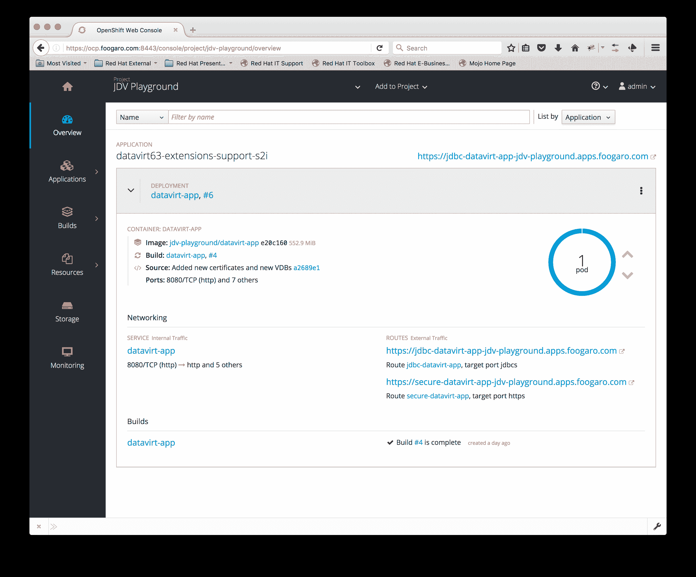

# OpenShift 上的 JBoss 数据虚拟化:集成远程 SQL Server 数据库

> 原文：<https://developers.redhat.com/blog/2018/01/04/openshift-jboss-data-virtualization-sql-server>

这个例子展示了如何在 OpenShift 上使用一个定制的数据库驱动程序，通过一个虚拟数据库(又名 VDB)连接到一个外部数据库。对于这个例子，我们将使用一个 Microsoft SQL Server 数据库(信不信由你，它运行在 Linux 容器上)，以及最新的 SQL Server JDBC 驱动程序。

## 先决条件

在你开始之前，确保你的防火墙和其他安全工具处于*许可*模式。

以下是遵循示例所需的工具列表:

*   互联网连接
*   Git 客户端
*   OpenJDK 1.8
*   码头工人
*   OpenShift oc 命令行客户端

如果您拥有有效的 OpenShift Enterprise 订阅来访问下载页面，则可以从 Red Hat 客户门户下载并解压缩 OpenShift oc cli 工具，以便在 Linux、MacOSX 和 Windows 客户端上使用。

* * *

**编者按:[Red Hat Container Development Kit](https://developers.redhat.com/products/cdk/overview/)包含一个单节点 OpenShift 集群，您可以在本地机器上运行。加入红帽开发者，下载[红帽开发套件](https://developers.redhat.com/products/devsuite/overview/)即可获得。**

* * *

## Git 克隆项目

要获得本例所需的文件，克隆我的 github 库:

```
$ git clone https://github.com/foogaro/jdv-playground.git
```

然后导航到`ocp`文件夹，因为这将是我们的工作目录。

## 设置 SQL Server 数据库

Docker 应该启动并运行，如果没有，请按如下方式启动它:

```
$ service docker start
Redirecting to /bin/systemctl start  docker.service
```

在容器上运行 SQL Server，如下所示:

```
$ docker run --name="sqlserver-loves-linux" -e 'ACCEPT_EULA=Y' -e 'SA_PASSWORD=datavirt.2017' -p 1433:1433 -d microsoft/mssql-server-linux:latest
Unable to find image 'microsoft/mssql-server-linux:latest' locally
Trying to pull repository registry.access.redhat.com/microsoft/mssql-server-linux ...
Trying to pull repository docker.io/microsoft/mssql-server-linux ...
latest: Pulling from docker.io/microsoft/mssql-server-linux
f6fa9a861b90: Downloading [======================>                            ] 20.91 MB/46.41 MB
da7318603015: Downloading [==================================================>]    851 B/851 B
6a8bd10c9278: Download complete
d5a40291440f: Download complete
bbdd8a83c0f1: Download complete
3a52205d40a6: Downloading [========================>                          ] 14.45 MB/28.98 MB
6192691706e8: Downloading [=====================>                             ] 16.51 MB/38.7 MB
1a658a9035fb: Waiting
97fa7291bda1: Waiting
b27ed30c4cf6: Waiting
```

完成后，您应该已经启动并运行了数据库，如下所示:

```
$ docker ps -aq
CONTAINER ID        IMAGE                                                                                                                               COMMAND                  CREATED             STATUS                         PORTS                    NAMES
d0bc27cdbf85        microsoft/mssql-server-linux:latest                                                                                                 "/bin/sh -c /opt/mssq"   2 hours ago         Up 2 hours                     0.0.0.0:1433->1433/tcp   sqlserver-loves-linux
```

一旦启动并运行了数据库，就可以登录并创建数据库、模式和表，如下所示:

### 创建数据库

```
/opt/mssql-tools/bin/sqlcmd -S localhost -U SA -P datavirt.2017 -Q "CREATE DATABASE DATAVIRT2;"
```

### 创建表格

```
/opt/mssql-tools/bin/sqlcmd -S localhost -U SA -P datavirt.2017 -Q "USE DATAVIRT2;
CREATE TABLE dbo.ITEMS ( 
 ITEM_ID INT NOT NULL, 
 ITEM_CODE VARCHAR(20) NOT NULL, 
 ITEM_DESCRITION VARCHAR(255) ,
 DT_INSERT DATETIME NOT NULL,
 DT_UPDATE DATETIME NOT NULL,
 CONSTRAINT PK_ITEM_ID PRIMARY KEY (ITEM_ID)
);"
```

### 填充表格

```
/opt/mssql-tools/bin/sqlcmd -S localhost -U SA -P datavirt.2017 -Q "USE DATAVIRT2;
INSERT INTO dbo.ITEMS (ITEM_ID, ITEM_CODE, ITEM_DESCRITION, DT_INSERT, DT_UPDATE) VALUES (1, '0000-0000-0000-0001', 'One', GETDATE(), GETDATE());
INSERT INTO dbo.ITEMS (ITEM_ID, ITEM_CODE, ITEM_DESCRITION, DT_INSERT, DT_UPDATE) VALUES (2, '0000-0000-0000-0002', 'Two', GETDATE(), GETDATE());
INSERT INTO dbo.ITEMS (ITEM_ID, ITEM_CODE, ITEM_DESCRITION, DT_INSERT, DT_UPDATE) VALUES (3, '0000-0000-0000-0003', 'Three', GETDATE(), GETDATE());
INSERT INTO dbo.ITEMS (ITEM_ID, ITEM_CODE, ITEM_DESCRITION, DT_INSERT, DT_UPDATE) VALUES (4, '0000-0000-0000-0004', 'Four', GETDATE(), GETDATE());
INSERT INTO dbo.ITEMS (ITEM_ID, ITEM_CODE, ITEM_DESCRITION, DT_INSERT, DT_UPDATE) VALUES (5, '0000-0000-0000-0005', 'Five', GETDATE(), GETDATE());
INSERT INTO dbo.ITEMS (ITEM_ID, ITEM_CODE, ITEM_DESCRITION, DT_INSERT, DT_UPDATE) VALUES (6, '0000-0000-0000-0006', 'Six', GETDATE(), GETDATE());
INSERT INTO dbo.ITEMS (ITEM_ID, ITEM_CODE, ITEM_DESCRITION, DT_INSERT, DT_UPDATE) VALUES (7, '0000-0000-0000-0007', 'Seven', GETDATE(), GETDATE());
INSERT INTO dbo.ITEMS (ITEM_ID, ITEM_CODE, ITEM_DESCRITION, DT_INSERT, DT_UPDATE) VALUES (8, '0000-0000-0000-0008', 'Eight', GETDATE(), GETDATE());
INSERT INTO dbo.ITEMS (ITEM_ID, ITEM_CODE, ITEM_DESCRITION, DT_INSERT, DT_UPDATE) VALUES (9, '0000-0000-0000-0009', 'Nine', GETDATE(), GETDATE());
INSERT INTO dbo.ITEMS (ITEM_ID, ITEM_CODE, ITEM_DESCRITION, DT_INSERT, DT_UPDATE) VALUES (10, '0000-0000-0000-0010', 'Ten', GETDATE(), GETDATE());"
```

## 奔跑的 OCP

OC 客户端工具将使用 docker 创建它需要的所有节点，比如 Docker 注册表、HAProxy 节点等等。保持 OpenShift 配置是一个很好的做法，所以我们最终不需要重新导入表格、图像等等。
以下是我们将用于发布 OCP 的脚本:

```
oc cluster up \
--host-data-dir="/opt/rh/oc-cluster-up/data"  \
--host-pv-dir="/opt/rh/oc-cluster-up/pv"  \
--host-volumes-dir="/opt/rh/oc-cluster-up/vol" \
--logging=false \
--metrics=true \
--public-hostname="ocp.foogaro.com" \
--routing-suffix="apps.foogaro.com" \
--use-existing-config ocp-datavirt
```

随意更改主机名和路由后缀。另外，确保在您的`/etc/hosts`文件中添加主机名。
如果一切正常启动，您应该会得到如下输出:

```
Starting OpenShift using registry.access.redhat.com/openshift3/ose:v3.6.173.0.5 ...
OpenShift server started.

The server is accessible via web console at:
    https://ocp.foogaro.com:8443

```

## 登录 OCP

我们现在可以开始使用 OpenShift 容器平台了。
首先我们需要以*系统管理员*的身份登录，导入我们需要的 Docker *图片*，如下:

```
oc login -u system:admin https://127.0.0.1:8443
Logged into "https://127.0.0.1:8443" as "system:admin" using existing credentials.

You have access to the following projects and can switch between them with 'oc project <projectname>':

  * default
    kube-public
    kube-system
    myproject
    openshift
    openshift-infra

Using project "default".
```

要以系统管理员的身份访问平台，您不需要凭证，因为它使用的是安装过程中创建的证书。
进入后，我们可以开始导入模板，如下所示:

```
oc create -n openshift -f https://raw.githubusercontent.com/jboss-openshift/application-templates/master/jboss-image-streams.json
oc create -n openshift -f https://raw.githubusercontent.com/jboss-openshift/application-templates/master/datavirt/datavirt63-basic-s2i.json
oc create -n openshift -f https://raw.githubusercontent.com/jboss-openshift/application-templates/master/datavirt/datavirt63-extensions-support-s2i.json
oc create -n openshift -f https://raw.githubusercontent.com/jboss-openshift/application-templates/master/datavirt/datavirt63-secure-s2i.json
```

现在我们已经将模板加载到平台中，我们可以使用它们来创建我们的项目。
以*管理员*的身份首次登录，如下所示:

```
oc login -u admin -p admin
Login successful.

You don't have any projects. You can try to create a new project, by running

 oc new-project <projectname>

```

现在创建一个项目:

```
oc new-project jdv-playground --description="JDV Playground on OCP" --display-name="JDV Playground"
```

现在创建应用程序，如下所示:

```
oc new-app --template=datavirt63-extensions-support-s2i \
-p APPLICATION_NAME=datavirt-app \
-p CONFIGURATION_NAME=datavirt-app-config \
-p SOURCE_REPOSITORY_URL=https://github.com/foogaro/jdv-playground \
-p SOURCE_REPOSITORY_REF=master \
-p CONTEXT_DIR=ocp/vdbs \
-p EXTENSIONS_REPOSITORY_URL=https://github.com/foogaro/jdv-playground \
-p EXTENSIONS_REPOSITORY_REF=master \
-p EXTENSIONS_DIR=ocp/drivers \
-p EXTENSIONS_DOCKERFILE=Dockerfile \
-p SERVICE_ACCOUNT_NAME=datavirt-service-account \
-p HTTPS_SECRET=datavirt-app-secret \
-p HTTPS_KEYSTORE=keystore.jks \
-p HTTPS_KEYSTORE_TYPE=JKS \
-p HTTPS_NAME=datavirt \
-p HTTPS_PASSWORD=datavirt.2017 \
-p TEIID_USERNAME=teiidUser \
-p TEIID_PASSWORD=datavirt.2017 \
-p MODESHAPE_USERNAME=modeshapeUser \
-p MODESHAPE_PASSWORD=datavirt.2017 \
-p IMAGE_STREAM_NAMESPACE=jdv-playground \
-p JGROUPS_ENCRYPT_SECRET=datavirt-app-secret \
-p JGROUPS_ENCRYPT_KEYSTORE=jgroups.jceks \
-p JGROUPS_ENCRYPT_NAME=datavirt \
-p JGROUPS_ENCRYPT_PASSWORD=datavirt.2017 \
-p JGROUPS_CLUSTER_PASSWORD=datavirt.2017 \
-p VDB_DIRS=
```

这将自动创建应用程序，并开始基于代码和资源文件构建映像。在构建第一批图像时，我们需要创建几个秘密并将它们链接到我们的应用程序，如下所示:

```
oc create serviceaccount datavirt-service-account
oc policy add-role-to-user view system:serviceaccount:jdv-play:datavirt-service-account -n jdv-playground
oc secrets new datavirt-app-secret keystore.jks jgroups.jceks -n jdv-playground
oc secrets new datavirt-app-config datasources.env -n jdv-playground
oc secrets link datavirt-service-account datavirt-app-secret datavirt-app-config -n jdv-playground
```

接下来，为构建配置和部署配置创建以下环境变量，如下所示:

```
oc env bc/datavirt-app VDB_DIRS=
oc env dc/datavirt-app SQLSERVER_DS_DATABASE=DATAVIRT
oc env dc/datavirt-app SQLSERVER_DS_JNDI=java:/SQLSERVER_DS
oc env dc/datavirt-app SQLSERVER_DS_USERNAME=sa
oc env dc/datavirt-app SQLSERVER_DS_PASSWORD=datavirt.2017
oc env dc/datavirt-app SQLSERVER_DS_URL="jdbc:sqlserver://192.168.59.105:1433;DatabaseName=DATAVIRT;"
oc env dc/datavirt-app SQLSERVER_DS_SERVICE_HOST=192.168.59.105
oc env dc/datavirt-app SQLSERVER_DS_SERVICE_PORT=1433
```

如果需要重新开始构建，请执行以下操作:

```
oc start-build datavirt-app-ext
```

如果您需要删除*服务账号*和*机密*，请执行以下操作:

```
oc delete secrets datavirt-app-secret
oc delete secrets datavirt-app-config
oc delete serviceaccount datavirt-service-account
```

如果您需要提供自己的证书，下面是我如何创建我的证书:

```
keytool -genkeypair -alias datavirt -storetype JKS   -keystore keystore.jks  -storepass "datavirt.2017" -keypass "datavirt.2017" --dname "CN=lfugaro,OU=Consulting,O=redhat.com,L=Raleigh,S=NC,C=US"
keytool -genseckey  -alias datavirt -storetype JCEKS -keystore jgroups.jceks -storepass "datavirt.2017" -keypass "datavirt.2017" --dname "CN=lfugaro,OU=Consulting,O=redhat.com,L=Raleigh,S=NC,C=US"
```

### 网络控制台

如果一切正常，您应该能够连接到端口 8443 上的 web 控制台，以 admin 身份登录(密码也是“admin”)，并看到类似下图的内容:

[](https://github.com/foogaro/jdv-playground/blob/master/ocp/ocp-console.png)

### 从 VDB 获取数据

JDV 开箱即用通过 OData 协议版本 2 和 4 公开其数据。可以使用以下 URL 获取数据库的模式:

[http://data virt-app-jdv-playground . apps . foogaro . com/odata 4/ITEMS/ITEMS/$ metadata](http://datavirt-app-jdv-playground.apps.foogaro.com/odata4/ITEMS/ITEMS/$metadata)

其中`odata4`指定要使用的协议版本；第一个*项*指的是 VDB 名称，第二个*项*指的是模式。
输出应该是这样的:

```
<?xml version='1.0' encoding='UTF-8'?>
<edmx:Edmx Version="4.0" xmlns:edmx="http://docs.oasis-open.org/odata/ns/edmx">
    <edmx:Reference Uri="http://datavirt-app-jdv-playground.apps.foogaro.com/odata4/static/org.apache.olingo.v1.xml">
        <edmx:Include Namespace="org.apache.olingo.v1" Alias="olingo-extensions"/>
    </edmx:Reference>
    <edmx:DataServices>
        <Schema xmlns="http://docs.oasis-open.org/odata/ns/edm" Namespace="ITEMS.1.ITEMS" Alias="ITEMS">
            <EntityType Name="ITEMS">
                <Key>
                    <PropertyRef Name="ITEM_ID"/>
                </Key>
                <Property Name="ITEM_ID" Type="Edm.Int32" Nullable="false"/>
                <Property Name="ITEM_CODE" Type="Edm.String" Nullable="false" MaxLength="20"/>
                <Property Name="ITEM_DESCRITION" Type="Edm.String" MaxLength="255"/>
                <Property Name="DT_INSERT" Type="Edm.DateTimeOffset" Nullable="false" Precision="4"/>
                <Property Name="DT_UPDATE" Type="Edm.DateTimeOffset" Nullable="false" Precision="4"/>
            </EntityType>
            <EntityContainer Name="ITEMS">
                <EntitySet Name="ITEMS" EntityType="ITEMS.ITEMS"/>
            </EntityContainer>
        </Schema>
    </edmx:DataServices>
</edmx:Edmx>
```

上面的 XML 代码显示了 datatabse 的结构，以及它所拥有的实体表。
我们有一个名为*物品*的表格。要访问该表，请指向以下 URL:

[http://data virt-app-jdv-playground . apps . foogaro . com/odata 4/ITEMS/ITEMS/ITEMS](http://datavirt-app-jdv-playground.apps.foogaro.com/odata4/ITEMS/ITEMS/ITEMS)

输出应该是这样的:

```
<?xml version='1.0' encoding='UTF-8'?>
<a:feed xmlns:a="http://www.w3.org/2005/Atom" xmlns:m="http://docs.oasis-open.org/odata/ns/metadata"
        xmlns:d="http://docs.oasis-open.org/odata/ns/data" m:context="$metadata#ITEMS">
    <a:id>http://datavirt-app-jdv-playground.apps.foogaro.com/odata4/ITEMS/ITEMS/ITEMS</a:id>
    <a:entry>
        <a:id>http://datavirt-app-jdv-playground.apps.foogaro.com/odata4/ITEMS/ITEMS/ITEMS(1)</a:id>
        <a:title/>
        <a:summary/>
        <a:updated>2017-12-10T00:24:38Z</a:updated>
        <a:author>
            <a:name/>
        </a:author>
        <a:link rel="edit" href="http://datavirt-app-jdv-playground.apps.foogaro.com/odata4/ITEMS/ITEMS/ITEMS(1)"/>
        <a:category scheme="http://docs.oasis-open.org/odata/ns/scheme" term="#ITEMS.1.ITEMS.ITEMS"/>
        <a:content type="application/xml">
            <m:properties>
                <d:ITEM_ID m:type="Int32">1</d:ITEM_ID>
                <d:ITEM_CODE>0000-0000-0000-0001</d:ITEM_CODE>
                <d:ITEM_DESCRITION>One</d:ITEM_DESCRITION>
                <d:DT_INSERT m:type="DateTimeOffset">2017-12-09T19:52:50.797Z</d:DT_INSERT>
                <d:DT_UPDATE m:type="DateTimeOffset">2017-12-09T19:52:50.797Z</d:DT_UPDATE>
            </m:properties>
        </a:content>
    </a:entry>
    <a:entry>
        <a:id>http://datavirt-app-jdv-playground.apps.foogaro.com/odata4/ITEMS/ITEMS/ITEMS(2)</a:id>
        <a:title/>
        <a:summary/>
        <a:updated>2017-12-10T00:24:38Z</a:updated>
        <a:author>
            <a:name/>
        </a:author>
        <a:link rel="edit" href="http://datavirt-app-jdv-playground.apps.foogaro.com/odata4/ITEMS/ITEMS/ITEMS(2)"/>
        <a:category scheme="http://docs.oasis-open.org/odata/ns/scheme" term="#ITEMS.1.ITEMS.ITEMS"/>
        <a:content type="application/xml">
            <m:properties>
                <d:ITEM_ID m:type="Int32">2</d:ITEM_ID>
                <d:ITEM_CODE>0000-0000-0000-0002</d:ITEM_CODE>
                <d:ITEM_DESCRITION>Two</d:ITEM_DESCRITION>
                <d:DT_INSERT m:type="DateTimeOffset">2017-12-09T19:52:50.797Z</d:DT_INSERT>
                <d:DT_UPDATE m:type="DateTimeOffset">2017-12-09T19:52:50.797Z</d:DT_UPDATE>
            </m:properties>
        </a:content>
    </a:entry>
    <a:entry>
        <a:id>http://datavirt-app-jdv-playground.apps.foogaro.com/odata4/ITEMS/ITEMS/ITEMS(3)</a:id>
        <a:title/>
        <a:summary/>
        <a:updated>2017-12-10T00:24:38Z</a:updated>
        <a:author>
            <a:name/>
        </a:author>
        <a:link rel="edit" href="http://datavirt-app-jdv-playground.apps.foogaro.com/odata4/ITEMS/ITEMS/ITEMS(3)"/>
        <a:category scheme="http://docs.oasis-open.org/odata/ns/scheme" term="#ITEMS.1.ITEMS.ITEMS"/>
        <a:content type="application/xml">
            <m:properties>
                <d:ITEM_ID m:type="Int32">3</d:ITEM_ID>
                <d:ITEM_CODE>0000-0000-0000-0003</d:ITEM_CODE>
                <d:ITEM_DESCRITION>Three</d:ITEM_DESCRITION>
                <d:DT_INSERT m:type="DateTimeOffset">2017-12-09T19:52:50.8Z</d:DT_INSERT>
                <d:DT_UPDATE m:type="DateTimeOffset">2017-12-09T19:52:50.8Z</d:DT_UPDATE>
            </m:properties>
        </a:content>
    </a:entry>
    <a:entry>
        <a:id>http://datavirt-app-jdv-playground.apps.foogaro.com/odata4/ITEMS/ITEMS/ITEMS(4)</a:id>
        <a:title/>
        <a:summary/>
        <a:updated>2017-12-10T00:24:38Z</a:updated>
        <a:author>
            <a:name/>
        </a:author>
        <a:link rel="edit" href="http://datavirt-app-jdv-playground.apps.foogaro.com/odata4/ITEMS/ITEMS/ITEMS(4)"/>
        <a:category scheme="http://docs.oasis-open.org/odata/ns/scheme" term="#ITEMS.1.ITEMS.ITEMS"/>
        <a:content type="application/xml">
            <m:properties>
                <d:ITEM_ID m:type="Int32">4</d:ITEM_ID>
                <d:ITEM_CODE>0000-0000-0000-0004</d:ITEM_CODE>
                <d:ITEM_DESCRITION>Four</d:ITEM_DESCRITION>
                <d:DT_INSERT m:type="DateTimeOffset">2017-12-09T19:52:50.807Z</d:DT_INSERT>
                <d:DT_UPDATE m:type="DateTimeOffset">2017-12-09T19:52:50.807Z</d:DT_UPDATE>
            </m:properties>
        </a:content>
    </a:entry>
    <a:entry>
        <a:id>http://datavirt-app-jdv-playground.apps.foogaro.com/odata4/ITEMS/ITEMS/ITEMS(5)</a:id>
        <a:title/>
        <a:summary/>
        <a:updated>2017-12-10T00:24:38Z</a:updated>
        <a:author>
            <a:name/>
        </a:author>
        <a:link rel="edit" href="http://datavirt-app-jdv-playground.apps.foogaro.com/odata4/ITEMS/ITEMS/ITEMS(5)"/>
        <a:category scheme="http://docs.oasis-open.org/odata/ns/scheme" term="#ITEMS.1.ITEMS.ITEMS"/>
        <a:content type="application/xml">
            <m:properties>
                <d:ITEM_ID m:type="Int32">5</d:ITEM_ID>
                <d:ITEM_CODE>0000-0000-0000-0005</d:ITEM_CODE>
                <d:ITEM_DESCRITION>Five</d:ITEM_DESCRITION>
                <d:DT_INSERT m:type="DateTimeOffset">2017-12-09T19:52:50.807Z</d:DT_INSERT>
                <d:DT_UPDATE m:type="DateTimeOffset">2017-12-09T19:52:50.807Z</d:DT_UPDATE>
            </m:properties>
        </a:content>
    </a:entry>
    <a:entry>
        <a:id>http://datavirt-app-jdv-playground.apps.foogaro.com/odata4/ITEMS/ITEMS/ITEMS(6)</a:id>
        <a:title/>
        <a:summary/>
        <a:updated>2017-12-10T00:24:38Z</a:updated>
        <a:author>
            <a:name/>
        </a:author>
        <a:link rel="edit" href="http://datavirt-app-jdv-playground.apps.foogaro.com/odata4/ITEMS/ITEMS/ITEMS(6)"/>
        <a:category scheme="http://docs.oasis-open.org/odata/ns/scheme" term="#ITEMS.1.ITEMS.ITEMS"/>
        <a:content type="application/xml">
            <m:properties>
                <d:ITEM_ID m:type="Int32">6</d:ITEM_ID>
                <d:ITEM_CODE>0000-0000-0000-0006</d:ITEM_CODE>
                <d:ITEM_DESCRITION>Six</d:ITEM_DESCRITION>
                <d:DT_INSERT m:type="DateTimeOffset">2017-12-09T19:52:50.81Z</d:DT_INSERT>
                <d:DT_UPDATE m:type="DateTimeOffset">2017-12-09T19:52:50.81Z</d:DT_UPDATE>
            </m:properties>
        </a:content>
    </a:entry>
    <a:entry>
        <a:id>http://datavirt-app-jdv-playground.apps.foogaro.com/odata4/ITEMS/ITEMS/ITEMS(7)</a:id>
        <a:title/>
        <a:summary/>
        <a:updated>2017-12-10T00:24:38Z</a:updated>
        <a:author>
            <a:name/>
        </a:author>
        <a:link rel="edit" href="http://datavirt-app-jdv-playground.apps.foogaro.com/odata4/ITEMS/ITEMS/ITEMS(7)"/>
        <a:category scheme="http://docs.oasis-open.org/odata/ns/scheme" term="#ITEMS.1.ITEMS.ITEMS"/>
        <a:content type="application/xml">
            <m:properties>
                <d:ITEM_ID m:type="Int32">7</d:ITEM_ID>
                <d:ITEM_CODE>0000-0000-0000-0007</d:ITEM_CODE>
                <d:ITEM_DESCRITION>Seven</d:ITEM_DESCRITION>
                <d:DT_INSERT m:type="DateTimeOffset">2017-12-09T19:52:50.81Z</d:DT_INSERT>
                <d:DT_UPDATE m:type="DateTimeOffset">2017-12-09T19:52:50.81Z</d:DT_UPDATE>
            </m:properties>
        </a:content>
    </a:entry>
    <a:entry>
        <a:id>http://datavirt-app-jdv-playground.apps.foogaro.com/odata4/ITEMS/ITEMS/ITEMS(8)</a:id>
        <a:title/>
        <a:summary/>
        <a:updated>2017-12-10T00:24:38Z</a:updated>
        <a:author>
            <a:name/>
        </a:author>
        <a:link rel="edit" href="http://datavirt-app-jdv-playground.apps.foogaro.com/odata4/ITEMS/ITEMS/ITEMS(8)"/>
        <a:category scheme="http://docs.oasis-open.org/odata/ns/scheme" term="#ITEMS.1.ITEMS.ITEMS"/>
        <a:content type="application/xml">
            <m:properties>
                <d:ITEM_ID m:type="Int32">8</d:ITEM_ID>
                <d:ITEM_CODE>0000-0000-0000-0008</d:ITEM_CODE>
                <d:ITEM_DESCRITION>Eight</d:ITEM_DESCRITION>
                <d:DT_INSERT m:type="DateTimeOffset">2017-12-09T19:52:50.817Z</d:DT_INSERT>
                <d:DT_UPDATE m:type="DateTimeOffset">2017-12-09T19:52:50.817Z</d:DT_UPDATE>
            </m:properties>
        </a:content>
    </a:entry>
    <a:entry>
        <a:id>http://datavirt-app-jdv-playground.apps.foogaro.com/odata4/ITEMS/ITEMS/ITEMS(9)</a:id>
        <a:title/>
        <a:summary/>
        <a:updated>2017-12-10T00:24:38Z</a:updated>
        <a:author>
            <a:name/>
        </a:author>
        <a:link rel="edit" href="http://datavirt-app-jdv-playground.apps.foogaro.com/odata4/ITEMS/ITEMS/ITEMS(9)"/>
        <a:category scheme="http://docs.oasis-open.org/odata/ns/scheme" term="#ITEMS.1.ITEMS.ITEMS"/>
        <a:content type="application/xml">
            <m:properties>
                <d:ITEM_ID m:type="Int32">9</d:ITEM_ID>
                <d:ITEM_CODE>0000-0000-0000-0009</d:ITEM_CODE>
                <d:ITEM_DESCRITION>Nine</d:ITEM_DESCRITION>
                <d:DT_INSERT m:type="DateTimeOffset">2017-12-09T19:52:50.817Z</d:DT_INSERT>
                <d:DT_UPDATE m:type="DateTimeOffset">2017-12-09T19:52:50.817Z</d:DT_UPDATE>
            </m:properties>
        </a:content>
    </a:entry>
    <a:entry>
        <a:id>http://datavirt-app-jdv-playground.apps.foogaro.com/odata4/ITEMS/ITEMS/ITEMS(10)</a:id>
        <a:title/>
        <a:summary/>
        <a:updated>2017-12-10T00:24:38Z</a:updated>
        <a:author>
            <a:name/>
        </a:author>
        <a:link rel="edit" href="http://datavirt-app-jdv-playground.apps.foogaro.com/odata4/ITEMS/ITEMS/ITEMS(10)"/>
        <a:category scheme="http://docs.oasis-open.org/odata/ns/scheme" term="#ITEMS.1.ITEMS.ITEMS"/>
        <a:content type="application/xml">
            <m:properties>
                <d:ITEM_ID m:type="Int32">10</d:ITEM_ID>
                <d:ITEM_CODE>0000-0000-0000-0010</d:ITEM_CODE>
                <d:ITEM_DESCRITION>Ten</d:ITEM_DESCRITION>
                <d:DT_INSERT m:type="DateTimeOffset">2017-12-09T19:52:50.82Z</d:DT_INSERT>
                <d:DT_UPDATE m:type="DateTimeOffset">2017-12-09T19:52:50.82Z</d:DT_UPDATE>
            </m:properties>
        </a:content>
    </a:entry>
</a:feed>
```

通过指定 *$format* ，最终可以得到不同格式的结果，例如在 **JSON** 中，如下所示:

[http://data virt-app-jdv-playground . apps . foogaro . com/odata 4/ITEMS/ITEMS/ITEMS？$format=json](http://datavirt-app-jdv-playground.apps.foogaro.com/odata4/ITEMS/ITEMS/ITEMS?$format=json)

输出应该是这样的:

```
{
  "@odata.context": "$metadata#ITEMS",
  "value": [
    {
      "ITEM_ID": 1,
      "ITEM_CODE": "0000-0000-0000-0001",
      "ITEM_DESCRITION": "One",
      "DT_INSERT": "2017-12-09T19:52:50.797Z",
      "DT_UPDATE": "2017-12-09T19:52:50.797Z"
    },
    {
      "ITEM_ID": 2,
      "ITEM_CODE": "0000-0000-0000-0002",
      "ITEM_DESCRITION": "Two",
      "DT_INSERT": "2017-12-09T19:52:50.797Z",
      "DT_UPDATE": "2017-12-09T19:52:50.797Z"
    },
    {
      "ITEM_ID": 3,
      "ITEM_CODE": "0000-0000-0000-0003",
      "ITEM_DESCRITION": "Three",
      "DT_INSERT": "2017-12-09T19:52:50.8Z",
      "DT_UPDATE": "2017-12-09T19:52:50.8Z"
    },
    {
      "ITEM_ID": 4,
      "ITEM_CODE": "0000-0000-0000-0004",
      "ITEM_DESCRITION": "Four",
      "DT_INSERT": "2017-12-09T19:52:50.807Z",
      "DT_UPDATE": "2017-12-09T19:52:50.807Z"
    },
    {
      "ITEM_ID": 5,
      "ITEM_CODE": "0000-0000-0000-0005",
      "ITEM_DESCRITION": "Five",
      "DT_INSERT": "2017-12-09T19:52:50.807Z",
      "DT_UPDATE": "2017-12-09T19:52:50.807Z"
    },
    {
      "ITEM_ID": 6,
      "ITEM_CODE": "0000-0000-0000-0006",
      "ITEM_DESCRITION": "Six",
      "DT_INSERT": "2017-12-09T19:52:50.81Z",
      "DT_UPDATE": "2017-12-09T19:52:50.81Z"
    },
    {
      "ITEM_ID": 7,
      "ITEM_CODE": "0000-0000-0000-0007",
      "ITEM_DESCRITION": "Seven",
      "DT_INSERT": "2017-12-09T19:52:50.81Z",
      "DT_UPDATE": "2017-12-09T19:52:50.81Z"
    },
    {
      "ITEM_ID": 8,
      "ITEM_CODE": "0000-0000-0000-0008",
      "ITEM_DESCRITION": "Eight",
      "DT_INSERT": "2017-12-09T19:52:50.817Z",
      "DT_UPDATE": "2017-12-09T19:52:50.817Z"
    },
    {
      "ITEM_ID": 9,
      "ITEM_CODE": "0000-0000-0000-0009",
      "ITEM_DESCRITION": "Nine",
      "DT_INSERT": "2017-12-09T19:52:50.817Z",
      "DT_UPDATE": "2017-12-09T19:52:50.817Z"
    },
    {
      "ITEM_ID": 10,
      "ITEM_CODE": "0000-0000-0000-0010",
      "ITEM_DESCRITION": "Ten",
      "DT_INSERT": "2017-12-09T19:52:50.82Z",
      "DT_UPDATE": "2017-12-09T19:52:50.82Z"
    }
  ]
}
```

就这些，希望有帮助！

* * *

从[版本 3.3](https://blog.openshift.com/whats-new-openshift-3-3-developer-experience/) 开始[红帽 OpenShift 容器平台](https://www.openshift.com/container-platform/)正式命名为【OpenShift Enterprise】。了解如何使用 [Red Hat Container 开发套件](https://developers.redhat.com/products/cdk/overview/)在您的笔记本电脑上运行完整的单节点 OpenShift 集群。

*Last updated: September 3, 2019*