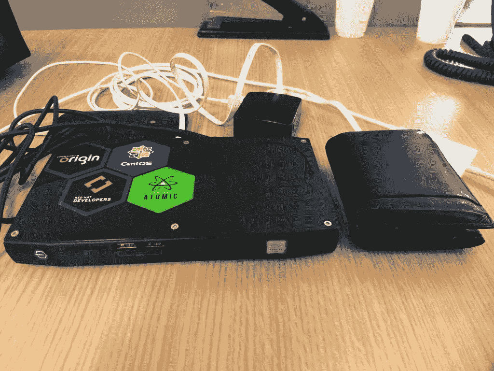
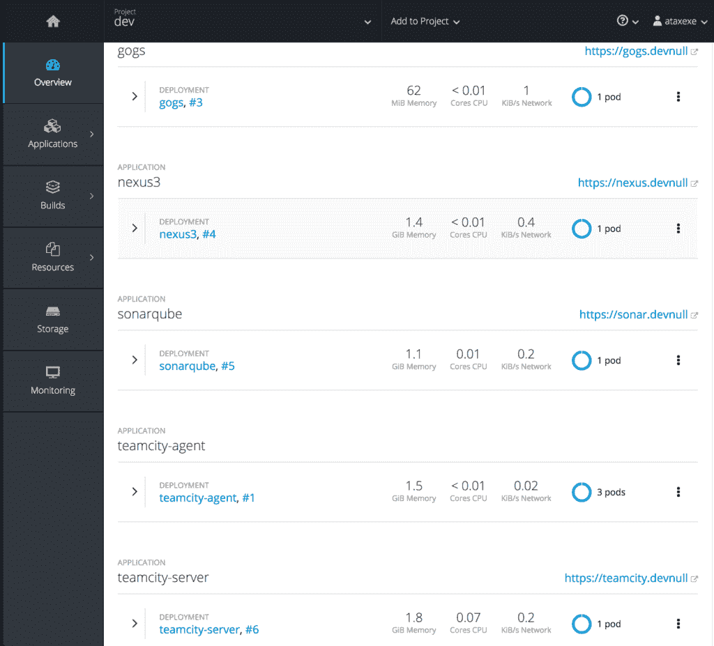

# Nuc shell 上的 Openshift

> 原文：<https://developers.redhat.com/blog/2017/08/18/openshift-on-a-nuc-shell>

许多员工在客户的网站上工作，每天都需要与人接触。移动互联网不是广泛可靠的东西，这使得云产品和复杂解决方案的演示不可避免。

想了一段时间，终于有了好东西，想在本帖分享给大家。

要求

如上所述，移动连接对于总是在移动的人来说并不是一件愉快的事情。这种情况需要完全离线的解决方案来完成工作，因此需要强大的火力。结果，便携性成了必备条件(因为带着 2U 服务器走路可能会伤到你的背...还有你的银行账户)。

## 解决方案

经过一番研究，我得到了一个不错的英特尔 NUC 套件 NUC6i7KYK，它由英特尔酷睿 i7-6770HQ、32GB 内存和 1TB 固态硬盘驱动。它有多大？

它太小了，只有 4 个六角贴纸贴在它的左边！在这个可爱的小盒子里有一个 OpenShift Origin 3.6，主要运行以下服务:

-Gogs
-Nexus 3
-SonarQube
-team city
-3x team city 建造代理

以下是该项目的截图:

这些服务可以毫无困难地支持编码工作。而且有足够的空间来测试和演示一堆东西。

这个小东西不仅帮助我做我的开源项目，还帮助我吸引人们。当有人在这么小的硬件上看到我的所有环境时，我可以得到我需要的关注。当然，这是一台有能力的机器，但它就像一台没有屏幕和键盘的伟大的笔记本电脑。许多工程师在他们的环境中拥有更大的权力，所以对我的客户来说并不算多。关键是用不同的方式展示一些东西。就像魔术是怎么做的一样！

## 影响

我喜欢纸牌魔术。你可以很容易地用一个好的技巧吸引观众，这就是我做演示的方式。他们并不指望我带着一个小设备，就能让整个环境摇滚起来。很好的一招！

一个好的纸牌魔术很简单。你如何让人们选一张牌，或者你把牌翻得多好，都无关紧要。最后，关键是你如何揭示底牌。如果做得好，揭示的过程可能会令人难忘。NUC 壳是我如何“揭示”OpenShift 的。

* * *

**了解** [**Red Hat Openshift 容器平台**](https://developers.redhat.com/products/openshift/overview/) **，允许您供应、管理和扩展基于容器的应用程序。**

*Last updated: August 16, 2017*