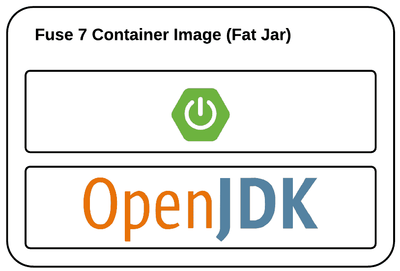
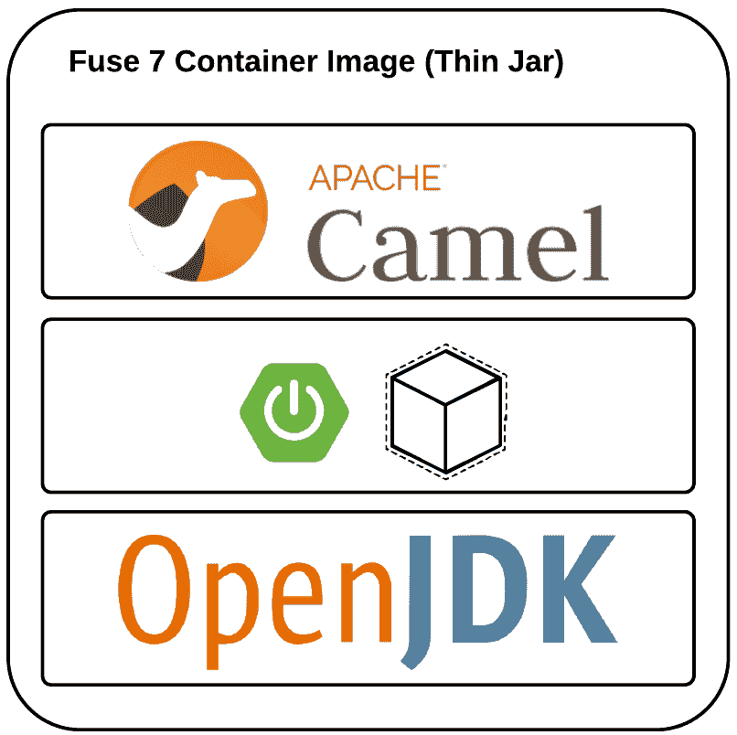

# 优化红帽保险丝 7 Spring Boot 集装箱图像

> 原文：<https://developers.redhat.com/blog/2019/04/26/optimizing-red-hat-fuse-7-spring-boot-container-images>

在 Spring Boot 与红帽保险丝 7 合作很简单。在我的现场经验中，我看到许多开发(也称为集成)团队将他们的新集成平台迁移到 Spring Boot 的 Fuse 7 上，这些平台位于 Red Hat open shift Container Platform 上(与[敏捷集成](https://middlewareblog.redhat.com/2017/09/13/what-is-agile-integration/)非常一致)。

然而，最近，我也看到一些团队担心最终图像的大小和部署管道。在大多数情况下，他们开发了一套公共库或框架来扩展或统一最终的集成项目。所有的案例都有相同的结果:

*   在每个集成项目中复制了几个依赖项
*   在每个构建管道中，总是用最新的 fat JAR(包括相同的依赖项)替换容器映像

Spring Boot 通常被打包成包含所有运行时依赖项的“大罐子”。虽然这很方便，因为您只需要一个 JRE 和一个 JAR 来运行应用程序，但是在像 Red Hat OpenShift 这样的容器环境中，您必须构建一个完整的容器映像来部署您的应用程序。

## 单应用层与多应用层

在 Spring Boot 应用程序上使用 Fuse 7 的典型容器图像具有以下结构:



基本上，图像只有两大层:

*   Spring Boot 应用程序上的 Fuse 7:Fuse 7 用 Spring Boot 及其所有依赖项创建的胖罐子
*   Java 运行时:提供 JRE 和其他库、工具等的基础映像。

每次用这种结构构建应用程序时，我们都在浪费该层的存储空间。基本上，容器映像构建过程不会重用该层的缓存，因为我们正在添加一个新的 fat JAR，它可能与上一个非常相似，因为通常我们会在应用程序中做一些小的更改。

Dockerfiles 的最佳实践之一是减少层数；然而，在我们的例子中，我们也应该最小化我们在每次构建之间改变的层的大小。在 Spring Boot 上用 Fuse 7 开发的应用会改变一些东西(骆驼路线，豆子等。);然而，每个构建过程所使用的依赖关系基本上是相同的。

为了优化存储并增加构建过程和部署阶段，我们需要更改默认结构。新结构应该类似于:



这种新结构基于三层:

*   应用:这个只有最后的应用。组件可以更改几次，但是层很小，因为它只包含应用程序所需的项目(基本上是 Apache Camel 上下文)。
*   Spring Boot 和依赖关系:应用程序所需的任何依赖关系或库都将在这一层进行管理。它比前一层大，但只有当我们在应用程序的依赖关系树中应用更改时，这一层才会更改。
*   Java 运行时:提供 JRE 和其他库、工具等的基础映像。

要实现这一点，还有其他策略，比如 Docker 多级构建；但是，本文基于 Maven 及其生命周期。

主要步骤是:

*   不要像 Spring Boot 那样打包应用程序(即，不使用 *spring-boot-maven-plugin*
*   使用 Maven 插件将应用程序所需的任何*运行时*依赖项复制到一个地方
*   使用 Maven 插件用应用程序提供的类构建一个简单的 jar 文件。这个新应用程序将包含一个清单。MF 文件包含:
    *   主类名
    *   类路径条目，用于定位应用程序所需的任何依赖项。
*   使用与新层结构一致的 docker 文件构建容器映像:
    *   从提供 OS 和 Java 运行时的基本映像
    *   将应用程序所需的任何依赖项复制到一个地方
    *   将应用程序文件(JAR 文件)复制到要执行的位置

## 给我看看代码

GitHub 中开发了一个项目来展示如何轻松实现这个策略。该项目包括两种不同的 Maven 配置文件，以:

*   构建一个 Fat JAR 文件(fuse7-s b-Fat JAR):Spring Boot 应用程序上的典型 Fuse 7
*   构建一个瘦 JAR 文件(fuse7-sb-thinjar):使用新结构在 Spring Boot 应用程序上构建 fuse7

在这两种情况下，[*docker-maven-plugin*](https://dmp.fabric8.io/)用于构建容器映像。同样构建镜像的基础镜像也是一样的，红帽为 Fuse 7 Spring Boot 应用提供的官方镜像([Fuse 7/Fuse-Java-open shift:1.2](https://access.redhat.com/containers/?tab=overview#/registry.access.redhat.com/fuse7/fuse-java-openshift))。

构建 fat JAR 的概要是:

```
<profile>
  <id>fuse7-sb-fatjar</id>
  <activation>
    <activeByDefault>false</activeByDefault>
  </activation>
  <build>
    <defaultGoal>spring-boot:run</defaultGoal>

    <plugins>
      <plugin>
        <groupId>org.jboss.redhat-fuse</groupId>
        <artifactId>spring-boot-maven-plugin</artifactId>
        <executions>
          <execution>
            <goals>
              <goal>repackage</goal>
            </goals>
          </execution>
        </executions>
      </plugin>

      <!-- Build Docker Image -->
      <plugin>
        <groupId>io.fabric8</groupId>
        <artifactId>docker-maven-plugin</artifactId>
        <executions>
          <!-- Build Docker Image at Maven package phase -->
          <execution>
            <id>docker</id>
            <phase>package</phase>
            <goals>
              <goal>build</goal>
            </goals>
          </execution>
        </executions>
        <configuration>
          <images>
            <image>
              <name>fuse7-sb-sample-fatjar:${project.version}</name>
              <build>
                <from>registry.access.redhat.com/fuse7/fuse-java-openshift:1.2</from>
                <assembly>
                  <basedir>/deployments</basedir>
                  <descriptorRef>artifact</descriptorRef>
                </assembly>
              </build>
            </image>
          </images>
        </configuration>
      </plugin>
    </plugins>
  </build>
</profile>
```

在 Spring Boot 应用程序上使用 Fuse 7 照常构建项目:

```
$ mvn clean package -Pfuse7-sb-fatjar
```

容器图像及其结构可以被检查为:

```
$ docker images
REPOSITORY               TAG             IMAGE ID       CREATED              SIZE
fuse7-sb-sample-fatjar   1.0.0-SNAPSHOT  413ec90066b2   2 minutes ago       472MB
$ docker image history fuse7-sb-sample-fatjar:1.0.0-SNAPSHOT
IMAGE               CREATED             CREATED BY                                      SIZE
413ec90066b2        3 minutes ago       /bin/sh -c #(nop) COPY dir:bce1849c62a66a19b…   22.5MB
3acce9532a02        2 months ago                                                        29.7MB
<missing>           2 months ago                                                        204MB
<missing>           2 months ago                                                        12.6MB
<missing>           2 months ago                                                        2.92kB
<missing>           2 months ago                                                        203MB
```

**应用层消耗 22.5 MB 存储。**

构建薄罐子的概要文件是:

```
<profile>
  <id>fuse7-sb-thinjar</id>
  <activation>
    <activeByDefault>false</activeByDefault>
  </activation>
  <build>
    <plugins>
      <!-- Generate a simple JAR file with ClassPath -->
      <plugin>
        <groupId>org.apache.maven.plugins</groupId>
        <artifactId>maven-dependency-plugin</artifactId>
        <executions>
          <execution>
            <id>copy-dependencies</id>
            <goals>
              <goal>copy-dependencies</goal>
            </goals>
            <configuration>
              <outputDirectory>${project.build.directory}/lib</outputDirectory>
              <includeScope>runtime</includeScope>
            </configuration>
          </execution>
        </executions>
      </plugin>
      <plugin>
        <groupId>org.apache.maven.plugins</groupId>
        <artifactId>maven-jar-plugin</artifactId>
        <configuration>
          <archive>
            <manifest>
              <addClasspath>true</addClasspath>
              <classpathPrefix>lib/</classpathPrefix>
              <mainClass>org.jboss.fuse7.samples.Application</mainClass>
            </manifest>
          </archive>
        </configuration>
      </plugin>

      <!-- Build Docker Image -->
      <plugin>
        <groupId>io.fabric8</groupId>
        <artifactId>docker-maven-plugin</artifactId>
        <executions>
          <!-- Build Docker Image at Maven package phase -->
          <execution>
            <id>docker</id>
            <phase>package</phase>
            <goals>
              <goal>build</goal>
            </goals>
          </execution>
        </executions>
        <configuration>
          <images>
            <image>
              <name>fuse7-sb-sample-thinjar:${project.version}</name>
              <build>
                <dockerFile>${project.basedir}/Dockerfile</dockerFile>
              </build>
            </image>
          </images>
        </configuration>
      </plugin>
    </plugins>
  </build>
</profile>
```

这个概要文件使用一个新的 Dockerfile 文件来定义新的结构。

```
FROM registry.access.redhat.com/fuse7/fuse-java-openshift:1.2

# Fuse 7, Spring Boot and Third Party Dependencies
COPY target/lib /deployments/lib

# Application
COPY target/*.jar /deployments
```

使用新结构构建项目:

```
$ mvn clean package -Pfuse7-sb-thinjar
```

容器图像及其结构可以按如下方式检查:

```
$ docker images
REPOSITORY               TAG             IMAGE ID       CREATED              SIZE
fuse7-sb-sample-fatjar   1.0.0-SNAPSHOT  413ec90066b2   2 minutes ago       472MB
fuse7-sb-sample-thinjar  1.0.0-SNAPSHOT  f3bf83f4ac28   About a minute ago  472MB
$ docker image history fuse7-sb-sample-thinjar:1.0.0-SNAPSHOT
IMAGE               CREATED             CREATED BY                                      SIZE
f3bf83f4ac28        3 minutes ago       /bin/sh -c #(nop) COPY file:8e8b28eec64eeef0…   5.93kB
8f85633e632f        6 weeks ago         /bin/sh -c #(nop) COPY dir:9371efeba146b0c49…   22.4MB
3acce9532a02        2 months ago                                                        29.7MB
<missing>           2 months ago                                                        204MB
<missing>           2 months ago                                                        12.6MB
<missing>           2 months ago                                                        2.92kB
<missing>           2 months ago                                                        203M
```

**应用层仅消耗大约 6 kB 的存储空间。**

### 结论

比较两个容器图像，我们可以得出以下结论:

*   两个图像具有相同的最终大小(472 MB)
*   在应用程序执行期间没有变化或影响
*   在每次使用 fat JAR 应用程序构建之后，应用程序层被完全替换(大约 22 MB)
*   在每次使用瘦 JAR 构建之后，只有应用层被完全替换(大约 6 kB)。Docker 缓存层适用于依赖关系。

因此，如果您担心 Fuse 7 在 Spring Boot 应用程序上的大小，有各种替代方案和策略可以帮助您优化它。

*Last updated: April 24, 2019*