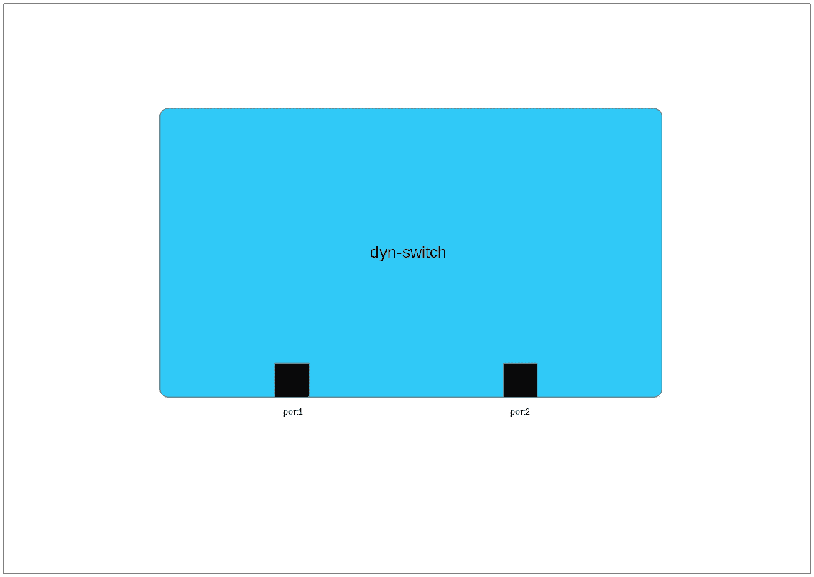
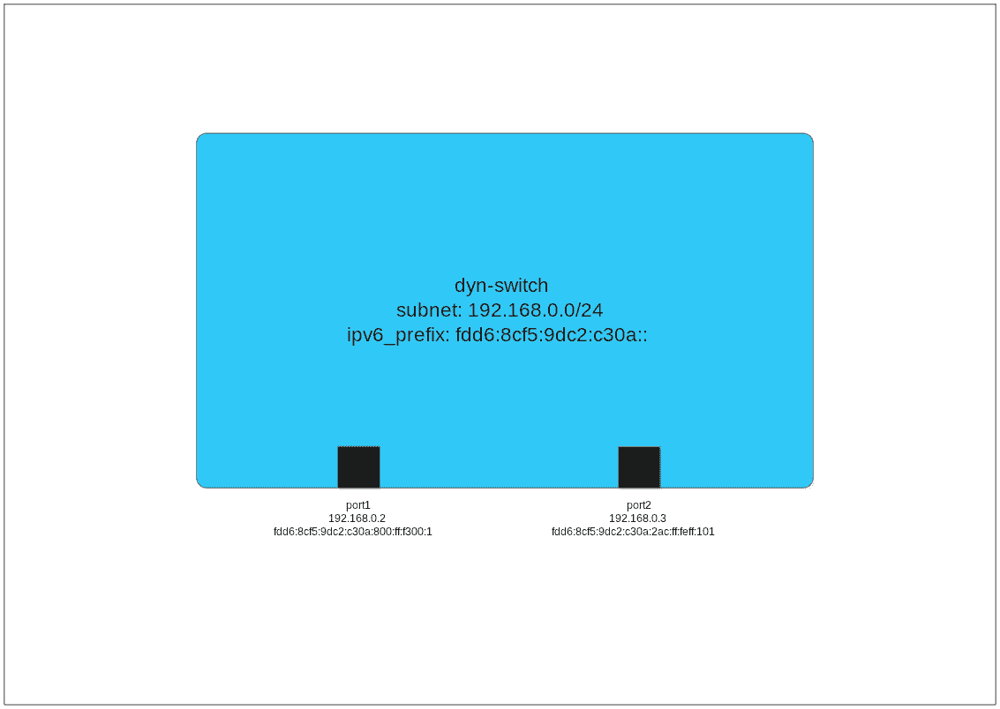
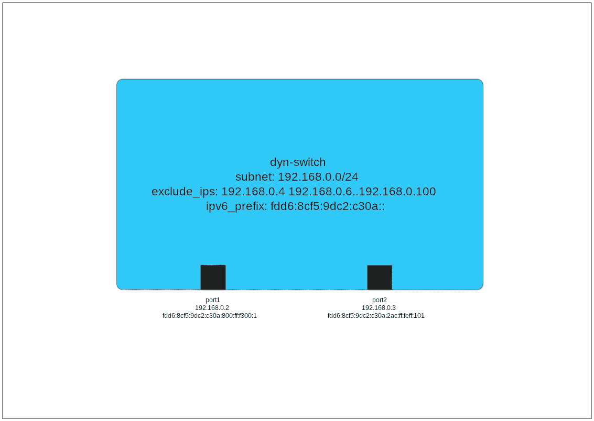
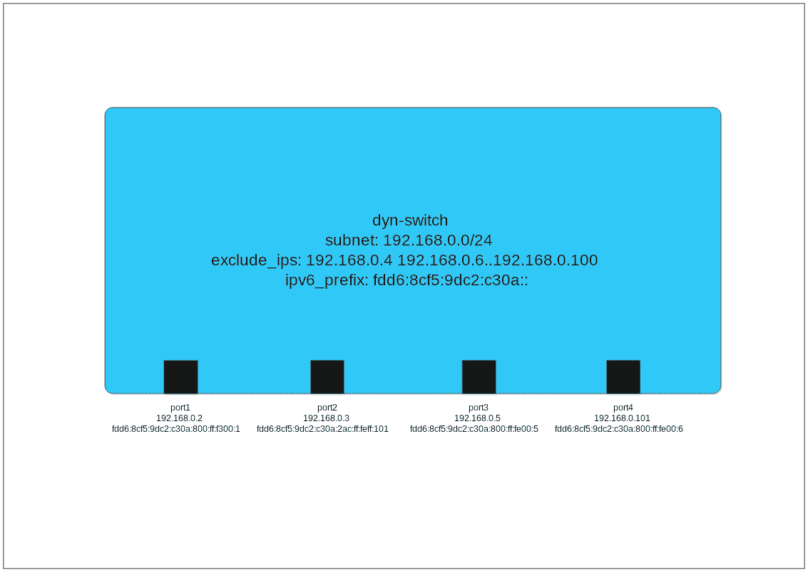

# 开放虚拟网络(OVN)中的动态 IP 地址管理(上)

> 原文：<https://developers.redhat.com/blog/2018/09/03/ovn-dynamic-ip-address-management>

## 一些背景

对于那些不熟悉的人来说，开放虚拟网络(OVN)是一个高性能可编程多平台虚拟交换机 [OpenVswitch](http://www.openvswitch.org/) (OVS)的子项目。OVN 能够将覆盖网络表示为一系列虚拟路由器和交换机。OVN 还提供了设置访问控制列表(ACL)的本地方法，它充当 OpenFlow 交换机，提供 DHCP 之类的服务。OVN 程序的组件在网络中的每个虚拟机管理程序上运行 OVS。红帽的许多产品，如红帽 OpenStack 平台和红帽虚拟化，现在都在使用 OVN。[红帽 OpenShift 集装箱平台](https://developers.redhat.com/products/openshift/overview/)即将使用 OVN。

环顾互联网，很容易找到高质量的 OVN 基础教程。然而，当涉及到更高级的主题时，有时会感觉信息量不足。在本教程中，我们将研究 OVN 的动态寻址。您将了解 OVN 的 IP 地址管理(IPAM)选项以及如何应用它们。

## 静态寻址

从 OVN 开始，您首先要学习的事情之一是如何创建逻辑交换机和逻辑交换机端口。您可能会看到类似这样的内容:

```
$ ovn-nbctl ls-add sw
$ ovn-nbctl lsp-add sw sw-p1
$ ovn-nbctl lsp-set-addresses sw-p1 00:ac:00:ff:01:01 192.168.0.1
```

第一行创建了一个名为`sw`的逻辑开关。第二行向`sw`添加了一个名为`sw-p1`的交换机端口。最后一行设置了`sw-p1`的 MAC 和 IP 地址。这非常简单，但是需要您手动跟踪交换机端口的 IP 地址。有没有一种方法可以创建一个交换机端口，而不必手动添加 MAC 和 IP 地址？

## 动态寻址

如果你挖掘得更深一点，你可以在网上找到描述如何设置 OVN 使用 DHCP 提供 IP 地址的教程。这为您节省了虚拟机上的一些配置步骤，但对 OVN 端没有任何帮助。您仍然需要在逻辑交换机端口上指定一个 IP 地址。

但是，有什么方法可以让 OVN 动态地为交换机端口分配地址呢？如果你搜索一下联机帮助页，你也许能拼凑出一个方法来做这件事。

本教程旨在澄清这种情况，因此您可以确切地知道您可以使用哪些工具以及如何使用它们。

在我们的演示中，我们将使用一个非常简单的逻辑交换机，它有两个端口:


## 开关配置

让我们从您可以设置的相关选项开始，然后我们将查看一些使用这些选项的示例。所有这些在逻辑交换机上都被设置为`other_config`。

*   `subnet`:这是一个 IPv4 子网，指定为网络地址和掩码。比如`10.0.0.0/8`或者`10.0.0.0/255.0.0.0`。
*   `exclude_ips`:这是不应分配给交换机端口的 IPv4 地址列表。您可以用逗号分隔各个地址，也可以使用`..`指定一个地址范围。
*   `ipv6_prefix`:这是一个 64 位的 IPv6 网络地址。如果您提供的地址长度超过 64 位，则超过前 64 位的那些位将被忽略。每个交换机端口上提供的 IPv6 地址是一个使用指定前缀和端口 MAC 地址的 [EUI-64](https://en.wikipedia.org/wiki/IPv6_address#Modified_EUI-64) 地址。

一旦您在交换机上设置了这些选项，接下来的问题就是设置您的交换机端口以利用这些选项。你可以用两种方法之一来做这件事。

方法 1:

```
$ ovn-nbctl lsp-set-addresses port 00:ac:00:ff:01:01 dynamic
```

方法 2:

```
$ ovn-nbctl lsp-set-addresses port dynamic
```

使用方法#1，您指定 MAC 地址，使用方法#2，您允许 OVN 为您分配 MAC 地址。

## 示范

因此，让我们来看一个例子，我们做一些基本的设置:

```
$ ovn-nbctl ls-add dyn-switch
$ ovn-nbctl set Logical_Switch dyn-switch other_config:subnet=192.168.0.0/24 \
other_config:ipv6_prefix=fdd6:8cf5:9dc2:c30a::
$ ovn-nbctl lsp-add dyn-switch port1
$ ovn-nbctl lsp-set-addresses port1 dynamic
$ ovn-nbctl lsp-add dyn-switch port2
$ ovn-nbctl lsp-set-addresses port2 "00:ac:00:ff:01:01 dynamic"
```

通过这种设置，我们创建了一个名为`dyn-switch`的逻辑交换机，并创建了两个名为`port1`和`port2`的端口。

那么当你这样做的时候会发生什么呢？让我们看看此时逻辑交换机端口的数据库内容:

```
$ ovn-nbctl list logical_switch_port
_uuid : 2d1fe408-f119-48d6-88c9-dff237c92856
addresses : [dynamic]
dhcpv4_options : []
dhcpv6_options : []
dynamic_addresses : "0a:00:00:00:00:01 192.168.0.2 fdd6:8cf5:9dc2:c30a:800:ff:fe00:1"
enabled : []
external_ids : {}
name : "port1"
options : {}
parent_name : []
port_security : []
tag : []
tag_request : []
type : ""
up : false

_uuid : 43867394-8d3b-4e36-a90d-5f635d6a084c
addresses : ["00:ac:00:ff:01:01 dynamic"]
dhcpv4_options : []
dhcpv6_options : []
dynamic_addresses : "00:ac:00:ff:01:01 192.168.0.3 fdd6:8cf5:9dc2:c30a:2ac:ff:feff:101"
enabled : []
external_ids : {}
name : "port2"
options : {}
parent_name : []
port_security : []
tag : []
tag_request : []
type : ""
up : false
```

注意两个交换机端口的`dynamic_addresses`。该数据库列由`ovn-northd`根据逻辑交换机上的 IPAM 配置自动填充。对于`port1`，我们为地址指定了`dynamic`，所以 OVN 为我们创建了一个 MAC 地址和 IP 地址。您可以识别 OVN 分配的 MAC 地址，因为它们总是以`0a`开头。

在图片中，我们的开关看起来像这样:



`port1`被分配了 IPv4 地址 192.168.0.2，`port2`被分配了地址 192.168.0.3。为什么寻址以. 2 而不是. 1 开始？OVN 为交换机连接的路由器保留子网的第一个地址。在我们的例子中，没有路由器，所以没有交换机端口被分配给 192.168.0.1。当前的`ovn-northd`算法在子网内连续分配地址。

在本教程的剩余部分，我们将知道这是`ovn-northd`如何操作的。但是，由于文档没有说明动态 IPv4 寻址是如何工作的，因此在您的应用程序中依赖这种行为可能会有风险。OVS 版本的更改可能会导致地址的更改。

每个端口的 IPv6 地址都是 EUI-64 地址。地址的前 64 位是我们配置的`ipv6_prefix`。地址的其余部分来自 MAC 地址。在配置`ipv6_prefix`时，请记住，即使只使用了地址的前 64 位，OVN 也希望提供一个有效的 IPv6 地址。因此，如果你提供的是 64 位，一定要以`::`结束地址，这样 OVN 就会像预期的那样处理它。

## 不包括 IP 地址

让我们仔细看看`exclude_ips`选项。让我们设置`exclude_ips`，然后设置额外的端口，看看会发生什么。

```
$ ovn-nbctl set Logical_Switch dyn-switch other_config:exclude_ips="192.168.0.4 \
192.168.0.6..192.168.0.100"
```



在继续之前，让我们仔细看看语法。首先，我们指定了一个 IP 地址:192.168.0.4。这意味着这个单独的 IP 地址不会被动态分配。接下来，我们使用`..`指定一个 IP 地址范围。这比拼出 192.168.0.6 到 192.168.0.100 的 95 个 IP 地址要实用得多。字符串两边的引号是必要的，这样 shell 就不会将地址之间的空格解释为`ovn-nbctl`的单独参数。

在`exclude_ips`中只能指定 IPv4 地址。由于 IPv6 地址源自端口的 MAC 地址，因此没有必要指定任何排除的地址。

现在让我们在交换机上再设置两个端口。

```
$ ovn-nbctl lsp-add dyn-switch port3
$ ovn-nbctl lsp-set-addresses port3 dynamic
$ ovn-nbctl lsp-add dyn-switch port4
$ ovn-nbctl lsp-set-addresses port4 dynamic
```

基于我们之前看到的模式，我们可能期望`port3`的 IP 地址是 192.168.0.4。但是，该地址在我们排除的 IP 地址集中。让我们看看`port3`被分配了什么:

```
$ ovn-nbctl list logical_switch_port port3
_uuid : 9dfee1d5-a279-4a06-a66e-5178b6f2f3e0
addresses : [dynamic]
dhcpv4_options : []
dhcpv6_options : []
dynamic_addresses : "0a:00:00:00:00:05 192.168.0.5 fdd6:8cf5:9dc2:c30a:800:ff:fe00:5"
enabled : []
external_ids : {}
name : "port3"
options : {}
parent_name : []
port_security : []
tag : []
tag_request : []
type : ""
up : false
```

它被指定为 192.168.0.5。让我们看看分配给`port4`的 IP 地址:

```
$ ovn-nbctl list logical_switch_port port4
_uuid : d7d20a60-2720-4056-904f-2f4ad3be4b0b
addresses : [dynamic]
dhcpv4_options : []
dhcpv6_options : []
dynamic_addresses : "0a:00:00:00:00:06 192.168.0.101 fdd6:8cf5:9dc2:c30a:800:ff:fe00:6"
enabled : []
external_ids : {}
name : "port4"
options : {}
parent_name : []
port_security : []
tag : []
tag_request : []
type : ""
up: false
```

它被分配为 192.168.0.101，因为 192.168.0.6 和 192.168.0.100 之间的所有地址都在我们的排除集中。

这里是我们最后的逻辑开关:


## 接下来会发生什么

有了这些，您就应该拥有在逻辑交换机上设置 IP 地址所需的工具，而无需在应用程序中跟踪分配的地址。

但是，除了我在这里介绍的内容之外，还有更多内容。在这个博客系列的第 2 部分[，我们将会看到 OVN 的 IPAM 实现中的一些缺点，并且我们将会深入研究即将到来的 OVN 版本中的改进。](https://developers.redhat.com/blog/2018/09/27/dynamic-ip-address-management-in-open-virtual-network-ovn-part-two/)

*Last updated: September 27, 2018*