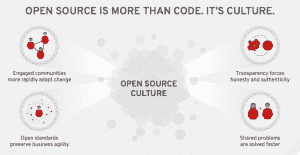
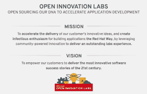
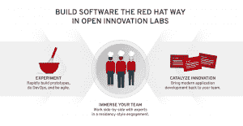

# 走进红帽开放创新实验室驻地-(第一部分)

> 原文：<https://developers.redhat.com/blog/2018/01/26/part-1-inside-open-innovation-labs-residency>

本系列带读者踏上旅程，一窥 Red Hat 开放创新实验室的生活。对于任何客户来说，这都是顶级体验； 向他们展示开放协作、开放技术和快速敏捷的应用交付方法。

尝试数字化转型的组织往往没有这种体验。通过沉浸在开放创新实验室驻地，红帽分享其在管理，开发和交付社区，开放技术和开放协作解决方案的经验。

请和我一起分享真实生活中的经历，观看 Red Hat 与客户的亲密合作。这将揭示使用快速、敏捷的应用交付方法和开放协作来利用开放技术的新工作方式。

## **Red Hat 开放创新实验室驻场有什么？**

我最常被问到的一个问题大概是这样的，*“Red Hat 和它的开放式组织内部到底是什么样的？”* 

我完全理解这种好奇心，因为在像 Red Hat 这样的公司工作是非常独特的。在 Red Hat，我们希望实践我们所宣扬的，通过培育我们产品的社区生活，并继续培育开源文化，帮助我们的客户踏上数字化之旅。

在世界各地的会议舞台上、聚会上或非正式的晚餐上讨论这些话题总是令人愉快的。我尽了最大努力，让我们每天面对你们的现场同事能够讲述这些故事，因为当我们分享时，我们就成长了，我们的客户也成长了。

去年，Red Hat 推出了一些新的东西来帮助展示这是怎么回事，与客户分享这些经验，并教授我们在 Red Hat 围绕这些主题正在学习的东西。 [红帽开放创新实验室](https://www.redhat.com/en/open-innovation-labs) 是作为 *驻场* 交付的，在那里参与者沉浸在几个星期完全脱离他们的日常事务中。

让我们来看看这是如何工作的。

### **开放式创新实验室的建立**

许多组织发现开放技术为他们的业务提供了巨大的优势，但是他们也发现他们必须改变他们的流程和文化来充分利用这些新技术。然而，改变他们的文化并不像他们的基础设施组件那样容易。

许多人正试图发现如何在将开放标准应用于他们的工作方式的同时，激励积极参与的内部社区更快地适应变化。他们想知道如何保持透明度，以及如何促进协作，以便更快地解决共同的问题。

越来越多的 Red Hat 被要求展示我们是如何做这些事情的，以一种持久的方式揭开我们实现这些的方式。许多组织已经明白，他们数字化之旅的关键是让这些特性和特征扎根。

客户希望亲身体验 Red Hat 的技术和文化，以说明他们的数字化之旅需要帮助的原因。开放创新实验室正是这样做的。然而，解释这一切需要一个比喻，比如将它比作一家获奖的餐厅。

### **追求卓越**

每个人都可以以某种形式烹饪，但要成为一家获奖的餐厅，需要一些特别的东西，而这些东西往往暗示着普通人。这同样适用于您使用开放技术的数字化之旅。每个人都可以开始，但不是每个人都可以在没有指导的情况下超越到新的高度。

那么，一家获奖餐厅与红帽开放创新实验室有什么共同之处呢？

如果你观察一家获奖餐厅的团队，你会发现他们拥有多种世界级的技能。他们都对每一餐的成功负责，并对他们每天所做的事情有着共同的热情。他们在一个开放、透明、拥有最好的工具和原料的特殊环境中工作。它是为速度和实验而构建的，同时以随时可用的方式进行维护。

他们使用流水线方法来提高速度和管理水平，确保饭菜制作一致，每次都完全一样，并且在送到顾客餐桌前接受反馈之前，可以由厨师进行质量控制检查。这个管道允许实验和学习。在这种环境下，当某些东西不起作用时，支点就会迅速发生。

厨师遵循一种学徒模式，这种模式加快了学习过程，并让新的团队成员在他们的角色中成长，这也使团队在成员离开的情况下保持灵活性。餐厅不断发明新的菜肴，同时员工收集即时和真实的反馈。当一个人有难忘的经历时，真正的热情会蔓延开来。

### **居住模式**

这是开放创新实验室体验的相同模式，在那里构建软件是以 Red Hat 的方式进行的，实验性地构建快速原型，进行开发操作，并保持敏捷。这是您的团队的一种沉浸感，因为他们与派驻专家一起工作，将现代应用程序开发带回您的团队。

开放创新实验室是一种付费的派驻式项目，我们与来自客户的 3-6 名开发人员和运营人员组成的团队合作。我们将他们一对一地与同等数量的红帽子、一名设计师和一名参与领导(他充当敏捷教练，与我们客户的产品负责人一起工作)进行匹配。 我们都在一个专门的空间(伦敦、硅谷、波斯顿或新加坡)或一个弹出式实验室(在你所在城市的一个与其他初创公司合作的酷空间)一起工作。

我们致力于解决真正的业务问题(要么从头开始创建一个新的绿地应用程序，要么对现有的棕色地带应用程序进行现代化改造)。派驻时间通常为 4-12 周，并在演示日达到高潮，在演示日，我们展示已构建的内容，然后是回顾会，在回顾会上，我们将应用程序转移回您自己的环境。    就好像你要花时间在一家获奖餐厅的厨房里工作，当你花时间在开放创新实验室的“厨房”里以开源的方式编写软件时，毫无疑问，当你回到你的厨房时，你会使用不同的工具和设备。而且你做的菜(或者软件)会很独特。

对 [感兴趣更多关于红帽开放创新实验室](https://www.redhat.com/en/open-innovation-labs) ？请继续关注本系列的下一篇文章，分享派驻服务用例并研究派驻服务流程。

*Last updated: September 3, 2019*