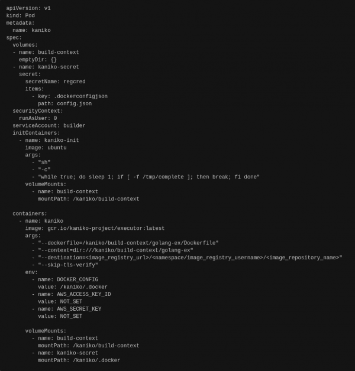

# 在 Red Hat OpenShift 集群上执行 kaniko 构建，并将映像推送到注册表

> 原文：<https://developers.redhat.com/articles/2021/06/18/perform-kaniko-build-red-hat-openshift-cluster-and-push-image-registry>

通常，从标准的[docker 文件](https://docs.docker.com/engine/reference/builder/)构建[容器](/topics/containers)和图像需要 root 访问和权限。当使用公共或共享集群时，这可能会带来挑战。例如，集群管理员通常不允许运行这种类型的工作负载，因为这可能会危及整个集群的安全性。

在这些情况下，许多开发人员使用像 [kaniko](https://github.com/GoogleContainerTools/kaniko) 这样的构建工具来简化工作。Kaniko 可以构建您的图像，而不需要 root 访问权限。这种能力使 kaniko 成为在任何环境中构建容器和图像的可行选择；例如，标准的 [Kubernetes](/topics/kubernetes) 集群、Google Kubernetes 引擎以及公共或共享集群。Kaniko 还可以自动将您的图像推送到指定的图像注册表。

本文向您展示了如何使用 kaniko 在一个 [Red Hat OpenShift](/products/openshift/overview) 集群中构建一个容器映像，并将该映像推送到一个注册表中。

## 先决条件

要在 Red Hat OpenShift 集群上执行 kaniko 构建，请确保满足以下先决条件:

*   访问活动的 OpenShift 集群(具有管理员访问权限)。
*   访问本地或托管在其他地方的源代码库，如 GitHub。
*   目标源目录的有效 docker 文件。只要有完全合格的 URL，Dockerfile 文件可以存在于任何地方。

**注意**:本文中的所有`oc`命令也适用于`kubectl`，无论您使用的是 OpenShift 集群还是 Kubernetes 集群，或者没有集群。

## OpenShift 上 kaniko 的设置和配置

一旦设置、配置并激活了先决条件，就可以在 OpenShift 集群上执行 kaniko 构建，并将映像推送到注册表中。

### 登录到 OpenShift 集群

首先，登录到 OpenShift 集群，如下所示:

```
$ oc login --token=token --server=server-url
```

### 创建新项目

使用以下工具创建您自己的项目:

```
$ oc new-project project-name
```

### 使用注册表的凭据创建一个密码

要将您的映像推送到外部注册中心(比如 Docker Hub)，使用下面的`oc`命令创建一个名为`regcred`的秘密:

```
$ oc create secret docker-registry regcred \
     --docker-server=your-registry-server \
     --docker-username=your-name \
     --docker-password=your-pword \
     --docker-email=your-email
```

用以下信息替换该命令中的斜体值:

*   `*your-registry-server*`:你的私人 Docker 注册中心(Docker Hub 的 https://index.docker.io/v1/)的完全合格的域名(FQDN)
*   *`your-name`* :您的码头工人用户名
*   *`your-pword`* :您的码头工人密码
*   *`your-email`* :您的码头工人邮箱

**注意**:使用服务帐户通过集群上的 pod 将您的映像推送到内部注册表。例如，您可以通过群集的控制台获取服务帐户(如 Builder)的登录凭据。

从您的名称空间的可用机密列表中，选择一个`builder-dockercfg`机密，并使用 OpenShift 控制台上的**显示值**按钮显示 base64 凭证。

找到目标映像注册中心的 URL，并复制授权令牌。用它来准备一个新的`config.json`文件，用适当的值替换*图像注册 url* 和*认证令牌*。例如:

```
{
"auths": {
"image-registry-url": { 

"auth": "auth-token"
 } 
}, 
"HttpHeaders": { 

"User-Agent": "Docker-Client/19.03.8 (darwin)" 
}, 
"experimental": "disabled"
}
```

一旦`config.json`文件准备好，创建一个秘密如下，命名为`regcred`:

```
$ oc create secret generic regcred --from-file=.dockerconfigjson=path/to/config.json --type=kubernetes.io/dockerconfigjson
```

### 克隆源代码库

在本地文件系统中，`git clone`你的源代码库。例如，在空目录中输入以下内容:

```
git://github.com/openshift/golang-ex.git
```

接下来，从它所在的位置下载相应的 Dockerfile，并将其放在这个目录的根目录下，如果它还不存在的话。

如果克隆的存储库中的特定子目录包含用于构建映像的代码(而不是整个克隆的目录)，请将 Dockerfile 放在该子目录的根目录下。包含源代码和 Dockerfile 的目录现在一起代表了您的构建上下文。

**注意**:当使用上述存储库中的 Dockerfile 时，去掉写着`USER nobody`的那一行，以避免权限问题。

确保`/kaniko/build-context`之后提到的路径相对于`openshift-pod.yaml`文件中的`--dockerfile`和`--context`参数准确地代表了`kaniko-build-context.tar.gz`中存在的目录结构。路径必须完全匹配。

### 将构建上下文压缩到 tar.gz 文件中

构建上下文准备好之后，将其压缩到一个`tar.gz`文件中，如下所示:

```
$ tar -czvf kaniko-build-context.tar.gz path/to/folder
```

### 创建一个包含两个容器的 openshift-pod.yaml 文件

创建一个有两个容器的`openshift-pod.yaml`文件，如图 1 所示。

[](/sites/default/files/blog/2020/12/kaniko-blog.png)

Figure 1: An openshift-pod.yaml file with two containers.

如果您正在推送至 Docker Hub，您可以按如下方式设置目的地:

```
--destination=docker.io/your-dockerhub-username/image-name:image-tag
```

如果您正在推送至内部注册表，请按如下所示设置目标:

```
--destination=image-registry.openshift-image-registry.svc:5000/your-project-name/image-name:image-tag
```

### 将 pod 应用到集群

使用以下命令将 pod 应用到集群:

```
$ oc apply -f path/to/openshift-pod.yaml
```

该命令应该返回:

```
pod/kaniko created
```

### 检查集群的状态

要检查群集的状态，请运行以下命令:

```
$ oc get pods
```

以下是它所显示内容的一个示例:

```
NAME     READY   STATUS     RESTARTS   AGE
kaniko   0/1     Init:0/1   0          50s
```

### 将 tar.gz 从本地文件系统复制到 kaniko-init 容器中

将您之前创建的`tar.gz`文件从本地文件系统复制到当前在 pod 中运行的`kaniko-init`容器:

```
$ oc cp path/to/kaniko-build-context.tar.gz kaniko:/tmp/kaniko-build-context.tar.gz -c kaniko-init
```

### 将挂载路径上复制的 tar.gz 文件解压缩到共享卷

从您的`kaniko-init`容器中，将复制的`tar.gz`文件解压到挂载路径中，该路径指向 kaniko pod 中的共享卷。这允许其他可以访问这个共享卷的容器访问它。

## 检查你的工作

您应该看到推送的图像反映在您的目标注册表中。此外，您可以随时仔细查看容器内部。(我发现这在调试过程时非常有用。)首先，在您的`kaniko-init`容器中启动一个 bash 会话，看看:

```
$ oc exec kaniko -c kaniko-init -it /bin/bash
```

一旦提取过程完成，您就可以关闭 init 容器，这时 kaniko 容器就会接管。然后创建一个用作触发器的文件:

```
$ oc exec kaniko -c kaniko-init -- touch /tmp/complete
```

当您再次运行`oc get pods`时，输出显示一切是否正常:

```
NAME    READY   STATUS    RESTARTS   AGE
kaniko   1/1     Running   0          6m57s
```

接下来，运行下面的`oc`命令来更详细地了解 kaniko 容器内部的情况:

```
$ oc describe pod kaniko
```

或者，您可以在 OpenShift 控制台中查看 pod 日志。

在 pod 达到完成状态后，如果您将它推送到外部注册表，您应该能够登录到您的注册表并在那里找到新推的映像。如果您推送至内部注册表，您应该能够导航至**Builds—>****ImageStreams**(在 OpenShift 控制台的管理员视图中)以找到新推送的映像。

如果需要，您可以使用`oc delete pod kaniko`删除 pod。

*Last updated: August 24, 2022*