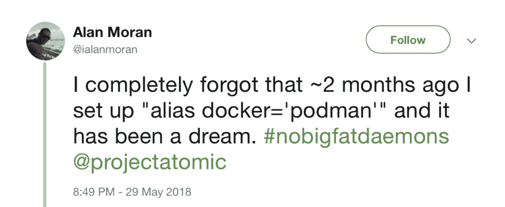

# 波德曼基础备忘单

> 原文：<https://developers.redhat.com/blog/2019/04/25/podman-basics-cheat-sheet>

在这里和其他地方，我们得到了很多关于 Red Hat Enterprise Linux 7.6 和 Red Hat Enterprise Linux 8 beta 中的 post-Docker 容器工具的问题。像[波德曼](https://podman.io)、 [buildah](https://buildah.io) 和[斯科佩奥](https://github.com/containers/skopeo)这样的工具使你能够创建和管理*无根容器*，这些容器不需要根访问来构建和部署。为了帮助你掌握基础知识，我们很高兴提供[新的波德曼基础知识小抄](https://developers.redhat.com/cheat-sheets/podman-basics/)。

好消息是，如果你知道基本的 Docker 命令，你通常可以简单地用`podman`替换`docker`，做你习惯做的任何事情。事实上，这两个命令行界面非常相似，以至于一些用户将[别名定义为 docker='podman'](https://twitter.com/ialanmoran/status/1001671953571303425) :

除了[波德曼基础知识备忘单，](https://developers.redhat.com/cheat-sheets/podman-basics/)这里还有其他资源可以帮助你开始学习波德曼:

*   亚历山德罗·阿里基耶洛的《波德曼简介》
*   威廉·亨利为 Docker 用户设计的 Podman 和 Buildah
*   没有守护进程的容器
*   Brent Baude 的《Podman:在本地容器运行时管理 pod 和容器》
*   Doug Tidwell 的《Podman -下一代 Linux 容器工具》

[现在就下载 podman 基础知识备忘单](https://developers.redhat.com/cheat-sheets/podman-basics/)，享受使用无根容器的乐趣！

### 也阅读

*   [红帽企业版 Linux 8 测试版备忘单](https://developers.redhat.com/blog/2019/03/04/red-hat-enterprise-linux-8-beta-cheat-sheet-for-developers/)
*   [集装箱备忘单](https://developers.redhat.com/cheat-sheets/containers/)
*   [库柏叶](https://developers.redhat.com/cheat-sheets/kubernetes/)

*Last updated: April 24, 2019*