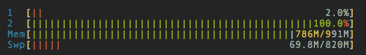
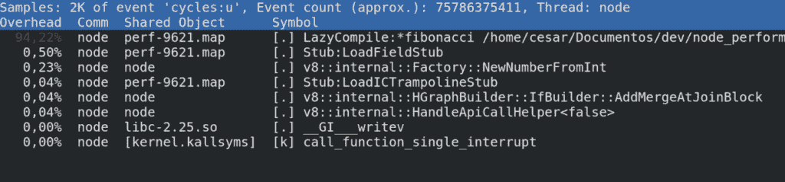
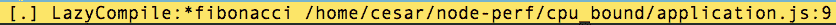

# 使用 Linux 性能工具分析 NodeJS 应用程序

> 原文：<https://developers.redhat.com/blog/2017/09/11/profiling-nodejs-applications-with-linux-performance-tools>

### 使用 Linux 性能工具

【Linux 的性能分析工具( [perf](http://man7.org/linux/man-pages/man1/perf.1.html) ) 是一个强大的分析应用程序的工具。它通过混合使用硬件计数器(速度很快)和软件计数器来工作，所有这些都由 Linux 性能计数器(LPC)子系统提供，该子系统负责为不同类型的 CPU 包装 CPU 计数器的复杂任务。因此，您可以通过 C API 或本例中的一个方便的命令( [perf](http://man7.org/linux/man-pages/man1/perf.1.html) )非常有效地获取正在运行的进程的信息。

这个命令让您可以访问各种各样的系统和进程级事件，但是在这个条目中，我将使用它来调查 CPU 受限的问题。

### 入门指南

首先，您需要使用您喜欢的软件包管理器安装 perf 工具:

```
#install perf in Archlinux 
sudo pacman -Sy perf 

#install perf in Fedora
sudo dnf install perf 

```

作为本教程的一部分，我们将使用一个我编写的示例 NodeJS 服务器应用程序，并将其推送到 [Github](https://github.com/cesarvr/node_performance) 中，该示例的目录是/cpu_bound，在那里您可以找到以下文件:

*   [application.js:](https://github.com/cesarvr/node_performance/blob/master/cpu_bound/application.js)
    *   这是一个基本的 ExpressJS web 服务，后面还有两个基本服务 **/fib** 和 **/fast** 。
*   [test.sh](https://github.com/cesarvr/node_performance/blob/master/cpu_bound/test.sh)
    *   是一个 bash 脚本，用于运行一些基本的并发网络请求，这将为我们的服务生成一些流量。

如果要执行这些脚本，需要以下 Linux 4.0+和 NodeJS 4.3+。

### 基准

一旦你有了这个文件并安装了依赖项，你需要用 **npm install** 安装依赖项，之后我们可以继续运行 [test.sh](https://github.com/cesarvr/node_performance/blob/master/cpu_bound/test.sh) ，它将执行以下步骤:

*   运行一个
*   对这两个服务执行 150 个 curl 并发请求(如果太慢，可以减少这个数量)。
*   等待请求完成，然后“优雅地”退出节点进程。

#### 执行



使用一个具有一个内核和 500 MB 内存的虚拟机，我需要 83 秒来处理 150 个请求，这并不惊人，所以让我们看看我们可以做些什么来使它更快。首先，在运行示例时，CPU 达到了 100%,我们正在处理一个单线程框架(NodeJS ),这意味着如果这个应用程序阻塞了主线程，我们也阻塞了我们的调度/接收功能，那么我们该如何开始呢？

> #### *假设什么都没有*。—当你关心性能时，尽最大努力改进代码，然后*测量*改进。如果你不衡量性能，你只是在猜测，如果你在猜测，你不太可能写出一流的代码。
> 
> 迈克尔·阿布拉什

### 运行时信息

因此，遵循一位 x86 汇编先知的建议，我们应该首先通知自己，为此我们将使用 **perf** 命令工具。首先，我们需要告诉 V8 编译器我们想要生成分析信息，所以要集成两者，我们只需要传递这个标志 **- perf-basic-prof.**

[节点 **-性能-基本-配置**](https://github.com/cesarvr/node_performance/blob/master/cpu_bound/test.sh#L4)

现在我们可以再次重新运行我们的脚本，V8 将开始在/tmp/perf-中记录分析事件。一旦我们的程序开始运行，我们应该执行 **perf record** ，并将其附加到我们想要分析的进程，在本例中是**‘pgrep-n node’**，但是在此之前，我建议您选择一个文件夹来保存 perf.data，因为命令将文件保存在您进行调用的同一个文件夹中。

```
perf record -F 99 -p `pgrep -n node`

# Example:
# F is the sampling frequency in hertz. 
# p is the process ID (PID). 
# Example: pgrep -n node >> 1801 << returning the PID of a process called node.

```

此外，为了方便起见，我编写了这个[脚本](https://github.com/cesarvr/node_performance/blob/master/perf_data/run_perf.sh)来执行记录并删除遗留的 perf.data 您可以使用它来测试参数的多种组合。

### 报告

经过足够长的时间来测试我们的应用程序，我们应该通过 Ctrl-C 分离，然后在我们的文件夹中，我们应该看到一个新的文件 perf.data。这个二进制文件包含配置文件信息，以检查我们需要运行的信息 **perf 报告；**该命令将选取 perf.data，并向我们显示一个包含 JavaScript 和本机(C/C++)函数的调用树。

它看起来会像这样:



简单解释一下:

*   **开销**:显示 CPU 花费的时间。
*   **命令** :在这里，流程是一个**节点。**
*   **共享对象:** 显示 ELF(可执行 Linux 格式)或该指令的来源，在我们的例子中，V8 API 将探测日志发送到/tmp/perf-5671 中的临时位置，perf 获取该文件并组装一个调用树。
*   **符号** :这有两个组成部分，第一是特权在哪里。]表示用户级和[k]内核级调用。

### 寻找瓶颈

有趣的地方就在这里，通过快速浏览我们可以发现 CPU 饥饿调用，所以让我们解释一下如何在 NodeJS::V8 上下文中阅读这一行。



*   **LazyCompile** 是 V8 编译器生成的一个事件，意味着您的函数正在按需编译和优化。
*   这是一个好消息，如果你看到一个波浪符号(~)表示你的代码正在被解释(慢),这意味着你的代码被成功编译成本机代码(快)。
*   **路径&行**这告诉文件和行。

现在我们有了我们的怀疑，我们可以跳到代码，在 [application.js:9](https://github.com/cesarvr/node_performance/blob/master/cpu_bound/application.js#L9) 中，你会发现/fib 只是一个简单的 Fibonacci 随机生成器，并使用一个简单的递归算法进行计算，现在我们可以开始规划我们的优化计划，我将把它留给读者作为练习；).

### JavaScript 是我的瓶颈

我从许多人那里听到的一个误区是 JavaScript 很慢，这不是他们的错，所以我在这里花 5 美分来试图揭开这个谜团:

*   x86 Linux [链接](https://bellard.org/jslinux/vm.html?url=https://bellard.org/jslinux/buildroot-x86.cfg)
*   x86 Windows 虚拟机[链接](https://bellard.org/jslinux/vm.html?url=https://bellard.org/jslinux/win2k.cfg&mem=192&graphic=1&w=1024&h=768)
*   H.264 编解码[链接](http://mbebenita.github.io/Broadway/foxDemo.html) [源代码](https://github.com/mbebenita/Broadway)

### 包扎

在我们的示例中，很容易发现性能问题，但我认为真正的价值在于您需要分析大型项目，这样可以创建一个可理解的 CPU 利用率图，这将简化发现低效点的过程。其他优点是，您可以将它与其他编程语言一起使用，这样您就可以获得相同数量的信息，正如我前面提到的，由于 LPC 的架构，影响很小，因为一些工作是在硬件级别完成的。

以下是一些有用的链接:

*   [Perf 命令文档](https://perf.wiki.kernel.org/index.php/Main_Page) 。
    *   如何从命令行使用。
*   [Perf 技术文档](https://git.kernel.org/pub/scm/linux/kernel/git/torvalds/linux.git/tree/tools/perf/design.txt?h=v4.12-rc1) 。
    *   解释内部运作的优秀文档。
*   [火焰图](http://www.brendangregg.com/blog/2014-09-17/node-flame-graphs-on-linux.html)
    *   非常有助于分析应用程序的运行时行为。
*   [V8 编译器](https://www.youtube.com/watch?v=j6LfSlg8Fig)
    *   Franziska Hinkelmann 关于 V8 编译器优化技术的精彩演讲。

* * *

**如果你知道 Linux 的基本命令，那么下载** [**高级 Linux 命令备忘单**](https://developers.redhat.com/cheat-sheets/advanced-linux-commands/) **，这个备忘单可以帮助你把你的技能提升到一个新的水平。**

*Last updated: January 24, 2022*