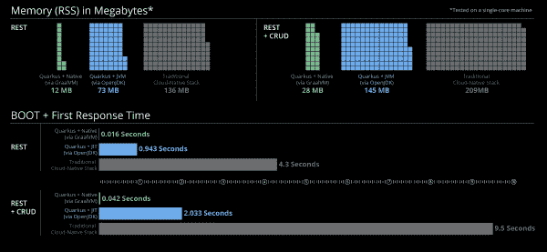

# Quarkus:一个 Kubernetes-native Java 框架

> 原文：<https://developers.redhat.com/blog/2020/04/24/ramp-up-on-quarkus-a-kubernetes-native-java-framework>

自从几年前容器开始流行以来，Java 一直处于一个有点尴尬的境地。在 [Kubernetes](https://developers.redhat.com/topics/kubernetes/) 、[微服务](https://developers.redhat.com/topics/microservices/)和[无服务器](https://developers.redhat.com/topics/serverless-architecture/)的世界里，以今天的标准来看，越来越难以忽视 Java 应用程序的臃肿。直到现在。在本文中，我将探索 Quarkus 的基础知识，这是一个专门为解决 Java 膨胀问题而构建的 Kubernetes-native Java 框架。

## 昔日的爪哇

多年来，面对 Java 的膨胀，我们中的许多人都睁一只眼闭一只眼。谁在乎我的服务器端应用程序:

*   需要数百兆字节的类文件。
*   创造了千兆字节的运行时内存足迹。
*   启动需要一分钟(或五分钟)。

我当然不在乎，因为我的 [Java](https://developers.redhat.com/topics/enterprise-java/) 应用程序将在一个强大的硬件或虚拟机上可靠地运行几个月，如果不是几年的话，同时服务数百个请求。更不用说，作为一种语言，Java 为组织提供了长时间维护软件所需的一切，使用了一个拥有不同技能水平的大型专业团队。

Java 虚拟机(JVM)早就承诺并被交付为“一次编写，几乎在任何地方运行”的平台。类型安全、面向对象的编程支持以及工具和库中无与伦比的选项集，一直以来都使 Java 成为基于团队的软件开发的绝佳选择。此外，有了企业级应用服务器(例如 EAP、WebLogic 和 Tomcat)，组织也有了一个弹性的、功能丰富的 Java web 应用平台。这些应用程序只需要遵循 JavaEE 标准来描述部署问题(想想`web.xml`)。

任何符合 JavaEE 的应用服务器都会关注操作问题，比如安全性、日志、连接到数据库/队列和伸缩。毫无疑问，多年来，Java 作为企业事实上的标准一直主导着编程语言的发展。

## Kubernetes:新的应用服务器

在之前[已经观察到 Kubernetes 是新的应用服务器。容器和 Kubernetes 采用了 JVM 的“编写一次，随处运行”的范例，并将其扩展到大多数其他编程语言。现在，用任何语言编写的应用程序都可以利用 Kubernetes 来处理操作问题，并且将自己与运行时基础设施分离。这些应用程序必须在兼容的 Linux 容器中交付。](https://developers.redhat.com/blog/2018/06/28/why-kubernetes-is-the-new-application-server/)

有了这种结构，开发人员就可以用他们喜欢的编程语言编写应用程序，并依靠 Kubernetes 来处理操作问题，如日志记录、伸缩、修复和联网。再加上 [Istio 服务网格](https://developers.redhat.com/topics/service-mesh/)，您甚至可以在没有一行应用程序代码的情况下获得开箱即用的容错和应用程序级指标。今天，我们发现自己处于一个科技领域，这个领域压倒性地倾向于[自动养牛的水平扩展，而不是人工照料宠物的垂直扩展](http://cloudscaling.com/blog/cloud-computing/the-history-of-pets-vs-cattle/)。微服务和无服务器/ 功能即服务(FaaS) 应用已经风靡一时，它们都极大地受益于低内存占用和极快的启动时间。

所以，说了这么多，越来越难以忽视的是，我的 Java 容器映像在大小和内存占用方面都更大，而且启动时间也更长，尤其是与 Golang 这样的语言相比。像 [Spring Boot](https://developers.redhat.com/topics/spring-boot/) 或 Dropwizard 这样的现代云原生框架有所帮助，但启动时间仍然至少 10 秒或更长，运行时内存占用至少有几百兆字节。

## 输入 quartus

Quarkus 的目标是正面解决 Java 的膨胀问题。Quarkus 以*超音速亚原子 Java* 上市，利用 [GraalVM](https://www.graalvm.org/) 和 [HotSpot](http://openjdk.java.net/groups/hotspot/) 为开发者提供一个框架，以快速启动时间和低 RSS 内存从 Java 代码创建应用程序。下面这张来自 [quarkus.io](https://quarkus.io/) 的图很好地说明了这些好处。请注意 Quarkus native 和传统的云原生栈在 RSS 内存和引导时间上的巨大差异。

[](/sites/default/files/blog/2020/04/quarkus_metrics_graphic_bootmem_wide.png)

*来源:*>

## OpenJDK 和 GraalVM

如上图所示，Quarkus 有两种模式:JVM 和 native。本机模式使用 GraalVM 创建一个不在 Java VM 中运行的独立可执行文件，在这种模式下运行 Quarkus 应用程序可以获得最大的效率收益。然而，并不是每个 JVM 特性都在本机模式下工作，这些丢失的特性中最臭名昭著的是[反射](https://www.oracle.com/technical-resources/articles/java/javareflection.html)。

这个事实可能是一个巨大的问题，因为 Java 开发人员日常开发所依赖的许多框架和库严重依赖于反射。GraalVM 通过允许类在编译时注册反射来解决这个问题。虽然这个过程在直接使用 GraalVM 时会很麻烦，但 Quarkus 通过检测和自动注册尽可能多的代码反射候选对象来简化注册过程。

虽然 Quarkus 在自动注册大多数反射候选对象方面做得很好，但是您可能仍然会遇到必须使用 [Quarkus 的`RegisterForReflection`注释](https://javadoc.io/doc/io.quarkus/quarkus-core/latest/io/quarkus/runtime/annotations/RegisterForReflection.html)显式注册一些类的情况。在某些项目中，这个过程可能会变得比它的价值更麻烦。出于这个原因，除了一般的灵活性，Quarkus 还提供了 JVM 模式。在 JVM 模式下，Quarkus 应用程序被打包成 JAR 文件，并在 OpenJDK HotSpot JVM 上运行。

## 给我看看代码！

设置好舞台后，让我们看一些代码。为了开始使用 Quarkus，我按照 Quarkus 的优秀的[入门指南组装了一个 JAX 遥感应用程序。](https://quarkus.io/guides/getting-started)[见我的回购](https://github.com/saharsh-samples/sample-quarkus-app)申请的代码。这个应用程序是一个简单的服务，可以用来存储、更新、检索和删除任意文本值。当我写代码的时候，我基本上只是按照指南去做。我在以下几个阶段构建了这个应用程序。

### 核心应用程序

在这个阶段，我创建了带有所有 API 端点的核心应用程序。我首先使用`quarkus-maven-plugin`生成了一个应用框架，并添加了用于 JSON 支持的`resteasy-jackson`扩展:

```
mvn io.quarkus:quarkus-maven-plugin:1.3.2.Final:create \
    -DprojectGroupId=org.saharsh \
    -DprojectArtifactId=sample-quarkus-app \
    -DclassName="org.saharsh.samples.quarkus.resources.ValuesResource" \
    -Dpath="/api/values"

mvn quarkus:add-extension -Dextensions="resteasy-jackson"
```

我做的一些改变包括去掉由`quarkus-maven-plugin`的创建任务生成的`.dockerignore`和`Dockerfile`例子。相反，我更喜欢使用一个[多级 Dockerfile](https://docs.docker.com/develop/develop-images/multistage-build/) (参见 [JVM](https://github.com/saharsh-samples/sample-quarkus-app/blob/master/Dockerfile) 和 [Native](https://github.com/saharsh-samples/sample-quarkus-app/blob/master/Dockerfile.native) )将我的构建关注点保存在一个文件中。在这之后，我只是在这个标签(或[提交](https://github.com/saharsh-samples/sample-quarkus-app/commit/b087b495cee5c35ea7e8072fe2bb4d08a2dd29f5))中添加了我的应用程序代码作为捕获的[。](https://github.com/saharsh-samples/sample-quarkus-app/releases/tag/core-app)

### 度量和运行状况检查

在创建 12 因素应用程序时，指标和健康检查至关重要。Quarkus 利用了[微概要文件](https://projects.eclipse.org/projects/technology.microprofile)，这使得添加这些特性变得非常简单:

```
mvn quarkus:add-extension -Dextensions="metrics"
```

[查看这个标签](https://github.com/saharsh-samples/sample-quarkus-app/releases/tag/metrics)(和[提交](https://github.com/saharsh-samples/sample-quarkus-app/commit/303174f467a1ffcf95e758235ec8f08eb50cedec))了解我为应用程序添加的指标。我的应用程序收集所有公开的 API 端点的计时指标。它还包含价值存储大小的度量。这些指标在`/metrics`端点发布，其中包含基础、供应商和应用程序指标。每个子组也有自己的端点(例如，`/metrics/application`):

```
mvn quarkus:add-extension -Dextensions="health"
```

类似地，查看这个[标签](https://github.com/saharsh-samples/sample-quarkus-app/releases/tag/healthchecks)(和[提交](https://github.com/saharsh-samples/sample-quarkus-app/commit/784451eb13fb3aedffc433270dfeedf57abb24dc))进行健康检查。我添加了一个[活性检查](https://github.com/saharsh-samples/sample-quarkus-app/blob/master/src/main/java/org/saharsh/samples/quarkus/health/LivenessCheck.java)和一个[准备就绪检查](https://github.com/saharsh-samples/sample-quarkus-app/blob/master/src/main/java/org/saharsh/samples/quarkus/health/ReadinessCheck.java)。对于聚合成一个的所有健康检查，可以访问`/health`端点。然而，您通常将这些分为活性和就绪性探测。因此，`/health/live`和`/health/ready`端点也是自动提供的。

### 坚持

我在第一阶段组装的核心应用程序使用了内存存储服务。这意味着存储对于应用程序的每个实例来说都是本地的，当该实例停机时会被擦除。为了构建一个可以扩展并具有持久存储的实际无状态应用程序，让我们将应用程序状态卸载到一个 MySQL 数据库:

```
mvn quarkus:add-extension -Dextensions="hibernate-orm,jdbc-mysql"
```

[见本标签](https://github.com/saharsh-samples/sample-quarkus-app/releases/tag/persistent-storage)(和[提交](https://github.com/saharsh-samples/sample-quarkus-app/commit/6912d349c827ceb28b8c5424af7f924d9dd03a93))关于持久性的变化。亮点是:

*   因为[我的资源类](https://github.com/saharsh-samples/sample-quarkus-app/blob/master/src/main/java/org/saharsh/samples/quarkus/resources/ValuesResource.java)依赖于[`StorageService`接口抽象](https://github.com/saharsh-samples/sample-quarkus-app/blob/master/src/main/java/org/saharsh/samples/quarkus/service/StorageService.java)，所以不需要修改代码就可以切换到持久模式。
*   在运行时选择我的存储服务实现让我介绍三件事:
    *   一处房产。
    *   一个基于属性创建正确 bean 的`producer`类。
    *   我的资源类的一个 [`Qualifier`注释](https://javaee.github.io/javaee-spec/javadocs/javax/inject/Qualifier.html) ( [`ConfiguredStorage`](https://github.com/saharsh-samples/sample-quarkus-app/blob/master/src/main/java/org/saharsh/samples/quarkus/service/ConfiguredStorage.java) )指定它打算使用由`producer`类产生的 bean。
*   利用[`application.properties`模式](https://github.com/saharsh-samples/sample-quarkus-app/blob/master/src/main/resources/application.properties)将内存存储用作默认存储类型。

对于最后一个，我打算使用[环境变量来覆盖这些属性](https://quarkus.io/guides/config#overriding-properties-at-runtime)并切换到持久存储。然而，有一个问题。Quarkus 在构建时完成大部分配置和引导。大多数属性将在构建时步骤中被读取和设置。要更改它们，请确保重新打包您的应用程序。在我的`application.properties`文件中，`quarkus.hibernate-orm.dialect`、`quarkus.datasource.driver`和`quarkus.datasource.health.enabled`在运行时不能被覆盖。好消息是其余的可以。

## 就这样

关于添加原生构建支持和文档，我还有几个承诺。但是，应用程序已经准备就绪。我的 repo 的`README.md`很好地完成了在本地构建和运行这个应用程序的细节。您可以参考以下步骤在 [Red Hat OpenShift](https://developers.redhat.com/openshift/) 或[Red Hat code ready Containers](https://developers.redhat.com/products/codeready-containers/overview)上运行应用程序:

```
# Create a new project
oc new-project samples

# Standup MySQL
oc new-app --name=valuesdb  mysql-ephemeral \
    -p DATABASE_SERVICE_NAME=valuesdb \
    -p MYSQL_ROOT_PASSWORD=password \
    -p MYSQL_USER=valsuser \
    -p MYSQL_PASSWORD=password \
    -p MYSQL_DATABASE=valsdb

# Create the application schema in MySQL
oc rsh valuesdb-1-[pod_id] bash -c "mysql -uvalsuser -ppassword valsdb"
mysql> CREATE TABLE vals (
    id BIGINT AUTO_INCREMENT PRIMARY KEY,
    value VARCHAR(255) NOT NULL,
    date_created TIMESTAMP DEFAULT CURRENT_TIMESTAMP,
    last_updated TIMESTAMP DEFAULT CURRENT_TIMESTAMP ON UPDATE CURRENT_TIMESTAMP
);

# Create API application from Github repo
oc new-app --name valuesapi https://github.com/saharsh-samples/sample-quarkus-app

# Expose a route
oc expose svc/valuesapi && oc get routes

# To use persistent storage, first create a secret containing DB configuration
oc create secret generic valuesapi-properties \
    --from-literal=SAMPLE_STORAGE_TYPE=persistent \
    --from-literal=QUARKUS_DATASOURCE_URL="jdbc:mysql://valuesdb/valsdb" \
    --from-literal=QUARKUS_DATASOURCE_USERNAME=valsuser \
    --from-literal=QUARKUS_DATASOURCE_PASSWORD=password

# Turn the fields of the secret into environment variables for the API app
oc set env dc/valuesapi --from=secret/valuesapi-properties

# Add liveness and readiness probes
oc set probe dc/valuesapi --liveness --get-url=http://:8080/health/live
oc set probe dc/valuesapi --readiness --get-url=http://:8080/health/ready
```

## 结论

Quarkus 是 Java 生态系统中令人兴奋的新发展。当我探索与无服务器架构、反应式编程和 Kafka 相关的 Quarkus 时，我一定会分享更多的文章和代码。与此同时，请查看以下链接以深入了解:

*   [夸尔库斯官方网站](https://quarkus.io/)
*   官方 Quarkus GitHub
*   [夸库斯常见问题解答](https://quarkus.io/faq/)
*   [为什么选择 GraalVM？](https://www.graalvm.org/docs/why-graal/)

*Last updated: January 18, 2022*