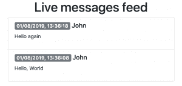

# 用 Vert.x 进行反应式 Spring Boot 编程

> 原文：<https://developers.redhat.com/blog/2019/08/21/reactive-spring-boot-programming-with-vert-x>

最近发布了最新的红帽支持的 Spring Boot 首发包。除了为我们的 [Spring Boot](https://spring.io/projects/spring-boot) 客户提供受欢迎的红帽产品，红帽 Spring Boot 团队还忙于开发新产品。最近增加的技术预览版是一组 Eclipse [Vert.x Spring Boot](https://github.com/snowdrop/vertx-spring-boot) 启动器，为流行的 JVM 反应工具包提供了一个 Spring 原生词汇表。

在查看示例之前，让我们快速浏览一下主要概念，让每个人都有相同的看法。

在[反应宣言](https://www.reactivemanifesto.org/)中定义的反应系统是反应灵敏的、有弹性的、有弹性的和消息驱动的。这些特性保证了简单的复制、非阻塞通信、高系统资源利用率和高容错能力。在软件发展的最新阶段，随着云优先、低延迟和高度数据密集型应用的出现，反应式系统提供了巨大的资金价值。

在我们的最新版本中，我们为 [Vert.x](https://vertx.io/) 引入了一些 [Spring WebFlux](https://docs.spring.io/spring/docs/current/spring-framework-reference/web-reactive.html) 扩展。有了这些扩展，你可以用你习惯的方式构建你的应用——使用 WebFlux 和[Project Reactor](https://projectreactor.io/)——而网络通信将由 Vert.x 服务器和客户端处理。

反应式 HTTP 层的实现将使您离完全反应式系统更近一步，但不要止步于此。在理想的情况下，你的整个系统都是被动的。组件间通信、数据访问、缓存和其他实用程序应该支持反应流和反压，以保证您的应用程序能够承受任何情况。Vert.x 为所有这些类型的技术提供了反应式客户端，我们将逐步将它们引入我们的 [Vert.x Spring Boot 启动器包](https://github.com/snowdrop/vertx-spring-boot)。

让我们看几个代码示例，看看 Vert.x 如何在 WebFlux 应用程序中使用。

## 留言板示例

为了演示 Vert.x WebFlux 的运行，让我们创建一个简单的留言板应用程序。这个应用程序由两个服务组成:消息和仪表板。

消息服务使用一个临时代理来发布和订阅新消息。这两个操作通过 HTTP REST API 公开为 GET 和 POST 操作。GET endpoint 返回一个 JSON 对象流，每次新消息到达时都会更新该对象流。

仪表板服务使用 HTTP 客户端从消息服务请求新消息，并将它们显示在仪表板中。当新消息到达时，仪表板网页会实时更新。

好消息是，与默认的 WebFlux 应用程序相比，Vert.x Spring Boot HTTP starter 在大多数情况下不需要任何代码更改。我们的自动配置使用 WebFlux SPI 处理 beans 的创建和注册。因此，唯一需要的改变是 Maven 依赖项的更新。

将我们的 BOM 和 starter 添加到您应用的`pom.xml`中。

```
<dependencyManagement>
  <dependencies>
    <dependency>
      <groupId>me.snowdrop</groupId>
      <artifactId>spring-boot-bom</artifactId>
      <version>2.1.6.Final</version>
      <type>pom</type>
      <scope>import</scope>
    </dependency>
    <!-- Other application specific dependencies -->
  </dependencies>
</dependencyManagement>
<dependencies>
  <dependency>
    <groupId>dev.snowdrop</groupId>
    <artifactId>vertx-spring-boot-starter-http</artifactId>
  </dependency>
  <!-- Other application specific dependencies -->
</dependencies>
```

### 消息服务

有两种方法可以在 WebFlux 应用程序中定义 HTTP 端点。消息服务使用函数端点，这允许函数编程风格。然而，Dashboard 使用传统的 Spring MVC 风格的带注释的控制器。

当使用功能端点时，我们需要定义处理器函数，然后由路由器函数调用。首先，让我们实现一个 GET 处理程序，它将订阅一个代理并返回一个消息流。

```
private Mono<ServerResponse> getHandler(MessagesBroker broker) {
    return ok()
        .contentType(APPLICATION_STREAM_JSON)
        .body(broker.subscribe(), Message.class);
}
```

然后，让我们定义一个 POST 处理程序，它将接收新消息并将它们发布给代理。

```
private Mono<ServerResponse> postHandler(ServerRequest request,
        MessagesBroker broker) {

    Mono<Message> messageMono = request
        .bodyToMono(Message.class)
        .doOnNext(broker::publish);
    return accepted()
        .contentType(APPLICATION_JSON)
        .body(messageMono, Message.class);
}
```

最后，让我们创建一个路由器函数，它将把 HTTP 请求映射到正确的处理程序。

```
@Bean
public RouterFunction<ServerResponse> router(MessagesBroker broker) {
    return route()
        .GET("/", accept(APPLICATION_STREAM_JSON), r -> getHandler(broker))
        .POST("/", request -> postHandler(request, broker))
        .build();
}
```

正如您在这个代码示例中看到的，处理程序将消息处理委托给一个代理组件，该组件实现了消息分发的主要逻辑。对于这个例子，它只是一个简单的通量发生器。然而，在真实的场景中，它将被一个实际的消息代理所取代，比如红帽 AMQ。

### 仪表盘

Dashboard 使用 Spring MVC 风格实现了两个控制器。第一个示例呈现了一个带有留言板的 HTML 页面。第二个控制器提供一个 GET 端点，HTML 页面使用它来接收作为服务器发送事件的消息。

这是索引页面的控制器。

```
@Controller
public class DashboardController {
    @GetMapping("/")
    public String home() {
        return "index";
    }
}
```

消息端点稍微复杂一点。它注入一个 web 客户端构建器并创建一个 Vert.x WebFlux web 客户端。它使用这个客户机从 messages 服务中检索新消息，并将它们转发到 web 页面。

下面是消息控制器的实现。

```
@RestController
public class MessagesController {
    private static final String MESSAGES_SERVICE_URL = "http://localhost:8081";
    private final WebClient webClient;

    public MessagesController(WebClient.Builder webClientBuilder) {
        this.webClient = webClientBuilder
            .baseUrl(MESSAGES_SERVICE_URL)
            .build();
    }

    @GetMapping(path = "/messages", produces = TEXT_EVENT_STREAM_VALUE)
    public Flux<Message> getMessages() {
        return webClient
            .get()
            .accept(APPLICATION_STREAM_JSON)
            .retrieve()
            .bodyToFlux(Message.class);
    }
}
```

如果您启动这两个应用程序并在 [http://localhost:8080](http://localhost:8080) 打开浏览器，您将首先看到一个空白页面。让它开着，从你的终端发送一些信息。请注意，我们的演示代理不提供持久性，因此只显示仪表板打开时收到的消息。

从您的终端发布几条消息。

```
$ http POST :8081 sender=John text="Hello, World"
$ http POST :8081 sender=John text="Hello again"

```

现在，仪表板中应该有两条消息。



## 结论

请在我们的 GitHub 库查看 Vert.x Spring Boot 项目。我们将感谢您的输入和拉动请求。最新版本还包含了本文没有涉及的特性，比如 WebSockets 和邮件客户端，所以请查看示例以了解更多信息。

在即将发布的版本中，我们计划引入 AMQP 1.0 和 Kafka 客户端，在您的服务之间提供反应式消息传递。

### 查看更多

*   完整示例代码:[https://github . com/gytis/vertx-spring-boot-message-board-example](https://github.com/gytis/vertx-spring-boot-message-board-example)
*   项目库:[https://github.com/snowdrop/vertx-spring-boot](https://github.com/snowdrop/vertx-spring-boot)

*Last updated: January 5, 2022*