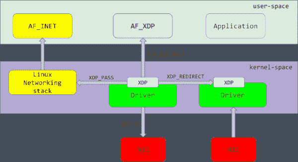
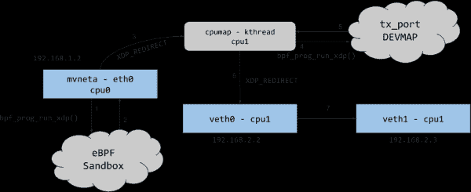

# 利用 eBPF 和 CPUMAP 实现接收端调整(RSS)

> 原文：<https://developers.redhat.com/blog/2021/05/13/receive-side-scaling-rss-with-ebpf-and-cpumap>

高速网络数据包处理在服务器上提出了一个具有挑战性的性能问题。现代网络接口卡(NIC)处理数据包的速度远远高于主机在单个 CPU 上的处理速度。因此，为了扩展主机上的处理， [Linux](/topics/linux) 内核使用名为[接收端扩展](https://access.redhat.com/documentation/en-us/red_hat_enterprise_linux/6/html/performance_tuning_guide/network-rss#:~:text=Receive%2DSide%20Scaling%20(RSS)%2C%20also%20known%20as%20multi,be%20processed%20by%20multiple%20CPUs.&text=It%20also%20shows%20how%20many,which%20CPU%20serviced%20the%20interrupt.) (RSS)的硬件特性向多个 CPU 发送数据包。RSS 依靠流散列将传入的流量分布在 RX IRQ 线路上，这将由不同的 CPU 处理。不幸的是，在很多情况下，NIC 硬件 RSS 功能会失败；例如，如果 NIC RSS 引擎不支持接收的流量。当网卡不支持 RSS 时，网卡会将所有数据包发送到同一个 RX IRQ 线路，从而到达同一个 CPU。

以前，如果硬件特性与部署用例不匹配，没有好的方法来解决。但是 [eXpress Data Path](https://www.iovisor.org/technology/xdp) (XDP)提供了一个高性能、可编程的钩子，使得路由到多个 CPU 成为可能，因此 Linux 内核不再受硬件的限制。本文展示了如何在软件中处理这种情况，重点是如何使用 XDP 和 [CPUMAP](https://xdp-project.net/areas/cpumap.html) 重定向来解决这个问题。

## 更快的软件接收与 XDP 转向

Linux 内核已经有了一些 RSS 的软件实现，称为接收包导向(RPS)和接收流导向(RFS ),但不幸的是，它们的性能还不足以取代硬件 RSS。一种更快、更具可扩展性的软件解决方案使用 XDP 将原始帧重定向到 CPUMAP 中。

XDP 是在正常网络堆栈之前调用的内核层。这意味着 XDP 在分配[套接字缓冲区](http://vger.kernel.org/~davem/skb.html) (SKB)之前运行，这个内核对象跟踪网络数据包。XDP 通常避免任何基于包的内存分配。

## 什么是 XDP？

当 DMA rx-ring 为 CPU 同步时，XDP 在驱动程序接收路径的最早可能点运行 eBPF 程序。这个 eBPF 程序解析接收到的帧，并返回一个由网络栈执行的动作或*判决*。可能的判决是:

*   XDP _ 丢弃:丢弃帧，这在驱动级别意味着回收而不分配。
*   XDP 传递:让帧传递到正常的网络堆栈处理。
*   XDP_TX:从同一个接口弹出帧。
*   XDP _ 重定向:本文关注的高级操作。

图 1 显示了 XDP 架构以及 XDP 如何与 Linux 网络堆栈交互。

[](/sites/default/files/blog/2020/11/XDP_arch.png)

Figure 1: XDP in the Linux networking stack.

## 重定向到 CPUMAP

BPF 映射是通用的键值存储，可以有不同的数据类型。这些映射既用作用户空间应用程序和运行在 Linux 内核中的 eBPF 程序之间的接口，也用作向内核助手传递信息的一种方式。截至本文撰写之时，共有 [28 种地图类型](https://elixir.bootlin.com/linux/v5.10-rc2/source/include/uapi/linux/bpf.h#L130)。

对于 XDP 的软件 RSS 用例，CPUMAP 类型(`BPF_MAP_TYPE_CPUMAP`)正是我们所需要的。CPUMAP 表示系统中的 CPU(零)，索引为 map-key，map-value 是配置设置(每个 CPU 映射条目)。每个 CPUMAP 条目都有一个绑定到给定 CPU 的专用内核线程来代表远程 CPU 执行单元。以下伪代码说明了 CPUMAP 条目和相关内核线程的分配:

```
static int cpu_map_kthread_run(void *data)
{
    /* do some work */
}

int cpu_map_entry_alloc(int cpu, ...)
{
    ...
    rcpu->kthread = kthread_create_on_node(cpu_map_kthread_run, ...);
    kthread_bind(rcpu->kthread, cpu);
    wake_up_process(rcpu->kthread);
    ...
}
```

我们向 XDP 承诺了一个更快的解决方案，这只有通过 CPUMAP 内部的精心设计和大量细节才能实现。这些内部组件在文章结尾的[附录](#details)部分有所描述。

### 将原始帧移动到远程 CPU

NIC RX 队列的 IRQ 被引导到的 CPU(接收 CPU)接收数据包。这个 CPU 是最先看到数据包的 CPU，也是 XDP 程序执行的地方。因为目标是在多个 CPU 之间扩展 CPU 使用，所以 eBPF 程序应该在这个初始 CPU 上使用尽可能少的周期——刚好足以确定将数据包发送到哪个远程 CPU，然后使用带有 CPUMAP 的 redirect eBPF 助手将数据包移动到远程 CPU 进行继续处理。

远程 CPUMAP `kthread`接收原始 XDP 帧(`xdp_frame`)对象。因此，SKB 对象由远程 CPU 分配，而 SKB 被传递到网络堆栈中。以下示例说明了对`kthread`伪代码的更改，以阐明 SKB 分配以及 skb 如何被转发到 Linux 网络堆栈:

```
static int cpu_map_kthread_run(void *data)
{
    while (!kthread_should_stop()) {
        ...
        skb = cpu_map_build_skb();
        /* forward to the network stack */
        netif_receive_skb_core(skb);
        ...
    }
}
```

### 陷阱:缺少远程 CPU 上的 SKB 信息

当基于`xdp_frame`对象创建 SKB 时，某些可选的 SKB 字段不会被填充。这是因为这些字段来自 NIC 硬件 RX 描述符，而在远程 CPU 上，该 RX 描述符不再可用。经常丢失的两条硬件“部分卸载”信息是硬件接收校验和信息(`skb->ip_summed` + `skb->csum`)和硬件接收散列。不太常用的值还有 VLAN、接收时间戳和标记值。

丢失的接收校验和会导致发送 SKB 时速度变慢，因为校验和必须重新计算。当网络堆栈需要访问哈希值时(参见`skb_get_hash()`函数),它会触发哈希的软件重新计算。

## 新的 CPUMAP 特性:在远程 CPU 上运行 XDP

从 Linux 内核版本 5.9 开始(不久将在[Red Hat Enterprise Linux 8](/products/rhel/overview))[CPU map 可以在远程 CPU](https://git.kernel.org/pub/scm/linux/kernel/git/torvalds/linux.git/commit/?id=9216477449f33cdbc9c9a99d49f500b7fbb81702) 上运行一个新的(第二个)XDP 程序。这有助于可伸缩性，因为接收 CPU 应该在每个数据包上花费尽可能少的周期。分组被定向到的远程 CPU 能够承受花费更多的周期，例如更深入地查看分组报头。以下示例通过伪代码展示了当与 CPUMAP 条目相关联的 eBPF 程序运行时所执行的内容:

```
static int cpu_map_bpf_prog_run_xdp(void *data)
{
    ...
    act = bpf_prog_run_xdp();
    switch (act) {
    case XDP_DROP:
        ...
    case XDP_PASS:
        ...
    case XDP_TX:
        ...
    case XDP_REDIRECT:
        ...
    }
    ...
}

static int cpu_map_kthread_run(void *data)
{
    while (!kthread_should_stop()) {
        ...
        cpu_map_bpf_prog_run_xdp();
        ...
        skb = cpu_map_build_skb();
        /* forward to the network stack */
        netif_receive_skb_core(skb);
        ...
    }
}

```

运行在每个远程 CPU 上的第二个 XDP 程序是通过在映射入口级插入 eBPF 程序(文件描述符)来附加的。这是通过扩展地图值实现的，现在通过`struct bpf_cpumap_val`定义为 UAPI:

```
/* CPUMAP map-value layout
 *
 * The struct data-layout of map-value is a configuration interface.
 * New members can only be added to the end of this structure.
 */
struct bpf_cpumap_val {
    __u32 qsize;  /* queue size to remote target CPU */
    union {
        int   fd; /* prog fd on map write */
        __u32 id; /* prog id on map read */
    } bpf_prog;
};

```

## 实际使用案例:低端硬件的问题

市场上的一些多核设备不支持 RSS。此类设备上的网卡产生的所有中断都由一个 CPU(通常为 CPU0)管理。

然而，使用 XDP 和 CPUMAPs，有可能为这些设备实现一个软件近似的 RSS。通过在网卡上加载一个 XDP 程序，将数据包重定向到 CPUMAP 条目，您可以平衡所有可用 CPU 上的流量，只需在连接到网卡 IRQ 线路的内核上执行几条指令。运行在 CPUMAP 条目上的 eBPF 程序将实现将流量重定向到远程接口或将其转发到网络堆栈的逻辑。图 2 显示了这个解决方案在 [EspressoBin](http://espressobin.net/) (mvneta)上的系统架构。大部分代码在与 CPU1 相关的 CPUMAP 条目上执行。

[](/sites/default/files/blog/2020/11/cpumap-test-arch.png)

Figure 2: How XDP redirects packets off of CPU0 and allows most processing on another CPU.

## 未来的发展

目前，CPUMAP 没有调用通用接收卸载(GRO)系统，该系统可以通过创建指向几个 TCP 数据段的 SKB 来提高 TCP 吞吐量。为了填补 SKB 场景的空白，我们需要扩展 CPUMAPs(以及一般的 XDP)以支持巨型帧，并利用网络堆栈中可用的 GRO 代码路径。别担心，我们已经在努力了！

## 承认

我要感谢 Jesper Dangaard Brouer 和Toke h iland-jrgensen对本文的详细贡献和反馈。

## 附录

这一节解释了一些读者可能感兴趣的复杂性，但是对于理解本文中讨论的基本概念来说并不是必需的。

### 旧软件接收转向的问题

Linux 内核已经有了一个软件特性，称为接收数据包导向(RPS)和接收流导向(RFS)，从逻辑上讲，这是 RSS 的一个软件实现。这个特性[很难配置](https://www.kernel.org/doc/html/latest/networking/scaling.html)，并且具有有限的可扩展性和性能。出现性能问题是因为 RPS 和 RFS 在内核的接收路径中发生得太晚，最重要的是在分配 SKB 之后。将这些 SKB 对象转移和排队到远程 CPU 也是一个跨 CPU 的可伸缩性瓶颈，它涉及处理器间通信(IPC)调用和在 CPU 之间移动缓存线。

### 缺陷:Q-in-Q VLAN 的 RSS 不正确

当 NIC 硬件解析器无法识别协议时，它无法计算正确的 RX 散列，因此无法在硬件中的可用 RX 队列(绑定到 IRQ 线路)上执行正确的 RSS。

这尤其适用于硬件网卡发布后开发的新协议和封装。当 VXLAN 首次推出时，这一点非常明显。为了扩展一些网卡，固件升级允许它们支持新的协议。

此外，您会期望网卡能很好地与旧的通用 VLAN (IEEE 802.1Q)协议标准一起工作。确实如此，只是多个或堆叠的 VLANs 似乎会在许多常见的网卡上中断。这些多个 VLANs 的标准是 IEEE 802.1ad，非正式地称为 Q-in-Q(2011 年并入 802.1Q)。在 ixgbe 和 i40e NIC 驱动程序中发现了实际的 Q-in-Q RSS 问题。

### XDP 重定向有何特别之处？

XDP 重定向判决与其他判决的不同之处在于，它可以将 XDP 帧(`xdp_frame`)对象排列到 BPF 地图中。所有其他的判断都需要立即采取行动，因为跟踪包数据的`xdp_buff`数据结构没有被分配到任何地方；它只是函数调用本身的一个变量。

为了提高性能，必须避免使用每包分配来将`xdp_buff`转换为`xdp_frame`，以便允许对执行 XDP 重定向的对象进行排队。为了避免任何内存分配，`xdp_frame`对象被放在数据包本身的顶部净空中。CPU 预取操作在 XDP eBPF 程序之前运行，以避免写入该高速缓存行的开销。

在返回 XDP 重定向判决之前，XDP eBPF 程序调用以下 BPF 助手之一来描述帧应该发送到的重定向目的地:

*   `bpf_redirect(ifindex, flags)`
*   `bpf_redirect_map(bpf_map, index_key, flags)`

第一个助手使用`ifindex`作为一个键，简单地选择 Linux 网络设备的目的地。第二个助手是允许用户扩展 XDP 重定向的大飞跃。这个助手可以在特定的`index_key`重定向到 BPF 地图。这种灵活性可用于 CPU 控制。

批量处理的能力对于性能非常重要。地图重定向负责创建批量效果，因为当 NAPI 民意测验预算结束时，驱动程序需要调用一个`xdp_flush`操作。该设计允许单个 map 类型的实现来控制膨胀的级别。下一节将解释如何使用膨胀来减少跨 CPU 通信的开销。

### CPU 之间的高效传输

CPUMAP 条目表示一个多生产者单消费者(MPSC)队列(通过内核中的`ptr_ring`实现)。

*单个消费者*是 CPUMAP `kthread`，它可以访问`ptr_ring`队列而不需要任何锁。它还尝试将八个`xdp_frame`对象批量出队，因为它们代表一个缓存行。

*多生产者*可以是 RX IRQ 线路 CPU，为远程 CPU 同时排队分组。为了避免每个生产者 CPU 的队列锁争用，有一个小的八对象队列来生成跨 CPU 队列的批量入队。这种小心的队列使用意味着每个缓存行在 CPU 之间传输八个帧。

*Last updated: May 7, 2021*