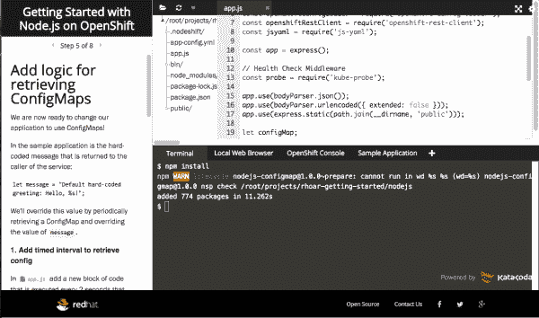

# Node.js 14 的 Red Hat build 带来了诊断报告、计量等等

> 原文：<https://developers.redhat.com/blog/2020/12/08/red-hat-build-of-node-js-14-brings-diagnostic-reporting-metering-and-more>

Node.js 14 长期支持(LTS)发布的最新 Red Hat 版本。这个版本带来了新的特性，比如诊断报告、`full-icu`国际化支持和 [Red Hat OpenShift](https://developers.redhat.com/products/openshift/overview) 集成。我们还包括了新的`AsyncLocalStorage`类等技术预览功能，并且更新了我们的文档和交互式开发人员学习场景。请继续阅读，了解 [Node.js](https://developers.redhat.com/topics/nodejs) 14 的新增内容以及如何开始使用 Red Hat build。

## 开始使用 Node.js 14 的 Red Hat 版本

如果您使用 OpenShift，从导入最新的`nodejs-14`图像开始。假设您已经通过`oc`命令行界面(CLI)登录，在您的终端中输入以下内容:

```
$ oc import-image rhel8/nodejs-14 --from=registry.redhat.io/rhel8/nodejs-14 --confirm

```

接下来，您可能想要在 OpenShift 中构建一个简单的 [nodejs-sample-app](https://github.com/sclorg/nodejs-ex.git) ，如下所示:

```
$ oc new-app nodejs:14~https://github.com/sclorg/nodejs-ex.git

```

您可以使用 docker 文件创建自己的映像来打包您的应用程序:

```
FROM ubi8/nodejs-14
# Add application sources
ADD app-src .

# Install the dependencies
RUN npm install

# Run script uses standard ways to run the application
CMD npm run -d start

```

如果您想要提取并使用一个或多个[Red Hat Enterprise Linux](https://developers.redhat.com/topics/linux)(RHEL)映像，请输入以下内容:

```
$ docker login registry.redhat.io

Username: {REGISTRY-SERVICE-ACCOUNT-USERNAME}
Password: {REGISTRY-SERVICE-ACCOUNT-PASSWORD}

Login Succeeded!

$ docker pull registry.redhat.io/rhel8/nodejs-14

```

## 内置诊断报告

如果在生产环境中运行应用程序，有时需要从中提取诊断数据。Node.js 使用首次故障数据捕获(FFDC)技术在错误发生时捕获诊断数据。作为开发人员，您可以使用诊断报告来分析正在发生的事情，并对应用程序环境进行故障排除。

以前的版本需要单独安装 Node.js 报告模块。在 Node.js 14 的 Red Hat 版本中，您可以直接在 Node.js 运行时使用诊断报告功能。以下是如何在 Node.js 14 构建中直接访问诊断报告的示例:

```
function test() {
    process.report.writeReport();
}

test();
console.log('Ready');

```

以下是如何使用命令行转储报告的示例:

```
$ node --report-uncaught-exception --report-on-signal --report-on-fatalerror app.js

```

您可以为诸如性能问题、内存泄漏、高 CPU 使用率等异常情况生成诊断报告。报告采用 JSON 格式，便于将结果集成到更广泛的报告机制中。

## 全面的 ICU 国际化支持

为不同地理位置的客户服务的应用程序需要国际化支持。国际化会影响应用程序的各个方面，包括数据进入系统的方式、用户界面的外观以及系统输出的使用方式。Node.js 14 的 Red Hat build 提供了对 Unicode 国际组件的完全支持(完全 ICU)。选择`full-icu`选项可以让您编写国际化的应用程序，并将其简单地内置到运行时中。有关 Node.js 14 中的`full-icu`的更多信息，请参见 Node.js 文档中的[国际化支持](https://nodejs.org/dist/latest-v14.x/docs/api/intl.html)。

## Red Hat OpenShift 容器平台中图像的计量标签

[计量](https://access.redhat.com/documentation/en-us/openshift_container_platform/4.4/html/metering/about-metering)是一个[红帽 OpenShift 容器平台](https://developers.redhat.com/products/openshift/getting-started)工具，通过结构化查询语言(SQL)实现数据分析和报告。在 OpenShift 上运行时，您可以使用计量报告来分析应用程序的复杂细节。在这个版本中，我们为在 OpenShift 上运行的 Node.js 应用程序添加了计量标签。您可以使用计量标签将 OpenShift 中计量的好处应用到您自己的应用程序域中。

有关更多信息，请参见 Red Hat OpenShift 容器平台文档中的[计量](https://access.redhat.com/documentation/en-us/openshift_container_platform/4.4/html/metering/index)。

## V8 JavaScript 引擎更新至 8.4 版

在这个版本中，我们已经将 [V8 JavaScript 引擎](https://v8.dev)更新到了 8.4 版本。该引擎包含一些新功能，如[可选链接](https://developers.redhat.com/blog/2020/10/20/get-started-with-node-js-14-on-red-hat-openshift/)和 API 变化，以改进本地化支持。

## 技术预览功能

Node.js 14 的 Red Hat 版本包括两个新的技术预览功能和一个对现有技术预览功能的改进。

### 异步本地存储的新类

如果您曾经尝试过将上下文信息(如日志记录)传播到异步流程中，您就会知道这是一件乏味的事情。应该有更简单的方法来处理这些内部流程。在 Node.js 14 的 Red Hat 构建中，我们提供了`AsyncLocalStorage`类作为技术预览特性。`AsyncLocalStorage`在回调和承诺链中创建异步状态，如下例所示:

```
const requestId = (req, res, next) => {
  asyncLocalStorage.run(customId, () => {
    asyncLocalStorage.getStore().set("requestId", uuid());
  });
};

```

`asyncLocalStorage.run()`方法有两个参数:第一个是*存储状态*，可以是您想要的任何东西。在我们的例子中，我们使用了一个`customId(customer Id)`。第二个参数是一个函数。我们的状态将在函数中被检索和隔离。在这个例子中，我们在函数中调用了`next()`，让所有其他 Express.js 中间件实例在`AsyncLocalStorage`上下文中运行。

### Node.js 的新 WebAssembly 系统接口(WASI)API

[WebAssembly](https://webassembly.org) 是一个基于堆栈的虚拟机，构建在二进制指令格式上。Node.js 的 WebAssembly 包提高了性能和跨平台支持。新的 WebAssembly 系统接口(WASI)API 提供了 [WebAssembly 系统接口规范](https://nodejs.org/docs/latest-v14.x/api/wasi.html)的实现。开发人员可以将此接口用于 WebAssembly 应用程序的沙盒执行。该接口为应用程序提供了对底层操作系统的访问。

### 不再有使用 EcmaScript 模块的警告消息

在 Node.js 的早期版本中，开发人员因在 Node.js 应用程序中使用一个或多个 EcmaScript 模块而收到警告消息。警告消息表明 EcmaScript 模块是实验性的。我们已经从这个 Node.js 14 build forward 中删除了警告消息。但是，请注意，EcmaScript 模块仍然只在技术预览版中可用。

## 开发者资源

为了支持开发人员开始使用 Node.js 14 的 Red Hat 版本，我们更新了该版本的文档和学习场景。

### 证明文件

我们已经为这个版本更新了 [Node.js 14 发行说明](https://access.redhat.com/documentation/en-us/red_hat_build_of_node.js/14/html/release_notes_for_node.js_14/index)和 [API 文档](https://nodejs.org/dist/latest-v14.x/docs/api/)。我们还添加了新的 [Node.js 运行时指南](https://access.redhat.com/documentation/en-us/red_hat_build_of_node.js/14/html/node.js_runtime_guide/index)。

**注意**:参见发行说明的“IBM Z 上 Node.js 运行时的支持”部分，了解更多关于在 s390x 平台和 IBM Z 基础设施上运行的 OpenShift 上的 Node.js 14 的 Red Hat 构建的信息。

### 开发者互动学习场景

您可以使用[自定进度的开发人员交互式学习场景](https://learn.openshift.com/)来[试验 Node.js](https://learn.openshift.com/middleware/rhoar-getting-started-nodejs/) 或了解其他[红帽运行时](https://www.redhat.com/en/products/runtimes)技术。每个场景都为您提供了一个预配置的 OpenShift 实例，无需任何下载或配置即可从浏览器访问。如图 1 所示，您可以使用 OpenShift 实例来探索 Node.js 14，看看它如何帮助您解决现实世界的问题。

[](/sites/default/files/blog/2018/03/katacoda-node.png)

Figure 1\. Getting started with Node.js on OpenShift.

## 向 Red Hat Runtimes 工程团队致敬

Red Hat Runtimes 工程团队制作了这个版本。开发 Node.js 14 的 Red Hat 版本涉及许多小时的开发、测试、编写文档、更多的测试，以及与更广泛的客户、合作伙伴和 Node.js 开发人员的 Red Hat 社区合作，以整合大大小小的贡献。我们真诚地希望这个建筑达到或超过你期望！

*Last updated: December 4, 2020*