# 红帽 CodeReady Studio 12.14.0.GA 和 JBoss Tools 4 . 14 . 0 . final:open shift 和 Quarkus 更新

> 原文：<https://developers.redhat.com/blog/2020/04/20/red-hat-codeready-studio-12-14-0-ga-and-jboss-tools-4-14-0-final-openshift-application-explorer-view-feedback-loops-new-quarkus-tooling>

[JBoss Tools 4.14.0](https://tools.jboss.org/downloads/jbosstools/2019-12/4.14.0.Final.html) 和[Red Hat code ready Studio 12.14](https://developers.redhat.com/products/codeready-studio/overview)for Eclipse 4.14(2019-12)在这里等你。对于这个版本，我们专注于改进基于容器的开发，为 [Quarkus 框架](https://developers.redhat.com/topics/quarkus/)添加工具，并修复错误。我们还更新了 Hibernate Tools runtime provider 和 Java Developer Tools (JDT)扩展，它们现在与 Java 13 兼容。此外，我们对平台视图、对话框和工具栏进行了许多 UI 更改。

在这两篇文章中，我将介绍这些新版本的亮点，并向您展示如何开始在您的 Java 项目中使用它们。请继续阅读，了解 JBoss Tools 4.14.0 中的更多更新和新特性。在这第一篇文章中，我主要关注这些特性:

## 装置

首先，让我们看看如何安装这些更新。Red Hat CodeReady Studio(以前的 Red Hat Developer Studio)在其安装程序中预捆绑了所有东西。只需从 [Red Hat CodeReady Studio 产品页面](https://developers.redhat.com/products/codeready-studio/overview)下载安装程序，并按如下方式运行:

```
$ java -jar codereadystudio-<installername>.jar

```

另一方面，安装 JBoss Tools 4.14.0— *又名*“自带 Eclipse(BYOE)code ready Studio”—需要更多的努力。该版本至少需要 Eclipse 4.14 (2019-12)，但我们建议安装最新的 [Eclipse 4.14 2019-12 Java EE 捆绑包](http://www.eclipse.org/downloads/packages/release/2019-12/r/eclipse-ide-java-ee-developers)。安装最新的包可以确保您获得最新的 Java 依赖项。

一旦你安装了 Eclipse 4.14 (2019-12)或更高版本，你可以打开 Eclipse Marketplace 标签页，寻找 JBoss Tools 或 T2 的 Red Hat CodeReady Studio。或者，你可以[直接从我们的更新网站下载 JBoss Tools 4.14.0](http://download.jboss.org/jbosstools/photon/stable/updates/) 。

## OpenShift 容器平台 4.3 兼容性

JBoss Tools 现在兼容 [OpenShift 容器平台(OCP) 4.3](https://blog.openshift.com/introducing-red-hat-openshift-4-3-to-enhance-kubernetes-security/) 。现在，您可以通过定义到 OpenShift Container Platform 4.3 集群的连接来访问 JBoss Tools 中的新版本，就像您之前对 OpenShift Container Platform 3 集群所做的那样。

## OpenShift 应用程序浏览器视图

除了标准的 OpenShift 浏览器之外，我们还添加了新的 OpenShift 应用浏览器视图。基于 [OpenShift Do (odo)](https://github.com/openshift/odo/) ，新视图简化了用户体验，并引入了反馈循环和改进的调试控制台。

要查看新视图的运行情况，请打开 JBoss Tools 4.14.0 工作区。您应该在屏幕底部的可用视图列表中看到 OpenShift Application Explorer，如图 1 所示。

[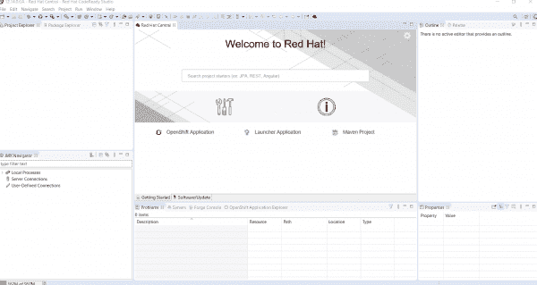](/sites/default/files/blog/2020/03/img_5e6f29efe18e9.png)

Figure 1\. The OpenShift Application Explorer view in JBoss Tools 4.14.0.

如果视图没有自动列出，您可以使用**窗口- >显示视图- >其他**找到它。从**其他**窗口，在提供的文本框中输入`open`，然后从 JBoss 工具下拉列表中选择 **OpenShift 应用浏览器**，如图 2 所示。

[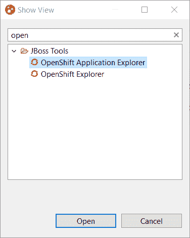](/sites/default/files/blog/2020/03/img_5e6f2a3693aa9.png)

Figure 2\. Select OpenShift Application Explorer from the drop-down list.

您将在一个新的选项卡中看到 OpenShift 应用程序浏览器，如图 3 所示。

[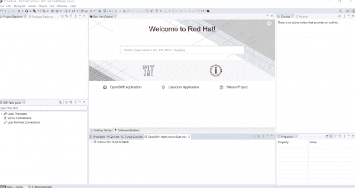](/sites/default/files/blog/2020/03/img_5e6f2a876a32d.png)

Figure 3\. OpenShift Application Explorer in a new tab.

展开根节点将显示 OpenShift 容器平台集群上可用的项目列表，如图 4 所示。

[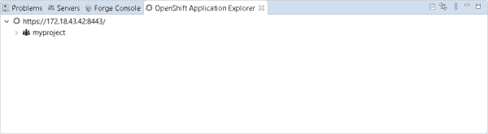](/sites/default/files/blog/2020/03/img_5e6f2ac7e681d.png)

Figure 4\. Expand the root node to display projects available on the cluster.

## OpenShift 应用程序浏览器反馈循环

我们还增加了一个新的*反馈循环*特性，它可以给你关于代码变化的快速反馈。为了更好地理解这个特性，创建一个示例应用程序会有所帮助。一旦创建了示例应用程序，请继续这里的操作。

现在您已经打开并运行了新的 OpenShift 应用程序浏览器，让我们用一个示例应用程序来尝试一下。

### 用 JBoss Tools 4.14.0 开发一个基于 Java 的微服务

在这一节中，我将向您展示如何使用 OpenShift 容器平台 4.3 和 JBoss Tools 4.14.0 中新的 OpenShift 应用程序浏览器。我们将使用这些工具开发一个基于 Java 的微服务。

在我们开始处理应用程序之前，我们需要将组件源代码加载到我们的工作空间中。首先，点击 **Ctrl+N** 并从下拉列表中选择**启动器项目**向导，如图 5 所示。

[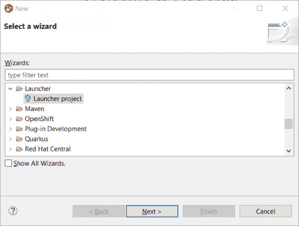](/sites/default/files/blog/2020/03/img_5e6f2b018dacf.png)

点击**下一个**，然后在给定字段中输入以下信息:

*   在**任务**字段中输入`rest-http`。
*   在**运行时间**字段中输入`vert.x community`。
*   在**项目名称**字段中输入`myservice`。

图 6 显示了这些条目。

[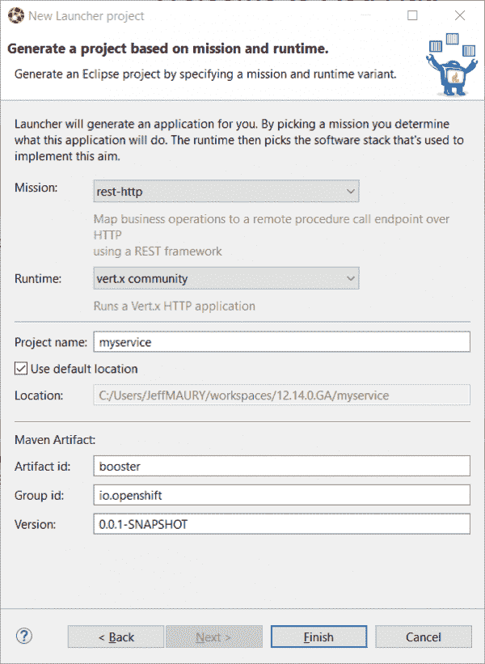](/sites/default/files/blog/2020/03/img_5e6f2b77aee89.png)

Figure 6\. Define and name your project.

点击**完成**将新项目添加到您的工作区。一旦依赖关系得到解决，我们就可以开始使用集群了。

#### 步骤 1:创建新的微服务组件

我们要做的第一件事是创建微服务组件。在 OpenShift 应用浏览器中，右键选择 **myproject** ，然后点击 **New - > Component** 。这个操作将把您带到图 7 所示的**创建一个组件**窗口。

[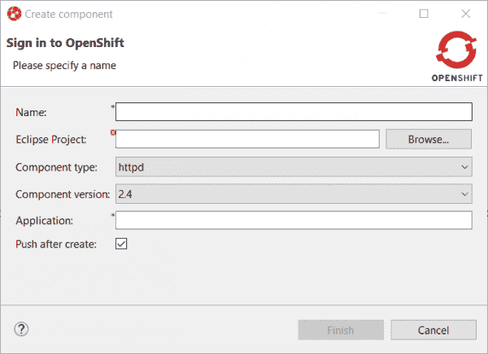](/sites/default/files/blog/2020/03/img_5e6f2bab5d504.png)

在**名称**字段中，输入`myservice`，然后点击**浏览**按钮选择您刚刚创建的新项目。在**组件类型**字段中，选择`java`。在**组件版本**字段中，选择`8`。最后，在**应用**字段输入`myapp`，然后取消勾选**创建**后推送复选框。所有这些选择如图 8 所示。

[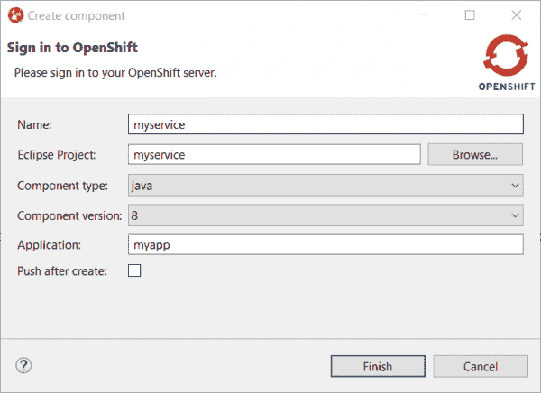](/sites/default/files/blog/2020/03/img_5e6f2bc87bc7e.png)

Figure 8\. Configuration for the new component.

点击 **Finish** 创建组件，然后展开项目节点查看应用程序。该视图如图 9 所示。

[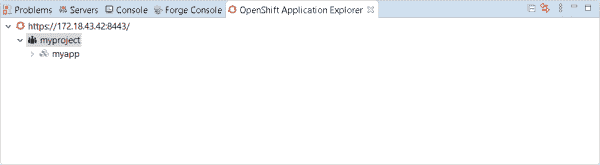](/sites/default/files/blog/2020/03/img_5e6f2be695a75.png)

Figure 9\. Expand the project node to view the application.

展开应用程序会显示新的组件，如图 10 所示。

[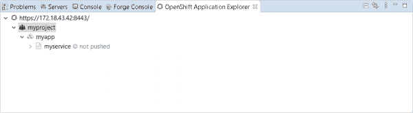](/sites/default/files/blog/2020/03/img_5e6f2c02589a2.png)

Figure 10\. Find the new service component.

#### 步骤 2:构建和部署组件

我们已经创建了`myservice`组件，但是请注意，我们没有选中创建复选框后的**推送。我们必须在我们的集群上手动部署组件。右键选择组件并点击**按钮**进行部署。OpenShift 容器平台将创建部署并启动构建。**

完成后，您会看到在控制台视图中创建了一个新窗口。过一会儿，您应该会看到图 11 中的输出。

[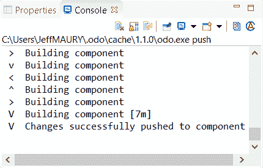](/sites/default/files/blog/2020/03/img_5e6f2c20bd567.png)

Figure 11\. The component has been successfully deployed.

#### 步骤 3:定义一个 URL

该组件现在已经部署到集群中，但是我们还不能访问它。我们的下一步是定义一个允许我们从外部访问组件的 URL。右键选择组件，点击**新建- > URL** ，如图 12 所示。

[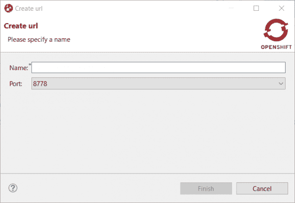](/sites/default/files/blog/2020/03/img_5e6f2c483cc8b.png)

Figure 12\. Create a new URL for external access to the component.

在**名称**字段输入`url1`，在**端口**字段选择`8080`，如图 13 所示。

[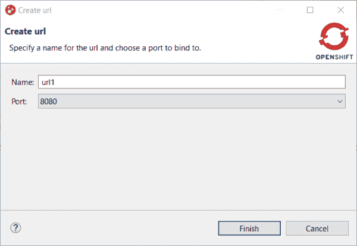](/sites/default/files/blog/2020/03/img_5e6f2c68bdf18.png)

Figure 13\. Name the URL and configure it for port 8080.

现在点击**完成**。

#### 步骤 4:同步配置

我们已经创建了 URL，但是它还没有在 OpenShift 容器平台集群上运行。再次推出组件将使本地配置与集群上的配置同步。在图 14 中，**控制台**视图中的一条消息通知我们需要推送。

[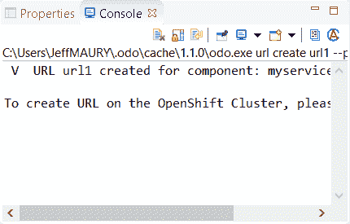](/sites/default/files/blog/2020/03/img_5e6f2c935a857.png)

Figure 14\. A push is required in order to create a URL on the OpenShift Container Platform cluster.

要再次推出组件，点击**组件- >推送**。

#### 步骤 5:测试新的微服务

让我们检查一下现在是否可以访问该服务。将组件扩展到另一个级别，我们可以看到刚刚创建的 URL，如图 15 所示。

[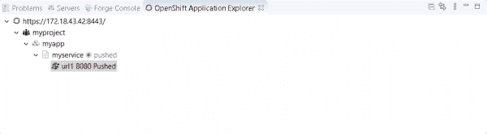](/sites/default/files/blog/2020/03/img_5e6f2cbc534fa.png)

Figure 15\. Find the new URL in OpenShift Application Explorer.

右键选择网址，点击**在浏览器**中打开。现在您应该会看到一个新的浏览器窗口，如图 16 所示。

[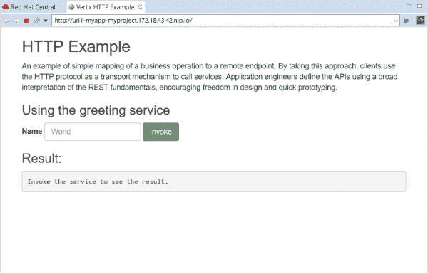](/sites/default/files/blog/2020/03/img_5e6f2cefea1b1.png)

Figure 16\. The service opens in a browser window.

要测试服务，在文本框中输入`demo`，然后点击**调用**。您将看到服务的一个新屏幕，如图 17 所示。

[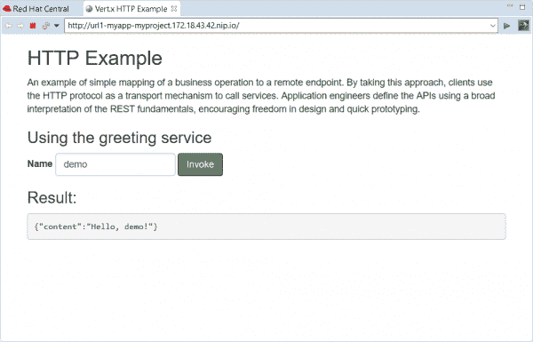](/sites/default/files/blog/2020/03/img_5e6f2d0a3c56b.png)

只需几个配置，我们就可以在 OpenShift 容器平台上启动并运行一个新的微服务。接下来，我将介绍 OpenShift 应用程序浏览器中可用的两个附加特性:一个反馈循环，让您可以快速查看代码更改的结果，以及新的调试控制台。

### 创建反馈回路

现在我们有了一个示例应用程序，我们可以在 OpenShift 应用程序浏览器中探索新的反馈循环。让我们修改示例应用程序的代码并进行试验。

在**项目浏览器的**选项卡中，找到`HttpApplication.java`文件，如图 18 所示。

[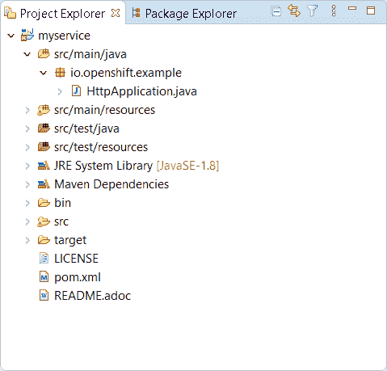](/sites/default/files/blog/2020/03/img_5e6f2dfeb5da7.png)

Figure 18\. Find HttpApplication.java in the Project Explorer.

双击文件，在新的编辑器窗口中打开它，如图 19 所示。

[](/sites/default/files/blog/2020/03/img_5e6f2e1596280.png)

Figure 19\. Open the HttpApplication.java file in a new editor window.

在第 14 行，更改:

```
protected static final String template = "Hello, %s!";

```

收件人:

```
protected static final String template = "Hello, %s!, we modified the code";

```

完成后，按下 **Ctrl+S** 保存文件。

现在，右键单击服务组件(`myservice`)并单击**推送**。这样做会将您的更改发送到集群，在集群中，将使用您的代码更改重新构建组件。几秒钟后，组件将再次可用，如图 20 所示。

[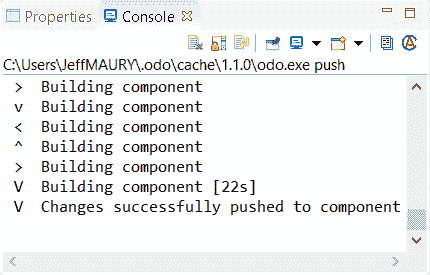](/sites/default/files/blog/2020/03/img_5e6f2e85ecd1c.png)

Figure 20\. The console output indicates a successful build.

返回浏览器窗口并刷新它。在文本框中输入`demo1`(更改该字段中的值可以避免重新加载缓存的版本)，然后单击**调用**。图 21 显示了结果屏幕。

[](/sites/default/files/blog/2020/03/img_5e6f2ea5e9d36.png)

虽然我们的改变很简单，但足以展示新的反馈循环。我们能够修改示例微服务的代码，将更改同步到集群，然后只需在浏览器中刷新服务即可获得快速反馈。

**注意**:如果您不想手动将代码更改推回集群，您可以选择通过一个监视操作自动同步到集群。如果您设置了一个 watch 操作，那么每次您在工作站上更改代码时，都会在集群上自动启动一个新的构建。

### 在调试控制台中测试反馈循环

用快速反馈循环测试应用程序是一个巨大的成就，但是对于更复杂的应用程序，我们还需要理解代码是如何运行的。在本节中，我们将使用 OpenShift Application Explorer 的调试控制台在集群上实时调试应用程序。

首先，我们将在应用程序代码中设置一个断点。选择`HttpApplication.java`文件，然后向下滚动到`greeting()`方法，如图 22 所示。

[](/sites/default/files/blog/2020/03/img_5e6f2ee257bbc.png)

Figure 22\. Find the greeting() method in HttpApplication.java.

找到第 41 行，然后双击左边标尺列中的数字。这样做会设置断点，如图 23 所示。

[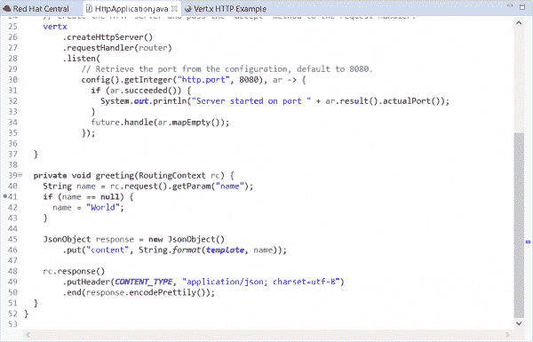](/sites/default/files/blog/2020/03/img_5e6f2efca6a57.png)

Figure 23\. Double-clicking the left-hand ruler column sets the breakpoint.

我们现在准备调试应用程序。首先，我们需要启动一个本地调试器(在本例中是一个 Java 调试器)，它将连接到集群上的应用程序。在控制台中右键选择`myservice`，然后点击**调试**。如图 24 所示，这将启动端口转发，这将允许我们的本地调试器连接到远程 Java 虚拟机(JVM)。

[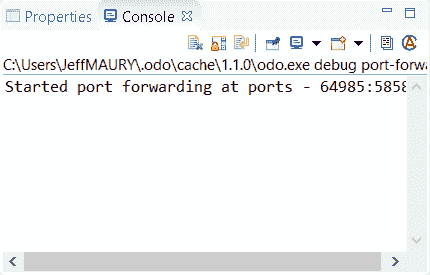](/sites/default/files/blog/2020/03/img_5e6f2f183150d.png)

Figure 24\. Port forwarding has been initiated.

接下来，我们将检查是否可以调试应用程序。再次选择浏览器窗口，在文本框中输入`demo2`，点击**调用**。当调试器到达第 41 行的断点时，会询问您是否要切换到 **Debug** 透视图，如图 25 所示。(请注意，如果您之前选择了**记住我的决定**选项，您可能看不到此消息。)

[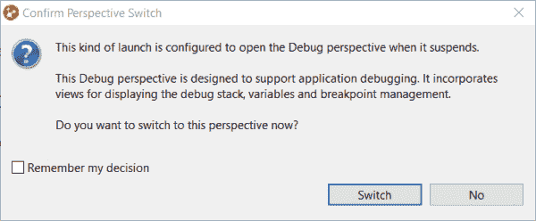](/sites/default/files/blog/2020/03/img_5e6f2f30dff16.png)

Figure 25\. Select the Debug perspective.

当你点击**开关**按钮时，你会看到**调试**透视图，如图 26 所示。

[](/sites/default/files/blog/2020/03/img_5e6f2f4acd30b.png)

Figure 26\. The new Debug window.

现在，您可以调试运行在远程集群上的 Java 组件，就像它运行在您的本地工作站上一样。

**注意**:我们在这个例子中使用了一个基于 Java 的组件，但是 JBoss Tools 也支持基于 Node.js 的组件的调试控制台。

## quartus 的新工具

在 JBoss Tools 4.14.0 中，我们还为构建在*超音速、亚原子*基于 Java 的框架、 [Quarkus](https://developers.redhat.com/topics/quarkus/) 之上的应用添加了新的工具。在这一节中，我们将使用新工具设置和调试一个示例应用程序。

### 步骤 1:创建一个新的 Quarkus 项目

我们添加了一个向导，用于在 JBoss Tools 工作区中创建新的 Quarkus 应用程序项目。要开始使用它，单击 **Ctrl+N** 来获得可用向导的列表，如图 27 所示。

[](/sites/default/files/blog/2020/03/img_5e6f2fa5cfc97.png)

Figure 27\. Select a wizard.

在文本框中，输入`qu`。这样做可以过滤 Quarkus 的向导列表，如图 28 所示。

[](/sites/default/files/blog/2020/03/img_5e6f2fc0c5a25.png)

Figure 28\. Select the Quarkus Project wizard.

在你选择了 **Quarkus 项目**向导后，点击**下一步**按钮。这导致了图 29 所示的**项目类型**屏幕。

[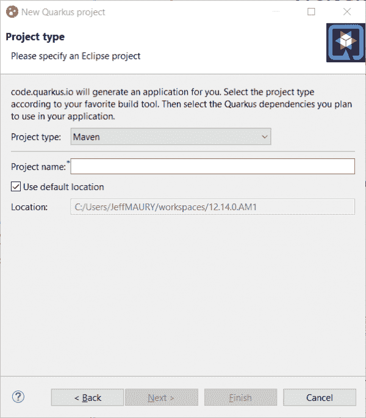](/sites/default/files/blog/2020/03/img_5e6f2fe1aac90.png)

Figure 29\. Select your project type.

这个屏幕邀请您选择 Maven 或 Gradle 来管理您的项目。在这个例子中，我们将使用 Maven。

选择 Maven 后，输入项目名称(`code-with-quarkus`)，然后点击**下一个**。图 30 中显示的对话框要求您定义项目坐标，比如组 ID、工件 ID 和应用程序的版本号，以及关于 REST 端点的信息。默认值已经被填入，所以我们可以接受这些并点击**下一个**。

[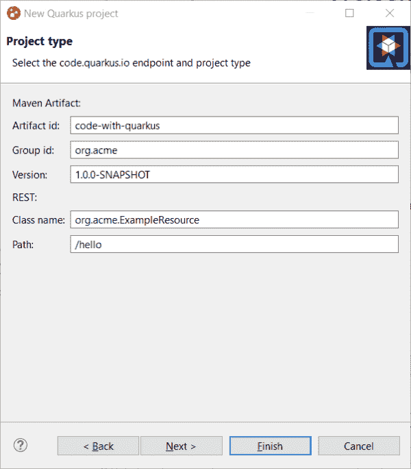](/sites/default/files/blog/2020/03/img_5e6f300bb7efc.png)

Figure 30\. Define the parameters for your project.

然后，您将被要求为您的项目选择您想要的 Quarkus 扩展。如图 31 所示，扩展按类别分组。我们将选择 Web 类别。

[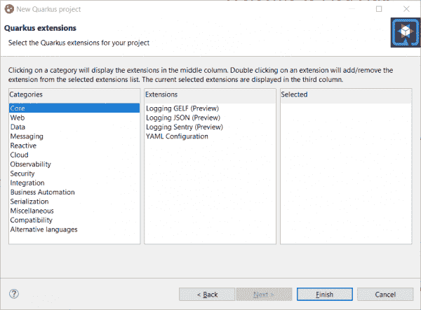](/sites/default/files/blog/2020/03/img_5e6f302b79029.png)

Figure 31\. Select the Web category to see a list of Quarkus web extensions.

现在，您可以看到如图 32 所示的扩展列表。如果您想添加扩展名，请双击它。

[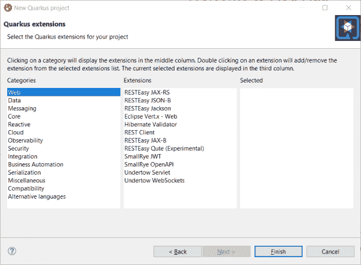](/sites/default/files/blog/2020/03/img_5e6f3046c5b83.png)

Figure 32\. Select the Quarkus extensions you want for your project.

如图 33 所示，我们将选择 RESTEasy JAX-RS 和 RESTEasy Qute 扩展。(注意，RESTEasy Qute 是一个模板引擎。)

[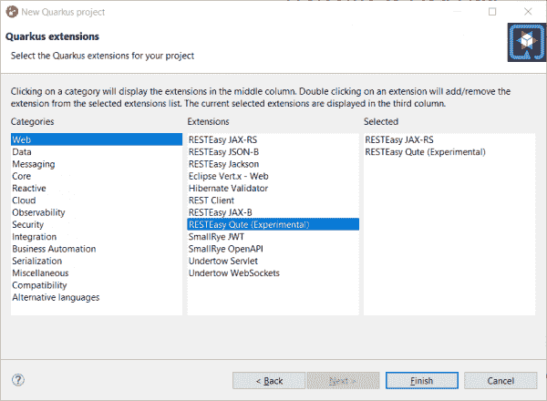](/sites/default/files/blog/2020/03/img_5e6f306372ba6.png)

Figure 33\. Select the RESTEasy JAX-RS and RESTEasy Qute extensions.

您应该会看到您选择的扩展已经添加到屏幕最右侧的表格中。如果您想从列表中删除扩展名，只需在它出现的表格中再次双击它。

我们已经完成了项目的设置，所以点击**完成**。将启动项目，并检索其依赖项。过一会儿，您将在您的**项目浏览器**视图中看到新项目，如图 34 所示。

[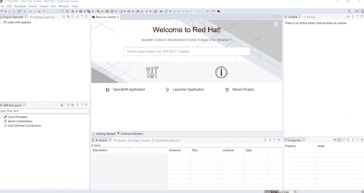](/sites/default/files/blog/2020/03/img_5e6f307f9466a.png)

Figure 34\. The new project has been created.

我们已经成功创建了一个新的夸库斯项目。接下来，我将向您展示如何构建和运行 Quarkus 应用程序。

### 步骤 2:构建并运行 Quarkus 应用程序

选择**运行- >运行配置…** 显示如图 35 所示的对话框。

[](/sites/default/files/blog/2020/03/img_5e6f30ac48f1c.png)

Figure 35\. Configure the application launch settings.

向下滚动到 **Quarkus 应用程序**并选择该选项，如图 36 所示。

[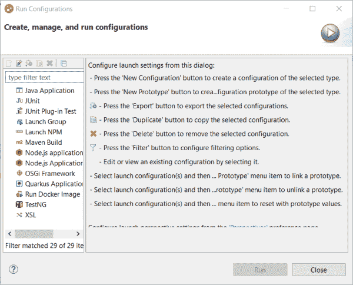](/sites/default/files/blog/2020/03/img_5e6f30d70f70e.png)

选择**新配置**选项，如图 37 所示。

[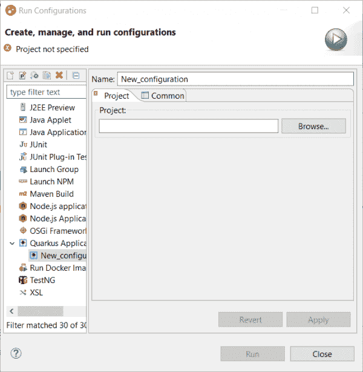](/sites/default/files/blog/2020/03/img_5e6f30f50f6a6.png)

Figure 37\. Create a new configuration for your Quarkus application.

接下来，您需要将一个工作区项目与配置相关联，因此单击 **Browse** 。您将看到一个单独的项目，如图 38 所示。

[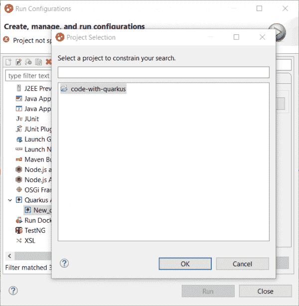](/sites/default/files/blog/2020/03/img_5e6f31297ad14.png)

Figure 38\. The code-with-quarkus project.

因为工作空间包含一个单独的项目，所以它被自动选中。点击 **OK** ，将进入如图 39 所示的对话框。

[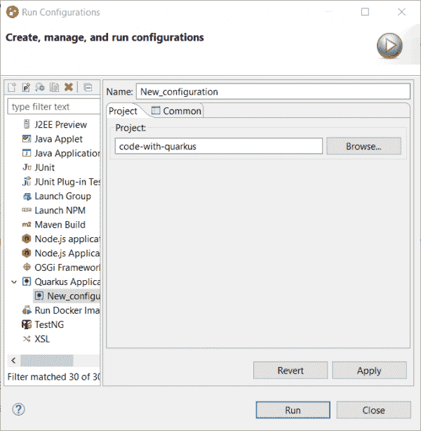](/sites/default/files/blog/2020/03/img_5e6f3146d9d1a.png)

Figure 39\. The new configuration page for code-with-quarkus.

在我们可以使用它之前，需要构建配置，所以通过点击 **Run** 来开始这个过程。新的**控制台**视图显示了构建输出，如图 40 所示。

[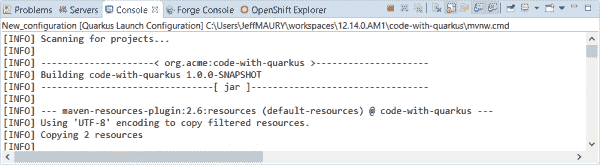](/sites/default/files/blog/2020/03/img_5e6f316900efd.png)

Figure 40\. The Console view is shown in a new tab.

此时，应用程序正在构建。过一会儿就要启动了。图 41 显示了剩余的构建输出。

[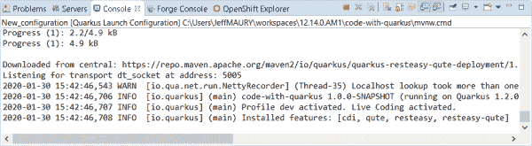](/sites/default/files/blog/2020/03/img_5e6f319632dee.png)

Figure 41\. Build output in the Console view.

### 步骤 3:调试 Quarkus 应用程序

调试 Quarkus 应用程序很简单:我们需要做的就是启动我们刚刚在 Debug 中创建的新配置。选择**运行- >调试配置**菜单选项，然后点击**调试**。

这样做可以将远程 JVM 调试配置连接到正在运行的 Quarkus 应用程序。如果您已经在应用程序代码中设置了断点(就像我们在 Java 微服务演示中所做的那样)，那么执行将在第一个断点处自动停止。

## 预览:Quarkus 的内容帮助

我已经向您展示了如何使用 JBoss Tools 4.14.0 中引入的新工具特性来创建、运行和调试 Quarkus 应用程序。我还想介绍一个计划集成到我们下一个 JBoss 工具版本中的特性:`application.properties`文件的内容帮助。你现在可以开始试验了。

##### application.properties 文件

每个 Quarkus 应用程序都使用`application.properties`文件进行配置。`application.properties`的内容取决于您为应用程序选择的 Quarkus 扩展。有些设置是强制性的，有些不是。每个设置的可能值取决于其性质；例如，您可能有`boolean`、`integer`，或者一组有限的值(枚举)。

作为一名开发人员，应该由您来研究项目及其扩展的指南和文档。从 JBoss Tools 4.14.0 开始，您还可以在 **Quarkus Tools** 下找到特定文件的内容帮助。为验证您的`application.properties`文件的内容的工具提供了内容帮助，并且该特性提供了可能的设置名称和值。

要查看新的内容帮助特性，请转到我们刚刚创建的示例项目中的`src/main/resources/application.properties`。右击`application.properties`文件并选择**打开方式- >通用文本编辑器**。**文本编辑器**视图如图 42 所示。

[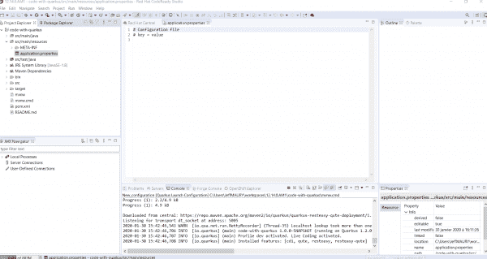](/sites/default/files/blog/2020/03/img_5e6f31df1ebd6.png)

Figure 42\. Open the application.properties file in a generic text editor.

转到图 43 所示文件的第三行，输入 **Ctrl+Space** 。这样做会调用代码完成，如图 43 所示。

[](/sites/default/files/blog/2020/03/img_5e6f31f8ee158.png)

Figure 43\. Press Ctrl + Space to invoke code completion.

将鼠标悬停在设置上以显示其文档。例如，尝试将`quarkus.http.port`添加到`application.properties`文件中，然后将鼠标悬停在上面。结果文档如图 44 所示。

[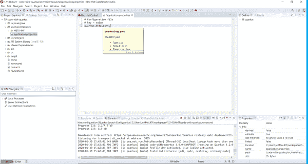](/sites/default/files/blog/2020/03/img_5e6f3215986c7.png)

Figure 44\. Documentation for quarkus.http.port.

如果您输入了一个错误的值，比如输入了`false`而不是一个数值，内容助手将会突出显示这个错误，如图 45 所示。

[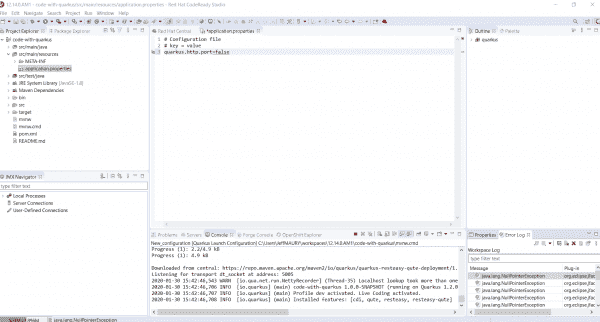](/sites/default/files/blog/2020/03/img_5e6f323b371f7.png)

Figure 45\. The content assistant highlights an error.

新的内容助手是 JBoss Tools 下一版本将集成的一系列特性中的第一个。我们鼓励您使用它，如果您发现我们缺少特性或增强功能，请使用 [JBoss Tools issue tracker](https://issues.redhat.com/issues/?jql=project%20%3D%20JBIDE%20AND%20component%20%3D%20quarkus%20and%20status%20!%3D%20Closed%20and%20status%20!%3D%20Resolved%20) 报告它们。

## 结论

这些只是通过 [JBoss Tools 4.14.0](https://tools.jboss.org/downloads/jbosstools/2019-12/4.14.0.Final.html) 和[Red Hat code ready Studio 12.14](https://developers.redhat.com/products/codeready-studio/overview)为 Eclipse 4.14 (2019-12)提供的部分新功能和更新功能。本文讨论了与 OpenShift 容器平台、OpenShift 应用程序浏览器和 Quarkus 相关的特性。[下一篇](https://developers.redhat.com/blog/2020/04/20/red-hat-codeready-studio-12-14-0-ga-and-jboss-tools-4-14-0-final-tool-and-ui-updates/)将关注:

*   Hibernate 工具更新。
*   Forge、JST 和 VPE 在弃用前最后一次更新。
*   视图、对话框和工具栏的平台变化。
*   许多常规更新。

*Last updated: June 29, 2020*