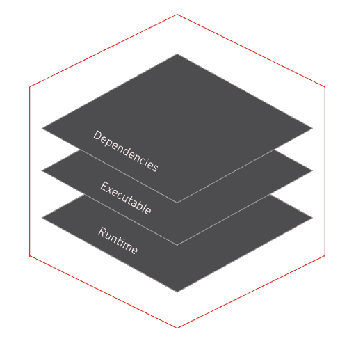
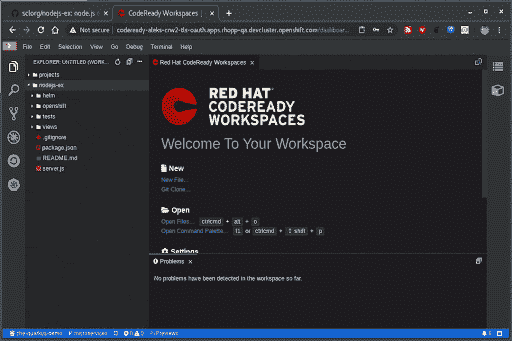
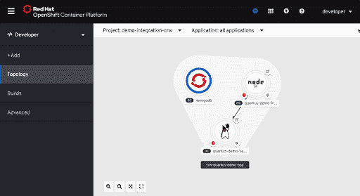
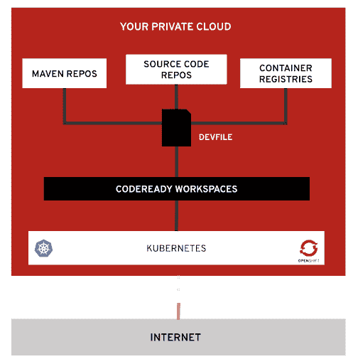

# Red Hat CodeReady Workspaces 2:加速 Kubernetes 开发的新工具

> 原文：<https://developers.redhat.com/blog/2019/12/03/red-hat-codeready-workspaces-2-new-tools-to-speed-kubernetes-development>

我们很高兴地宣布[Red Hat code ready work spaces 2.0](https://developers.redhat.com/products/codeready-workspaces/overview)的发布。基于 [Eclipse Che](https://www.eclipse.org/che/getting-started/cloud/?sc_cid=701f2000000RtqCAAS) ，其上游项目 CodeReady Workspaces 是一个[Red Hat open shift](https://developers.redhat.com/openshift/)-原生开发者环境，支持开发者团队的云原生开发。

CodeReady Workspaces 2.0 现已在 OpenShift 3.11 和 OpenShift 4.x 上推出。

这个新版本引入了:

*   **Kubernetes-open shift 上的本地开发人员沙箱:**将您的 Kubernetes 应用程序带入您的开发环境，允许您像在生产环境中一样进行编码、构建、测试和运行。
*   **集成 OpenShift 体验:** OpenShift 插件，集成到 OpenShift 4 开发者控制台。
*   **新的编辑器和 Visual Studio (VS)代码扩展兼容性:**新的基于浏览器的编辑器，提供快速的类似桌面的体验和与 Visual Studio 代码扩展的兼容性。
*   **Devfile，开发人员环境代码:**开发人员环境用 Devfile 进行编码，使它们一致、可重复、可再现。
*   **通过 AirGap 集中托管在 OpenShift 上:**部署在您的防火墙后面的 OpenShift 集群上。气隙能力。更易于监控和管理。

## kubernetes-open shift 上的本地开发人员沙箱

CodeReady Workspaces 2.0 提供了在 OpenShift 上运行的开发者环境。在这些沙箱中是项目编码所需的组件和工具:基于浏览器的编辑器、插件、工具以及项目所需的不同运行时。一切都在容器中运行，提供了高度一致、可重复和可再现的开发人员环境——零配置需求，零痛苦。

在这个新版本中，您在开发环境中需要的一切都是完全容器化的，甚至是编辑器及其插件。CodeReady Workspaces 将工具与您的应用程序运行时隔离开来，允许您将 Kubernetes 应用程序带入您的开发人员沙箱，在您的应用程序上编码，并像在生产中一样运行它。这些工具运行在 sidecar 容器中，并打包了它们自己的依赖项，使您的开发人员环境的配置更加顺畅，并使您的应用程序运行时不受您正在使用的工具的影响。

Developer tools are containerized, zero dependency installation, isolated execution and lifecycle, easy to upgrade and switch.
Developer tools are containerized, zero dependency installation, isolated execution and lifecycle, easy to upgrade and switch.">

借助 CodeReady Workspaces，您可以直接在 OpenShift 上进行编码，将您的 Kubernetes 应用程序放入您的开发人员沙盒中，并尽可能以接近生产环境的方式编码和运行您的代码。

## 集成 OpenShift 体验

CodeReady Workspaces 2.0 使开发人员能够轻松创建在 OpenShift 上运行的应用程序。开发人员受益于集成的体验，在内循环开发过程中提供了快速的周转。

一个 OpenShift 插件可以用来加速 OpenShift 的开发。开发人员可以连接到任何 OpenShift 集群，并直接从 CodeReady 工作区创建、调试和部署。

该插件利用 [OpenShift Do (odo)](https://developers.redhat.com/blog/2019/08/14/openshift-development-with-interactive-odo/) 来简化内循环开发，利用 [OpenShift CLI (oc)](https://developers.redhat.com/blog/2019/05/03/announcing-odo-developer-focused-cli-for-red-hat-openshift/) 来帮助您与 OpenShift 实例进行交互，丰富内循环体验。它兼容 OpenShift 实例(3.11 或 4.x)并支持公有云实例，如 Azure 和 AWS 上的 Red Hat OpenShift。

从 OpenShift 4.2 开始，当从 Operator Hub 安装 CodeReady Workspaces 时，它在 OpenShift Developer 透视图中变得可用，允许您从应用程序拓扑视图中获得开发人员工作区。

## 新编辑器和 VS 代码扩展兼容性

CodeReady Workspaces 2.0 基于 [Eclipse 忒伊亚](https://theia-ide.org/)提供了一个新的默认编辑器。开发人员可以享受响应迅速、感觉熟悉的类似桌面的体验。

这个新的默认编辑器还带来了与 VS 代码扩展的兼容性。CodeReady Workspaces 提供的插件注册表已经打包了大多数流行语言的工具:JavaScript、Java、Python。NET、Go、PHP、XML 和 Yaml。您还可以找到 OpenShift 的工具。从 VS 代码中引入一个现有的插件很简单；主要的区别在于插件的打包方式。在 CodeReady 工作区中，插件和它们的依赖项一起被放在它们自己的容器中，并在 workspace 窗格中作为 sidecar 运行。

借助新版本的 CodeReady 工作区，开发人员可以从更丰富的编辑体验中获益:

*   **命令调板:**全键盘导航。
*   **丰富编辑器:**查找/替换实例，查看定义，大纲视图。
*   **调试器:**集成调试体验。
*   **Git:** 原生 Git 体验，项目浏览器和编辑器中变化的可视化指示器。
*   **布局定制:**拖拽&配置布局。
*   **主题化:**白色或黑色主题都是现成的。
*   **安全性:**编辑、最终用户和工作空间之间的安全通信。
*   **扩展任务:**处理 CodeReady 工作区命令，并提供将这些命令启动到工作区的特定容器中的能力。
*   **扩展终端:**允许为工作区 pod 的任何容器提供一个终端。
*   **工作区插件:**提供一个视图，显示工作区中运行的所有容器，并允许与它们交互。
*   **Ports 插件:**允许检测服务何时在工作区内运行，并自动公开它们。

## 气隙能力

CodeReady 工作区支持在受限环境中安装。这包括您自己的私有云，与公共互联网断开连接。

CodeReady 工作区可以配置为依赖您的私有映像注册表。将安装和配置 CodeReady 工作区所需的不同组件，以便它们只使用您的内部资源。

带有工具和不同插件的工作区窗格也可以配置为:

*   利用您的私有 Git 存储库。
*   利用来自您自己的容器注册中心的运行时容器。
*   依赖您自己的 maven、npm 或您拥有的任何依赖库。

按照 [OpenShift 集装箱平台 3.11](https://access.redhat.com/documentation/en-us/red_hat_codeready_workspaces/1.2/html/administration_guide/installing_codeready-workspaces) 和 [OpenShift 集装箱平台 4.x](https://access.redhat.com/documentation/en-us/red_hat_codeready_workspaces/2.0/html/installation_guide/installing-codeready-workspaces-on-ocp-4_crw) 的文件说明进行安装。

## Devfile，作为代码的开发人员环境

devfile 提供了可移植开发环境的易于配置、可重复的定义。

devfile 是开发人员工作区的声明性抽象，包括应用程序的运行时环境、映射到存储库的项目源代码以及编码、构建、测试、运行和调试应用程序所需的工具、插件和命令。这使得开发人员工作区是可复制的。您可以在 devfile 中使用 OpenShift 应用程序定义；只需通过增强您需要在其上编码的工具来“开发模式”它。

一旦您为您的项目配置了一个 devfile，您就可以将它托管在您的源代码存储库中。

有了 devfile 定义和 CodeReady 工作区，开发人员环境变得完全规范化，可以轻松地修改、共享、派生和扩展。您不需要处理难以维护和管理的文档、虚拟机和 docker 文件，它们只提供了设置开发人员环境的部分解决方案。

## 立即试用 CodeReady Workspaces 2.0

CodeReady Workspaces 2.0 现已在 OpenShift 3.11 和 OpenShift 4.x 上推出:

*   参见 [OpenShift 3.11 安装说明](https://access.redhat.com/documentation/en-us/red_hat_codeready_workspaces/2.0/html/installation_guide/installing-codeready-workspaces-on-openshift-3-using-the-operator_crw) s。
*   在 OpenShift 4.x 上，您可以直接从 Operator Hub 安装[并遵循文档](https://access.redhat.com/documentation/en-us/red_hat_codeready_workspaces/2.0/html/installation_guide/installing-codeready-workspaces-on-ocp-4_crw)。
*   下载[Red Hat code ready work spaces CLI](https://developers.redhat.com/products/codeready-workspaces/download)。
*   访问 [Red Hat CodeReady Workspaces 产品页面](https://developers.redhat.com/products/codeready-workspaces)。

*Last updated: July 1, 2020*