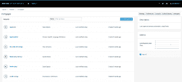
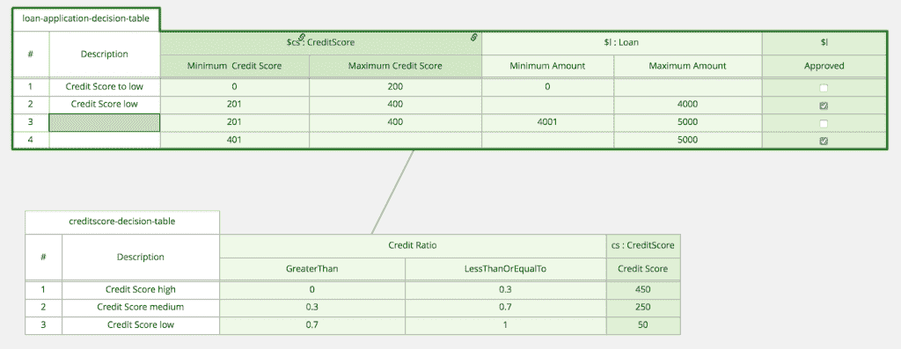
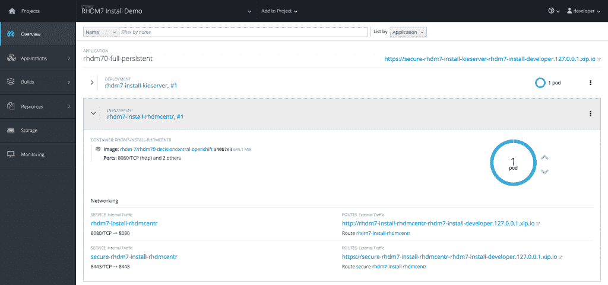
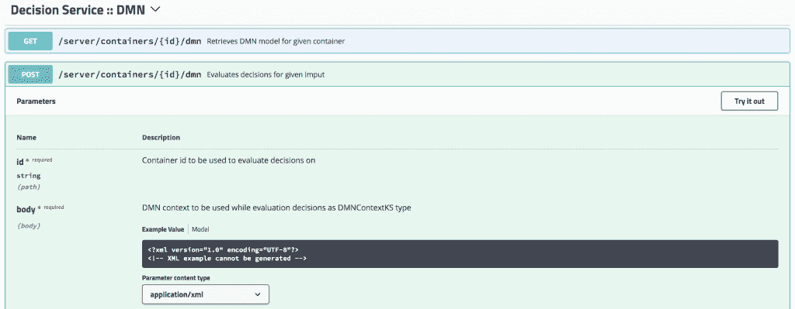
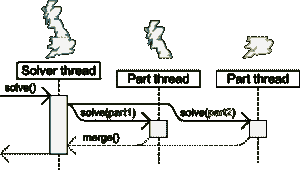

# Red Hat Decision Manager 7 入门

> 原文：<https://developers.redhat.com/blog/2018/03/19/red-hat-decision-manager-7-3>

全新闪亮的[红帽决策经理](https://developers.redhat.com/products/red-hat-decision-manager/overview/) 7 已经[最近发布](https://www.redhat.com/en/about/press-releases/red-hat-unveils-next-generation-decision-management-offering)。决策管理器 7 是红帽 JBoss BRMS 的继任者，我们的业务规则和决策管理平台。在这篇文章中，我们将看看主要的新特性，并提供如何开始使用新平台的说明，无论是在您的本地机器上还是在 [OpenShift 容器平台](https://developers.redhat.com/products/openshift/overview/)上。

Red Hat Decision Manager 7 专注于四个主题:适合和完成、云原生、决策模型和符号(DMN)以及业务优化器。

## **安装并完成**

在平台的可用性和业务用户友好性方面已经做了很多工作。作为一个同时面向 IT 用户和业务用户的平台，这应该会吸引各种各样的角色。在 Decision Manager 7 中，我们重点抽象了平台的许多底层技术细节。同时，用户界面变得更加具有上下文感知能力。这使得用户更容易专注于他们正在执行的任务。例如，创建决策表、编写规则、部署和管理规则运行时平台。

一个例子是新的项目视图(如图所示)，它现在只关注项目工件(规则、决策表和规则流)，隐藏了底层的技术概念，比如包名和目录结构。新的视图使得添加、查找和管理工件变得更加容易。像包名这样的技术细节不再影响用户界面。由于具有上下文意识，新的 UI 关注于用户需要执行的任务。例如，当用户的工作空间为空时，用户现在会看到一个屏幕，询问用户是否想要创建或导入一个新的项目，而不是显示一个空的 project explorer 视图。这一概念贯穿于整个平台。

可用性改进的另一个方面是新的决策表编辑器。它更易于使用，性能更高(现在可以向表中添加数千行，而不会对编辑器的性能产生影响)，并且提供了一种新的方法来使用新的表图显示决策表之间的依赖关系。

决策表 UI 现在包括一个向导，该向导指导用户创建决策表，包括约束和操作列的定义。这使得创建新的决策表变得更加容易和快速。

## 云原生(容器和微服务)

新平台非常重视云原生部署。首先，DM7 工作台(决策中心)现在已经可用，并在 OpenShift 上得到完全支持。这意味着用户现在可以在任何支持 OpenShift 的云环境中的托管容器中运行工作台。这使得决策管理器平台能够利用 OpenShift 带来的混合云环境的所有优势。

运行时服务器(称为决策服务器)也可以作为 OpenShift 上的容器映像使用。这个轻量级引擎提供了一个开箱即用的 RESTful API 来执行决策和业务规则。因此，它是构建和部署实现决策和业务规则的微服务的理想平台。或者我们喜欢称之为[微规则](https://middlewareblog.redhat.com/2018/02/21/micro-rules-event-driven-apps-and-red-hat-decision-manager/)。

Decision Manager 利用一个开放的、事实上的标准来构建管理(Maven)和规则打包(JAR 文件)。因此，在 Decision Manager 7 中构建和管理的决策服务的生命周期管理流程可以与通用持续集成和持续交付(CI/CD)平台和工具(例如，Jenkins 和 SonarQube)集成。

这些功能的组合使业务和 IT 部门能够在托管和受控的混合云环境中轻松定义、构建和部署云原生决策和规则微服务。

## 二甲基硝基氧化物

DMN 代表决策模型和符号。它是由业务流程建模符号(BPMN)背后的组织对象管理小组(OMG)制定的一个相对较新的标准。DMN 正试图为业务决策管理做 BPMN 十年前为业务流程管理所做的事情:通过一种独立于供应商的图表语言，让企业负责驱动其运营的逻辑。[1] DMN 提供了一种强大的图形化建模语言，结合了一种商业用户友好的脚本语言，叫做 FEEL(足够友好的表达式语言)。

红帽 DM7 是第一个(开源)运行时引擎，实现了完整的 DMN 1.1 版感觉一致性级别 3 规范。这意味着决策管理器 7 完全支持所有 DMN 结构(包括感觉表达式)。决策中心工作台中还不包括 DMN 编辑器。该编辑器将在平台的后续次要版本中引入。对于 DMN 编辑，该平台可以利用第三方 DMN 编辑器(例如， [Trisotech](https://www.trisotech.com/) 和 [Signavio](https://www.signavio.com/) )。

在决策管理器 7 中，DMN 运行时既可以用作应用程序中的嵌入式引擎，也可以用作决策服务器上运行的 DMN 决策服务。这允许用户创建用 DMN 模型实现的微服务。如图所示，决策服务器的新 Swagger RESTful API 描述提供了一种简单的方法来探索和测试这种强大的 DMN 功能。

## 业务优化器

Business Optimizer 是 [OptaPlanner](http://www.optaplanner.org/) 社区项目的产品化版本，包含在 Red Hat Decision Manager 7 中。在这个新版本中，Business Optimizer 在易用性、可伸缩性和洞察力方面得到了改进。

Business Optimizer 的第 7 版引入了许多可用性改进。API 和注释得到了增强，使得定义和配置您的领域模型变得更加容易和直观。创建和运行 benchmarker 是实现成功的优化器项目的一个关键组件，现在已经减少到只有一行代码。

Business Optimizer 的伸缩性一直很好，允许您解决 10，000 或更多规划实体的问题。在版本 7 中，随着*分区搜索*的引入，可伸缩性得到了进一步的提高。这个特性支持将一个非常大的问题划分为多个分区，这些分区可以在单独的线程中解决，之后可以将它们合并以创建完整的解决方案。这使得 Optimizer 可以扩展到具有成千上万个规划实体和非常大的解决方案空间的问题。

Business Optimizer 的另一大改进是能够洞察哪些约束已经被打破。这允许平台的用户解释给定解决方案的计划*分数*。这可以给用户提供对规划问题本身的洞察力，以及阻止更好的解决方案分数的可能缺失的资源。例如，在考试安排用例中，解释计划分数可以表明我们没有足够大的房间来容纳大量学生的考试。业务优化器示例(可在[决策管理器 7 附加组件](https://developers.redhat.com/download-manager/file/rhdm-7.0.0.GA-add-ons.zip)中找到)在*热图*中利用了这一新特性，该热图已在“课程时间表”、“员工花名册”、“考试时间表”和“巡回赛”示例中实现。

## 如何开始

我们知道您对这一新版本感到兴奋，并希望将新产品拿到手中进行试驾。因此，我们创建了许多易于安装和使用的演示。这些演示可以独立运行，可以在 Linux 容器中运行，也可以在 OpenShift 上运行。对于 Linux、macOS 和 Windows，安装是自动化的，并且完全按照脚本进行。

*   [安装演示](https://github.com/jbossdemocentral/rhdm7-install-demo):演示红帽决策管理器 7 的安装。
*   [贷款申请演示](https://github.com/jbossdemocentral/rhdm7-loan-demo):显示贷款审批系统决策表中定义的决策的执行情况。
*   保险定价 DMN 演示:使用 DMN 模型确定保险价格的演示。

平台的发行版、maven 资源库和附加组件可以从这个 Red Hat Developer Program 站点上的 [Decision Manager 下载页面](https://developers.redhat.com/products/red-hat-decision-manager/download/)下载。

## 结论

凭借 Decision Manager 7，Red Hat 发布了下一代决策管理平台。这个新平台面向企业和 IT 用户。用户管理和云原生特性等关键领域的重大改进允许平台用户在混合云环境中运行的现代容器运行时上设计、开发和部署复杂的决策逻辑作为微服务(或微规则)。

### 参考

[1]:布鲁斯·西尔维，http://methodandstyle.com/what-is-dmn

*Last updated: March 16, 2018*