# EAP 上的 Red Hat 决策经理

> 原文：<https://developers.redhat.com/articles/red-hat-decision-manager-on-eap>

# 介绍

本指南向您展示了如何实现 Red Hat Decision Manager 来创作、部署和执行决策服务。通过三个步骤，本指南将引导您从安装业务应用程序到测试它们。

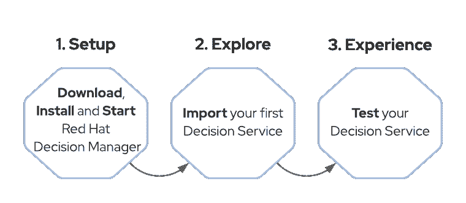

我们将在本地安装 RHDM，它将运行在 Red Hat JBoss EAP(又名 WildFly)之上。一旦我们启动并运行了 RHDM，我们将导入一个现有的应用程序，向您展示 RHDM 的一些功能，我们还将探索工具和项目本身。最后，我们将通过部署项目并测试它来结束我们的安装指南。

## 1.设置您的环境

### 先决条件

我们希望您在计算机中安装:

*   Java JDK 11(如果你还没有的话，[可以下载红帽](https://developers.redhat.com/openjdk-install)打造的 OpenJDK)
*   [GIT 客户端](https://git-scm.com/)

### 分三步安装决策管理器

#### [计] 下载

让我们首先下载我们需要的文件:JBoss EAP，以及决策管理器的两个主要组件:决策中心和 Kie 服务器:

*   [红帽 JBoss EAP 7.3](https://developers.redhat.com/download-manager/file/jboss-eap-7.3.0.zip)
*   [RHDM -决策中心，可部署邮编](https://developers.redhat.com/download-manager/file/rhdm-7.11.0-decision-central-eap7-deployable.zip)
*   [RHDM - KIE 服务器，可部署 zip](https://developers.redhat.com/download-manager/file/rhdm-7.11.0-kie-server-ee8.zip)

安装很简单，让我们开始吧！在这个 Hello World 中，我们将使用一个可以安装 EAP 和 DM 并为我们配置环境的安装程序。

1.  [克隆 Red Hat Decision Manager 7 安装演示 Git 库](https://www.github.com/jbossdemocentral/rhdm7-install-demo)
2.  将刚刚下载的 3 个 zip 文件复制到 **rhdm7-install-demo** 目录的 **installs** 目录下。你应该有这样的东西:

```
├── installs

│  ├── README

│  ├── jboss-eap-7.3.0.zip

│  ├── rhdm-7.11.0-decision-central-eap7-deployable.zip

│  └── rhdm-7.11.0-kie-server-ee8.zip

```

3.  运行 **init.sh** 或 **init.bat** 文件。**注意:init.bat 必须以管理权限运行**

安装完成后，您应该会在终端上看到一条成功消息以及环境信息。

#### 启动您的环境

现在，为了启动环境，我们将用终端中输出的命令引导 JBoss EAP。应该是这样的:

对于 Linux/OSx:

`./target/jboss-eap-7.3/bin/standalone.sh`

对于 Windows:

`.\target\jboss-eap-7.3\bin\standalone.sh`

### 2.探索

恭喜你！您已经成功安装了 Red Hat 决策管理器。

现在，您的 Red Hat EAP 中部署了两个关键组件:决策中心和 KIE 服务器。

决策中心是允许您开发业务规则和决策、管理项目以及构建和打包项目的组件。最后，您可以将它部署在 KIE 服务器、规则和决策引擎中。

KIE 服务器是一个能够执行规则和决策的轻量级组件。它可以很容易地与您的服务集成，例如通过 REST 或 JMS。

#### 访问决策管理器

让我们从访问决策中心开始。

1.  在您的浏览器中，通过导航[此处进入决策中心。](http://localhost:8080/decision-central/)
2.  使用凭据登录:
    *   用户:dmAdmin
    *   密码:redhatdm1！
3.  点击**设计，创建和修改项目**，如图 1 所示。[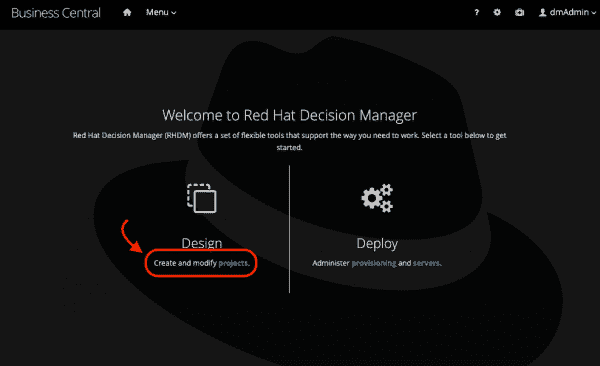](/sites/default/files/rhdm-hw-1_0.png)图 1:从决策管理器欢迎屏幕中选择“创建和修改项目”
4.  接下来，点击**导入项目**(参见图 2)。[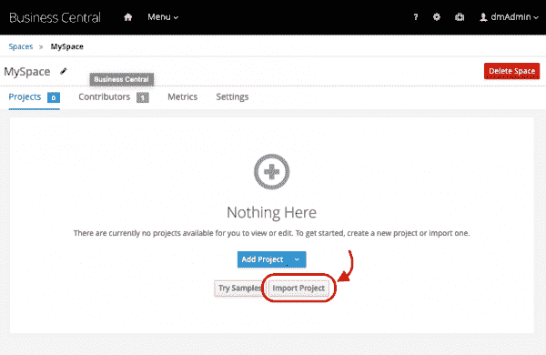](/sites/default/files/rhdm-hw-2_0.png)图 2:选择【导入项目】

5.  插入[这个库的 URL](https://github.com/jbossdemocentral/rhdm7-loan-demo-repo.git) ，并点击**导入**。
6.  选择**贷款申请**，点击**确定** (见图 3)。[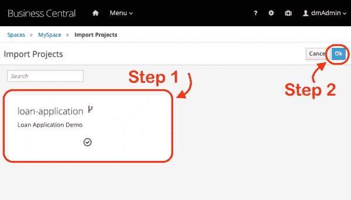](/sites/default/files/rhdm-hw-3_0.png)图 3:选择 Ok前插入回购网址

项目导入后，您应该在资产列表中看到四个资产:

*   三种数据模型(推荐、贷款和申请人)
*   使用决策建模符号(DMN)实现的简单决策(推荐)
*   和传统的指导决策表(贷款批准)。

打开图 4 所示的**贷款审批**决策表。检查表中定义的四条规则。

[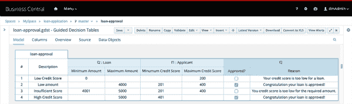](/sites/default/files/rhdm-hw-4_0.png)Figure 4: loan-approval Decision Table

这些规则根据贷款金额和申请的信用评分来控制“贷款”是否获得批准。更具体地说，当申请获得批准时，“贷款”的**批准**字段将被设置为**真**。

现在，关闭这个文件，并打开**推荐** DMN 文件。DMN 规范是一个被 OMG(对象管理组织)认可的成熟模式，它是平台无关的。它是专门为业务团队以更直观的方式设计决策而创建的。

[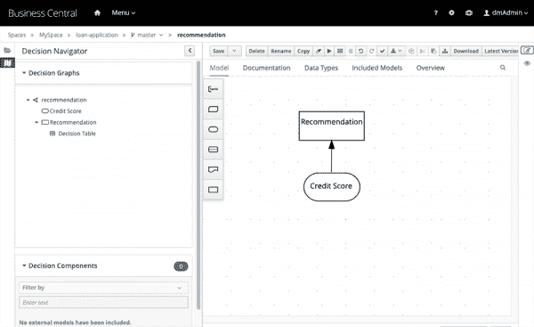](/sites/default/files/rhdm-hw-5.png)Figure 5: The DMN specification is a well-established pattern, and it is platform agnostic

这个 DMN 文件有一个输入，即**信用评分**，基于这个**信用评分**，输出将是关于贷款金额的**建议**(见图 5)。

点击**推荐**决策节点，选择**编辑**选项(见图 6):

[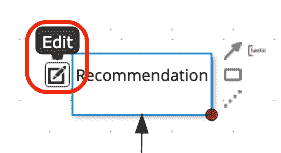](/sites/default/files/rhdm-hw-6.png)Figure 6: Recommendation decision node

在图 7 中，您将看到**决策表**，它负责根据提供的**信用分数**来确定输出:

[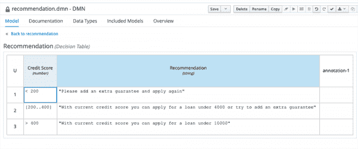](/sites/default/files/rhdm-hw-7.png)Figure 7: Decision Table on the Recommendation decision node

关闭您当前打开的所有文件。

既然我们已经探索了我们的项目规则和决策，让我们构建和部署项目。

#### 部署规则

我们现在正在进行一个传统的 maven 项目。我们需要将其构建并打包到 KJAR (Knowledge Java Archive)中——包含模型和规则的决策部署单元。打包后，该应用程序可以部署到引擎中。

幸运的是，决策中心可以帮助我们完成这项任务。

点击图 8 所示的 **Deploy** 按钮，在执行服务器上构建并部署项目:

[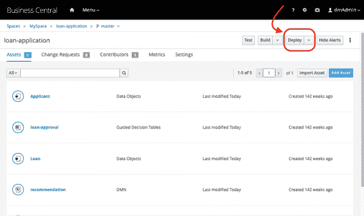](/sites/default/files/rhdm-hw-8.png)Figure 8: Decision Central can help with packaging a traditional maven project

一旦构建和部署完成，您将看到如图 9 所示的成功部署消息。点击**查看部署详情**链接。

[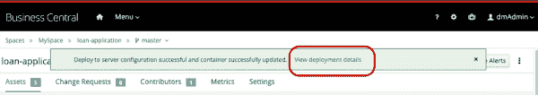](/sites/default/files/rhdm-hw-9.png)Figure 9: Successful deployment message

该页面将显示一个正在运行的 **default-kie-server** ，其中部署了 **loan_application_1.2.0** 容器。

我们的项目现在可供客户端应用程序使用！让我们来看看如何使用这个决策服务。

### 3.经验

KIE 服务器附带了一个 Swagger UI，允许我们测试引擎的 RESTful 端点，并使用部署在其上的规则。我们将使用这个 UI 来测试我们的规则。

让我们从检查这个 KIE 服务器中部署的项目开始:

打开一个新选项卡并访问 KIE 服务器 Swagger UI:

*   网址:[http://localhost:8080/kie-server/docs](http://localhost:8080/kie-server/docs)
*   用户:kieserver
*   密码:kieserver1！

*   通过导航到 **KIE 服务器和 KIE 容器**，并定位到 **GET /server/containers** 选项，验证规则已经被正确地部署在 KIE 服务器上。
*   点击**尝试一下**(见图 10)。

[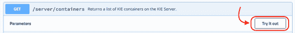](/sites/default/files/rhdm-hw-10_0.png)Figure 10: GET /server/containers option

将参数留空，点击**执行**。如果被询问，以下是您可以使用的凭据:

*   用户:kieserver
*   密码:kieserver1！

该页面将显示一个响应:

[1]成功代码 **200**

[2]以及如图 11 所示的响应主体，它列出了容器 id**loan-application _ 1 . 2 . 0**容器。

[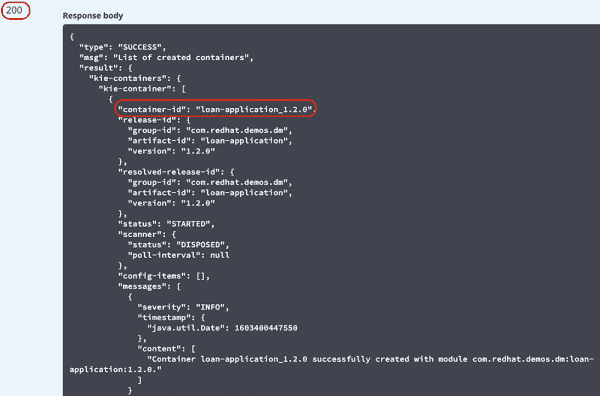](/sites/default/files/rhdm-hw-11_0.png)Figure 11: A successful response body

#### 消费业务规则

现在，让我们使用 REST API 来消费我们用指导决策表实现的规则。

要向决策服务发送请求，导航到 **KIE 会话资产**，并搜索**POST/server/containers/instances/{ container id }**(参见图 12)。

[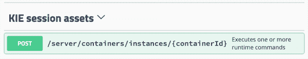](/sites/default/files/rhdm-hw-12_0.png)Figure 12: POST request under KIE session assets

点击它，并点击**试用**按钮。

现在，让我们填写请求参数:

*   **参数内容类型**和**响应内容类型**到**应用/JSON**；
*   **containerId** 到**贷款申请 _1.2.0** (这是 KIE 集装箱的 id)；
*   在**正文**中，插入:

```
{

"lookup" : "default-stateless-ksession",

"commands":[

{

"insert":{

"object":{

"com.redhat.demos.dm.loan.model.Applicant":{

"creditScore":230,

"name":"Jim Whitehurst"

}

},

"out-identifier":"applicant"

}

},

{

"insert":{

"object":{

"com.redhat.demos.dm.loan.model.Loan":{

"amount":2500,

"approved":false,

"duration":24,

"interestRate":1.5

}

},

"out-identifier":"loan"

}

},

{

"fire-all-rules":{

}

}

]

}
```

[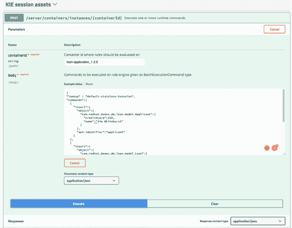](/sites/default/files/rhdm-hw-13_0.png)Figure 13: POST request with correct containerId and body

点击**执行**。

如图 13 所示，页面将显示一个代码为 **200** 的响应，以及一个列出规则执行结果的响应主体。特别是，“贷款”对象的**批准的**字段现在应该说**为真**，并且**原因**应该带来同样基于我们的规则定义的消息:**祝贺您的贷款获得批准**，这是规则评估的结果(参见图 14)。

[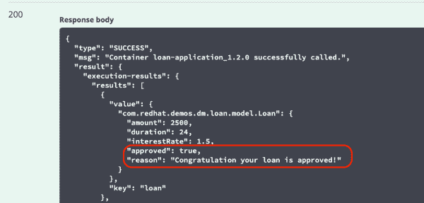](/sites/default/files/rhdm-hw-14_0.png)Figure 14: Object’s approved field should display true if the request was successful

#### 消费决策

既然我们已经测试了我们的业务规则，我们应该用 DMN 来测试我们实现的决策。为了做到这一点，我们将使用决策引擎 REST API。

在 KIE 服务器 Swagger UI 中，导航到 **DMN 资产**部分，并找到**POST/Server/containers/{ container id }/DMN**项目(参见图 15)。

[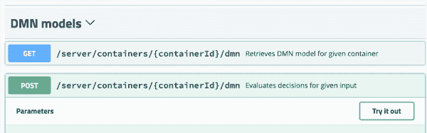](/sites/default/files/rhdm-hw-15_0.png)Figure 15: Use the decision engine REST API to test the decision implemented with DMN

点击**试用**，并在表格中填写以下数据:

*   ContainerID:贷款申请 _1.2.0
*   将**参数内容类型**和**响应内容类型**更改为**应用/json**
*   正文:

```
{

"model-namespace" : "https://kiegroup.org/dmn/_C159F266-40FF-49CB-B4D9-447DFACDDC16",

"model-name" : "recommendation",

"decision-name" : [ ],

"decision-id" : [ ],

"dmn-context" : {"Credit Score": 100}

}
```

请注意，我们正在发送一个值为 100 的**信用评分**。基于这个输入，引擎将作出决定，并给我们输出。点击**执行**按钮并检查输出(见图 16)。

[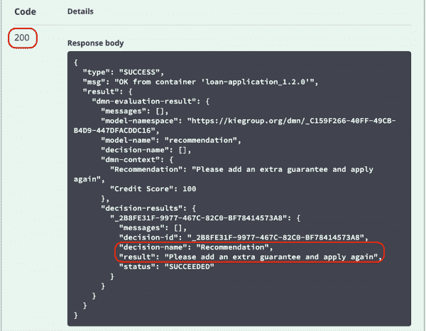](/sites/default/files/rhdm-hw-16_0.png)Figure 16: Successful response with correct execution result

在正文中，将信用分数更改为 **400** ，点击**执行**按钮，查看**执行**结果。

## 结论

就这样，我们结束了我们的 Hello World。我们安装了 Red Hat Decision Manager，直接从 GitHub 导入了一个项目，检查了导向决策表和 DMN，这是实现业务逻辑的许多可能方法中的两种。我们通过部署和测试我们的服务结束了我们的 Hello World。恭喜你！

*Last updated: June 17, 2021*