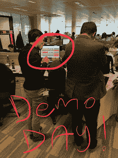
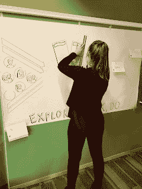

# 走进红帽开放创新实验室(第三部分)

> 原文：<https://developers.redhat.com/blog/2018/04/27/red-hat-open-innovation-labs-residency-part-3>

本文是一系列文章的最后一篇，带领读者开始一段窥视红帽开放创新实验室内部生活的旅程。

这是任何客户 ***** 的顶级体验，让他们接触开放式协作、开放式技术和快速敏捷的应用交付方法。

尝试数字化转型的组织往往没有这种体验，因此，通过沉浸在开放创新实验室中，Red Hat 与社区、开放技术和开放协作分享了其在管理、开发和交付解决方案方面的经验。

请和我一起分享在现实生活中的体验，观看 Red Hat 与客户的亲密合作，展示新的工作方式，利用开放技术，使用快速、敏捷的应用交付方法和开放协作。

在第一部分的[中，我分享了红帽开放创新实验室驻地的内容。然后](https://developers.redhat.com/blog/2018/01/26/part-1-inside-open-innovation-labs-residency/)[在第二部分](https://developers.redhat.com/blog/2018/03/20/red-hat-open-innovation-labs-residency-part-2/)，我看了我在住院医师培训接近交付阶段所遇到的情况。现在剩下的就是分享交付周，也就是众所周知的演示日。

## 兑现承诺

如果您已经阅读了第二部分，那么您会知道住院医师培训分为四周，每一周又分为几个冲刺阶段。

试着为演示日做好准备！

这些 sprints 是为了支持团队做出的承诺而设立的，这个承诺是我们每周通过内部团队演示正在开发的产品的进展来实现的。

整个派驻期也是根据团队定义的结果建立的，这也必须在第四周也是最后一个 sprint 周结束时交付。这个最后的冲刺致力于交付一个最终的演示，它通常不仅针对团队本身，也针对外部的业务涉众。

演示日我们有三个目标成果:

*   证明我们实现了目标业务成果
*   展示*我们如何作为一个团队使用敏捷、DevOps、TDD、自动化和 CI/CD 来做这件事。*
*   说服涉众将产品团队团结在一起，并让其他团队以同样的方式工作。

在这种情况下，业务涉众分布在几个全球地点和时区。这意味着我们举行了两次单独的演示。

第一个演示日于周四在一个会议室举行，其中包括一个相当不错的视频会议系统，大屏幕显示了位于地球另一端的每个利益相关方。客户团队成员经历了整个流程和冲刺，并在产品展示中展示了一些成果。利益相关者可以在演示过程中提问、提出建议并提供反馈。

艺术家在工作中捕捉单一海报上的居住图像。

第一个演示日顺利进行，反馈非常令人鼓舞。这个过程赢得了人心，涉众离开时感觉他们的团队比以往任何时候都用更少的时间做了更多的事情。这个信息的重要部分是过程、工具和方法现在已经到位。这些东西留在客户身边，提供了继续推进利益相关者团队文化和变革的真正潜力。

最后一天的演示包括一位特殊的嘉宾艺术家，来自 [Inky Thinking](http://inkythinking.com/) 的 Ellie，她在房间里聆听并现场捕捉过程、冲刺和常驻故事情节。上面，你会注意到一张图片显示 Ellie 在现场演示日捕捉到了这一切，这篇文章顶部的图片显示了 Ellie 制作的最终图形。

该团队非常高兴完成了他们的实习，学会了以新的方式工作，利用了新的流程，使用了新的交付方法，最重要的是，在交付期望的业务成果时获得了很多乐趣。

对开放创新实验室的更多信息感兴趣吗？

如果您错过了前两部分，请倒带和[补上这个系列的第一部分](https://developers.redhat.com/blog/2018/01/26/part-1-inside-open-innovation-labs-residency/)检查派驻流程。

*Last updated: May 13, 2021*