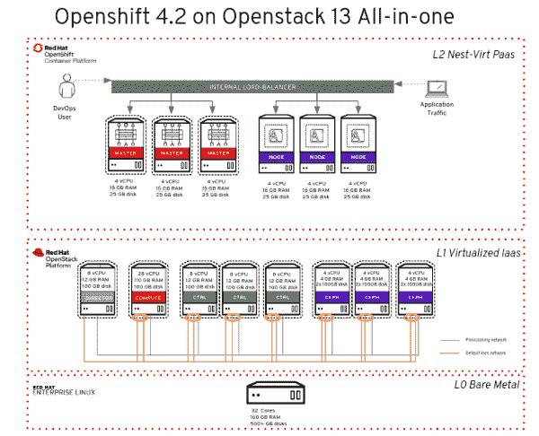
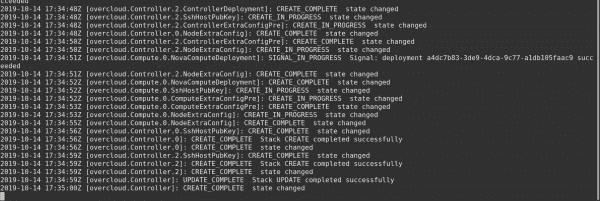
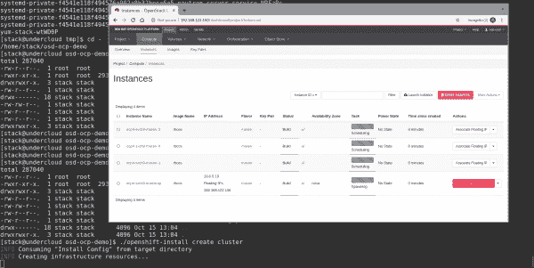
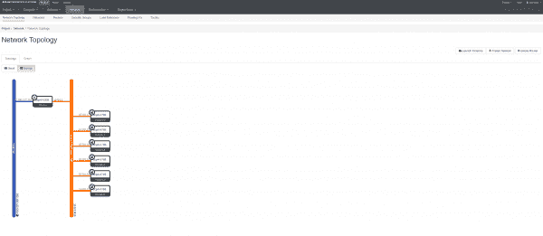
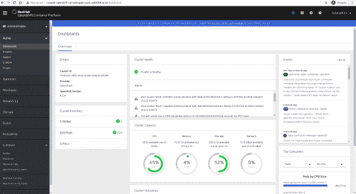

# OpenStack 13 上的 Red Hat OpenShift 4.2 IPI:一体化设置

> 原文：<https://developers.redhat.com/blog/2020/02/06/red-hat-openshift-4-2-ipi-on-openstack-13-all-in-one-setup>

几个月前，一位客户问我关于 OpenStack 上的 [Red Hat OpenShift](http://developers.redhat.com/openshift/) 的问题，特别是关于 OpenShift 在节点级可用的网络配置选项。为了给他们一个答案，增加我对$topic 的信心，我考虑过如何测试这个场景。

与此同时，意大利解决方案架构师“壮志凌云团队”负责为罗马和米兰日期的意大利红帽论坛(也称为开源日)准备演讲和演示。头脑风暴让我开始了在 OpenStack 13 上测试 OpenShift 4.2 设置的旅程，以便回复客户并利用这一成果为 Red Hat Forum 制作演示视频。

**注意:**如果您想跳过位和字节，请跳到“演示”部分。

## OpenStack 13 上的 OpenShift 4.2:背景

为什么要在 OpenStack 上使用 OpenShift？将这两种解决方案结合起来有很多好处:

*   **OpenStack 为 OpenShift 提供顶级私有云架构**来托管 OpenShift 节点，支持多租户、即服务方法和基础设施即服务(IaaS)级别的模块化。
*   **这种组合提供了一种三层扩展架构**，因为 OpenStack 节点、OpenShift 节点和 OpenShift pods 可以水平扩展。这种组合意味着您可以不受限制地满足您的业务需求。
*   **OpenStack 为 OpenShift 提供了一个程序化的 API 驱动的方法**。例如，您可以通过单击调用 OpenStack API，经由 MachineSet 来扩展您的 OpenShift worker 节点。
*   **open stack 上的 OpenShift 集成了【Nova、Cinder、Swift、奥克塔维亚、Kuryr 等。例如，借助 Kuryr，您可以通过在 pod 级别使用中子网络来避免双重封装，即 OpenStack SDN 上的 OpenShift 软件定义网络(SDN)。**
*   **open stack 上的 OpenShift 是由 Red Hat** 联合设计的，这意味着让每天从事这些项目的 Red Hat 工程师创建一致的产品路线图和集成测试。

OpenShift 安装程序提供的基础架构(IPI)随 OpenShift 4.2 一起发布。新安装程序的目标是以完全自动化和自以为是的方式提供和配置 OpenShift 4.2，使第一天开始变得容易，并让您在第二天有更多时间专注于您的团队。

如你所知，OpenShift 4.2 上的 IPI 还支持[Red Hat OpenStack Platform](https://www.redhat.com/en/technologies/linux-platforms/openstack-platform)13 作为提供者，利用 open stack 的虚拟化功能来托管 OpenShift 节点。我主要担心的是，我没有足够的裸机节点来构建我的环境。标准高可用性(HA) OpenStack 环境包括:

*   一个控制器节点
*   三个控制器
*   三个 Ceph 节点
*   至少两个计算节点

我的目标是构建以下内容来托管 OpenShift 4.2，并在控制平面和存储级别模拟高可用性环境:

*   一个控制器节点(云下)
*   三个控制器
*   三个 Ceph 节点
*   一个计算节点(超云)

*为什么？*模拟现有的客户环境。

*如何？*使用虚拟机作为 OpenStack 节点。

我有一个想法:看看我是否可以只用一台裸机服务器来设置一切。这一努力促使我发表了这篇文章，以便我可以分享和解释我如何在 OpenStack 13 上使用一台 Red Hat Enterprise Linux (RHEL)服务器测试 OpenShift 4.2 IPI 设置。这样做是可能的，因为 RHEL 被适当地调整为使用 KVM 的嵌套虚拟化。

**警告:**本文旨在帮助客户、合作伙伴和社区成员在 OpenStack 13 上测试 OpenShift 4.2，仅供演示/测试之用。红帽不支持(甚至不建议)这个过程和由此产生的架构*。*

我要感谢 Daniel Bellantuono 分享了关于 OpenStack 架构的有用提示。

## 方案

我只使用了一个裸机节点(L0 ),然后使用 KVM 的嵌套虚拟化特性，创建了一个 OpenStack 节点(L1)的部署，并在其上部署了虚拟化的 OpenShift 节点(L2)。图 1 显示了总结整个设置的模式。

[](/sites/default/files/blog/2020/01/img_5e2729a74a7f0.png)

Figure 1: The resulting schema.

现在，让我们深入不同的层。

## L0 bare metal

L0 裸机节点配置了 Red Hat Enterprise Linux 和 KVM 作为虚拟机管理程序。其服务器要求是:

*   至少 32 个内核
*   160 GB 内存
*   500 GB 固态硬盘(用于托管高性能虚拟机磁盘，即 Ceph OSD 磁盘和 Nova 计算磁盘)
*   200 GB SAS 磁盘(用于托管中等性能的虚拟机磁盘，即云下磁盘和控制器磁盘)。

**注意:**您可以为每个虚拟机使用固态硬盘，但是我必须在我的需求和硬件可用性之间进行平衡。

`virsh`命令显示了裸机节点的其余规格:

```
[root@newkvm ~]# virsh nodeinfo
CPU model: x86_64
CPU(s): 32
CPU frequency: 2099 MHz
CPU socket(s): 1
Core(s) per socket: 8
Thread(s) per core: 2
NUMA cell(s): 2
Memory size: 167676348 KiB
```

接下来，我使用`tuned`命令在 L0 级别执行网络延迟工作负载调优:

```
[root@newkvm ~]# tuned-adm profile network-latency
```

为了成功配置和部署您的云节点，您需要做两件事。首先，您需要在 libvirt 上定义一个供应网络，以便在通过 PXE 安装我们的云上节点时使用。其次，您必须定义您的虚拟机。

以下是 L0 层的网络配置片段:

```
[root@newkvm ~]# cat > /tmp/provisioning.xml <<EOF
<network>
<name>provisioning</name>
<ip address="172.16.0.254" netmask="255.255.255.0"/>
</network>
EOF
[root@newkvm ~]# echo "Defining provisioning network..."
[root@newkvm ~]# virsh net-define /tmp/provisioning.xml
[root@newkvm ~]# echo "Setting net-autostart to provisioning network..."
[root@newkvm ~]# virsh net-autostart provisioning
[root@newkvm ~]# echo "Starting provisioning network..."
[root@newkvm ~]# virsh net-start provisioning
[root@newkvm ~]# echo "Disabling DHCP on default network..."
[root@newkvm ~]# if(virsh net-dumpxml default | grep dhcp &>/dev/null); then
virsh net-update default delete ip-dhcp-range "<range start='192.168.122.2' end='192.168.122.254'/>" --live --config
echoinfo "DHCP already disabled, skipping"
```

供应网络通常是原生 VLAN 配置中预先存在的数据中心网络。该配置由下层云使用，通过 PXE 和 TFTP 执行节点自检和设置。为此，我创建了一个名为“provisioning”的专用网络(图 1 的蓝色部分)来连接我的所有虚拟机。

您可能已经知道，OpenStack 节点(在我们的例子中为虚拟机)的整个操作系统设置和配置由 Red Hat open stack Platform director 管理。此外，DHCP 在默认(预先存在的)libvirt 网络上被禁用，因为 director 在 OpenStack 设置期间分配 IP。最后，同样重要的是，我们需要配置我们的 hypervisor 来使用一个具有讽刺意味的项目驱动。我的选择是使用 VirtualBMC 来模拟虚拟机环境中不可用的智能平台管理接口(IPMIs)。

**注:** [阅读这篇 Red Hat 知识库](https://access.redhat.com/solutions/3057171)文章，了解更多关于如何配置 VBMC 并使用它来导入和自省裸机节点的信息。

OpenStack 设置的细节我就不深究了，因为过程很长，很难总结。本文假设您对 OpenStack 架构有基本的了解和理解。也就是说，提供了一些基本步骤。

## L1 虚拟机(OpenStack 节点)

从可从 Red Hat 客户门户网站下载的 Red Hat Enterprise Linux 7 KVM 客户映像开始，使用`qemu-img`、`virt-customize`和`virt-install`定义虚拟机:

```
[root@newkvm ~]# echo "Downloading basic RHEL image"
[root@newkvm ~]# curl -o rhel7-guest-official.qcow2 $RHEL_IMAGE_U
[root@newkvm ~]# echo "Cloning RHEL image to a 100G sparse image..."
[root@newkvm ~]# qemu-img create -f qcow2 rhel7-guest.qcow2 100G
[root@newkvm ~]# echo "Extending file system..."
[root@newkvm ~]# virt-resize --expand /dev/sda1 rhel7-guest-official.qcow2 rhel7-guest.qcow2
[root@newkvm ~]# echo "Checking image filesystem size..."
[root@newkvm ~]# virt-filesystems --long -h -a rhel7-guest.qcow2 | grep 100G &> /dev/null
[root@newkvm ~]# echo "Deleting old image..."
[root@newkvm ~]# rm -f rhel7-guest-official.qcow2
[root@newkvm ~]# echo "Create undercloud qcow2 disk..."
[root@newkvm ~]# qemu-img create -f qcow2 -b rhel7-guest.qcow2 undercloud.qcow2
```

控制器需要两个网卡。第一个(eth0)连接到*供应网络*，以便成功部署过云节点，第二个(eth1)连接到*默认网络*，以便(通过 L0 虚拟机管理程序创建的 NAT)访问互联网，下载设置所需的 RPM 包:

```
[root@newkvm ~]# echo "Customizing VM..."
[root@newkvm ~]# virt-customize -a undercloud.qcow2 --root-password password:mypassword --ssh-inject "root:file:/root/.ssh/id_rsa.pub" --selinux-relabel --run-command 'yum remove cloud-init* -y && cp /etc/sysconfig/network-scripts/ifcfg-eth{0,1} && sed -i s/ONBOOT=.*/ONBOOT=no/g /etc/sysconfig/network-scripts/ifcfg-eth0 && cat << EOF > /etc/sysconfig/network-scripts/ifcfg-eth1
DEVICE=eth1
ONBOOT=yes
IPADDR=192.168.122.253
NETMASK=255.255.255.0
GATEWAY=192.168.122.1
NM_CONTROLLED=no
DNS1=192.168.122.1
EOF'
[root@newkvm ~]# echo "Creating undercloud VM"
[root@newkvm ~]# virt-install --ram 12288 --vcpus 8  --os-variant rhel7 \
--disk path=/var/lib/libvirt/images/undercloud.qcow2,device=disk,bus=virtio,format=qcow2 \
--import --noautoconsole --vnc --network network:provisioning \
--network network:default --name undercloud 
[root@newkvm ~]# echo "Start undercloud VM now and on-boot"
[root@newkvm ~]# virsh start undercloud
[root@newkvm ~]# virsh autostart undercloud
```

其他虚拟机的设置类似，唯一的区别是涉及的资源量(如 RAM 和 CPU)和 NIC 配置。对于过云节点，我添加了两个额外的 NIC(图 1 的橙色部分),因为我希望在 Open vSwitch 内部进行绑定。在这个绑定中，我用标签`vlan`配置了 OpenStack 网络(即 InternalApi、租户网络、存储和存储管理),并保留了外部网络的标签。因此，OpenStack 端的外部网络将使用 L0 虚拟机管理程序上的默认网络。

完成这个基本设置后，我安装了底层云，导入并自省了 OpenStack 节点，然后构建了我的 OSP 模板来成功部署我的上层云:

[](/sites/default/files/blog/2020/01/img_5e28195f7c158.png)

Figure 2: Building the OSP templates.

我跳过了云上端点 TLS 配置，因为在撰写本文时，当端点使用自签名证书加密时，无法通过安装程序提供的安装(IPI)在 Red Hat OpenStack 平台上安装 Red Hat open shift Container Platform 4.2(如本知识库条目[中所强调的)。因此，结果是这样的:](https://access.redhat.com/solutions/4735631)

```
[root@newkvm ~]# virsh list --all
Id Name State
----------------------------------------------------
17 undercloud running
18 overcloud-ceph01 running
19 overcloud-ceph02 running
20 overcloud-ceph03 running
21 overcloud-compute01 running
22 overcloud-ctrl01 running
23 overcloud-ctrl02 running
24 overcloud-ctrl03 running
```

以下是生成的超云服务器列表:

```
(undercloud) [stack@undercloud ~]$ openstack server list
+--------------------------------------+------------------+--------+----------------------+----------------+--------------+
| ID | Name | Status | Networks | Image | Flavor |
+--------------------------------------+------------------+--------+----------------------+----------------+--------------+
| 9c4d82fd-c37e-4341-9a24-ea6416751aa3 | lab-controller01 | ACTIVE | ctlplane=172.16.0.40 | overcloud-full | control |
| ae2431d5-ff70-4fd3-83e3-48c72fca626e | lab-controller03 | ACTIVE | ctlplane=172.16.0.21 | overcloud-full | control |
| 4176914d-23ef-4e5f-83cd-86a53d320fc4 | lab-controller02 | ACTIVE | ctlplane=172.16.0.29 | overcloud-full | control |
| 78e6d4b0-c3de-431d-b144-6aa19664818d | lab-ceph01 | ACTIVE | ctlplane=172.16.0.46 | overcloud-full | ceph-storage |
| b7bb7596-4bf7-45f7-bd3b-c6bb79304531 | lab-ceph02 | ACTIVE | ctlplane=172.16.0.22 | overcloud-full | ceph-storage |
| 35258a3a-ff8b-44d0-b68b-a55039c4451d | lab-compute01 | ACTIVE | ctlplane=172.16.0.26 | overcloud-full | compute |
| 93d7ff6c-4713-431e-9461-0303126eb7ad | lab-ceph03 | ACTIVE | ctlplane=172.16.0.37 | overcloud-full | ceph-storage |
+--------------------------------------+------------------+--------+----------------------+----------------+--------------+
```

由于硬件能力有限(考虑到我们谈论的是一台裸机服务器，这也是一种过度承诺)，我执行了许多测试，以便在 OpenStack 上成功部署 OpenShift。我遇到了许多超时问题，但最终，我找到了合适的调优方法。以下是一些关于 OpenStack 计算节点超时调整的提示和技巧。

您可能需要在`nova_libvirt`容器配置文件`(/var/lib/config-data/puppet-generated/nova_libvirt/etc/nova/nova.conf)`中进行两次编辑。第一个是在`[neutron]`部分，设置一个足够大的超时值(在我的例子中是 300 秒),以避免 nova 产生新实例时中子端超时:

```
[neutron]
url=http://172.17.1.150:9696
ovs_bridge=br-int
default_floating_pool=nova
extension_sync_interval=600
timeout=300
```

第二个是在`[default]`部分，设置一个足够大的超时值(在我的例子中是 300 秒),以避免当 nova 试图将一个虚拟接口(VIF)连接到一个新实例时中子端超时:

```
[default]
instance_usage_audit_period=hour
rootwrap_config=/etc/nova/rootwrap.conf
compute_driver=libvirt.LibvirtDriver
allow_resize_to_same_host=False
vif_plugging_is_fatal=True
vif_plugging_timeout=300
```

在这些编辑之后，您将在计算节点上重启`nova_libvirt`容器。

请注意，这些更改会在容器重启后应用于 OpenStack Nova 容器。如果你想稍后重新部署你的超云，你必须通过由 OpenStack director 执行的[自定义傀儡配置](https://access.redhat.com/documentation/en-us/red_hat_openstack_platform/13/html/advanced_overcloud_customization/chap-configuration_hooks#sect-Customizing_Overcloud_PreConfiguration)来自定义`nova.conf`。

## L2 嵌套虚拟机(OpenShift 节点)

除了这些节点(在我的例子中是虚拟机)，我当然还必须考虑 IPI 在 vCPU、RAM、浮动 IP 和租户级可用的安全组方面的需求列表。OpenStack 上 OpenShift 4.2 IPI 的完整先决条件可从[这里](https://docs.openshift.com/container-platform/4.2/installing/installing_openstack/installing-openstack-installer-custom.html#installation-osp-default-deployment_installing-openstack-installer-custom)获得。

因为我已经多次测试该设置，并且我不想在每次执行设置时都担心先决条件，所以我制作了一个简单的 bash 脚本来为 OpenStack 上的租户做准备:

```
[stack@undercloud osd-ocp-demo]$ cat create_ocp_tenant.sh
#!/bin/bash
source ../overcloudrc
openstack project create ocp-tenant
openstack user create ocp-user --password mypassword
user=$(openstack user show ocp-user -f value -c id)
admin=$(openstack user show admin -f value -c id)
project=$(openstack project show ocp-tenant -f value -c id)
openstack role add --user $user --project $project _member_
openstack role add --user $user --project $project admin
openstack role add --user $admin --project $project admin
openstack role add --user $user --project $project swiftoperator
# show default quota and set new limits on project ocp-tenant
echo "compute quota"
openstack quota list --compute --project ocp-tenant -f yaml
openstack quota set --cores 40 --ram 102400 $project
echo "network quota"
openstack quota list --network --project ocp-tenant -f yaml
openstack quota set --secgroups 40 --secgroup-rules 500 $project
# create needed flavors
openstack flavor create --ram 16384 --vcpu 4 --disk 25 master
echo -e "working on $project"
source ocp-tenant-openrc
openstack object store account set --property Temp-URL-Key=superkey
# create rhcos image
curl --compressed -J -L -o rhcos-openstack.qcow2 https://mirror.openshift.com/pub/openshift-v4/dependencies/rhcos/pre-release/latest/rhcos-42.80.20191002.0-openstack.qcow2
openstack image create --container-format=bare --disk-format=qcow2 --file rhcos-openstack.qcow2 rhcos
mkdir -p /home/stack/osd-ocp-demo
cd /home/stack/osd-ocp-demo
cat <<EOF > clouds.yaml
clouds:
openstack:
auth:
auth_url: http://192.168.122.150:5000/v3
username: "ocp-user"
password: "mypassword"
project_id: $project
project_name: "ocp-tenant"
user_domain_name: "Default"
region_name: "regionOne"
interface: "public"
identity_api_version: 3
EOF
wget -r --no-parent -A 'openshift-install-linux*.tar.gz' https://mirror.openshift.com/pub/openshift-v4/clients/ocp/latest/
wget -r --no-parent -A 'openshift-client-linux*.tar.gz' https://mirror.openshift.com/pub/openshift-v4/clients/ocp/latest/
tar -xvzf mirror.openshift.com/pub/openshift-v4/clients/ocp/latest/openshift-install-linux-4.2.4.tar.gz -C .
tar -xvzf mirror.openshift.com/pub/openshift-v4/clients/ocp/latest/openshift-client-linux-4.2.0.tar.gz -C .
# openstack FIP for API lb
openstack floating ip create --floating-ip-address 192.168.122.164 --project ocp-tenant external
# openstack FIP for APPS lb
openstack floating ip create --floating-ip-address 192.168.122.180 --project ocp-tenant external
# add ssh key to ssh agent
eval "$(ssh-agent -s)"
ssh-add /home/stack/.ssh/id_rsa
# configure KUBECONFIG path
export KUBECONFIG='/home/stack/osd-ocp-demo/auth/kubeconfig'
```

既然先决条件已经具备，让我们看看我们的`install-config.yam`文件，它将指导 IPI 安装程序在节点数量、要使用的风格、网络 CIDR 等方面进行 OpenShift 配置。

如您所见，我指定了字段来:

*   构建两个工作节点。
*   构建三个主节点。
*   使用 OpenStack 作为带有“master”风格的提供者(由脚本`create_ocp_tenant.sh)`创建)。

此外，我为内部 API 负载平衡器(`lbFloatingIP`)包含了一个浮动 IP (FIP)，这个 FIP 允许访问内部 LB (API 负载平衡器):

```
(undercloud) [stack@undercloud osd-ocp-demo-static-nic]$ cat template/install-config.yaml
apiVersion: v1
clusterID: ocp4
baseDomain: osd2019.local
compute:
- hyperthreading: Enabled
name: worker
platform: {}
replicas: 2
type: worker
controlPlane:
hyperthreading: Enabled
name: master
platform: {}
replicas: 3
type: master
metadata:
name: ocp4
networking:
clusterNetwork:
- cidr: 10.128.0.0/14
hostPrefix: 23
machineCIDR: 10.0.0.0/16
networkType: OpenShiftSDN
serviceNetwork:
- 172.60.0.0/16
platform:
openstack:
cloud: openstack
computeFlavor: master
externalNetwork: external
lbFloatingIP: 192.168.122.164
octaviaSupport: false
region: regionOne
trunkSupport: false
pullSecret: 'mypull secret'
sshKey: ssh-rsa blablabla stack@undercloud.redhat.local
```

您可能还注意到，我没有使用奥克塔维亚(一个 OpenStack 负载平衡器即服务)，因为在我自己的测试中，我特别想模拟一个不使用奥克塔维亚的客户环境。奥克塔维亚不是一个严格的要求，除非你使用 Kuryr。

我们现在可以用一个简单的命令来执行安装(如果您愿意，可以指定调试日志级别，以便更好地理解安装过程):

```
(overcloud) [stack@undercloud osd-ocp-demo]$ ./openshift-install create cluster --log-level debug
DEBUG OpenShift Installer v4.2.4
DEBUG Built from commit 425e4ff0037487e32571258640b39f56d5ee5572
DEBUG Fetching "Terraform Variables"...
DEBUG Loading "Terraform Variables"...
DEBUG Loading "Cluster ID"...
DEBUG Loading "Install Config"...
DEBUG Loading "SSH Key"...
DEBUG Loading "Base Domain"...
DEBUG Loading "Platform"...
DEBUG Loading "Cluster Name"...
DEBUG Loading "Base Domain"...
DEBUG Loading "Pull Secret"...
DEBUG Loading "Platform"...
DEBUG Using "Install Config" loaded from target directory
DEBUG Loading "Install Config"...
DEBUG Loading "Image"...
DEBUG Loading "Install Config"...
DEBUG Loading "BootstrapImage"...
DEBUG Loading "Install Config"...
DEBUG Loading "Bootstrap Ignition Config"...
DEBUG Loading "Install Config"...
DEBUG Loading "Kubeconfig Admin Client"...
DEBUG Loading "Certificate (admin-kubeconfig-client)"...
DEBUG Loading "Certificate (admin-kubeconfig-signer)"...
DEBUG Loading "Certificate (kube-apiserver-complete-server-ca-bundle)"...
DEBUG Loading "Certificate (kube-apiserver-localhost-ca-bundle)"...
OUTPUT TRUNCATED
```

在安装过程中，登录 OpenStack 仪表盘(如图 3 所示)，你会看到 OpenShift IPI 负责一切；从产生新的实例，到构建专用的租户网络，配置安全组，等等。

[](/sites/default/files/blog/2020/01/img_5e281995be9d4.png)

Figure 3: The OpenStack dashboard lets you watch the installation process in action.

一段时间后(大约 30 分钟)，您将启动并运行 Red Hat OpenShift 4.2 集群，如下所示:

```
DEBUG Still waiting for the cluster to initialize: Working towards 4.2.4: 98% complete
DEBUG Still waiting for the cluster to initialize: Working towards 4.2.4: 99% complete
DEBUG Cluster is initialized
INFO Waiting up to 10m0s for the openshift-console route to be created...
DEBUG Route found in openshift-console namespace: console
DEBUG Route found in openshift-console namespace: downloads
DEBUG OpenShift console route is created
INFO Install complete!
INFO To access the cluster as the system:admin user when using 'oc', run 'export KUBECONFIG=/home/stack/osd-ocp-demo/auth/kubeconfig'
INFO Access the OpenShift web-console here: https://console-openshift-console.apps.ocp4.osd2019.local
INFO Login to the console with user: kubeadmin, password: YOURKUBEADMINRANDOMPASSWORD
```

查看图 4 中的 OpenStack 网络拓扑，您将看到最终的架构。

[](/sites/default/files/blog/2020/01/img_5e281a04ee758.png)

Figure 4: Your OpenStack network topology.

您还可以从用于安装 OpenShift 的客户机上使用`oc`客户机(在我的例子中，它是我的云下虚拟机):

```
(undercloud) [stack@undercloud osd-ocp-demo$ oc get nodes
NAME STATUS ROLES AGE VERSION
ocp4-4p5fd-master-0 Ready master 9d v1.14.6+c7d2111b9
ocp4-4p5fd-master-1 Ready master 9d v1.14.6+c7d2111b9
ocp4-4p5fd-master-2 Ready master 9d v1.14.6+c7d2111b9
ocp4-4p5fd-worker-76gvc Ready worker 9d v1.14.6+c7d2111b9
ocp4-4p5fd-worker-n6jvq Ready worker 9d v1.14.6+c7d2111b9
```

只需要一个部署后命令就可以将预先分配的浮动 IP 地址(FIP)附加到入口端口。详情可在官方文件[这里](https://docs.openshift.com/container-platform/4.2/installing/installing_openstack/installing-openstack-installer-custom.html#installation-osp-configuring-api-floating-ip_installing-openstack-installer-custom)找到。这一步是必需的，因为 IPI 安装程序负责在每个主节点和工作节点上配置 Keepalived pod，公开将流量路由到内部 API、入口和 DNS 服务的虚拟 IP(VIP)。

让我们分配我们的 FIP，以便到达 OpenShift 控制台。我们需要将它分配给`ingress-port`:

```
(overcloud) [stack@undercloud osd-ocp-demo]$ openstack port show c3c14e9d-750f-46fb-af9c-e9fd375719b2
+-----------------------+-------------------------------------------------------------------------+
| Field | Value |
+-----------------------+-------------------------------------------------------------------------+
| admin_state_up | UP |
| allowed_address_pairs | |
| binding_host_id | |
| binding_profile | |
| binding_vif_details | |
| binding_vif_type | unbound |
| binding_vnic_type | normal |
| created_at | 2019-11-01T00:49:21Z |
| data_plane_status | None |
| description | |
| device_id | |
| device_owner | |
| dns_assignment | None |
| dns_name | None |
| extra_dhcp_opts | |
| fixed_ips | ip_address='10.0.0.7', subnet_id='9cbfdd62-b1e5-4f01-b49c-db992b9afc8e' |
| id | c3c14e9d-750f-46fb-af9c-e9fd375719b2 |
| ip_address | None |
| mac_address | fa:16:3e:b8:39:8b |
| name | ocp4-ll4qz-ingress-port |
| network_id | ec5de4de-2f52-42c5-87bf-35c8d91bd1a7 |
| option_name | None |
| option_value | None |
| port_security_enabled | True |
| project_id | 699eeaefb7b84291a75d389ec0f10ea2 |
| qos_policy_id | None |
| revision_number | 7 |
| security_group_ids | 9e6ee5d9-fa19-418c-804e-f1c654d2e34b |
| status | DOWN |
| subnet_id | None |
| tags | openshiftClusterID=ocp4-ll4qz |
| trunk_details | None |
| updated_at | 2019-11-01T00:49:29Z |
+-----------------------+-------------------------------------------------------------------------+
openstack floating ip set --port c3c14e9d-750f-46fb-af9c-e9fd375719b2 192.168.122.180
```

最后，我更新了我的主机文件，以便通过 FQDN 访问 OpenShift，这样我就不必配置 DNS 服务了:

```
#ocp4
192.168.122.164 api.ocp4.osd2019.local
192.168.122.180 console-openshift-console.apps.ocp4.osd2019.local
192.168.122.180 integrated-oauth-server-openshift-authentication.apps.ocp4.osd2019.local
192.168.122.180 oauth-openshift.apps.ocp4.osd2019.local
192.168.122.180 prometheus-k8s-openshift-monitoring.apps.ocp4.osd2019.local
192.168.122.180 grafana-openshift-monitoring.apps.ocp4.osd2019.local
```

就是这样。三十分钟后，您将在 OpenStack 上启动并运行您的 OpenShift 集群。然后，您可以开始试验这种环境能够赋予您的组织的能力。有关 Red Hat OpenShift 容器平台中的结果，请参见图 5。

[](/sites/default/files/blog/2020/01/img_5e281a44b51c1.png)

Figure 5: Your new cluster in Red Hat OpenShift Container Platform.

## 网络深度潜水

如您所见，我们使用我在“L2 嵌套虚拟机(OpenShift 节点)”一节中分享的 bash 脚本在我们的租户中预分配了两个 FIP，代码行如下:

```
lbFloatingIP: 192.168.122.164
ingress port floating: 192.168.122.180
```

这两个 FIPS 与两个中子端口相关联，即`api-port`(内部 IP 10.0.0.5)和入口端口(内部 IP 10.0.0.7)。第一次 FIP 分配(192.168.122.164 - > 10.0.0.5)是由 IPI 在设置期间自动进行的。相反，第二个 FIP 关联由我们管理，正如我们之前看到的那样，以便访问 OpenShift 控制台和其他服务:

```
overcloud) [stack@undercloud osd-ocp]$ openstack floating ip list
+--------------------------------------+---------------------+------------------+--------------------------------------+--------------------------------------+----------------------------------+
| ID | Floating IP Address | Fixed IP Address | Port | Floating Network | Project |
+--------------------------------------+---------------------+------------------+--------------------------------------+--------------------------------------+----------------------------------+
| 87295f6b-75ed-4420-9548-a37d4ae137fc | 192.168.122.164 | 10.0.0.5 | 4ca1d30d-9931-495b-a295-5eba2019293f | 2b122467-8cd0-4159-a176-2a4bc4c2f1e7 | 699eeaefb7b84291a75d389ec0f10ea2 |
| 8e47ae70-fb99-4a3b-ad66-314b9e1a5400 | 192.168.122.180 | 10.0.0.7 | a8d54ead-3283-4746-94d1-ef724fcd50f9 | 2b122467-8cd0-4159-a176-2a4bc4c2f1e7 | 699eeaefb7b84291a75d389ec0f10ea2 |
+--------------------------------------+---------------------+------------------+--------------------------------------+--------------------------
```

查看中子端口，我们可以看到，正如怀疑的那样，这些端口是 API 和 Ingress，但它们已关闭。那么，负载平衡是如何工作的呢？看看这个:

```
(overcloud) [stack@undercloud osd-ocp-demo-static-nic]$ openstack port list | grep "api-port\|ingress"
| 4ca1d30d-9931-495b-a295-5eba2019293f | ocp4-4p5fd-api-port | fa:16:3e:5b:2b:eb | ip_address='10.0.0.5', subnet_id='c38b6eb3-0dc3-41ec-915e-e7c365bcb0a0' | DOWN |
| a8d54ead-3283-4746-94d1-ef724fcd50f9 | ocp4-4p5fd-ingress-port | fa:16:3e:dc:b7:1b | ip_address='10.0.0.7', subnet_id='c38b6eb3-0dc3-41ec-915e-e7c365bcb0a0' | DOWN |
```

这些端口没有连接到实例。相反，它们是在租户网络上创建的，OpenShift 使用它们通过 Keepalived 或虚拟路由器冗余协议(VRRP)分配 VIP，以便对主设备公开的内部服务(API 和 DNS)和工作设备公开的入口请求进行负载平衡(ingress pod = OpenShift router)。

深入我们的 OpenShift 设置，项目`openshift-openstack-infra`包含三个`haproxy`和三个`keepalived`在主设备上运行，加上两个`keepalived`在工人设备上运行:

```
(overcloud) [stack@undercloud osd-ocp-demo-static-nic]$ oc get pods -n openshift-openstack-infra
NAME READY STATUS RESTARTS AGE
coredns-ocp4-4p5fd-master-0 1/1 Running 0 9d
coredns-ocp4-4p5fd-master-1 1/1 Running 0 9d
coredns-ocp4-4p5fd-master-2 1/1 Running 0 9d
coredns-ocp4-4p5fd-worker-76gvc 1/1 Running 1 9d
coredns-ocp4-4p5fd-worker-n6jvq 1/1 Running 0 9d
haproxy-ocp4-4p5fd-master-0 2/2 Running 2 9d
haproxy-ocp4-4p5fd-master-1 2/2 Running 0 9d
haproxy-ocp4-4p5fd-master-2 2/2 Running 0 9d
keepalived-ocp4-4p5fd-master-0 1/1 Running 0 9d
keepalived-ocp4-4p5fd-master-1 1/1 Running 0 9d
keepalived-ocp4-4p5fd-master-2 1/1 Running 0 9d
keepalived-ocp4-4p5fd-worker-76gvc 1/1 Running 1 9d
keepalived-ocp4-4p5fd-worker-n6jvq 1/1 Running 0 9d
mdns-publisher-ocp4-4p5fd-master-0 1/1 Running 0 9d
mdns-publisher-ocp4-4p5fd-master-1 1/1 Running 0 9d
mdns-publisher-ocp4-4p5fd-master-2 1/1 Running 0 9d
mdns-publisher-ocp4-4p5fd-worker-76gvc 1/1 Running 1 9d
mdns-publisher-ocp4-4p5fd-worker-n6jvq 1/1 Running 0 9d
```

查看其中一个在主节点上运行的 pod，我们可以看到 Keepalived 被配置为使用 VRRP 协议来公开三个 VIP:

```
(overcloud) [stack@undercloud osd-ocp-demo]$ oc rsh keepalived-ocp4-4p5fd-master-0
sh-4.2# cat /etc/keepalived/keepalived.conf | grep -A1 ipaddress
virtual_ipaddress {
10.0.0.5/16
--
virtual_ipaddress {
10.0.0.6/16
--
virtual_ipaddress {
10.0.0.7/16
```

例如，为了将入口流量路由到内部 API 端口，有一个分配了 VIP 的 VRRP 实例(10.0.0.5):

```
vrrp_instance ocp4_API {
state BACKUP
interface ens3
virtual_router_id 29
priority 40
advert_int 1
authentication {
auth_type PASS
auth_pass ocp4_api_vip
}
virtual_ipaddress {
10.0.0.5/16
}
track_script {
chk_ocp
}
}
```

查看主服务器上的`haproxy` pod，我们可以看到它监听所有 IP 上的端口 7443，并且它平衡对主服务器节点的 API 调用(section backend masters):

```
(overcloud) [stack@undercloud osd-ocp-demo]$ oc rsh haproxy-ocp4-4p5fd-master-0
sh-4.2$ cat /etc/haproxy/haproxy.cfg
defaults
maxconn 20000
mode tcp
log /var/run/haproxy/haproxy-log.sock local0
option dontlognull
retries 3
timeout http-keep-alive 10s
timeout http-request 1m
timeout queue 1m
timeout connect 10s
timeout client 86400s
timeout server 86400s
timeout tunnel 86400s
frontend main
bind :7443
default_backend masters
listen health_check_http_url
bind :50936
mode http
monitor-uri /healthz
option dontlognull
listen stats
bind 127.0.0.1:50000
mode http
stats enable
stats hide-version
stats uri /haproxy_stats
stats refresh 30s
stats auth Username:Password
backend masters
option httpchk GET /healthz HTTP/1.0
option log-health-checks
balance roundrobin
server etcd-0.ocp4.osd2019.local. 10.0.0.11:6443 weight 1 verify none check check-ssl inter 3s fall 2 rise 3
server etcd-2.ocp4.osd2019.local. 10.0.0.18:6443 weight 1 verify none check check-ssl inter 3s fall 2 rise 3
server etcd-1.ocp4.osd2019.local. 10.0.0.26:6443 weight 1 verify none check check-ssl inter 3s fall 2 rise 3
```

通过 SSH 登录到 CoresOS 节点(`master-0`)进行仔细检查，我们可以看到`haproxy`正在监听端口 7443:

```
root@ocp4-4p5fd-master-0 ~]# netstat -anop | grep 0.0.0.0:7443
tcp 0 0 0.0.0.0:7443 0.0.0.0:* LISTEN 336621/haproxy off (0.00/0/0)
```

VIP (10.0.0.5)现在被分配给 master-2 节点，从保持活动的角度来看，它是主节点:

```
root@ocp4-4p5fd-master-1 /]# ip a | grep 10.0.0.5
inet 10.0.0.5/16 scope global secondary ens3
```

少了什么？如果 Neutron 上的 API 和入口端口关闭，这个设置如何工作？它之所以有效，是因为从端口安全的角度来看，在分配给主设备和工作设备的中子端口上，允许保持活动的 VIP。

需要仅针对特定 IP/MAC 禁用反 MAC 欺骗吗？此设置允许来自同一中子端口上不同 IP 的传入流量:

```
(overcloud) [stack@undercloud osd-ocp-demo-static-nic]$ neutron port-show e3c60257-1877-45c4-8cae-492ef953207f
neutron CLI is deprecated and will be removed in the future. Use openstack CLI instead.
+-----------------------+-----------------------------------------------------------------------------------+
| Field | Value |
+-----------------------+-----------------------------------------------------------------------------------+
| admin_state_up | True |
| allowed_address_pairs | {"ip_address": "10.0.0.5", "mac_address": "fa:16:3e:25:f2:fe"} |
| | {"ip_address": "10.0.0.6", "mac_address": "fa:16:3e:25:f2:fe"} |
| | {"ip_address": "10.0.0.7", "mac_address": "fa:16:3e:25:f2:fe"} |
```

需要汇总传入 API 流量的流量吗？看起来是这样的:

```
192.168.122.164 -> MASTER-2 NODE (holding keepalived VIP) -> master-2 haproxy pod -> load balancing to other pods
```

总结传入 HTTP/HTTPS 请求的入站流量:

```
192.168.122.180 -> Worker-node (holding keepalived VIP for ingress)  -> console pods, prometheus pods, etc
```

**注意:**这一[页面](https://github.com/openshift/installer/blob/master/docs/design/openstack/networking-infrastructure.md)详细介绍了 IPI 的网络基础设施。

此外，我还尝试向 OpenShift 节点添加 OpenStack 中子端口，并附加一个提供商网络，以便拥有一个带有静态 IP/路由的专用管理网络。不幸的是，我无法实现这个目标，因为 IPI 的目标是提供一个固执己见的设置。相反，当用户提供的基础设施(UPI)可用于 Red Hat OpenStack 时，这一增加将为我们提供这一选项。

## 演示

这是我们和我的同事 Rinaldo Bergamini 录制的演示视频。它以实用的方式展示了 OpenShift IPI 安装。

No video provider was found to handle the given URL. See [the documentation](https://www.drupal.org/node/2842927) for more information.*Last updated: June 29, 2020*