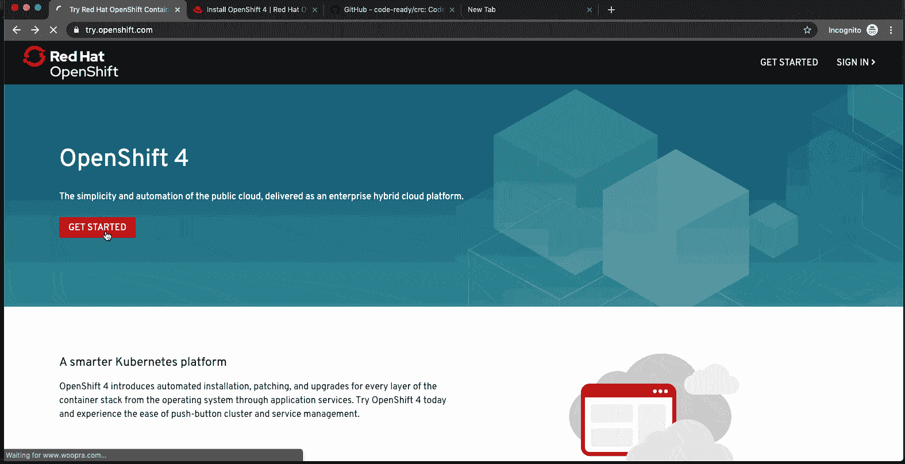

# 笔记本电脑上的 Red Hat OpenShift 4:介绍 Red Hat CodeReady 容器

> 原文：<https://developers.redhat.com/blog/2019/09/05/red-hat-openshift-4-on-your-laptop-introducing-red-hat-codeready-containers>

我们很高兴地宣布，Red Hat CodeReady Containers 现在可以作为开发者预览版使用。CodeReady Containers 为您的本地笔记本电脑或台式机带来了一个最小的、预配置的 OpenShift 4.1 或更新的集群，用于开发和测试目的。CodeReady Containers 支持 Linux、macOS 和 Windows 10 的本机虚拟机管理程序。你可以从 Red Hat CodeReady Containers 产品页面下载 CodeReady Containers。

CodeReady Containers 是为在 OpenShift 4 集群上进行本地开发和测试而设计的。要在本地运行 OpenShift 3 集群，请参见[红帽容器开发工具包(CDK)](https://developers.redhat.com/products/cdk/overview) 或 [Minishift](https://github.com/minishift/minishift) 。

在本文中，我们将了解 CodeReady 容器的特性和优势，展示创建本地 Red Hat OpenShift 4 集群有多简单，并展示如何在其上部署应用程序。

### 先决条件

CodeReady 容器运行 Red Hat OpenShift 需要以下最低系统资源:

*   4 个虚拟 CPU(vcpu)
*   8 GB 内存
*   35 GB 的存储空间

您还需要针对您的主机操作系统的本机虚拟机管理程序。CodeReady Containers 目前支持 libvirt for Linux、HyperKit for macOS 和 Hyper-V for Windows。

这里有一个简单的步骤，从开始到部署应用程序。



### 下载和安装

你可以从[的 Red Hat CodeReady Containers 产品页面](https://developers.redhat.com/products/codeready-containers)下载 CodeReady Containers。要安装 CodeReady 容器，提取下载的归档文件及其内容，并将提取的`crc`二进制文件添加到您的`PATH`环境变量中。在 Linux 和 macOS 上，您可以使用`tar xvf` 命令提取`.tar.xz`档案的内容。

### 配置

一旦安装了 CodeReady 容器，就用`crc setup`命令设置您的主机环境。该命令必须在启动 OpenShift 集群之前运行。该命令应该使用您的普通用户帐户运行，但在需要修改时会请求提升权限。确保您的用户帐户能够提升权限。

```
$ crc setup

```

### 启动您的 OpenShift 4 集群

在使用`crc setup`命令设置了您的主机环境之后，您可以使用`crc start`命令启动 OpenShift 集群。出现提示时，为群集提供您的用户提取密码。你的用户拉密可以从[红帽 CodeReady Containers 产品页面](https://developers.redhat.com/products/codeready-containers)的*拉密*部分下复制或下载。需要一个 Red Hat 帐户来访问用户提取密码。

```
$ crc start

```

就是这样！

现在，您应该很快就拥有了一个正在运行的 Red Hat OpenShift 4 集群。

### 使用您的集群

CodeReady 容器包含一个缓存的 OpenShift 客户端二进制文件(`oc`)。您可以使用这个缓存的`oc`二进制文件，通过运行`crc oc-env`命令并遵循打印的指令，与正在运行的 OpenShift 集群进行交互。一旦环境被设置为使用缓存的`oc`二进制文件，您就可以以`developer`用户的身份登录集群，如下所示:

```
$ eval $(crc oc-env)
$ oc login -u developer -p developer

```

现在我们将创建一个示例`httpd`应用程序部署。使用`oc`登录后，创建一个新项目:

```
$ oc new-project myproject

```

创建`httpd`示例应用程序:

```
$ oc new-app httpd-example

```

监控您的构建的状态，以确保它成功推送:

```
$ oc logs -f bc/httpd-example
[...]
Writing manifest to image destination
Storing signatures
Push successful

```

推送成功后，获取到您的应用程序的路由，并确保它正常工作:

```
$ oc get routes
NAME            HOST/PORT                           PATH SERVICES PORT TERMINATION   WILDCARD
httpd-example   httpd-example-myproject.apps-crc.testing          httpd-example <all> None
$ curl -Ik httpd-example-myproject.apps-crc.testing
HTTP/1.1 200 OK
[...]

```

恭喜，您现在已经有了一个运行在 Red Hat OpenShift 4 上的示例应用程序`httpd`!

您还可以使用`[odo](https://github.com/openshift/odo)`，一个面向开发人员的 OpenShift 命令行界面，与 CodeReady 容器提供的 OpenShift 集群进行交互。

关于 CodeReady 容器的更多信息，请参见官方 CodeReady 容器文档。此外，请参见下面的视频，亲自体验一下。

### 获得帮助

如果您在使用 CodeReady 容器时遇到任何问题，请参见【Red Hat CodeReady 容器故障排除指南。如果这不能解决你的问题，[用‘CRC’组件](https://bugzilla.redhat.com/enter_bug.cgi?product=OpenShift%20Container%20Platform&component=crc)在 Bugzilla 中创建一个 bug。

如需社区讨论，请加入 Freenode 上的#codeready IRC 频道。

### 承认

非常感谢 CodeReady 容器开发团队、Red Hat OpenShift 开发团队的成员以及博客作者/评论者 Kevin Owen、Gerard Braad、Praveen Kumar 和所有人。

[https://www.youtube.com/embed/qogFjV2fJNs](https://www.youtube.com/embed/qogFjV2fJNs)

 *Last updated: October 15, 2019*