# EAP 上的 Red Hat 流程自动化管理器

> 原文：<https://developers.redhat.com/articles/2020/11/19/red-hat-process-automation-manager-eap>

# 过程自动化你好世界

本指南向您展示了如何实现 Red Hat Process Automation Manager(RHPAM)来创作、部署和执行您的业务自动化应用程序。通过三个步骤，这个 Hello World(图 1.1)将引导您从安装业务应用程序到测试它们。

[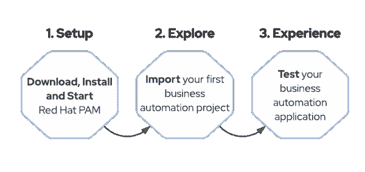](/sites/default/files/3-steps.png)Figure 1.1: Setup, Explore, Experience

首先，我们将在本地安装 RHPAM，并在 Red Hat JBoss EAP (WildFly)上运行它。一旦我们启动并运行了 RHPAM，我们将导入一个现有的应用程序，向您展示 RHPAM 的一些功能，我们还将探索工具和项目本身。最后，我们将通过部署项目并测试它来结束我们的安装指南。

## 1.设置您的环境

### 先决条件

在你的机器上安装 [Java JDK 11](https://developers.redhat.com/openjdk-install) 和 [GIT](https://git-scm.com/) 客户端。如果你还没有 Java JDK 11，可以下载红帽打造的 [OpenJDK。](https://developers.redhat.com/openjdk-install)

Process Automation Manager 可以通过图形安装程序或 ZIP 发行版进行安装。在这个 Hello World 中，我们将使用 ZIP 发行版，因为它使得自动化安装更加容易。如果你更喜欢使用图形安装程序，你可以在这里下载它。

### 分三步安装流程自动化管理器

#### [计] 下载

首先下载我们需要的文件: **JBoss EAP** ，流程自动化管理器的两个主要组件:**商务中心**和 **Kie 服务器**:

*   [红帽 JBoss EAP 7.3](https://developers.redhat.com/download-manager/file/jboss-eap-7.3.0.zip)
*   [RHPAM -商务中心，可部署邮编](https://developers.redhat.com/download-manager/file/rhpam-7.11.0-business-central-eap7-deployable.zip)
*   [RHPAM - KIE 服务器，可部署 zip](https://developers.redhat.com/download-manager/file/rhpam-7.11.0-kie-server-ee8.zip)
*   [RHPAM 附加组件](https://developers.redhat.com/download-manager/file/rhpam-7.11.0-add-ons.zip)

安装很简单，让我们开始吧！在这个 Hello World 中，我们将使用一个安装程序来安装 EAP 和 RHPAM，并为我们配置环境。

1.  克隆[Red Hat Process Automation Manager 7 安装演示 git 库](https://github.com/jbossdemocentral/rhpam7-install-demo.git):

    ```
    $ git clone https://github.com/jbossdemocentral/rhpam7-install-demo.git
    ```

2.  将刚才下载的四个 zip 文件复制到**rhp am 7-install-demo**目录下的 **installs** 目录下。
3.  运行“init.sh”或“init.bat”文件。**注意:**‘init . bat’必须以管理权限**运行。**
4.  安装完成后，您应该会在终端上看到一条成功消息以及环境信息。

#### 启动您的环境

要启动环境，在终端中使用命令输出引导 JBoss EAP。你的屏幕应该看起来像这样。

*   对于 Linux/OSx

```
/target/jboss-eap-7.3/bin/standalone.sh
```

*   对于 Windows

```
\target\jboss-eap-7.3\bin\standalone.sh
```

### 2.探索

恭喜你！您已经成功安装了流程自动化管理器。现在，您已经在 EAP 中部署了两个关键组件: **[商业中心](https://developers.redhat.com/download-manager/file/rhpam-7.9.0-business-central-eap7-deployable.zip)** 和 **[KIE 服务器](https://developers.redhat.com/download-manager/file/rhpam-7.9.0-kie-server-ee8.zip)** 。Business Central 是一个组件，它允许您开发流程和决策，并使用这些流程来管理、构建和打包项目。KIE 服务器是一个轻量级引擎，能够执行业务资产，如流程、案例和决策，并且可以通过 REST 或 JMS 轻松地与您的服务集成。

幸运的是，Process Automation Manager 附带了许多现成的模板和示例应用程序，您可以使用它们来快速构建和部署流程微服务。

#### 访问商务中心

让我们从访问**商务中心**开始。

1.  通过导航到[http://localhost:8080/Business-Central](http://localhost:8080/business-central )访问商务中心。
2.  使用以下凭据登录
    *   User: pamAdmin
    *   密码:redhatdm1！
3.  点击**设计**然后**创建和修改项目和页面**(见图 1)。

[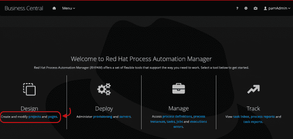](/sites/default/files/pam-hw-1.png)Figure 1: Select Design then Create and modify projects and pages

选择 **MySpace** ，然后**导入项目**(见图 2) **。**

[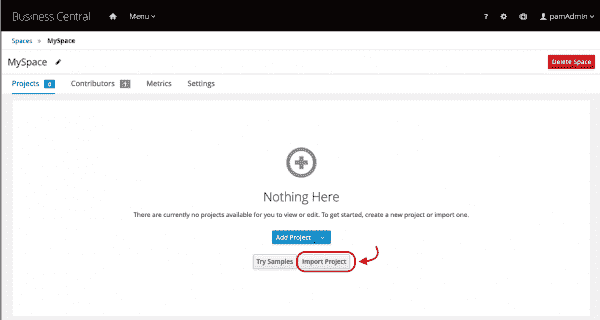](/sites/default/files/pam-hw-2.png)Figure 2: Select MySpace then Import Projects

1.  使用这个库:[https://github . com/JBoss demo central/RH PAM 7-order-management-demo-repo . git](https://github.com/jbossdemocentral/rhpam7-order-management-demo-repo)
2.  点击**导入**(见图 3)。

[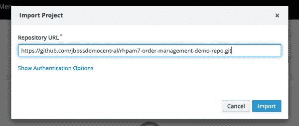](/sites/default/files/pam-hw-3_0.png)Figure 3: Input repository and select Import

选择**订单管理**项目(见图 4)，点击**确定**。

[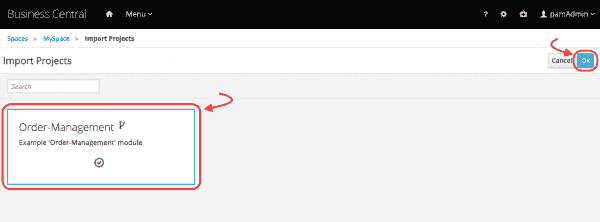](/sites/default/files/pam-hw-4.png)Figure 4: Select order management then Ok

一旦项目被导入，注意它有 27 个资产(参见图 5)。点击过滤按钮**全部。**选择**流程**。

[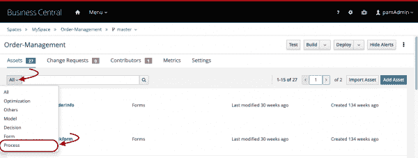](/sites/default/files/pam-hw-5.png)Figure 5: After the import, filter the assets by All, then select Process.

打开订单管理流程。这是决定批准或拒绝订单请求的自动化流程。如图 6 所示，它是使用 BPMN2 标准实现的。

[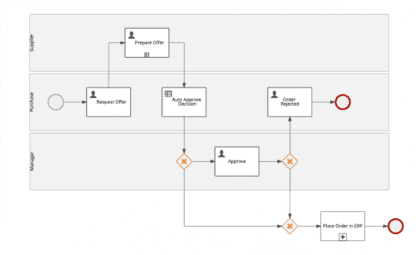](/sites/default/files/pam-hw-6.png)Figure 6: Open the order management process

这个流程的最后一个元素是一个子流程，**在 ERP** 中下订单(参见图 7)。该子流程包括高级 bpmn2 建模概念，如补偿和基于事件的网关。**注意** : RHPAM 支持使用 bpmn2 规范的高级流程建模。

[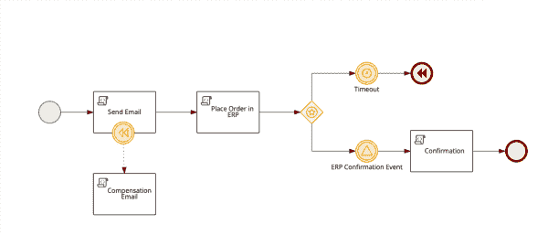](/sites/default/files/pam-hw-7_0.png)Figure 7: Place Order in ERP

请注意，这些流程任务被聚合到三个通道中:经理、采购和供应商。批准决定将基于多个作者做出，但在此过程中，我们有自动化决策的支持。自动决策是在节点 **Auto Approve Decision** 上做出的(参见图 8)，它引用了一个 DMN 模型，该模型也是这个业务项目的一部分。

[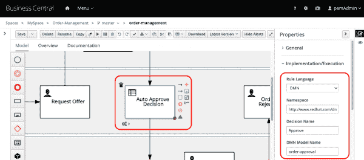](/sites/default/files/pam-hw-8.png)Figure 8: Aggregated process tasks

关闭流程建模器。通过**决策**过滤资产。您应该会看到一个测试场景和一个 DMN 模型(参见图 9)。

[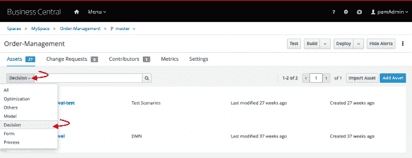](/sites/default/files/pam-hw-9.png)Figure 9: Test Scenario and a DMN model

打开订单批准(参见图 10)。这是一个简单的决策模型，它基于数据输入**订单信息**和**价格容差**业务规则来定义**批准**决策。

[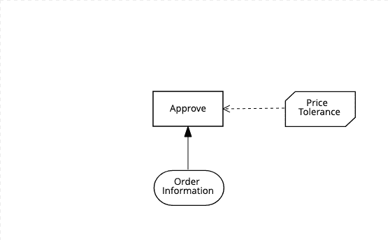](/sites/default/files/pam-hw-10.png)Figure 10: Open the order-approval

关闭决策资产。在您的项目页面中，点击**部署**，如图 11**所示。 **Business Central** 将触发这个 Maven 项目的构建，该项目将被打包在 KJAR(包含资产的部署单元)中，并部署在 **KIE 服务器上。****

**[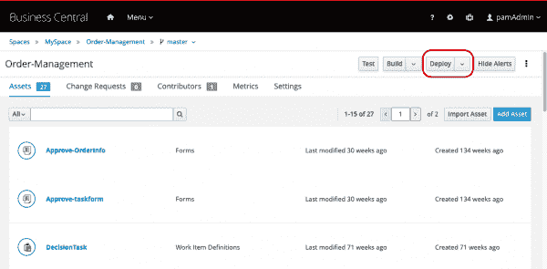](/sites/default/files/pam-hw-11.png)Figure 11: Click Deploy in Business Central

构建和部署完成后，您会看到一条成功部署的消息。点击**查看部署详情**(参见图 12)。

[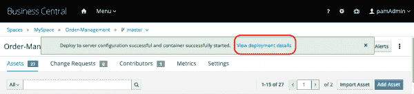](/sites/default/files/pam-hw-12.png)Figure 12: View successful deployment details

该页面将显示一个正在运行的“default-kieserver ”,其中部署了“order-management_1.1-SNAPSHOT”容器。我们的业务项目现在可供客户端应用程序使用！

让我们看看如何使用这个业务应用程序。

### 3.经验

**KIE 服务器**引擎是公开业务项目的服务，也是我们在与客户端应用程序集成时使用的服务。KIE 服务器附带了一个 Swagger UI，允许我们测试引擎的 RESTful 端点并使用部署在其上的规则。

消费我们的业务项目的另一种方式是使用 **Business Central** UI 与引擎进行交互，并测试我们的业务资产。对于这个 Hello World，让我们使用业务中心流程和任务管理功能。

在商务中心，让我们打开顶部栏中的**菜单**，并导航到**流程定义**(参见图 13**)。**

**[](/sites/default/files/pam-hw-13.png)Figure 13: Access Business Central. Open Menu. Navigate to Process Definitions.

有三种不同的过程定义。我们将基于**订单管理**流程启动一个新的流程实例。点击**动作**，选择**开始**(参见图 14)。

[](/sites/default/files/pam-hw-14.png)Figure 14: Filter the actions kebab, and select Start

打开的表单(见图 15)也是我们业务流程的一部分。如果需要，我们可以定制。现在，让我们只填写启动流程实例所需的数据:

*   商品名称:笔记本电脑戴尔 XPS 15
*   紧急程度:中等

选择**提交**。

[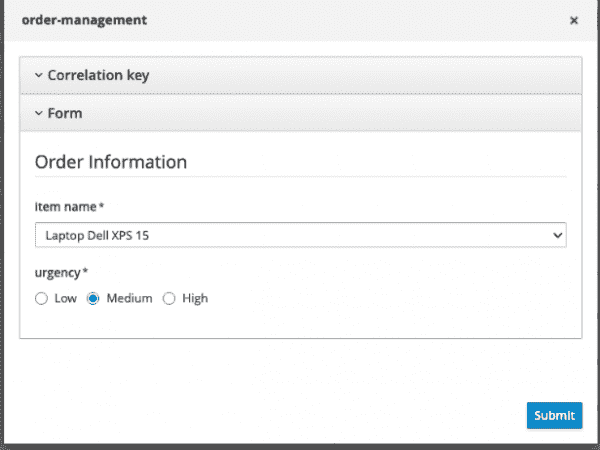](/sites/default/files/pam-hw-15.png)Figure 15: Order management form

一个新的流程实例将在引擎中启动。为了可视化当前状态，点击**图**(见图 16)。

[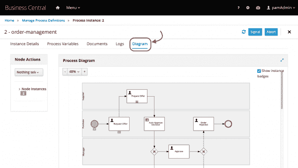](/sites/default/files/pam-hw-16.png)Figure 16: New process instance

现在我们有一个名为**的人工任务请求提供**等待人工干预。让我们来完成这项任务。在**菜单**中，进入**任务收件箱**(见图十七)**。**

[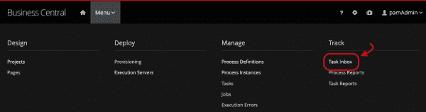](/sites/default/files/pam-hw-17.png)Figure 17: Access Task Inbox.

在任务收件箱中，您应该会看到您有权查看和处理的任务列表。让我们为我们的用户要求**请求提供**任务，并开始处理它。点击**动作**，选择**索赔和工作**(图 18)。

[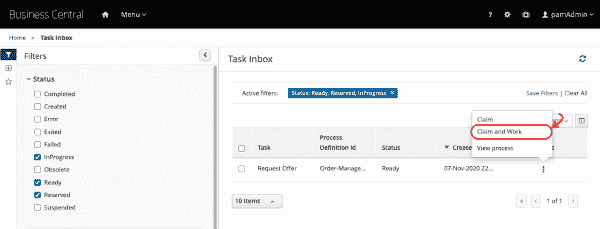](/sites/default/files/pam-hw-18.png)Figure 18: Select Claim and Work

作为知识工作者(负责执行任务的人)，您将看到可用于分析的任务数据。点击**开始**开始工作 **(** 图 19)。

基于这一提议，我们将确定我们的答复。提供以下数据:

*   类别:可选
*   目标价格:250 美元
*   供应商列表:供应商 1

点击**完成**。

[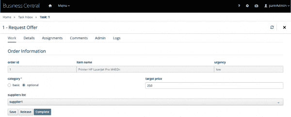](/sites/default/files/pam-hw-19.png)Figure 19\. Input the supplied data

已经为供应商创建了一个新任务。供应商应提供报价。当你还在任务列表上时，申请并完成任务**准备报价(**图 20)。

[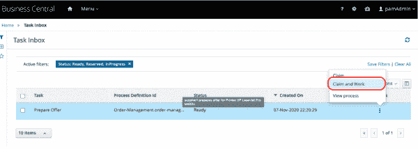](/sites/default/files/pam-hw-20.png)Figure 20\. Claim and work the task

点击**开始**，填写任意日期，将最佳报价填写为 **1000** 。点击**完成(**图 21)。

[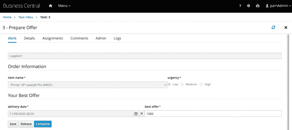](/sites/default/files/pam-hw-21.png)Figure 21\. Prepare offer task board

哦不！自动批准已被采用，我们的请求没有被自动批准。您可以通过可视化流程实例来确认这一点。在烤串上，选择**查看过程**(图 22)。

[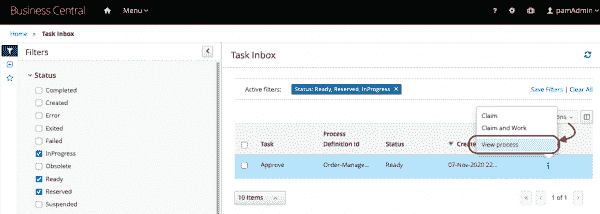](/sites/default/files/pam-hw-22.png)Figure 22\. Select View Process

您将被重定向到流程实例列表。选择流程实例 **id 1** ，然后选择**图(**图 23)。

[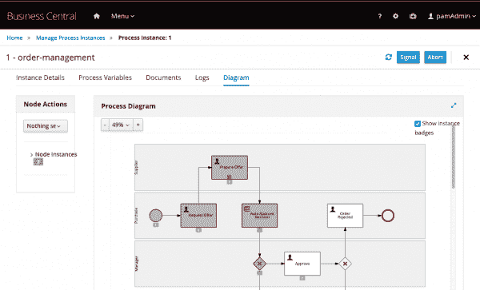](/sites/default/files/pam-hw-23.png)Figure 23\. Select process instance id 1 then choose Diagram

干得好！您已经学习了如何使用 **Business Central** 管理流程和任务。您还知道了如何启动新的流程实例，如何与流程任务交互，以及如何完成它们。

自己完成这个过程怎么样？按照 **Business Central 中的相同想法，**您可以重新提交请求、拒绝订单，并到达该流程实例的末尾。

## 结论

恭喜你！您已经在过程自动化管理器中成功完成了我们的 Hello World。在本指南中，您安装了 RHPAM，直接从 GitHub 导入了一个项目，并检查了一个过程定义模型和一个自动化决策。通过使用 Business Central UI 部署和测试您的服务，您完成了 Hello World。如果你想了解更多关于订单管理的演示，我们建议你看一下[项目的说明](https://github.com/jbossdemocentral/rhpam7-order-management-demo-repo)。

*Last updated: June 17, 2021*****