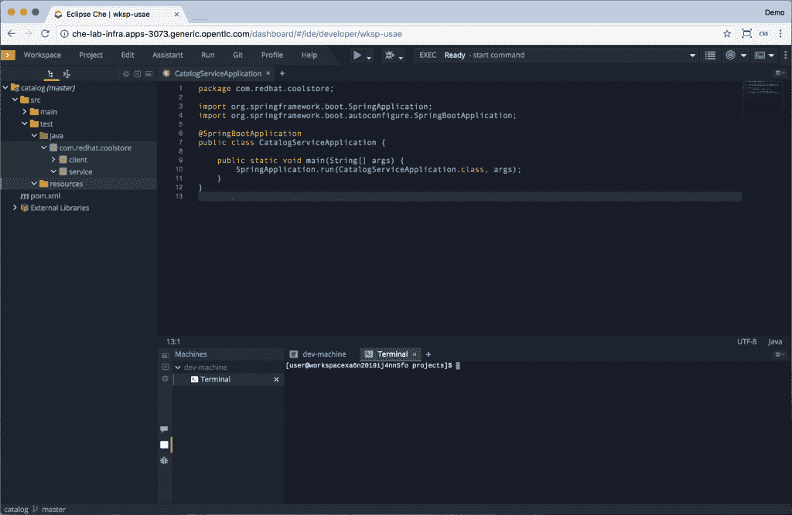
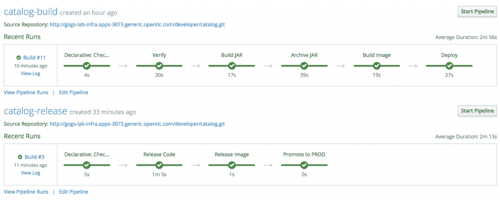
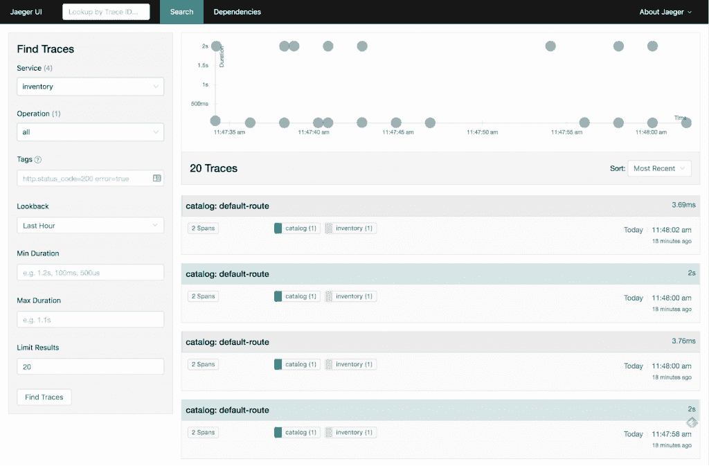
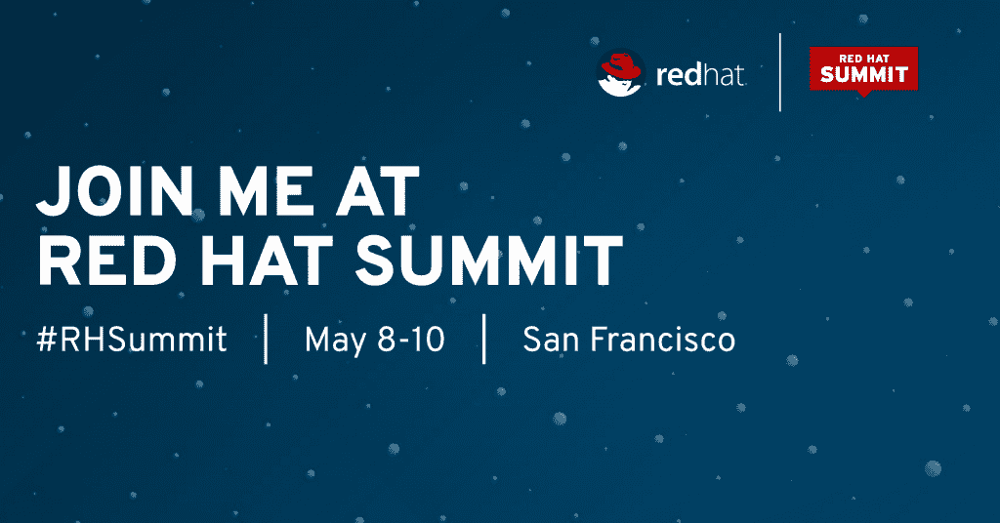

# 红帽峰会聚焦:云原生应用实验室入门

> 原文：<https://developers.redhat.com/blog/2018/04/27/red-hat-summit-spotlight-getting-started-with-cloud-native-apps-lab>

云原生应用程序开发是构建应用程序的新范式，尽管它经常被误认为是微服务，但它远不止于此，不仅包括应用程序架构，还包括构建、部署和管理应用程序的流程。

新应用通常被视为云原生应用的焦点；但是，我们认为现有的和新的应用程序是相似的，如果它们具有云原生应用程序的四个定义特征，则可以纳入云原生实践:

*   **基于服务:**构建模块化的松耦合服务(例如微服务)。
*   **API 驱动:**通过轻量级技术无关的 API 公开服务。
*   **容器:**封装并部署在容器中，作为一个便携式计算单元。
*   **DevOps:** 采用敏捷和 DevOps 原则。

2018 年[红帽峰会](https://www.redhat.com/en/summit/2018)上的[云原生应用实验室](https://agenda.summit.redhat.com/SessionDetail.aspx?id=153550)将于 5 月 8 日至 10 日在三藩市举行，会议议程安排得很满，重点是向与会者介绍构建和操作云原生应用的原则。

本课程由多个动手实验组成，这些实验将教授参与者如何使用 Spring Boot 构建一个微服务应用程序，跨职能团队与为同一微服务应用程序提供其他服务的其他团队一起工作。参与者将通过在实验室中使用基于 web 的 IDE 来体验现代开发工作区的外观。

然后，微服务应用被构建为容器映像，并部署在 [Red Had OpenShift 容器平台](https://www.openshift.com/container-platform/)上。然后，参与者将探索如何在跨环境的服务生命周期中解决配置管理等方面的问题，他们将使用 Jenkins 来构建部署管道，以促进开发和生产环境之间的服务。

云原生应用的一个重要方面是如何管理跨领域的方面，如服务弹性，这在部署了大量服务时尤为重要。 [Istio 服务网格](https://istio.io)提供了一种技术不可知的方式来解决服务的这种复杂性，而不需要用外部库来污染服务代码，它将在本实验中用于在服务调用之间添加断路器。

对云原生应用中的服务的可见性也非常重要，因为随着服务调用链的扩展，故障排除会立即变成一场噩梦，并且了解问题的根本原因变得非常重要。 [Jaeger 分布式跟踪](https://www.jaegertracing.io/)，旨在发现运行时服务之间的依赖关系，并可视化服务之间的交互方式，将在本实验中进行探索。

以下是本课程中您可能会用到的一些实验:

*   使用 Eclipse Che 基于 web 的 IDE 通过 Spring Boot 构建微服务
*   通过管道在 OpenShift 上自动构建和部署微服务
*   通过 Istio 服务网格为微服务增加弹性
*   通过 Jaeger 分布式跟踪了解服务依赖关系

云原生应用入门实验室充满了令人兴奋的 Spring Boot、OpenShift、Istio service mesh 和 Jaeger 分布式跟踪练习，我们迫不及待地想在那里见到您。

将本实验室添加到您的红帽峰会议程:
[https://agenda.summit.redhat.com/SessionDetail.aspx?id=153550](https://agenda.summit.redhat.com/SessionDetail.aspx?id=153550)

*Last updated: September 3, 2019*