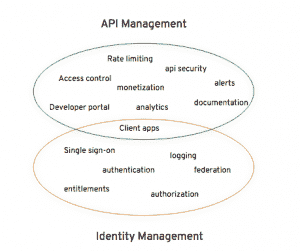
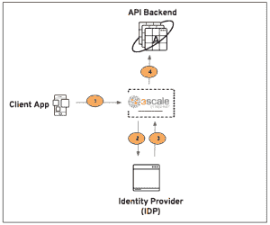

# 3 按 Red Hat API 和身份管理系列进行扩展

> 原文：<https://developers.redhat.com/blog/2018/03/06/redhat-3scale-identity-management>

当今的现代基础架构面临着管理用户对资源的访问的复杂挑战。为了保护系统和数据的完整性，公司已经为其内部系统实施了身份和访问管理(IAM)解决方案。IAM 解决方案解决了三个主要概念:身份、认证和授权。他们的工作是确保只有经过身份验证和授权的用户才能访问资源或信息。市场上的每个 IAM 解决方案都提供了一系列强大的功能，例如:

*   单点登录(SSO)
*   基于策略的集中式身份验证和授权
*   身份联盟

太棒了。！但是这里的挑战是什么？

在过去，这只是一个简单的问题，即哪些用户可以访问哪些系统。如今，在代表用户访问数据和系统的多个设备上运行着多个应用程序。为所有系统提供 API(比如 RESTful 接口)以实现敏捷性和业务流程自动化是一种压力。因此，组织几乎不可能了解哪些应用程序正在访问哪些资源，也不可能提供全面的访问控制。幸运的是，API 管理技术可以提供:

*   安全和认证(API key、OAuth2.0 等。)
*   速率限制和节流策略
*   监控和分析
*   计量和计费(货币化)
*   开发者体验(内容管理系统)
*   更多..

[3scale by Red Hat](https://www.3scale.net/) 是红帽的 API 管理平台。

有些人可能认为 IAM 和 API 管理是不同领域中的不同解决方案。虽然每一个都有独特的用途，但在我看来，客户端应用程序的访问是有重叠的。请参见下图:

市场上的身份提供者(IdP)很多([红帽单点登录](https://access.redhat.com/products/red-hat-single-sign-on)、[伪造者](https://www.forgerock.com/)、[平身份](https://www.pingidentity.com/)、 [Auth0](https://auth0.com/) 、 [Okta、](https://www.okta.com/)等。).挑战在于这些 IDP 和 API 管理解决方案之间的集成。 [3scale by Red Hat，](https://www.3scale.net/)凭借其可插拔和可扩展的架构，可轻松与流行的 IDP 集成。这就是我在 3scale by Red Hat integration 上与几个不同的 IDP 开始这一系列博客文章的动机。

以下几个资源将帮助您更好地理解 OpenID connect (OIDC)和 JSON Web Token (JWT):

*   [OpenID 连接说明](https://connect2id.com/learn/openid-connect)
*   [OpenID 连接概述](https://www.youtube.com/watch?v=Kb56GzQ2pSk)
*   [OpenID 连接核心规范](https://openid.net/specs/openid-connect-core-1_0.html)
*   [RFC 7519: JSON Web 令牌](https://tools.ietf.org/html/rfc7519)

让我们深入研究技术细节。

为了在整个系列中保持一致，我将坚持使用一个用例来了解如何使用 3scale by Red Hat 集成每个 IdP。

**用例**

*   我们称之为 Acme 的公司有一个订阅后端 API 端点，它向客户提供产品的订阅状态。他们希望向客户公开终端，但希望以安全的方式进行。
*   Acme 希望使用现有的身份提供者，并使用颁发的令牌来控制访问。

**详情**
Acme 想要识别使用 OIDC 的用户并生成一个 JWT 令牌:

*   JWT 将用于 API 调用。后端将提取 JWT，提取用户配置文件，提取订阅信息，并发回 API 响应。
*   为了完成握手，我们将使用 OAuth2 隐式授权流。

**架构**

*   **客户端 App** 向红帽 3scale 发送*授权*请求。
*   **3scale** (API 管理器和 API 网关)与 IdP 通信。
*   **IdP** 对用户进行认证和授权。然后，它生成一个 JWT 供 API 后端使用。
*   **API 后端**(资源服务器)提取 JWT 并返回成功响应。

欲了解更多信息，请参阅 Hugo Guerrero 撰写的教程“[如何设置 3scale OpenID Connect (OIDC)与 RH SSO 的集成”](https://developers.redhat.com/blog/2017/11/21/setup-3scale-openid-connect-oidc-integration-rh-sso/)。

红帽单点登录(RHSSO)是经过认证的 OpenID Connect 提供者( [*来源*](http://openid.net/certification/) )。

本系列的下一篇文章将展示如何将 3scale by Red Hat 和 Forgerock 与上述用例集成。

*Last updated: September 3, 2019*