# 使用 Visual Studio 代码进行远程 LLVM 开发

> 原文：<https://developers.redhat.com/blog/2021/04/22/remote-llvm-development-with-visual-studio-code>

过去我用 [Qt Creator IDE](https://www.qt.io/product/development-tools) 来完成我大部分的 [C++](/topics/c) 工作。然后我在 2016 年年中左右加入了红帽，和 [Go](/blog/category/go/) 一起做了三年的项目。我很快意识到我想要类似 Qt Creator 的东西。我是一个普通的 Vim 用户，但只用于纯文本编辑，没有更多的用途。我给了 Vim 一个机会，当我真的在寻找一些开箱即用并且仍然可以定制的东西时。和通常的现代项目一样，我需要做的不仅仅是编辑一个编程领域的文件。输入 [Visual Studio 代码](https://code.visualstudio.com/) ( [VS 代码](/blog/category/vs-code/))。

我不能说 VS 代码是现成的。但是作为一个新手，我想我应该试一试，特别是因为其他人也在使用它。三年后，在 2019 年，我需要改变，并加入了我们的调试器团队，从事 [LLDB](https://lldb.llvm.org/) 的工作，这是一个调试器，是更大的 [LLVM](https://llvm.org/) 项目的一部分。LLVM 还托管着 [Clang](/blog/category/clang-llvm/) ，一个众所周知的类 C 语言编译器前端。

我首先检查 LLVM 代码库——顺便说一下，它非常庞大——并在我的本地机器上编译它，这非常慢。你可以在本文的[中了解我最初加速编译的努力。总而言之:当你想用 LLVM 编码和编译时，笔记本并不理想。编译的速度并不是唯一重要的事情。这是链接，也很容易冻结我的笔记本电脑。也就是说，使用](/blog/2019/05/15/2-tips-to-make-your-c-projects-compile-3-times-faster/) [distcc](https://github.com/distcc/distcc) 或类似工具的分布式编译不能解决这个问题。

我们在 Red Hat 的小组可以访问多伦多的高性能共享机器(例如，56 个内核和 256 GB 内存)。我住在德国，起初我怀疑我是否能在没有太多延迟的情况下成功使用那些机器。Qt Creator 并不是远程编辑文件的真正选择，因为据我所知，它需要运行在应该编译的代码旁边。在给了 Vim 和 [Emacs](https://www.gnu.org/software/emacs/) 另一个远程编码和编译的机会后，我回到 VS Code，发现有一个[远程 SSH 扩展](https://code.visualstudio.com/docs/remote/ssh)。本文一步一步地向您介绍我是如何使用 VS Code 的远程 SSH 扩展来编辑和编译 LLVM 的。

## 先决条件

我的基本系统是运行 [Fedora](https://getfedora.org/) 32 操作系统的笔记本电脑。出于本教程的考虑，我们称远程主机为`remote-host`。如果您想一步一步地遵循教程，您可以将以下内容放入您的`~/.ssh/config`文件中，为您想要的任何主机创建一个别名:

```
Host remote-host
  HostName YOUR_OWN_REMOTE_HOST_GOES_HERE
  User USER_NAME_WITH_WHICH_YOU_LOGIN_TO_YOUR_REMOTE_HOST
```

替换定义中明显的部分。通过将您的 SSH-key 的公共部分复制到远程主机:`ssh-copy-id remote-host`，确保您可以在不输入密码的情况下登录到远程主机[。](https://code.visualstudio.com/docs/remote/troubleshooting#_configuring-key-based-authentication)

再次确认您现在可以使用`ssh remote-host`登录。现在注销。

## 设置 VS 代码

首先，确保你有一份最新的 VS 代码，或者从下载网站下载。一旦安装完毕，你将需要一堆扩展。要安装我认为在构建和编辑 LLVM 时有用的扩展，请在命令行中运行以下代码片段:

```
$ for i in ms-vscode.cmake-tools \
ms-vscode-remote.remote-ssh \
ms-python.python \
ms-vscode.cpptools \
twxs.cmake \
rreverser.llvm \
jakob-erzar.llvm-tablegen \
xaver.clang-format \
pkief.material-icon-theme; do code --install-extension $i; done
```

## 准备远程主机

在我的例子中，远程主机(Fedora 31)和我的笔记本电脑的架构是相同的:x86_64。我不确定是否总是需要这样。我可以确认，代替我的 [Linux](/topics/linux) 笔记本电脑和 Linux 远程主机，我可以使用一台 Mac 笔记本电脑和一台 Linux 远程主机。我相信 Windows 也是如此。

使用以下信息登录远程主机:

```
$ ssh remote-host
```

您的远程主机需要安装构建 LLVM 所需的所有开发工具。

现在让我们决定从哪里下载 LLVM，并用一个环境变量来引用它。在我的例子中，目录是*而不是*T0 】,这样会简化一些:

```
$ export MYHOME=/opt/notnfs/kkleine/ # replace this with ~/
```

导航至`$MYHOME`:

```
$ cd $MYHOME
```

获取 LLVM 源树:

```
$ git clone https://github.com/llvm/llvm-project
```

现在，在源目录中创建一个构建目录:

```
$ mkdir llvm-project/build
```

这个目录使得以后在 VS 代码 IDE 中查找构建文件变得更加简单。

## 启动 VS 代码

当您启动 VS 代码时，它会显示一个如图 1 所示的屏幕。

[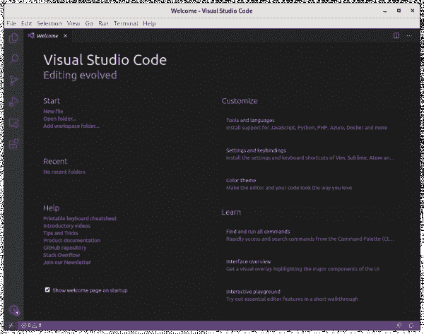](/sites/default/files/blog/2020/10/Screenshot-from-2020-10-14-16-17-47.png)

Figure 1: The VS Code startup screen.

注意屏幕左下角的绿色小图标。点击它并选择 **Remote-SSH:将当前窗口连接到主机...**如图 2 所示。

[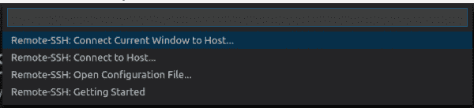](/sites/default/files/blog/2020/10/Screenshot-from-2020-10-14-16-21-00.png)

Figure 2: Select 'Remote-SSH: Connect Current Window to Host...' from the menu.

如果您已经正确配置了您的`~/.ssh/config`，现在您可以从下拉列表中选择`remote-host`。注意，之前的绿色图标现在显示**打开遥控器...**连接成功后变成 **SSH: remote-host** 。

祝贺您:现在您可以使用 VS 代码编辑远程主机上的文件了。要测试这一点，进入**文件— >打开文件...**并从您之前签出的 LLVM 项目中打开主`CMakeLists.txt`文件:`/opt/notnfs/kkleine/llvm-project/llvm/CMakeLists.txt`。

## 远程安装扩展

让我们通过点击扩展符号来看扩展，它是一个正方形网格。注意，侧面板显示了本地安装的扩展，并在 SSH: remote-host 中用 **Install 标记了一些扩展。单击绿色小图标，查看可以安装在远程主机上的所有扩展。一旦完成，点击蓝色的**重新加载所需的**图标，享受远程开发时的所有扩展。**

## 调整设置

我们需要调整一些设置让[和](https://cmake.org/)正常工作。按下 **Ctrl+Shift+P** ，在 Visual Studio 代码中打开命令面板，开始输入`>open remote set`，如图 3 所示。

[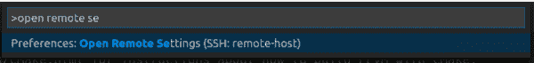](/sites/default/files/blog/2020/10/Screenshot-from-2020-10-15-11-47-03.png)

Figure 3: Autofill in the command palette.

然后，点击**首选项:打开远程设置(SSH:远程主机)**。这应该会在一个新的选项卡中打开一个`settings.json`文件，如图 4 所示。

[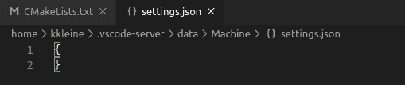](/sites/default/files/blog/2020/10/Screenshot-from-2020-10-15-11-47-21.png)

Figure 4: Open the remote settings file.

这个文件是一个空的 [JSON](https://www.json.org/json-en.html) [设置](https://code.visualstudio.com/docs/getstarted/settings)文件，在我的例子中。如果您已经有了配置，我假设您以前使用过 VS 代码，并且知道如何将我的设置集成到您的设置中。如果您的文件是空的，您可以将设置复制到此处:

```
{
    //--------------------------------------------------------------------------
    //              C++
    //--------------------------------------------------------------------------
    "clang-format.fallbackStyle": "LLVM",
    "clang-format.style": "LLVM",
    "C_Cpp.clang_format_style": "LLVM",
    "C_Cpp.default.cppStandard": "c++14",
    "C_Cpp.default.cStandard": "c11",
    //--------------------------------------------------------------------------
    //              CMake
    //--------------------------------------------------------------------------
    "cmake.generator": "Ninja",
    // Adjust this path to the expansion of $MYHOME/llvm-project/llvm.
    "cmake.sourceDirectory": "/opt/notnfs/kkleine/llvm-project/llvm",
    // Adjust this path to the expansion of $MYHOME/llvm-project/build.
    "cmake.buildDirectory": "/opt/notnfs/kkleine/llvm-project/build",
    "cmake.configureSettings": {
        "LLVM_ENABLE_PROJECTS": ["clang","clang-tools-extra","compiler-rt","lld","mlir"],
        "CMAKE_EXPORT_COMPILE_COMMANDS": 1,
        "BUILD_SHARED_LIBS": "Off",
        "LLVM_BUILD_LLVM_DYLIB": "On",
        "LLVM_LINK_LLVM_DYLIB": "On",
        "CLANG_LINK_CLANG_DYLIB": "On",
        // I only need LLVM Backends to produce X86, decide what you need here!
        "LLVM_TARGETS_TO_BUILD": "X86",
        "LLVM_ENABLE_LDD": "On",
        "LLVM_CCACHE_BUILD": "On",
        "LLVM_CCACHE_MAXSIZE": "20G",
        "LLVM_ENABLE_IDE": "On",
        "LLVM_ENABLE_ASSERTIONS": "On",
        "LLVM_BUILD_EXAMPLES": "On",
        "LLVM_LIT_ARGS": "-v --xunit-xml-output test-results.xml",
        "PYTHON_EXECUTABLE": "/usr/bin/python3",
    },
    //--------------------------------------------------------------------------
    //              Editor
    //--------------------------------------------------------------------------
    "editor.mouseWheelZoom": true,
    "editor.renderIndentGuides": false,
    "editor.rulers": [80],
    "editor.formatOnPaste": false,
    "editor.renderWhitespace": "all",
    //--------------------------------------------------------------------------
    //              Misc
    //--------------------------------------------------------------------------
    "telemetry.enableTelemetry": false,
    "telemetry.enableCrashReporter": false,
    "[cpp]": {
        "editor.defaultFormatter": "xaver.clang-format"
    },
    "workbench.iconTheme": "material-icon-theme",
}
```

我已经在 JSON 文件中添加了最少的个人设置。不要的话可以省略`Editor`和`Misc`部分。完成后，用 **Ctrl+S** 保存文件。

## 使用 CMake 配置 LLVM 项目

点击**文件— >打开文件夹**，输入`$MYHOME/llvm-project`的扩展名(如`~/llvm-project`)，如图 5 所示。

[](/sites/default/files/blog/2020/10/Screenshot-from-2020-10-15-12-34-33.png)

Figure 5: Type in the absolute path to the llvm-project folder.

通过键入 **Ctrl+Shift+P** ，然后键入`>cmake`，再次打开 VS 代码中的命令面板。这将弹出图 6 中的列表，您可以从中选择 **CMake:选择一个套件**。

[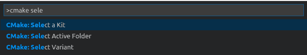](/sites/default/files/blog/2020/10/Screenshot-from-2020-10-15-12-37-29.png)

Figure 6: Select the 'CMake: Select a Kit' option.

在下一个对话框中，如图 7 所示，选择您想要用来编译 LLVM 的编译器，或者如果您没有看到任何选项，选择**【Scan for kits】**。(我选的是 Clang 9.0.1。)

[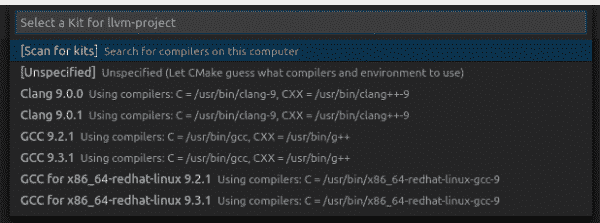](/sites/default/files/blog/2020/10/Screenshot-from-2020-10-15-12-38-07.png)

Figure 7: VS Code presents the available compiler options.

接下来，您需要决定 CMake 将在其中配置您的项目的构建变体。使用 **Ctrl+Shift+P** 并键入`CMake Select Variant`返回命令面板，如图 8 所示。

[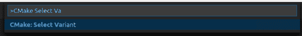](/sites/default/files/blog/2020/10/Screenshot-from-2020-10-15-12-41-04.png)

Figure 8: Select a build variant through 'CMake Select Variant'.

接下来，选择**释放**，如图 9 所示。

[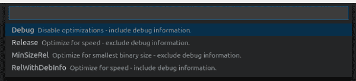](/sites/default/files/blog/2020/10/Screenshot-from-2020-10-15-12-41-12.png)

Figure 9: Choose Release as the build variant.

注意，状态栏现在看起来如图 10 所示。从现在开始，您可以控制您想要从这个栏中构建哪个目标。

[](/sites/default/files/blog/2020/10/Screenshot-from-2020-10-15-12-45-34.png)

Figure 10: The status bar after choosing a build variant.

配置完成后，如果输出窗格显示如下内容，则您已经成功配置了 LLVM:

```
[cmake] -- Performing Test HAVE_POSIX_REGEX -- success
[cmake] -- Performing Test HAVE_STEADY_CLOCK -- success
[cmake] -- Configuring done
[cmake] -- Generating done
[cmake] -- Build files have been written to: /opt/notnfs/kkleine/llvm-project/build
```

**注**:你可以在文章[*Linux 上的 CMake 工具入门*](https://code.visualstudio.com/docs/cpp/cmake-linux) 中阅读更多关于 VS 代码中的 CMake。

## 用 VS 代码首次构建 Clang

让我们做第一个铿锵声。点击状态栏中的**【全部】**，输入`clang`选择`clang Executable`。注意状态栏现在显示的是**【铿锵】**，而不是**【全部】**。

不要害怕点击**【构建】**按钮来构建所选目标。

有趣的是，VS 代码并不关心您是选择 Ninja 还是 Make 来构建您的项目，因为它调用 CMake 来调用底层构建系统:

```
[main] Building folder: llvm-project
[build] Starting build
[proc] Executing command: /usr/bin/cmake --build /opt/notnfs/kkleine/llvm-project/build --config Release --target clang -- -j 58
[build] [58/2573   0% :: 0.383] Building CXX object lib/Support/CMakeFiles/LLVMSupport.dir/ABIBreak.cpp.o
[build] [59/2573   0% :: 0.462] Building CXX object lib/Support/CMakeFiles/LLVMSupport.dir/COM.cpp.o/usr/bin/cmake --build /opt/notnfs/kkleine/llvm-project/build --config Release --target clang -- -j 58
```

## 引入终端

VS 代码有一个终端窗口。可以用 **Ctrl+`** (反斜杠字符)打开。终端如图 11 所示。

[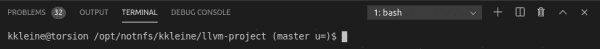](/sites/default/files/blog/2020/10/Screenshot-from-2020-10-15-14-04-23.png)

Figure 11: A command-line interface in the VS Code terminal window.

尝试用下面的代码片段测试您新构建的编译器:

```
$ cd build
$ echo "int main(){return 42;}" | ./bin/clang++ -x c++ -
$ ./a.out ; echo $?
42
```

我通常在终端窗口中运行一些类似于`./bin/llvm-lit -v *sometest*`的命令。终端的一个优点是，你可以在任何文件路径上按下**Ctrl+点击**，在当前 VS 代码窗口的新标签页中打开它们。这使得从终端打开和浏览文件非常方便。

从现在开始，您可以使用 VS 代码的所有优点，比如自动完成、定位声明、在头文件和实现之间切换等等。

## 启动 LLVM-LIT 的配置

要从 VS 代码内部运行`llvm-lit -av *current_file*`，不使用终端，可以用 **Ctrl+Shift+P** 调出命令面板，键入`>launch`打开`launch.json`文件。显示的菜单类似于图 12。

[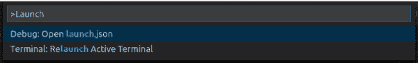](/sites/default/files/blog/2020/10/Screenshot-from-2020-10-15-16-48-52.png)

Figure 12: The menu displayed when you type '>launch' into the command palette.

该文件可以包含多个半通用配置，用于您希望不时启动的程序。下面是将在当前文件上启动`llvm-lit`的配置:

```
{
    "version": "0.2.0",
    "configurations": [
        {
            "name": "llvm-lit current file",
            "type": "python",
            "request": "launch",
            "program": "/opt/notnfs/kkleine/llvm-project/build/bin/llvm-lit",
            "args": ["${fileBasename}"],
            "cwd": "${fileDirname}",
        }
        {
            "name": "llvm-lit all tests in current dir",
            "type": "python",
            "request": "launch",
            "program": "/opt/notnfs/kkleine/llvm-project/build/bin/llvm-lit",
            "args": ["."],
            "cwd": "${fileDirname}",
        }
    ]
}
```

你只需要调整路径指向你的`llvm-lit`二进制文件。

**注意**:如果文件还没有建立，尝试建立`all`目标或者`check-llvm-tools-llvm-lit`目标。

让我们通过按下 **Ctrl+P** 来打开一个特定的 lit 文件。这将打开一个模糊对话框。键入`ast-dump-decl.c`并观察文件在哪里被找到(如图 13 所示)。

[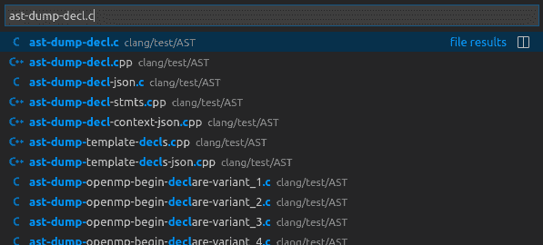](/sites/default/files/blog/2020/10/Screenshot-from-2020-10-15-16-57-32.png)

打开文件后，单击左侧栏中的调试符号打开调试窗格。此时，我们对传统意义上的调试不感兴趣；我们只是想推出`llvm-lit`。单击屏幕顶部启动目标名称旁边的小播放按钮(三角形图标)。在这种情况下，启动目标是 **llvm-lit 当前文件**。终端将打开并显示如下结果:

```
$ cd /opt/notnfs/kkleine/llvm-project/clang/test/AST ; env /usr/bin/python /home/kkleine/.vscode-server/extensions/ms-python.python-2020.6.91350/pythonFiles/lib/python/debugpy/launcher 44349 -- /opt/notnfs/kkleine/llvm-project/build/bin/llvm-lit ast-dump-decl.c
llvm-lit: /opt/notnfs/kkleine/llvm-project/build/bin/../../llvm/utils/lit/lit/llvm/config.py:347: note: using clang: /opt/notnfs/kkleine/llvm-project/build/bin/clang
-- Testing: 1 tests, 1 workers --
PASS: Clang :: AST/ast-dump-decl.c (1 of 1)

Testing Time: 1.90s
  Passed: 1
```

通过选择另一个启动目标，在与当前测试文件相同的目录下运行所有的测试，这个目标叫做`llvm-lit all tests in current dir`。

## 结论

我希望您喜欢阅读这篇文章——快乐编码！

*Last updated: October 14, 2022*