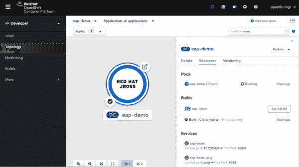

# Red Hat JBoss Enterprise Application Platform 7.4 Beta 中的安全性和管理改进

> 原文：<https://developers.redhat.com/blog/2021/03/30/security-and-management-improvements-in-red-hat-jboss-enterprise-application-platform-7-4-beta>

[红帽 JBoss 企业应用平台 7.4](/products/eap/overview) 测试版现已推出。此版本是为 2021 年晚些时候的正式发布(GA)做准备，包含许多新功能和增强功能。本文总结了最重要的改进，并举例说明了开始使用 JBoss EAP 的简单方法。

## 怎么样

JBoss EAP 7.4 Beta 继续了企业应用程序平台的发展及其对 Java 和 Jakarta EE 平台的支持。7.4 版本是 JBoss Enterprise Application Platform 7.x 系列的一部分，继续向后兼容早期的 7 . x 版本，并在一系列操作系统、硬件平台和 [Red Hat OpenShift](/products/openshift/overview) 上受到支持。JBoss EAP 建立在上游 [Wildfly](https://www.wildfly.org/) 项目的基础上，为企业客户提供了一个可靠、灵活、高性能的平台，在这个平台上可以部署关键任务的 Java 应用程序。

JBoss EAP 7.4 Beta 包括安全性、服务器管理、开发人员特性等方面的新增强。

### 安全性

这些新特性使得管理对实例的访问以及将应用程序与开源生态系统的其他部分相集成变得更加容易。

*   [Elytron](/blog/2018/04/20/elytron-new-security-framework-wildfly-jboss-eap/) 可以在其他子系统中自动更新凭证。`credential-reference`属性自动选择并传播新的凭证。
*   在 Java 11 上支持 TLS 1.3，尽管默认情况下是禁用的。
*   您可以使用您的 SSH 凭证连接到远程 Git 存储库，以管理服务器配置、属性文件和部署。这使得在 DevOps 友好的源存储库中进行简单的配置变更管理成为可能。以下视频演示了这一新功能:

    [https://www.youtube.com/embed/_MlgBxAXFIk?autoplay=0&start=0&rel=0](https://www.youtube.com/embed/_MlgBxAXFIk?autoplay=0&start=0&rel=0)

*   为了测试和训练，平台自动为[under flow](https://undertow.io/)HTTP 侦听器生成自签名证书。这个特性故意避开了良好的安全实践，因此不应该在生产中使用。
*   分布式安全领域支持跨领域共享身份。
*   RESTEasy 客户端与 Elytron 集成，使这些客户端能够访问凭证和 SSL 配置。

此外，JBoss EAP 7.4 测试版中提供了许多重要的 CVE 安全修补程序，它们也将成为正式发布的一部分。完整列表请参考[发行说明](https://access.redhat.com/documentation/en-us/red_hat_jboss_enterprise_application_platform/7.4-beta/html/7.4.0_beta_release_notes/)。

### 服务器管理

这些新特性有助于减少错误，并为您提供有关配置和正在运行的实例的更多信息。

*   全局目录使得分发共享库更加容易，节省了时间，减少了库更改后的工作量。
*   只读配置目录减少了配置漂移，并且与不可变的部署更加兼容，比如在 OpenShift 上。
*   维护托管执行器服务的运行时统计信息，报告活动线程、已完成任务、挂起线程、可使用的最大线程数等等。

### 开发者功能

这些新特性为应用程序增加了有价值的功能。

*   EJB 有几个增强，包括超时配置和 HTTP 上的自动 bean 发现。
*   活动的 MQ 主题可以暂时暂停。

### 支持的平台

一如既往，支持的平台列表在不断发展。在 7.4 版中，由于维护成本高、社区兴趣低以及存在更好的替代方案，几个平台和功能已被弃用。有关新的、已更改的或已弃用的平台和功能的完整列表，请参考[发行说明](https://access.redhat.com/documentation/en-us/red_hat_jboss_enterprise_application_platform/7.4-beta/html/7.4.0_beta_release_notes/)。

## 测试一个示例应用程序

在本节中，我们将通过[open shift Source-to-Image(S2I)images](https://docs.openshift.com/container-platform/4.7/openshift_images/create-images.html)部署 JBoss EAP。要运行这个示例，您需要登录到一个可以访问`registry.redhat.io`的 OpenShift 4.x 集群。您还必须能够使用`oc`命令行。请遵循以下步骤:

1.  创建一个新项目来存放应用程序:

    ```
    $ oc new-project eap-demo

    ```

2.  在 OpenJDK 11 上导入 JBoss EAP 7.4 Beta 的 ImageStream 定义(这需要`cluster-admin`权限):

    ```
    $ oc replace --force -n openshift -f https://raw.githubusercontent.com/jboss-container-images/jboss-eap-openshift-templates/eap74-beta/eap74-beta-openjdk11-image-stream.json

    ```

3.  导入定义应用程序部署方式的模板(这需要集群管理权限):

    ```
    $ oc replace --force -n openshift -f https://raw.githubusercontent.com/jboss-container-images/jboss-eap-openshift-templates/eap74-beta/templates/eap74-beta-basic-s2i.json

    ```

4.  从模板创建应用:

    ```
    $ oc new-app --template=eap74-beta-basic-s2i -p APPLICATION_NAME=eap-demo \
    -p EAP_IMAGE_NAME=jboss-eap74-beta-openjdk11-openshift:7.4.0.Beta \
    -p EAP_RUNTIME_IMAGE_NAME=jboss-eap74-beta-openjdk11-runtime-openshift:7.4.0.Beta \
    -p SOURCE_REPOSITORY_URL=https://github.com/jboss-developer/jboss-eap-quickstarts \
    -p SOURCE_REPOSITORY_REF=7.4.x \
    -p CONTEXT_DIR="helloworld-rs" \
    -l app.openshift.io/runtime=jboss

    ```

5.  将连续运行两个版本来构建应用程序。您可以通过

    ```
    $ oc logs -f bc/eap-demo-build-artifacts && oc logs -f bc/eap-demo
    ```

    检查构建的状态
6.  After both builds complete, watch the rollout with:

    ```
    $ oc rollout status -w dc/eap-demo

    ```

    构建和部署将需要一些时间来完成。

7.  一旦构建并部署了应用程序，您将能够在 OpenShift 控制台的拓扑视图中看到它，如图 1 所示。[](/sites/default/files/blog/2020/06/Screen-Shot-2020-06-16-at-10.25.14-AM-e1616785022459.png)open shift 拓扑视图与 JBoss EAP 应用

    图 1: OpenShift 拓扑视图与 JBoss 企业应用平台应用

8.  通过单击图标右上角的小箭头来访问示例应用程序。这将显示示例 RESTful 应用程序并确认成功部署。恭喜你！

## JBoss 企业应用平台资源

你可以找到[JBoss Enterprise Application Platform 7.4 Beta 文档](https://access.redhat.com/documentation/en-us/red_hat_jboss_enterprise_application_platform/7.4-beta/)，包括发行说明、[入门指南](https://access.redhat.com/documentation/en-us/red_hat_jboss_enterprise_application_platform/7.4-beta/html/getting_started_guide/)以及[docs.redhat.com](https://access.redhat.com/documentation/en-us/red_hat_jboss_enterprise_application_platform/7.4-beta/)上的其他几个指南。
有关 JBoss Enterprise Application Platform 7.4 Beta 开发流程的信息，请访问:

*   [红帽 JBoss 企业应用平台 7.4 Beta 发行说明](https://access.redhat.com/documentation/en-us/red_hat_jboss_enterprise_application_platform/7.4-beta/html/7.4.0_beta_release_notes/)
*   [JBoss EAP 生命周期注释](https://access.redhat.com/support/policy/updates/jboss_notes#p_eap)

*Last updated: October 7, 2022*