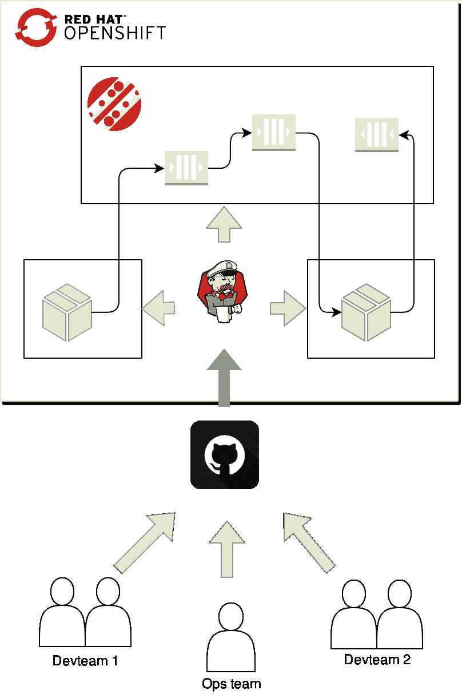
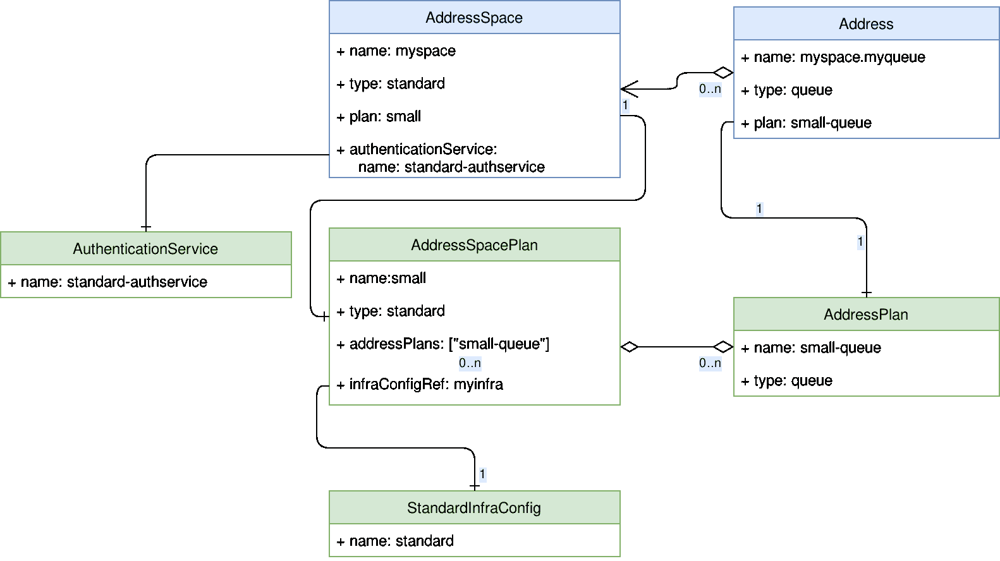

# 红帽 AMQ 在线和 GitOps 的自助信息服务

> 原文：<https://developers.redhat.com/blog/2019/05/17/self-service-messaging-with-red-hat-amq-online-and-gitops>

本文探讨了[红帽 AMQ 在线 1.1](https://access.redhat.com/documentation/en-us/red_hat_amq/7.2/html/amq_online_1.1_on_openshift_container_platform_release_notes/index) 的服务模型，以及它如何映射到您组织中不同团队的 GitOps 工作流。有关 AMQ 在线 1.1 新功能的更多信息，请参见[发行说明。](https://access.redhat.com/documentation/en-us/red_hat_amq/7.2/html/amq_online_1.1_on_openshift_container_platform_release_notes/index)

AMQ 在线是运行在[红帽 OpenShift](https://developers.redhat.com/openshift/) 上的有状态**消息服务**的运营商。AMQ 在线是围绕这样一个原则建立的，即运营信息服务的责任与使用信息服务的租户是分开的。中的运营团队可以管理消息传递基础架构，而开发团队以自助服务的方式提供消息传递，就像他们使用公共云服务一样。

GitOps 是一种进行连续交付(CD)的方法，其中应用程序的源代码和所有配置都存储在 Git 中。对生产环境的更改包括创建对 Git 存储库的拉/更改请求。一旦“拉”请求(PR)已经过测试和审查，就可以将其合并。当合并时，会触发一个 CD 作业，将 Git 存储库的当前状态应用到系统中。有这样的变体，你运行 A/B 测试等等；天空是极限。

声明性 GitOps 工作流非常符合 [Red Hat OpenShift](https://developers.redhat.com/openshift/) 的声明性本质。您可以将 OpenShift 配置存储在 Git 中，并触发一个进程来将配置应用到 OpenShift 集群。如果您将您的应用程序代码与 OpenShift 配置存储在一起，您将使开发团队能够完全控制他们的应用程序部署。有了 AMQ 在线，运营和开发团队都可以使用 GitOps 以声明的方式管理配置。

让我们假设您的组织中有一个团队在 OpenShift 上管理 Red Hat AMQ 在线，并且您有两个独立的开发团队，他们都希望在他们的应用程序中使用消息传递。下图描述了该流程:



运营团队将在线管理 AMQ，并将他们想要支持的所需配置提交给 Git。然后，CI 流程会将 AMQ 在线配置应用到集群。

独立于操作团队，开发团队提交他们的应用程序代码以及消息资源清单(例如， *AddressSpace* 、 *Address* 和*messaging user*；我们将回到这些是什么)。CI 流程构建应用程序，并应用应用程序和消息传递资源清单。

## 运营团队

在 Git 中管理一个 AMQ 在线安装就像打开[发布包](https://access.redhat.com/node/4098741/423/0/13780061)并提交用于特定安装的部分一样简单。此外，还可以创建所需的消息传递配置和可用计划。此配置包含以下资源类型的实例:

*   `AuthenticationService` —描述用于认证消息客户端的认证服务实例。
*   `AddressSpacePlan`—描述使用此计划的地址空间可用的消息资源。
*   `AddressPlan` —描述使用此计划的特定地址所消耗的消息资源。
*   `StandardInfraConfig` —描述标准地址空间类型的 AMQ 互连和 AMQ 代理配置。
*   `BrokeredInfraConfig` —描述代理地址空间类型的 AMQ 代理配置。

创建时，这些资源定义了可供消息传递租户使用的配置。下图描述了所有这些实体之间的关系:



绿色实体由运营团队管理，而蓝色实体由开发团队创建。

关于在线配置 AMQ 的更多信息，参见[在线配置 AMQ](https://access.redhat.com/documentation/en-us/red_hat_amq/7.2/html/installing_and_managing_amq_online_on_openshift_container_platform/configuring-messaging#con-external-authentication-service-api-messaging)。

在本文中，我们将创建一个简单的配置来满足我们开发团队的需求。

### 认证服务

身份验证服务用于对使用 SASL 的消息客户端进行身份验证和授权。AMQ 在线支持三种类型的身份验证服务，支持不同的 SASL 机制:

*   `none` —支持任何机制，但将授予所有客户端完全访问权限。
*   `standard` —支持 PLAIN、SCRAMSHA1、SCRAMSHA256 和 SCRAMSHA512 机制，以及使用 OpenShift 服务帐户令牌。
*   `external` —在您自己的身份管理系统上实施您自己的认证服务桥。有关外部认证服务的更多信息，请参见[外部认证服务 API](https://access.redhat.com/documentation/en-us/red_hat_amq/7.2/html/installing_and_managing_amq_online_on_openshift_container_platform/configuring-messaging#con-external-authentication-service-api-messaging) 。

`standard`认证服务将允许开发团队为他们的地址空间应用认证和授权策略:

```
apiVersion: admin.enmasse.io/v1beta1
kind: AuthenticationService
metadata:
  name: standard-authservice
spec:
  type: standard
```

### 基础设施配置

可以在基础架构配置中指定配置，例如内存、存储、访问策略以及与 AMQ 互连和 AMQ 代理相关的其他设置。

`StandardInfraConfig`资源类型用于定义服务于`standard`地址空间类型的基础设施的配置:

```
apiVersion: admin.enmasse.io/v1beta1
kind: StandardInfraConfig
metadata:
  name: standard
spec:
  router:
    minReplicas: 2
  broker:
    addressFullPolicy: FAIL
    resources:
      memory: 2Gi
```

上述配置将确保至少运行两个 AMQ 互连实例，并且代理将使用 2 GB 内存。将为所有未设置的设置提供默认值。一旦开发团队创建了`queue`地址类型的地址，就会按需创建代理。

#### 计划

计划控制开发团队消耗多少资源。诸如“永远不要启动两个以上的代理”和“允许最多 1000 个地址”这样的要求可以使用计划来实现。计划分为两个层次，地址空间和地址。

#### 地址空间规划

地址空间规划配置地址空间可能使用的最大资源量:

```
apiVersion: admin.enmasse.io/v1beta2
kind: AddressSpacePlan
metadata:
  name: small
spec:
  addressSpaceType: standard
  infraConfigRef: standard
  addressPlans:
  - small-queue
  resourceLimits:
    router: 2.0
    broker: 2.0
    aggregate: 4.0
```

上述计划允许开发团队地址空间使用最多两个 AMQ 互连和两个 AMQ 代理实例，并且只能使用`small-queue`地址计划。

#### 地址计划

地址规划配置地址在互连和代理实例上使用的资源量。AMQ 在线也用它来决定是否需要另一个经纪人:

```
apiVersion: admin.enmasse.io/v1beta2
kind: AddressPlan
metadata:
  name: small-queue
spec:
  addressType: queue
  resources:
    router: 0.0001
    broker: 0.002
```

有了这个计划，开发者最多可以创造`2.0 / 0.002 = 1000 addresses`。当创建第 501 个地址时，将创建另一个经纪人(`0.002 * 501 = 1.002 => 2 brokers`)。当达到极限时，系统将使用两个代理，每个代理将分配 500 个地址。

### 开发团队

开发团队可以使用与操作团队相同的工作流，但是他们不需要关心底层的消息传递基础设施。所有底层组件，如 AMQ 互连和 AMQ 代理，都隐藏在地址空间抽象之后。

#### 应用

现在让我们创建一个简单的消息应用程序。编写消息客户端可能是一项具有挑战性的任务，因为它本质上是异步的。vertx-amqp-client 允许你编写简单的反应式 AMQP 1.0 客户端。以下示例显示了应用程序如何从环境中获取其所有配置:

```
Vertx vertx = Vertx.vertx();
// Use OpenShift service account to authenticate client
AmqpClientOptions options = new AmqpClientOptions()
  .setSsl(true)
  .setPemKeyCertOptions(new PemKeyCertOptions()
  .addCertPath(""/var/run/secrets/kubernetes.io/serviceaccount/ca.crt"))
  .setHost(System.getenv("MESSAGING_HOST"))
  .setPort(Integer.parseInt(System.getenv("MESSAGING_PORT")))
  .setUsername("@@serviceaccount@@")
  .setPassword(new String(Files.readAllBytes(Paths.get("/var/run/secrets/kubernetes.io/serviceaccount/token")), StandardCharsets.UTF_8));

AmqpClient client = AmqpClient.create(vertx, options);
// Initiate the connection
client.connect(ar -> {
  if (ar.succeeded()) {
    AmqpConnection connection = ar.result();
    connection.createSender("confirmations", done -> {
      if (done.succeeded()) {
        AmqpSender sender = done.result();
        connection.createReceiver("orders"), order -> {
          // TODO: Process order
          AmqpMessage confirmation = AmqpMessage.create().withBody("Confirmed!").build();
          sender.send(confirmation);
        }, rdone -> {
          if (rdone.succeeded()) {
            startPromise.complete();
          } else {
            startPromise.fail(rdone.cause());
          }
        });
      } else {
        startPromise.fail(done.cause());
      }
    });
  } else {
    startPromise.fail(ar.cause());
  }
});
```

关于完整的示例客户端，请参见[示例客户端。](https://github.com/EnMasseProject/enmasse-example-clients)

#### 信息资源

一旦编写了应用程序，就需要对使用集群上可用的消息传递资源进行一些配置。

#### 地址空间

AMQ 在线地址空间是一组共享连接端点以及身份验证和授权策略的地址。创建地址空间时，可以配置如何公开消息传递端点:

```
apiVersion: enmasse.io/v1beta1
kind: AddressSpace
metadata:
  name: app
  namespace: team1
spec:
  type: standard
  plan: small
  endpoints:
  - name: messaging
    service: messaging
    cert:
      provider: openshift
    exports:
    - name: messaging-config
      kind: configmap
```

有关地址空间的更多信息，请参见[地址空间文档](https://access.redhat.com/documentation/en-us/red_hat_amq/7.2/html/using_amq_online_on_openshift_container_platform/managing-address-spaces-messaging#con-address-space-messaging)。

#### 地址

从一个地址发送和接收消息。地址具有决定其语义的类型和决定为该地址保留的资源量的计划。地址可以这样定义:

```
apiVersion: enmasse.io/v1beta1
kind: Address
metadata:
  name: app.orders
  namespace: team1
spec:
  address: orders
  type: queue
  plan: small-queue
```

#### 认证和授权

为了确保只有受信任的应用程序能够向您的地址发送和接收消息，必须创建一个消息用户。对于在集群上运行的应用程序，您可以使用 OpenShift 服务帐户对客户端进行身份验证。serviceaccount 用户可以这样定义:

```
apiVersion: user.enmasse.io/v1beta1
kind: MessagingUser
metadata:
  name: myspace.app
  namespace: team1
spec:
  username: system:serviceaccount:team1:default
  authentication:
    type: serviceaccount
  authorization:
  - operations: ["send", "recv"]
    addresses: ["orders"]
```

有了以上三个资源，您就有了应用程序使用消息服务所需的基础。

#### 发现端点

但是您的应用程序如何知道其地址空间的端点呢？您可能已经注意到地址空间定义中的*导出*字段。导出是指示 AMQ 在线您想要在您的命名空间中创建带有主机名、端口和 CA 证书的配置映射的一种方式。要允许 AMQ 在线创建该资源，我们还需要为其定义一个角色和角色绑定:

```
---
apiVersion: rbac.authorization.k8s.io/v1
kind: Role
metadata:
  name: messaging-config
  namespace: team1
spec:
  rules:
  - apiGroups: [ "" ]
    resources: [ "configmaps" ]
    verbs: [ "create" ]
  - apiGroups: [ "" ]
    resources: [ "configmaps" ]
    resourceNames: [ "messaging-config" ]
    verbs: [ "get", "update", "patch" ]
---
apiVersion: rbac.authorization.k8s.io/v1
kind: RoleBinding
metadata:
  name: messaging-config
  namespace: team1
roleRef:
  apiGroup: rbac.authorization.k8s.io
  kind: Role
  name: messaging-config
subjects:
- kind: ServiceAccount
  name: address-space-controller
  namespace: amq-online-infra
```

### 应用程序中的布线配置

消息传递配置就绪后，我们可以为应用程序编写部署清单了:

```
apiVersion: apps/v1
kind: Deployment
metadata:
  name: myapp
  labels:
    app: myapp
spec:
  replicas: 1
  template:
    metadata:
      matchLabels:
        application: demo
    spec:
      containers:
      - name: app
        image: myapp:latest
        env:
        - name: MESSAGING_HOST
          valueFrom:
            configMapKeyRef:
              name: messaging-config
              key: service.host
        - name: MESSAGING_PORT
          valueFrom:
            configMapKeyRef:
              name: messaging-config
              key: service.port.amqps
```

如您所见，configmap 的值作为环境变量被映射到我们的应用程序。

## 摘要

我们已经看到了一个操作团队和一组开发团队如何管理作为 Red Hat OpenShift 清单的消息传递。这允许您的整个组织在使用 OpenShift 上的消息传递部署应用程序时遵循 GitOps 模型。

*Last updated: September 3, 2019*