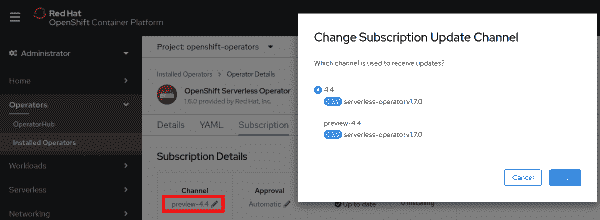
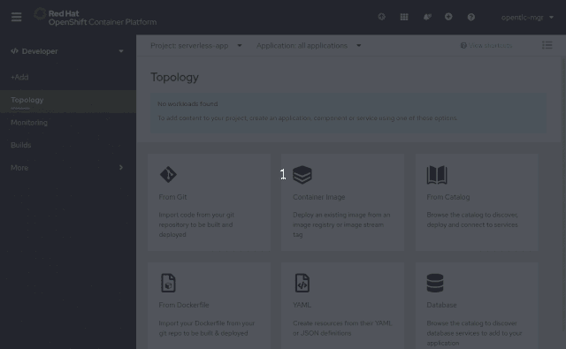
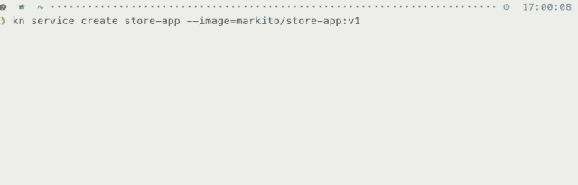
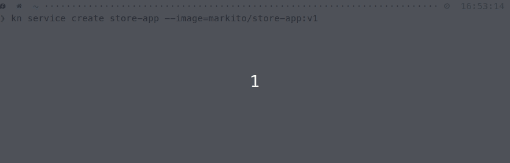
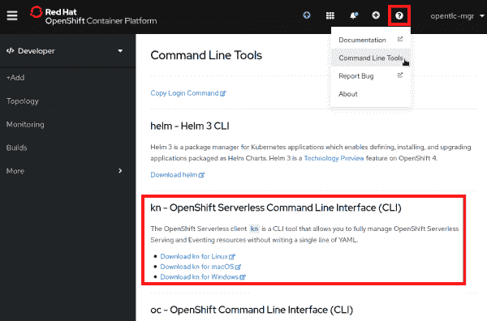
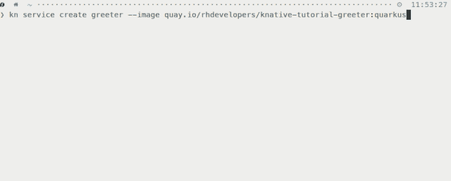
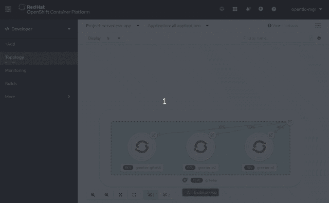
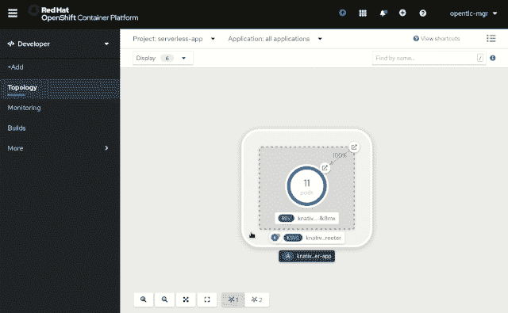
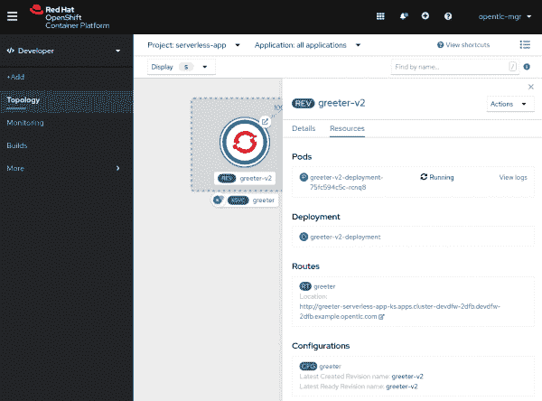

# OpenShift 无服务器 GA 使无服务器应用更快更简单

> 原文：<https://developers.redhat.com/blog/2020/04/30/serverless-applications-made-faster-and-simpler-with-openshift-serverless-ga>

Red Hat OpenShift Serverless 为微服务、容器和兼容的功能即服务(FaaS)实现提供了 Kubernetes-native、事件驱动的原语。OpenShft Serverless 提供开箱即用的流量路由和安全功能。该产品结合了红帽运营商、 [Knative](https://knative.dev/) 和[红帽 OpenShift](https://developers.redhat.com/openshift/) 。结合使用这些工具，无状态和无服务器工作负载可以在私有、公共、混合或多云环境中的 OpenShift 部署上运行，并实现自动化操作。

[OpenShift 无服务器](https://developers.redhat.com/topics/serverless-architecture/)现已全面上市。它使开发人员能够完全专注于构建下一代应用程序，为编写和部署业务差异化应用程序提供广泛的语言、框架、开发环境和其他工具选择。

Red Hat OpenShift 无服务器的主要功能包括:

*   为无服务器应用程序提供广泛的编程语言和运行时选择，让开发人员使用首选工具。
*   基于请求和事件自动扩展和缩减，这有助于根据当前需求而非传统需求来转移资源消耗。
*   与 OpenShift Pipelines 完全集成，这是一种 Kubernetes 风格的持续集成(CI)和持续交付(CD)解决方案，使用 Tekton 构建模块。
*   基于 Red Hat 运营商的基础，让管理员更安全地管理和更新大规模运行的实例，并为应用程序的生命周期提供类似云服务的体验。
*   持续跟踪社区发布节奏**、**，包括 Knative 0.13 服务、事件和`kn`—官方 Knative CLI。正如我们在 Red Hat 作为产品发布的任何东西一样，这意味着我们已经在各种不同的平台和配置 OpenShift 运行上验证了这些组件。

我们还与无服务器领域的几个合作伙伴进行了合作，并与微软围绕 Azure Functions 和 [KEDA](https://keda.sh/) 进行了持续的合作，我们应该会在不久的将来发布一篇博客文章，介绍更多细节。 [TriggerMesh](https://triggermesh.com/) 拥有 OpenShift 的认证运营商，最近[Serverless.com](http://serverless.com/)也决定与我们合作，使[无服务器框架](https://github.com/serverless-components/express-knative)能够与 OpenShift 无服务器和 Knative 一起工作。这些合作伙伴关系展示了无服务器领域是如何逐渐成熟的，以及一个蓬勃发展的生态系统。

虽然新安装应该获得普遍可用的版本，但旧安装可以顺利升级。使用技术预览版的 OpenShift Serverless 现有部署的管理员需要重新配置 OLM 订阅更新通道来接收更新，如图 1 所示。

Figure 1: Update the subscription channel.">

应该更新订阅更新通道以匹配 4.4 或 4.3 的 OpenShift 容器平台版本。

## 作为一等公民的服务

OpenShift 4.4 通过为您提供一种在 OpenShift Web 控制台的开发人员视角内部署 Knative 服务的简化方法，使使用 OpenShift Serverless 部署应用程序变得前所未有的简单。

现在，当向项目中添加新应用程序时，您可以选择一个 Knative Service 资源类型，立即允许任何应用程序受益于 OpenShift Serverless 的强大功能——包括在空闲时扩展到零的能力，如图 2 所示。

Figure 2: Deploying a Knative  ServiceFigure 2: Choose a Knative Service resource type.">

## Kourier 简化的安装体验

正如在 *[宣布 OpenShift 无服务器 1.5.0 技术预览——先睹为快我们的 GA](https://www.openshift.com/blog/announcing-openshift-serverless-1-5-0-tech-preview-a-sneak-peek-of-our-ga)* 中提到的，OpenShift 无服务器的最新版本使用 [Kourier](https://github.com/knative/net-kourier) 。通过使用 Kourier，我们可以将在 OpenShift 中安装无服务器的需求列表缩小到比我们的技术预览版还要小。这个因素允许更低的资源消耗和更快的运行应用程序冷启动。我们还避免影响运行在同一命名空间上的非无服务器工作负载。

总的来说，这些改进与我们在 OpenShift 4.3.5 中实现的修复相结合，将从预构建容器创建应用程序的时间加快了 40–50%，具体取决于容器映像大小。

图 3 显示了使用 Kourier 之前的结果。

Figure 3: Serverless Deployments before KourierFigure 3: Create time before Kourier.">

图 4 显示了添加 Kourier 后的创建时间:

Figure 4: Serverless Deployments after KourierFigure 4: Create time after Kourier.">

## 自动 TLS/SSL

OpenShift Serverless 现在允许为 Knative 服务的给定路由自动创建和部署 TLS/SSL。这意味着您可以继续专注于开发您的应用程序，而不是运行和管理它。因此，无服务器可以处理管理部署的复杂性，同时仍然保持开发人员对 Red Hat OpenShift 的期望。

## OpenShift 无服务器命令行界面(CLI)

OpenShift 无服务器命令行界面(CLI) `kn`现在可以通过 OpenShift 控制台的命令行工具部分获得，如图 5 所示。

Figure 5: kn - OpenShift Serverless Command Line Interface downloadFigure 5: Download the OpenShift Serverless command-line interface.">

当使用此界面下载无服务器 CLI 时，企业客户可以访问经过 Red Hat 认证的版本`kn`。MacOS、Windows 或 Linux 用户可以更加放心，因为已经对该分布式 CLI 进行了恶意组件检查。

在图 6 中，我们使用`kn`在单个命令中部署服务，在 OpenShift 上实例化我们的应用程序，几秒钟内就可以通过 URL 访问它。

Figure 6: Using the kn CLI clientFigure 6: Using the `kn` CLI.">

该工具允许您完全管理无服务器服务和事件资源，而无需编辑或查看任何 YAML 配置。

## 开发者拓扑增强

让我们来看看拓扑视图的增强，它使管理 OpenShift Knative 服务变得更加容易。

### 以服务为中心的虚拟化

Knative 服务被表示为一个矩形，包含了**拓扑**视图中的所有修订，如图 7 所示。

Figure 7: Knative Services in TopologyFigure 7: Knative Services in the Topology view.">

您可以快速查看 Knative 服务的当前流量分配百分比。还可以将 Knative 服务分组到一个应用程序组中，这允许对给定分组中发生的事情进行快速和有组织的可视化管理。

### 折叠 OpenShift Knative 服务

说到应用程序分组，OpenShift 4.4 带来了在应用程序组内折叠 Knative 服务的能力。当在一个项目中部署更复杂的应用程序时，这使得管理和查看您的服务变得更加容易。

### 服务详情

OpenShift 4.4 还为 Knative 服务提供了改进的侧面板内容。侧面板中的 **Resources** 选项卡现在显示了组成服务的组件，具体来说就是:Pods、Revisions 和 Routes。您还可以使用这些组件快速方便地访问各个 pod 日志。

该视图显示流量分布百分比，甚至允许快速配置更改。因此，通过针对给定版本运行的 pod 数量，您可以很快注意到给定 Knative 服务的实时流量分布，如图 8 所示。

Figure 8: Resources associated with Knative ServicesFigure 8: View Knative Service traffic distribution.">

### 更深入地了解修订

目前，开发人员拓扑视图包括对单个无服务器版本的更深入的视图。现在，您可以快速查看修订的所有窗格，并在需要时查看它们的日志。该视图还允许轻松访问修订版的部署和配置，以及直接指向给定修订版的子路径，如图 9 所示。

Figure 9: Resources associated with RevisionsFigure 9: Resources associated with Revisions.">

我们希望这些特性能够帮助您成功地创建和管理无服务器应用程序。在未来的版本中，我们将在开发者体验中提供更多的功能。密切关注创建事件源的能力，等等！

## 准备好开始了吗？

今天就试试 OpenShift。

## 提供您的反馈

[让我们知道您对无服务器体验的看法](https://forms.gle/6HArjszuqyE1xr3f8)。保持反馈，您的反馈让我们能够帮助您。此外，您可以加入我们的 [OpenShift 开发者体验谷歌小组](https://groups.google.com/forum/#!forum/openshift-dev-users)，参与讨论并了解我们的办公时间会议，在那里您可以与我们合作并提供反馈。

## 了解更多信息

[通过以下 Red Hat 资源了解有关 OpenShift 应用开发的更多信息](https://developers.redhat.com/blog/2020/04/30/whats-new-in-the-openshift-4-4-web-console-developer-experience/):

*   [OpenShift 无服务器资源](https://www.openshift.com/serverless)
*   [OpenShift 无服务器和 Knative](https://developers.redhat.com/topics/serverless-architecture/)
*   [Knative 教程](https://redhat-developer-demos.github.io/knative-tutorial/knative-tutorial/index.html)
*   [open shift 上的应用开发](https://developers.redhat.com/openshift)
*   [open shift 无服务器教程简介](https://learn.openshift.com/middleware/serverless/)

*Last updated: June 29, 2020*