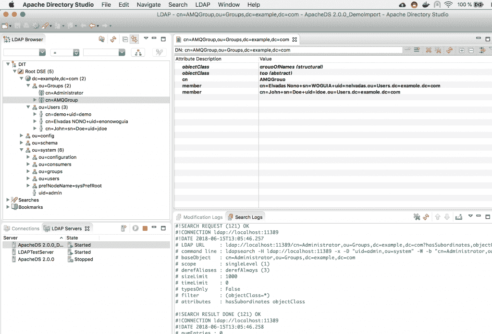
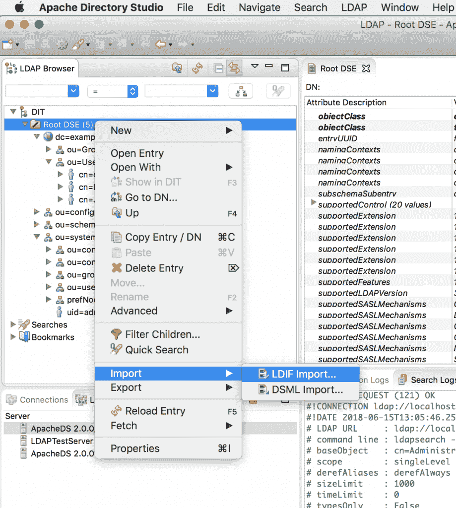
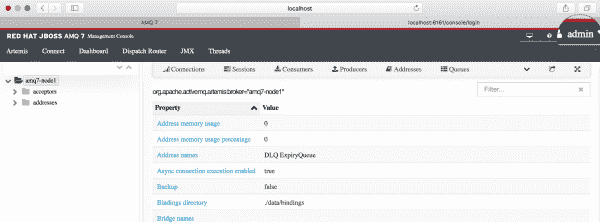
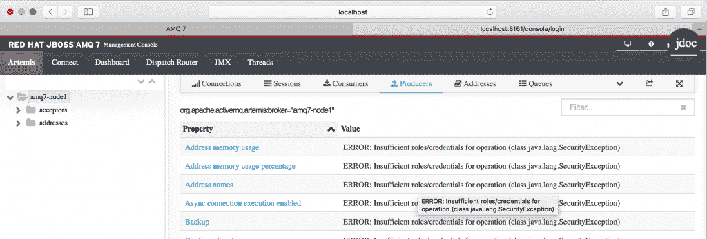

# 如何为红帽 AMQ 7 消息代理控制台设置 LDAP 认证

> 原文：<https://developers.redhat.com/blog/2018/09/21/setup-ldap-auth-amq-console>

这篇文章是由[玛丽·科克伦](https://developers.redhat.com/blog/author/mkcochran/)为开发者和运营人员发起的[红帽 AMQ 7 安全主题](https://developers.redhat.com/blog/2017/12/28/securing-amq7-brokers-ssl/)系列文章的继续。我们将看到如何在一个[红帽 AMQ 7](https://developers.redhat.com/products/amq/overview/) 代理实例上配置 LDAP 认证。为此，我们将执行以下操作:

*   使用 [Apache Directory Studio](http://directory.apache.org/studio/) 为一组用户和组设置一个简单的 LDAP 服务器。
*   使用身份验证提供程序将红帽 AMQ 7 连接到 LDAP。
*   在红帽 AMQ 7 中启用自定义 LDAP 授权策略。

## 设置 LDAP 服务器

在本教程中，我们将依靠 Apache Directory Studio 快速设置一个简单的 LDAP 服务器，其结构如下:

[](https://developers.redhat.com/blog/wp-content/uploads/2018/06/apachedirectorystudio-1.png)

您可以使用这个[github.com/nelvadas/amq7_ldap_lab/blob/master/ldap.ldif](https://github.com/nelvadas/amq7_ldap_lab/blob/master/ldap.ldif)文件来重现 LDAP 环境。从根目录导入`ldap.diff`文件。

[](https://developers.redhat.com/blog/wp-content/uploads/2018/06/importldiff.png)

然后，选择您想要导入的文件，选择**更新现有条目**复选框，并导入文件。

[](https://developers.redhat.com/blog/wp-content/uploads/2018/06/selectldifffile.png)

出于演示和简化的目的，所有用户密码都被设置为 *redhat* ，例如:

*jdoe/redhat，enonowoguia/redhat...*

访问 LDAP 服务器的用户名和密码是 *admin/secre* t。

一旦设置并启动了 LDAP 服务器，我们可以使用下面的`ldapsearch`命令检查现有用户:

```
$ ldapsearch -H ldap://localhost:11389 -x -D "uid=admin,ou=system" -w "secret" -b "ou=Users,dc=example,dc=com" -LLL cn
dn: cn=John+sn=Doe+uid=jdoe,ou=Users,dc=example,dc=com
cn: John

dn: cn=Elvadas NONO+uid=enonowoguia,ou=Users,dc=example,dc=com
cn: elvadas nono

dn: ou=Users,dc=example,dc=com

dn: cn=demo+uid=demo,ou=Users,dc=example,dc=com
cn: demo
```

在相同的上下文中，我们可能想要显示不同的用户组 *jdoe* :

```
$ ldapsearch -H ldap://localhost:11389 -x -D "uid=admin,ou=system" -w "secret" -b "ou=Groups,dc=example,dc=com" "(member=cn=John+sn=Doe+uid=jdoe,ou=Users,dc=example,dc=com)" -LL cn
# extended LDIF
#
# LDAPv3
# base <ou=Groups,dc=example,dc=com> with scope subtree
# filter: (member=cn=John+sn=Doe+uid=jdoe,ou=Users,dc=example,dc=com)
# requesting: -LL cn
#

# Administrator, Groups, example.com
dn: cn=Administrator,ou=Groups,dc=example,dc=com
cn: Administrator

# AMQGroup, Groups, example.com
dn: cn=AMQGroup,ou=Groups,dc=example,dc=com
cn: AMQGroup

# search result
search: 2
result: 0 Success

# numResponses: 3
# numEntries: 2

```

至此，我们已经设置了 LDAP 服务器，并使用各种`ldapsearch`命令确保它已经启动并运行。

在下一节中，我们将配置 Red Hat AMQ 来验证来自 LDAP 的用户，并只允许来自 AMQGroup 的用户访问管理控制台并在队列中发布消息。

## 启动红帽 AMQ 7 经纪人

红帽 AMQ 7 是一个轻量级、高性能、健壮的消息传递平台，可通过红帽开发者计划免费开发使用。

[下载](https://developers.redhat.com/products/amq/download/)并在您的电脑上解压缩最新版本:

```
$ unzip ~/Downloads/amq-broker-7.1.1-bin.zip
$ cd amq-broker-7.1.1/bin
```

使用默认身份验证机制创建代理实例:

```
$ ./bin/artemis create ../../brokers/amq7-broker1 --name amq7-node1 --user admin --password admin --allow-anonymous
Creating ActiveMQ Artemis instance at: /Users/enonowog/Documents/Missions/Blog/amq7ldap/brokers/amq7-broker1

Auto tuning journal ...
done! Your system can make 16.67 writes per millisecond, your journal-buffer-timeout will be 59999

```

现在，您可以通过执行以下命令来启动代理:

```
"/Users/enonowog/Documents/Missions/Blog/amq7ldap/brokers/amq7-broker1/bin/artemis" run

```

或者，您可以使用以下命令在后台运行代理:

```
"/Users/enonowog/Documents/Missions/Blog/amq7ldap/brokers/amq7-broker1/bin/artemis-service" start

```

作为后台进程启动代理。

```
$ cd ../brokers
$ "./amq7-broker1/bin/artemis-service" start
Starting artemis-service
artemis-service is now running (2804)
```

通过 http://localhost:8161/console/log in 访问管理控制台:

[](/sites/default/files/blog/2018/06/managementconsolewithdefaultadminloupe.png)

Accessing the Red Hat AMQ 7 Management Console with the default Admin user

在下一节中，我们将看到如何依靠之前设置的 LDAP 服务器来认证用户。

## 配置 LDAP 验证

为了启用 LDAP 身份验证，第一步是更改默认的`etc/login.config`文件以添加 LDAP 身份验证提供者。

### 添加 LDAP 身份验证提供程序

你可以在这里检索一个工作实例[。](https://raw.githubusercontent.com/nelvadas/amq7_ldap_lab/master/login.config)

```
$ cd brokers/amq7-broker1/etc/
MacBook-Pro-de-elvadas:etc enonowog$ cat <<EOF> login.config
> activemq {
>
>   org.apache.activemq.artemis.spi.core.security.jaas.LDAPLoginModule required
>      debug=true
>      initialContextFactory=com.sun.jndi.ldap.LdapCtxFactory
>      connectionURL="ldap://localhost:11389"
>      connectionUsername="uid=admin,ou=system"
>      connectionPassword=secret
>      connectionProtocol=s
>      authentication=simple
>      userBase="ou=Users,dc=example,dc=com"
>      userSearchMatching="(uid={0})"
>      userSearchSubtree=true
>      roleBase="ou=Groups,dc=example,dc=com"
>      roleName=cn
>      roleSearchMatching="(member={0})"
>      roleSearchSubtree=false
>      reload=true
>   ;
>
> };
> EOF
```

该文件包含您的 LDAP 配置，并声明需要 JAAS `LDAPLoginModule`。提供了连接参数，如 LDAP URL 和 Bind BD 用户详细信息。

例如，`UserBase="ou=Users,dc=example,dc=com"`定义了从中找到用户的 organizationalUnit。而`userSearchMatching="(uid={0})"`表示用户将基于他们的 UID 被认证。

`roleBase="ou=Groups,dc=example,dc=com"`定义将在其中执行用户搜索的基本组。

### 定义 Hawtio 控制台角色

`etc/artemis.profile`文件定义了您想要授予管理控制台访问权限的 LDAP 组。在该文件中，用您的 LDAP 组:`-Dhawtio.role=AMQGroup`替换`-Dhawtio.role=amq`。

```
# Java Opts
 JAVA_ARGS=" -XX:+PrintClassHistogram -XX:+UseG1GC -XX:+AggressiveOpts -XX:+UseFastAccessorMethods -Xms512M -Xmx2G 
-Dhawtio.realm=activemq -Dhawtio.offline="true" -Dhawtio.role=amq 
-Dhawtio.rolePrincipalClasses=org.apache.activemq.artemis.spi.core.security.jaas.RolePrincipal 
-Djolokia.policyLocation=${ARTEMIS_INSTANCE_URI}/etc/jolokia-access.xml -Djon.id=amq"

```

您可以通过运行以下命令来实现这一点:

```
sed -i.bak 's/hawtio.role=amq/hawtio.role=AMQGroup/g' artemis.profile
```

现在，您应该能够使用您的 LDAP 凭证( *jdoe/redhat* )登录到管理控制台。

[](https://developers.redhat.com/blog/wp-content/uploads/2018/06/managementconsoleauthent.png)

### 测试和调试

要查看幕后发生了什么，您可以在`spi`核心安全包中启用调试日志。

编辑`etc/logging.properties`文件。

将`org.apache.activemq.artemis.spi.core.security`包添加到根记录器中。

还要为此包添加调试日志记录级别:

`logger.org.apache.activemq.artemis.spi.core.security.level=DEBUG`

然后重启你的红帽 AMQ 实例。

```
# Additional logger names to configure (root logger is always configured)
 19 # Root logger option
 20 loggers=...,org.apache.activemq.artemis.integration.bootstrap
,org.apache.activemq.artemis.spi.core.security
 21 # Root logger level
 22 logger.level=INFO
 23 # ActiveMQ Artemis logger levels
 24 logger.org.apache.activemq.artemis.core.server.level=INFO
 25 logger.org.apache.activemq.artemis.journal.level=INFO
 26 logger.org.apache.activemq.artemis.utils.level=INFO
 27 logger.org.apache.activemq.artemis.jms.level=INFO
 28 logger.org.apache.activemq.artemis.integration.bootstrap.level=INFO
 29 logger.org.apache.activemq.artemis.spi.core.security.level=DEBUG
 30 logger.org.eclipse.jetty.level=WARN
 31 # Root logger handlers
 32 logger.handlers=FILE,CONSOLE
```

当用户尝试使用 LDAP 进行身份验证时，您可以看到检索到哪些角色:

```
2018-06-15 17:26:18,824 INFO [org.apache.activemq.artemis] AMQ241001: HTTP Server started at http://localhost:8161
2018-06-15 17:26:18,825 INFO [org.apache.activemq.artemis] AMQ241002: Artemis Jolokia REST API available at http://localhost:8161/console/jolokia
2018-06-15 17:26:18,825 INFO [org.apache.activemq.artemis] AMQ241004: Artemis Console available at http://localhost:8161/console
2018-06-15 17:26:31,794 INFO [io.hawt.web.LoginServlet] hawtio login is using 1800 sec. HttpSession timeout
2018-06-15 17:26:31,814 DEBUG [org.apache.activemq.artemis.spi.core.security.jaas.LDAPLoginModule] Create the LDAP initial context.
2018-06-15 17:26:31,826 DEBUG [org.apache.activemq.artemis.spi.core.security.jaas.LDAPLoginModule] Get the user DN.
2018-06-15 17:26:31,826 DEBUG [org.apache.activemq.artemis.spi.core.security.jaas.LDAPLoginModule] Looking for the user in LDAP with
2018-06-15 17:26:31,826 DEBUG [org.apache.activemq.artemis.spi.core.security.jaas.LDAPLoginModule] base DN: ou=Users,dc=example,dc=com
2018-06-15 17:26:31,827 DEBUG [org.apache.activemq.artemis.spi.core.security.jaas.LDAPLoginModule] filter: (uid=jdoe)
2018-06-15 17:26:31,830 DEBUG [org.apache.activemq.artemis.spi.core.security.jaas.LDAPLoginModule] LDAP returned a relative name: cn=John+sn=Doe+uid=jdoe
2018-06-15 17:26:31,831 DEBUG [org.apache.activemq.artemis.spi.core.security.jaas.LDAPLoginModule] Using DN [cn=John+sn=Doe+uid=jdoe,ou=Users,dc=example,dc=com] for binding.
2018-06-15 17:26:31,831 DEBUG [org.apache.activemq.artemis.spi.core.security.jaas.LDAPLoginModule] Binding the user.
2018-06-15 17:26:31,834 DEBUG [org.apache.activemq.artemis.spi.core.security.jaas.LDAPLoginModule] User cn=John+sn=Doe+uid=jdoe,ou=Users,dc=example,dc=com successfully bound.
2018-06-15 17:26:31,834 DEBUG [org.apache.activemq.artemis.spi.core.security.jaas.LDAPLoginModule] Get user roles.
2018-06-15 17:26:31,834 DEBUG [org.apache.activemq.artemis.spi.core.security.jaas.LDAPLoginModule] Looking for the user roles in LDAP with
2018-06-15 17:26:31,834 DEBUG [org.apache.activemq.artemis.spi.core.security.jaas.LDAPLoginModule] base DN: ou=Groups,dc=example,dc=com
2018-06-15 17:26:31,834 DEBUG [org.apache.activemq.artemis.spi.core.security.jaas.LDAPLoginModule] filter: (member=cn=John+sn=Doe+uid=jdoe,ou=Users,dc=example,dc=com)
2018-06-15 17:26:31,839 DEBUG [org.apache.activemq.artemis.spi.core.security.jaas.LDAPLoginModule] Roles [Administrator, AMQGroup] for user jdoe
```

在这一部分中，我们定义了身份验证策略，但是授权呢？

### 启用对 LDAP 组的自定义授权

要向 LDAP 组授予特定角色，请编辑`broker.xml`配置文件并为您的角色设置特定权限:

```
<security-settings>
<security-setting match="#">
<permission type="createNonDurableQueue" roles="amq,AMQGroup"/>
<permission type="deleteNonDurableQueue" roles="amq"/>
<permission type="createDurableQueue" roles="amq,AMQGroup"/>
<permission type="deleteDurableQueue" roles="amq"/>
<permission type="createAddress" roles="amq,AMQGroup"/>
<permission type="deleteAddress" roles="amq,AMQGroup"/>
<permission type="consume" roles="amq,AMQGroup"/>
<permission type="browse" roles="amq,AMQGroup"/>
<permission type="send" roles="amq,AMQGroup"/>
<!-- we need this otherwise ./artemis data imp wouldn't work -->
<permission type="manage" roles="amq,AMQGroup"/>
</security-setting>
</security-settings>

```

当权限被定义时，它们被正在运行的 Red Hat AMQ 实例自动获取。现在，您可以使用 *jdoe* 用户生成一组消息。

```
$ ./artemis producer --url tcp://localhost:61616 --user jdoe --password redhat --destination queue://RH_DEV_BLOG --message-count 10
Producer ActiveMQQueue[RH_DEV_BLOG], thread=0 Started to calculate elapsed time ...
Producer ActiveMQQueue[RH_DEV_BLOG], thread=0 Produced: 10 messages
Producer ActiveMQQueue[RH_DEV_BLOG], thread=0 Elapsed time in second : 0 s
Producer ActiveMQQueue[RH_DEV_BLOG], thread=0 Elapsed time in milli second : 50 milli seconds

```

## 结论

在这篇博客文章中，我们看到了如何使用 Apache Directory Studio 设置一个简单的 LDAP 目录，并在红帽 AMQ 7 上为消息传递操作和管理控制台配置了 LDAP 身份验证和自定义授权策略。

*Last updated: September 3, 2019*