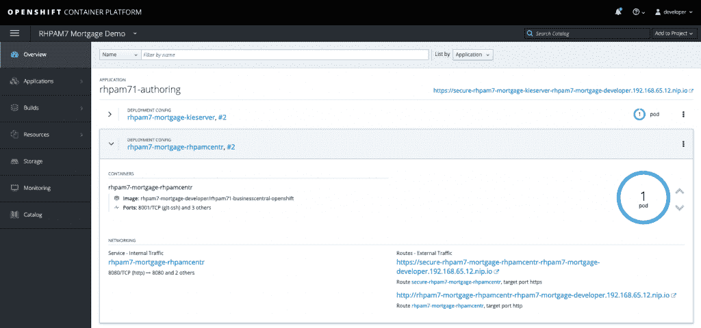
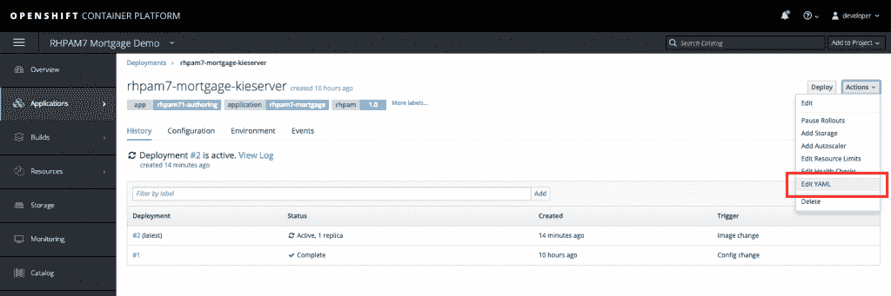
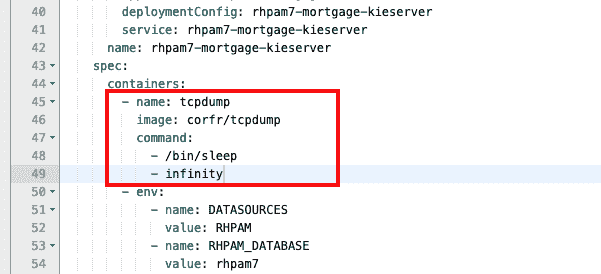
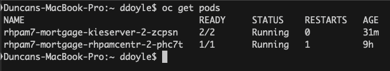
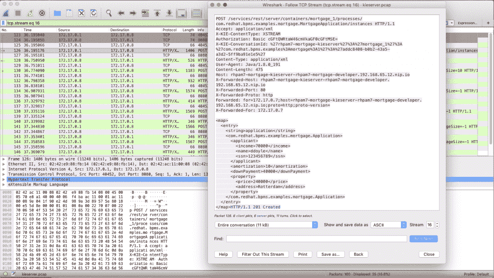

# 在 OpenShift 和 Kubernetes pods 中使用 sidecars 分析和调试网络流量

> 原文：<https://developers.redhat.com/blog/2019/02/27/sidecars-analyze-debug-network-traffic-kubernetes-pod>

在分布式计算、[容器](https://developers.redhat.com/blog/category/containers/)和[微服务](https://developers.redhat.com/blog/category/microservices/)的世界中，服务之间的许多交互和通信都是通过 RESTful APIs 完成的。在开发这些 API 和服务之间的交互时，我经常需要调试服务之间的通信，尤其是当事情似乎没有像预期的那样工作时。

在使用容器之前，我只是在本地机器上部署我的服务，启动 Wireshark，执行我的测试，并分析我的服务之间的 HTTP 通信。对我来说，这一直是快速分析我的软件中的通信问题的一种简单而有效的方法。然而，这种调试方法在容器化的环境中并不适用。

首先，容器很可能运行在内部容器平台网络上，您的机器不能直接访问该网络。第二个问题是，按照容器设计的最佳实践，容器只包含执行其任务所需的应用程序和库的最小集合。这意味着容器中通常没有类似于`tcpdump`的工具。这使得调试和分析容器之间的网络流量，从而调试微服务间的通信比在非容器化的环境中要困难一些。本文给出了一个解决方案。

## 边车来救援

在过去的几个月里，我尝试了各种方法来解决这个问题，最终产生了我将在本文中概述的方法。这是一种捕获[Kubernetes](https://developers.redhat.com/blog/category/kubernetes/)/[open shift](http://openshift.com/)pod 之间网络流量数据的简单方法，允许开发人员更好地分析和调试容器化应用程序中的通信问题，并更快、更有效地解决问题。

我们将使用`tcpdump`来捕获一个所谓的 PCAP(数据包捕获)文件，该文件将包含 pod 的网络流量。然后，可以将这个 PCAP 文件加载到 Wireshark 之类的工具中，以分析流量，在这种情况下，还可以分析 pod 中运行的服务的 RESTful 通信。在本文中，我将使用[Red Hat Process Automation Manager](https://developers.redhat.com/products/rhpam/overview/)产品的 KIE 服务器(执行服务器)作为例子，但是这种方法应该适用于任何类型的容器化应用程序。

要克服的第一个问题是 Kubernetes pod 中的`tcpdump`命令的可用性。KIE 服务器容器映像没有安装`tcpdump`。第二，容器没有提供从红帽仓库安装`tcpdump`的工具。为了解决这个问题，我们使用了“边车集装箱”的概念

边车容器是在与实际服务/应用相同的 pod 中运行的容器，并且能够向服务/应用提供附加功能。sidecar 容器的一个例子是 Istio 的 Envoy sidecar，它使 pod 成为服务网格的一部分。在这个例子中，我们将部署一个提供`tcpdump`工具的 sidecar 容器。因为 pod 中的多个容器共享同一个网络层，所以我们可以使用 sidecar 来捕获进出 KIE 服务器的网络流量。

## 展开边车

在这个例子中，我已经部署了[Red Hat Process Automation Manager 7 Mortgage Demo](https://github.com/jbossdemocentral/rhpam7-mortgage-demo)，它将在我的 OpenShift 名称空间中创建两个 pod。一个 pod 运行业务中心工作台，另一个 pod 是执行服务器的 pod。两个组件之间的通信是通过 REST 完成的，这是我们将要捕获的流量。

[](https://developers.redhat.com/blog/wp-content/uploads/2019/02/Screenshot-2019-02-20-at-09.04.48.png)

我们的目标是捕获 KIE 服务器 pod 上的网络流量，这样我们就可以分析 Business Central workbench 发送到 KIE 服务器的 RESTful 命令。为此，我们首先需要将一个边车连接到 KIE 服务器箱:

1.  在概览屏幕中，单击要分析的 pod 的名称。这将打开部署配置(DC)屏幕。
2.  在部署配置屏幕的右上角，单击“操作->编辑 YAML”这将打开 DC 的 YAML 配置。

[](https://developers.redhat.com/blog/wp-content/uploads/2019/02/Screenshot-2019-02-20-at-09.08.55.png)

3.  向下滚动，直到看到单词“containers”我们将添加一个额外的容器，我们安装了`tcpdump`的边车，到我们的 pod。直接在“容器”定义下添加以下 YAML 代码片段:

```
- name: tcpdump
   image: corfr/tcpdump
   command:
     - /bin/sleep
     - infinity
```

[](https://developers.redhat.com/blog/wp-content/uploads/2019/02/Screenshot-2019-02-20-at-09.17.56.png)

4.  保存配置。这将部署一个新的 pod，它现在由两个容器组成:一个容器包含 KIE 服务器，另一个容器包含我们的`tcpdump`工具，它将无限期地运行。

注意，在容器中运行“sleep”命令来保持它的运行有点“黑”,对于在生产环境中运行的容器来说，这绝对不是一个好的实践。然而，在几次失败的方法之后，其中包括运行`tcpdump`作为容器命令，这种方法使我以可控的方式实现了我的目标。

## 捕获和分析流量

随着边车的部署和运行，我们现在可以开始捕获数据。我尝试的方法之一是使用`oc rsh`命令在 sidecar 内部远程执行`tcpdump`命令，将输出流式传输到 FIFO 文件，并将数据直接传输到 Wireshark。由于各种原因，这种方法失败了。其中一个问题是`tcpdump`向`stderr`发送信息消息，但是这些消息将通过 SSH 在与`stdout`相同的流中被接收，破坏了进入 Wireshark 的数据。

我最终使用的方法是登录到 sidecar 容器，并在 sidecar 中运行`tcpdump`命令来创建一个 PCAP 文件。当您捕获了足够的数据后，您可以停止捕获过程，并将 PCAP 文件复制到您想要使用 Wireshark 进行网络流量分析的机器上。这是按如下方式完成的:

1.  在您的开发机器上，将您的`oc`客户端连接到您的 OpenShift 实例，并且激活正确的项目(名称空间),运行`oc get pods`命令来列出您的 pod:

[](https://developers.redhat.com/blog/wp-content/uploads/2019/02/Screenshot-2019-02-20-at-09.26.30.png)

2.  使用以下命令登录到我们的 KIE 服务器 pod 的`tcpdump`容器:`oc rsh -c tcpdump rhpam7-mortgage-kieserver-2-zcpsn`。
3.  在`tcpdump`容器中，运行此命令启动网络流量捕获进程:`tcpdump -s 0 -n -w /tmp/kieserver.pcap`。
4.  运行创建您想要分析的网络流量的测试。在本例中，我将从业务中心工作台启动一个业务流程，它将向 KIE 服务器发送一个 RESTful 请求。
5.  当您捕获了足够的数据后，在`tcpdump`容器中使用 Ctrl+C 完成捕获过程。
6.  回到你的本地机器。将 PCAP 文件从 pod 复制到您的本地机器:`oc cp -c tcpdump rhpam7-mortgage-kieserver-2-zcpsn:tmp/kieserver.pcap kieserver.pcap`。
7.  使用 Wireshark 打开 PCAP 文件并分析您的网络流量。在这个例子中，我正在分析我的 HTTP POST 方法，它创建了我们的抵押贷款流程的一个新实例:

[](https://developers.redhat.com/blog/wp-content/uploads/2019/02/Screenshot-2019-02-20-at-09.45.47.png)

## 结论

在像 Kubernetes 和/或 OpenShift 这样的容器环境中，分析 pod 之间的网络流量可能比在非容器环境中要困难一些。然而，sidecar 容器的概念为开发人员提供了一个简单的工具，通过所需的开发工具和实用程序，将容器连接到微服务单元。这使得开发人员不必在应用程序容器映像本身中安装这些类型的调试工具，保持了容器的简洁。使用像`oc rsh`和`oc cp`这样的 OpenShift 工具，我已经展示了如何轻松地从 pod 中捕获网络流量数据，并将数据带到开发机器上进行分析。

如果您有兴趣了解更多关于当您的微服务需要与您的 OpenShift/Kubernetes/pods 环境之外的另一个服务对话时使用 Istio Egress 的信息，请参见 [Istio Egress:通过礼品店退出](https://developers.redhat.com/blog/2018/05/01/istio-egress-exit-through-the-gift-shop/)。


### 关于作者

[Duncan Doyle](http://twitter.com/DuncanDoyle) 是 Red Hat Decision Manager 和 Red Hat Process Automation Manager 平台的技术营销经理。Duncan 拥有 Red Hat 咨询和服务的背景，曾与大型 Red Hat 客户广泛合作，构建高级的开源业务规则和业务流程管理解决方案。

他在面向服务的架构、持续集成和持续交付、规则引擎和 BPM 平台等技术和概念方面有着深厚的背景，并且是多种 Red Hat 中间件技术的主题专家(SME ),包括但不限于 Red Hat JBoss 企业应用程序平台、HornetQ、Red Hat Fuse、Red Hat 数据网格、Red Hat 决策管理器和 Red Hat 流程自动化管理器。当他不从事开源解决方案和技术时，他就和他的儿子和女儿一起建造乐高，或者在他的 Fender Stratocaster 上播放一些 90 年代的摇滚音乐。

*Last updated: September 3, 2019*