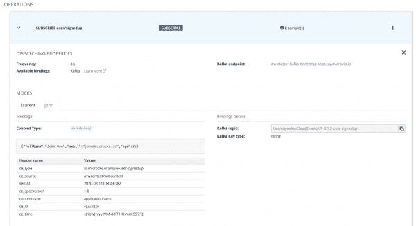

# 用 asyncapi 和 microcos 模拟云事件

> 原文：<https://developers.redhat.com/articles/2021/06/02/simulating-cloudevents-asyncapi-and-microcks>

[事件驱动架构](/topics/event-driven)是迈向云原生应用的进化步骤，支持[无服务器](/topics/serverless-architecture)应用。事件连接[微服务](/topics/microservices)，让你在空间和时间上解耦功能，让你的应用更有弹性。

但是事件伴随着挑战。开发团队首先面临的挑战之一是如何以可重复的结构化形式描述事件。另一个挑战是如何在使用事件的应用程序上工作，而不必等待另一个团队给你产生那些事件的应用程序。

本文探讨了这两个挑战，并展示了如何使用 [CloudEvents](https://cloudevents.io) 、 [AsyncAPI](https://asyncapi.com) 和 [Microcks](https://microcks.io) 来模拟事件。CloudEvents 和 AsyncAPI 是互补的规范，您可以组合它们来帮助定义事件驱动的架构。Microcks 允许模拟 CloudEvents 来加速和保护开发团队的自主性。

## CloudEvents 还是 AsyncAPI？

诸如 [CloudEvents](https://cloudevents.io/) 或 [AsyncAPI](https://www.asyncapi.com/) 等新标准已经出现，以满足以结构化格式描述事件的需求。人们经常会问:“我应该使用 CloudEvents 还是 AsyncAPI？”人们普遍认为 CloudEvents 和 AsyncAPI 在同一范围内竞争。我对此有不同的看法，在本文中，我将解释这两个标准是如何很好地协同工作的。

### 什么是 CloudEvents？

CloudEvents 的本质可以在[其网站](http://cloudevents.io/)的声明中找到:

CloudEvents 是一种以通用格式描述事件数据的规范，以提供跨服务、平台和系统的互操作性。

CloudEvents 的目的是建立事件数据描述的通用格式。CloudEvents 是云本地计算基金会[无服务器工作组](https://github.com/cncf/wg-serverless)的一部分。在 [Knative Eventing](https://knative.dev/docs/eventing/) (或[Red Hat open shift server less](/topics/serverless-architecture))、 [Trigger Mesh](https://www.triggermesh.com/) 和 [Azure Event Grid](https://azure.microsoft.com/en-us/services/event-grid) 中已经存在许多集成，允许真正的跨厂商平台互操作性。

CloudEvents 规范专注于事件，并为应用程序事件定义了一个公共信封(一组属性)。截至今天，CloudEvents 提出了两种不同的[内容模式](https://github.com/cloudevents/spec/blob/v1.0.1/kafka-protocol-binding.md#13-content-modes)来传输事件:结构化和二进制。

CloudEvents 存储库提供了一个包含事件属性的 JSON 结构的[示例。这是一个*结构化的云事件*。示例中的事件数据是 XML，包含在值`<much wow=\"xml\"/>`中，但是它可以是任何类型。CloudEvents 负责定义关于事件的元信息，但不帮助您定义实际的事件内容:](https://gist.github.com/e3261b13eb7a9dbb14ccf59b1580d5b7#file-cloudevent-json)

```
{
    "specversion" : "1.0.1",
    "type" : "com.github.pull.create",
    "source" : "https://github.com/cloudevents/spec/pull/123",
    "id" : "A234-1234-1234",
    "time" : "2020-04-05T17:31:00Z",
    "comexampleextension1" : "value",
    "comexampleextension2" : {
        "othervalue": 5
    },
    "contenttype" : "text/xml",
    "data" : "<much wow=\"xml\"/>"
}

```

### 什么是 AsyncAPI？

为了理解 AsyncAPI，我们再次求助于它的网站:

AsyncAPI 是定义异步 API 的行业标准。我们的长期目标是让使用 EDAs 像使用 REST APIs 一样简单。

“API”代表[应用程序编程接口](/topics/api-management)，体现了应用程序的交互和功能。AsyncAPI 可以被看作是 [OpenAPI](https://www.openapis.org/) 的姐妹规范，但是目标是基于事件代理的异步协议。

AsyncAPI 侧重于应用程序及其使用的通信通道。与 CloudEvents 不同，AsyncAPI 没有定义事件应该如何构造。然而，AsyncAPI 提供了一种扩展的方法来精确定义事件的元信息和实际内容。

在 GitHub 上可以找到 YAML 的一个[例子。这个例子描述了发布到`user/signedup`频道的标题为`User signed-up event`的事件。这些事件有三个属性:`fullName`、`email`和`age`。每个属性都使用来自](https://gist.github.com/67252933bcfea50c996b44dd20225962#file-asyncapi-yml) [JSON 模式](https://json-schema.org/)的语义来定义。尽管在这个例子中没有显示，AsyncAPI 还允许您指定事件头，以及这些事件是否可以通过不同的协议绑定获得，例如 [Kafka](https://kafka.apache.org/) 、 [AMQP](https://www.amqp.org/) 、 [MQTT](https://mqtt.org/) 或 [WebSocket](https://www.w3.org/TR/websockets/) :

```
asyncapi: 2.0.0
id: urn:com.asyncapi.examples.user
info:
  title: User signed-up event
  version: 0.1.1
channels:
  user/signedup:
    publish:
      message:
        payload:
          type: object
          properties:
            fullName:
              type: string
            email:
              type: string
              format: email
            age:
              type: integer
              minimum: 18
```

## 使用 AsyncAPI 的云事件

我展示的解释和例子揭示了带有 AsyncAPI 标准的 CloudEvents 处理不同的范围。因此，它们不必被视为相互排斥的。实际上，您可以将它们结合起来，形成一个完整的事件规范，包括应用程序定义、通道描述、结构化信封和事件携带的详细功能数据。

这种结合背后的一般思想是使用 AsyncAPI 规范作为宿主文档。它包含对 CloudEvents 属性的引用，并添加了关于事件格式的更多细节。

您可以在 AsyncAPI 中使用两种机制来确保这种结合。选择正确的机制可能取决于您选择用来传递事件的协议。事情还不完美，你必须做出选择。

让我们以使用 [Apache Kafka](/topics/kafka-kubernetes) 分发事件为例:

*   在结构化内容模式中，CloudEvents 元信息与 messages 值中的`data`纠缠在一起。对于这种模式，我们将使用可从 AsyncAPI 访问的 JSON 模式组合机制。
*   在二进制内容模式中(我们可以使用 [Avro](https://avro.apache.org/) )，每个事件的元信息与消息值分离，并插入到每个消息的报头中。为此，我们将使用 AsyncAPI 中的 [MessageTrait](https://www.asyncapi.com/docs/specifications/2.0.0#messageTraitObject) 应用程序机制。

### 结构化内容模式

本节重写了前面的 AsyncAPI 示例，以便在结构化内容模式下使用 CloudEvents。得到的[定义](https://gist.github.com/035ccc4d7b7cdd414f0ebc5a53e80c4c#file-asyncapi-ce-yaml)包含以下值得注意的元素:

*   从第 16 行开始的`headers`的定义包含我们的应用程序的`custom-header`，以及强制的云事件`content-type`。
*   一个`schemas`字段在第 33 行引用了 CloudEvents 规范，重用该规范作为我们消息的基础。
*   `schemas`字段还指第 36 行上的`data`属性描述的细化版本。

定义如下:

```
asyncapi: '2.0.0'
id: 'urn:io.microcks.example.user-signedup'
info:
  title: User signed-up CloudEvents API structured
  version: 0.1.3
defaultContentType: application/json
channels:
  user/signedup:
    subscribe:
      message:
        bindings:
          kafka:
            key:
              type: string
              description: Timestamp of event as milliseconds since 1st Jan 1970
        headers:
          type: object
          properties:
            custom-header:
              type: string
            content-type:
              type: string
              enum:
                - 'application/cloudevents+json; charset=UTF-8'
        payload:
          $ref: '#/components/schemas/userSignedUpPayload'
        examples: [...]
components:
  schemas:
    userSignedUpPayload:
      type: object
      allOf:
        - $ref: 'https://raw.githubusercontent.com/cloudevents/spec/v1.0.1/spec.json'
      properties:
        data:
          $ref: '#/components/schemas/userSignedUpData'
    userSignedUpData:
      type: object
      properties:
        fullName:
          type: string
        email:
          type: string
          format: email
        age:
          type: integer
          minimum: 18
```

### 二进制内容模式

现在，我们将把二进制内容模式应用于 AsyncAPI 格式。得到的[定义](https://gist.github.com/d5eca1c76fd57e5b3326b5d5db26bbd3#file-asyncapi-ce-yaml)显示事件属性已经脱离了这种格式。这里需要注意的其他重要事项有:

*   第 16 行的消息级应用了一个特征。trait 资源是包含一个`MessageTrait`定义的部分 AsyncAPI 文档。这个特性将从 CloudEvents 引入所有强制属性(`ce_*`)。它相当于 CloudEvents JSON 模式。
*   这一次，我们使用 Avro 模式来指定事件有效负载，如第 25 行所示。

定义如下:

```
asyncapi: '2.0.0'
id: 'urn:io.microcks.example.user-signedup'
info:
  title: User signed-up CloudEvents API binary
  version: 0.1.3
channels:
  user/signedup:
    subscribe:
      message:
        bindings:
          kafka:
            key:
              type: string
              description: Timestamp of event as milliseconds since 1st Jan 1970
        traits:
          - $ref: 'https://raw.githubusercontent.com/microcks/microcks-quickstarters/main/cloud/cloudevents/cloudevents-v1.0.1-asyncapi-trait.yml'
        headers:
          type: object
          properties:
            custom-header:
              type: string
        contentType: avro/binary
        schemaFormat: application/vnd.apache.avro+json;version=1.9.0
        payload:
          $ref: './user-signedup.avsc#/User'
        examples: [...] 
```

### 将 CloudEvents 与 AsyncAPI 结合有什么好处？

无论选择哪种内容模式，您现在都有了对事件和事件驱动架构的所有元素的全面描述。该描述保证了 CloudEvents-plus-AsyncAPI 组合的底层互操作性，以及在无服务器世界中被路由和触发功能的能力。此外，您提供了对所携带的`data`的完整描述，这将对应用程序消费和处理事件有很大的帮助。

## 用 microcos 模拟云事件

让我们来解决本文开头提到的第二个挑战:开发人员如何高效地作为一个团队工作，而不必等待其他人的事件？我们已经看到了如何完整地描述事件。然而，如果有一种实用的方法来利用这种 CloudEvents-plus-AsyncAPI 契约，那就更好了。这就是[微型芯片](https://microcks.io/)来救援的地方。

### 什么是 Microcks？

Microcks 是一个[开源](/topics/open-source)[Kubernetes](/topics/kubernetes/)——模仿/模拟和测试 API 的原生工具。Microcks 的一个目的是在几秒钟内将你的 API 契约(如 OpenAPI、AsyncAPI 或[邮差](https://getpostman.com/)集合)转化为真实的模拟。一旦导入了您的 AsyncAPI 契约，Microcks 就开始以定义的频率在消息代理上生成模拟事件。

使用 Microcks，您可以在几秒钟内模拟 CloudEvents，而无需编写一行代码。Microcks 允许依赖输入事件的团队立即开始工作。他们不需要等待编写将公布事件的应用程序的团队。

### 将 microcos 用于云事件

要使用微时钟生成 CloudEvents 事件，只需通过将示例添加到您的契约中来重用它们。我们之前省略了`examples`属性，但是我们现在将把该属性添加到我们的[示例中的二进制内容模式](https://gist.github.com/820c925b8ff84929ebf0c30ad1900c62#file-asyncapi-ce-yaml)的第 26 行:

```
asyncapi: '2.0.0'
id: 'urn:io.microcks.example.user-signedup'
info:
  title: User signed-up CloudEvents API binary
  version: 0.1.3
channels:
  user/signedup:
    subscribe:
      message:
        bindings:
          kafka:
            key:
              type: string
              description: Timestamp of event as milliseconds since 1st Jan 1970
        traits:
          - $ref: 'https://raw.githubusercontent.com/microcks/microcks-quickstarters/main/cloud/cloudevents/cloudevents-v1.0.1-asyncapi-trait.yml'
        headers:
          type: object
          properties:
            custom-header:
              type: string
        contentType: avro/binary
        schemaFormat: application/vnd.apache.avro+json;version=1.9.0
        payload:
          $ref: './user-signedup.avsc#/User'
        examples:
          - john:
              summary: Example for John Doe user
              headers:
                ce_specversion: "1.0"
                ce_type: "io.microcks.example.user-signedup"
                ce_source: "/mycontext/subcontext"
                ce_id: "{{uuid()}}"
                ce_time: "{{now(yyyy-MM-dd'T'HH:mm:SS'Z')}}"
                content-type: application/avro
                sentAt: "2020-03-11T08:03:38Z"
              payload:
                fullName: John Doe
                email: john@microcks.io
                age: 36
```

需要注意的要点是:

*   您可以放入任意多的示例，因为这个属性在 AsyncAPI 中变成了一个映射。
*   您可以指定`headers`和`payload`值。
*   即使`payload`将被 Avro-binary 编码，您也可以使用 YAML 或 JSON 来指定示例。
*   你可以通过`{{ }}`符号使用模板函数来引入[随机或动态值](https://microcks.io/documentation/using/advanced/templates/#function-expressions)。

一旦模式被导入到 Microcks 中，它就会发现 API 定义以及不同的例子。Microcks 立即开始在它所连接的 Kafka 代理上产生模拟事件——在我们的例子中是每三秒钟一次(见图 1)。

[](/sites/default/files/rh-simulating-cloud-events_0.png)Figure 1: A Microcks import of AsyncAPI with CloudEvents.

从版本 [1.2.0](https://microcks.io/blog/microcks-1.2.0-release/) 开始，Microcks 也支持到模式注册中心的连接。因此，它发布了模拟消息发布时使用的 Avro 模式。您可以使用 [kafkacat](https://github.com/edenhill/kafkacat) 命令行界面(CLI)工具连接到 Kafka 代理和注册表，然后检查模拟事件的内容。这里我们使用的是 [Apicurio 服务注册中心](https://www.apicur.io/registry/):

```
$ kafkacat -b my-cluster-kafka-bootstrap.apps.try.microcks.io:9092 -t UsersignedupCloudEventsAPI_0.1.3_user-signedup -s value=avro -r http://apicurio-registry.apps.try.microcks.io/api/ccompat -o end -f 'Headers: %h - Value: %s\n'
--- OUTPUT 
% Auto-selecting Consumer mode (use -P or -C to override)
% Reached end of topic UsersignedupCloudEventsAPI_0.1.3_user-signedup [0] at offset 276
Headers: sentAt=2020-03-11T08:03:38Z,content-type=application/avro,ce_id=7a8cc388-5bfb-42f7-8361-0efb4ce75c20,ce_type=io.microcks.example.user-signedup,ce_specversion=1.0,ce_time=2021-03-09T15:17:762Z,ce_source=/mycontext/subcontext - Value: {"fullName": "John Doe", "email": "john@microcks.io", "age": 36}
% Reached end of topic UsersignedupCloudEventsAPI_0.1.3_user-signedup [0] at offset 277
Headers: ce_id=dde8aa04-2591-4144-aa5b-f0608612b8c5,sentAt=2020-03-11T08:03:38Z,content-type=application/avro,ce_time=2021-03-09T15:17:733Z,ce_type=io.microcks.example.user-signedup,ce_specversion=1.0,ce_source=/mycontext/subcontext - Value: {"fullName": "John Doe", "email": "john@microcks.io", "age": 36}
% Reached end of topic UsersignedupCloudEventsAPI_0.1.3_user-signedup [0] at offset 279
```

我们可以检查发出的事件是否符合 CloudEvents 元信息结构和 AsyncAPI `data`定义。此外，每个事件都有不同的随机属性，这允许它模拟消费应用程序的多样性和变化。

## 结论

本文展示了如何解决事件驱动架构带来的一些挑战。

首先，我描述了最近的标准 CloudEvents 和 AsyncAPI 如何关注不同的范围:CloudEvents 的事件和 AsyncAPI 的应用程序。

然后，我演示了如何组合规范来提供事件驱动架构中涉及的所有元素的全面描述:应用程序定义、通道描述、结构化信封和事件携带的详细功能数据。这些规范是互补的，所以你可以使用其中一个或者两个，这取决于你想在你的正式描述中深入到什么程度。

最后，您已经看到了如何使用 Microcks 来模拟任何基于 AsyncAPI 的事件，包括那些由 CloudEvents 生成的事件，只是通过使用示例。当不同的开发团队使用事件驱动的架构时，Microcks 回答了自主工作、测试和验证的挑战。

我希望你学到了一些新东西——如果是这样，请考虑反应、评论或分享。感谢阅读。

*Last updated: August 26, 2022*