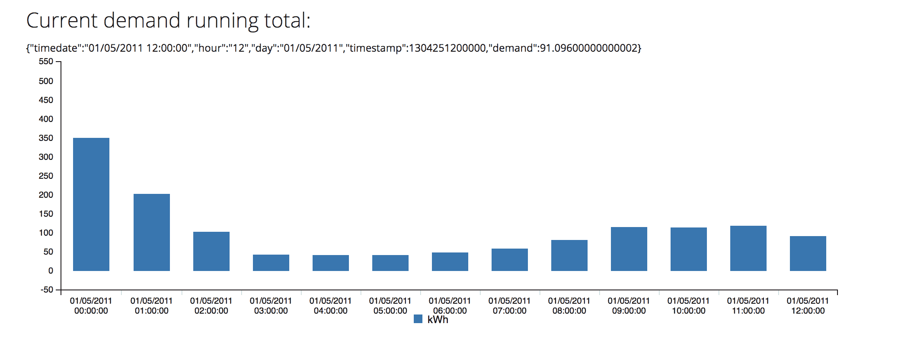

# 在 OpenShift 上使用 Apache Kafka 处理智能电表数据

> 原文：<https://developers.redhat.com/blog/2018/07/16/smart-meter-streams-kafka-openshift>

英国大力推动用联网智能电表取代老化的机械电表。新的电表允许消费者更密切地监控他们的能源使用和相关成本，并且它们使供应商能够自动化计费过程，因为电表自动报告精细的能源使用。

这篇文章描述了一个使用 [Strimzi](http://strimzi.io/) 处理仪表读数流的架构，该架构支持在容器环境中运行 Apache Kafka([Red Hat open shift](https://www.openshift.com/))。这些数据是通过[英国研究项目](http://www.networkrevolution.co.uk/)获得的，该项目从 2011 年到 2014 年收集了能源生产商、经销商和消费者的数据。这里使用的 TC1a 数据集包含来自 8，000 个国内客户的数据，每半小时一次，格式如下:

```
 Location ID,Measurement Description,Parameter Type and Units,of capture,Parameter
 120,Electricity supply meter,Consumption in period [kWh],03/12/2011 00:00:00,0.067
 120,Electricity supply meter,Consumption in period [kWh],03/12/2011 00:30:00,0.067
 120,Electricity supply meter,Consumption in period [kWh],03/12/2011 01:00:00,0.066
 120,Electricity supply meter,Consumption in period [kWh],03/12/2011 01:30:00,0.066
```

由于一年的数据代表大约 25GB 的逗号分隔值(CSV)数据，因此在单台机器上导入和分析这些数据极具挑战性。此外，考虑到与任何合理规模的电力公司所服务的实际客户数量相比，受监控的客户数量相对较少(8000 个)，处理这种数据流的难度就更大了。

此处采用的方法是以读数流的形式处理这些数据，并利用 [Red Hat AMQ 流](https://developers.redhat.com/blog/2018/05/07/announcing-amq-streams-apache-kafka-on-openshift/)分布式流平台在数据被接收到应用程序时实时执行聚合。该系统的输出将是双重的:一个数据集，可用于训练消费者在 24 小时内的使用模型，以及一个显示实时需求水平的监测仪表板。

## 成分

为了构建一个可以扩展以部署在生产环境中的系统，我们采用了部署在 Red Hat OpenShift 上的[微服务](https://developers.redhat.com/topics/microservices/)方法。微服务通过以下管道中的 Apache Kafka 主题进行连接:

这些模块中的每一个都被单独部署在 OpenShift 中，并使用由 AMQ Streams 提供的 Apache Kafka 集群。

[CloudEvents 规范](https://github.com/cloudevents/spec)旨在实现应用在多个云提供商之间的可移植性。这非常适合描述从智能电表(或模拟器，在我们的例子中)发送到能源供应商的抄表值。这种便携性将使客户能够更换他们的电力供应商，而无需更换他们家中的硬件。

### 休息终点

数据通过智能电表模拟器(只读取 CSV 数据文件)逐个读数地输入系统。这些仪表读数作为 CloudEvents 发送到作为 Thorntail 应用程序运行的 RESTEasy 微服务。该应用程序使用 Fabric8 Maven 插件部署到 OpenShift，并将 CloudEvents 转换为由 AMQ 流存储的 Apache Kafka 消息。这个微服务利用了 [Kafka CDI 库](https://github.com/aerogear/kafka-cdi)，它通过 Java 代码中简单的 CDI 注释实现了与 Apache Kafka 主题的交互。这意味着，要连接到 Apache Kafka 主题并向其发送数据，代码量会显著减少:

```
@ApplicationScoped
@Path("/clnr")
@KafkaConfig(bootstrapServers = "#{KAFKA_SERVICE_HOST}:#{KAFKA_SERVICE_PORT}")
public class IngestAPI {
private static final SimpleDateFormat format = new SimpleDateFormat("yyyy/MM/dd HH:mm:ss");
private final static Logger logger = Logger.getLogger(IngestAPI.class.getName());
@Producer
private SimpleKafkaProducer<String, Reading> myproducer;

```

`@KafkaConfig` 注释定义了将要使用的 Apache Kafka 集群的位置。该配置可以直接输入，或者，如果数据被格式化为 `#{VALUE}`，它将从环境变量中获取。这在将服务作为环境变量部署到 OpenShift 中时非常有用，环境变量是将配置数据添加到部署中的关键途径。 `@Producer` 注释定义了一个 Apache Kafka 主题的输出，代码可以在其中发送消息。对应用程序配置的更改由 OpenShift 透明地处理；如果配置发生变化，容器会重新启动。

作为任何流处理应用程序的一部分，正确考虑数据中的时间戳至关重要。默认情况下，Apache Kafka Streams API 在处理消息时采用系统时间(即挂钟时间)。因此，如果一条消息被放在一个没有时间戳的主题上，默认行为将是添加一个表示当前实例的时间戳。假设我们正在处理的数据是在接收之前由其他系统生成的，我们需要配置 Apache Kafka 来使用嵌入在消息有效负载中的时间戳。

有两种方法可以实现这一点:

1.  告诉 Apache Kafka 使用时间戳提取器类从消息中显式提取时间戳。Apache Kafka 在将 Streams API 附加到主题时提供了一种实现这一点的机制。
2.  在将消息放入主题之前，给消息添加时间戳。这是本例中采用的方法，主要是因为 Kafka CDI 库还不支持在 streams 注释中声明时间戳提取器类。

要在消息中包含时间戳，必须用所需的元数据创建一个新的`ProducerRecord`对象:

```
Long timetamp = reading.getReadingTime();
String key = reading.getCustomerId();

ProducerRecord<String, Reading>; record = new ProducerRecord<>(“readings”, null, timestamp, key, reading);

((org.apache.kafka.clients.producer.Producer)myproducer).send(record);

```

以下是一些需要考虑的要点:

*   时间戳和密钥直接从一行数据发布到摄取 API 时创建的已解析的仪表读数中获得。
*   需要将 Kafka CDI 库注入的`SimpleKafkaProducer`显式地强制转换为 Apache Kafka `Producer`对象，以便能够直接发送一个`ProducerRecord`。当 Kafka CDI 库被扩展为包含时间戳提取器类注释时，直接插入时间戳的代码就不再需要了。

### 当前需求水平计算器

需求水平聚集器的目的是收集数据集中所有消费者在一小时内的所有读数，以便提供每小时的需求水平。为了使用 Apache Kafka Streams API 做到这一点，我们需要将数据聚合到一个一小时的滚动窗口中。这方面的代码如下所示:

```
@KafkaStream(input="ingest.api.out", output="demand.out")
    public KStream<String, JsonObject> demandStream(final KStream<String, JsonObject> source) {
        return source
                /*.peek((k, v)->v.toString())*/
                .selectKey((key, value) -> {
                    return "ALL";
                }).map((key, value) -> {
                   MeterReading mr = new MeterReading();
                   mr.setCustomerId(value.getString("customerId"));
                   mr.setTimestamp(value.getString("timestamp"));
                   mr.setValue(value.getJsonNumber("kWh").doubleValue());
                   return new KeyValue<>(key, mr);
               })
                .groupByKey(Serialized.with(new Serdes.StringSerde(), CafdiSerdes.Generic(MeterReading.class)))
                .windowedBy(TimeWindows.of(1 * 60 * 60 * 1000).until(1 * 60 * 60 * 1000))
                .aggregate(() -> 0.0, (k, v, a) -> a + v.value,
                        Materialized.<String, Double, WindowStore<Bytes, byte[]>>as("demand-store")
                                .withValueSerde(Serdes.Double())
                                .withKeySerde(Serdes.String()))
                .toStream().map(new KeyValueMapper<Windowed<String>, Double, KeyValue<String, JsonObject>>() {
                    @Override
                    public KeyValue<String, JsonObject> apply(Windowed<String> key, Double value) {

                        JsonObjectBuilder builder = Json.createObjectBuilder();
                        builder.add("timedate", format.format(new Date(key.window().start())))
                                .add("hour", hourFormat.format(new Date(key.window().start())))
                                .add("day", dayFormat.format(new Date(key.window().start())))
                                .add("timestamp", key.window().start())
                                .add("demand", value);

                        return new KeyValue<>("DEMAND", builder.build());
                    }
                }
           )

```

在这段代码中，有许多不同的步骤需要执行:

`.selectKey((key, value)`

当数据被接收时，输入流中的数据由客户 ID 作为关键字；但是，在这个聚合中，我们希望将来自所有用户的数据分组到一组时间窗口中，这些时间窗口代表特定小时的使用数据。为了做到这一点，我们应用了一个`selectKey`操作符，该操作符简单地用默认键`“ALL”`替换了`customerId`字段。

`map((key, value)`

这个原型中各个步骤之间传递的数据被格式化为普通 JSON 格式，这是一种最小公分母格式。我们将把数据视为一个`MeterReading objects`流，因此这个`map`操作符依次解析流中的每个记录，并返回`MeterReading` Java 对象的实例。

`groupByKey`

为了执行任何窗口操作符，Apache Kafka Streams API 要求我们将传入的数据分组到一个`KGroupedStream`中。因为我们已经用一个标准键替换了`customerId`字段，所以这个操作符产生了一个分组流，其中包含一个组。

`.windowedBy(TimeWindows.of(1*60*60*1000).until(1*60*60*1000))`

这是将来自仪表读数输入流的数据收集到一小时长的读数窗口中的操作。为了应对一些无序事件，如延迟读取，我们将该数据窗口保留一个小时。这允许我们在事件预计到达后的一小时内将事件插入到该窗口中。该参数显然是可调的，并且在实际系统中，将被调整以在可接受的时间跨度内产生结果和潜在地忽略太晚到达的数据之间进行平衡。

`.aggregate(() ->0.0, (k, v, a) -> a + v.value`

该步骤执行将单个时间窗口中的所有仪表读数相加的实际工作。使用聚合器对这些值求和，该聚合器被初始化为双精度值 0.0，并且当新读数落在窗口内时，该值用当前仪表读数值更新。

`public KeyValue<String,JsonObject> apply(Windowed<String>key,Double value)`

一旦我们有了每个时间窗口的总值流，我们就对其应用另一个映射函数来添加额外的数据，如时间戳、数据小时等。然后，这个流作为 JSON 对象传递给下游主题。

### 需求级 Web 应用程序

一旦产生了每小时总需求水平流，管道中的下一步是通过简单的可视化显示该数据。因为这个原型的本质是调查使用 Apache Kafka 流处理智能电表数据的可行性，所以这个演示中的可视化本质上非常简单，只显示一个条形图，当有新的每小时需求水平时，该条形图就会更新。



除了 web 图表之外，该应用程序中还有另外两个组件:

#### 卡夫卡 CDI 话题连接

该组件使用 Kafka CDI 库的最简单形式来创建一个消费者方法，该方法从需求级别计算器应用程序的输出中接收需求级别 JSON 对象:

```
@ApplicationScoped
@KafkaConfig(bootstrapServers = "#{KAFKA_SERVICE_HOST}:#{KAFKA_SERVICE_PORT}")
public class DemandStreamListener {

    public DemandStreamListener() {
        System.out.println("Started demand stream listener");
    }

    private static final Logger logger = Logger.getLogger(DemandStreamListener.class.getName());

    @Consumer(topics = "demand.out", groupId = "1")
    public void onMessage(String key, JsonObject json){
        logger.info(json.toString());
        DemandWS.sendDemand(json);
    }

```

这段代码的关键部分是`@Consumer`注释，它附加到 Apache Kafka 主题，并将`onMessage`方法标记为来自`demand.out` Apache Kafka 主题的`JsonObject`消息的接收者。一旦收到消息，它们就被直接传递给`DemandWS` websocket。

#### Websocket 处理

为了将消息直接传递给浏览器以支持动态图表更新，我们创建了一个简单的 WebSocket 端点，它只保存一个已连接 WebSockets 的列表，并在每次收到来自 Kafka 主题的新消息时依次向每个 web sockets 传递需求级别的消息:

```
@ServerEndpoint("/ws")
@ApplicationScoped
public class DemandWS {
    private static final Logger logger = Logger.getLogger(DemandWS.class.getName());

    public static final Map<String, Session> clients = new ConcurrentHashMap<>();

    @OnOpen
    public void socketOpened(Session client){
        logger.info("Socked Opened: " + client.getId());
        clients.put(client.getId(), client);
    }

    @OnClose
    public void socketClosed(Session client){
        logger.info("Socket Closed: " + client.getId());
        clients.remove(client.getId());
    }

    public static void sendDemand(JsonObject demandMessage){
        for(Session client : clients.values()){
            client.getAsyncRemote().sendText(demandMessage.toString());
        }
    }
}

```

WebSocket 实现非常简单:它使用`@ServiveEndpoint`注释将其标记为 WebSocket 端点。这将允许客户端连接并接收实时更新。该实现跟踪客户端连接的生命周期，以便在收到新的需求级 Apache Kafka 消息时，可以将消息路由到当前活动的客户端。

### 客户档案聚合器

客户档案聚合器微服务的目标是为每个客户构建一天中的平均使用模式。这被分成 24 小时的值，代表客户在该小时内使用的平均能量。这些值可以与其他数据集相结合，并用于机器学习应用中，例如，预测社会阶层或未来的使用模式以进行容量规划。

与计算当前需求的微服务一样，配置文件聚合器利用 Apache Kafka Streams API 来处理数据。

```
source.selectKey((key, value) -> value.getString("customerId"))
       .groupByKey(Serialized.with(new Serdes.StringSerde(), new MeterReadingSerializer()))
       .aggregate(()->new CustomerRecord(), (k, v, a)-> a.update(v), CafdiSerdes.Generic(CustomerRecord.class))
       .toStream().map((k, v)->{
           String json = "";
           try {
               json = mapper.writeValueAsString(v);
           } catch (Exception e){
               e.printStackTrace();
           }
           return new KeyValue<>(v.customerId, json);                   
       });

```

使用 Apache Kafka Streams API 处理数据非常简单。最初，记录是按照与之相关的客户 ID 进行分组的。随后，它们被转换成一个`CustomerRecord`对象。这个对象包含一个桶，用于存储一天中每个小时所消耗的能量。当每个客户的`CustomerRecord`用新的`MeterReading`更新时，相关的桶也被更新。最后，输出被写成 JSON 格式的`CustomerRecords`流。这些记录被保存到数据库中，以供其他应用程序使用，这些应用程序不一定是以支持流的方式开发的。

有一个下载 REST 服务可以查询这个数据库，以 CSV 文件的形式给出所有客户的当前每小时使用情况，该文件可以导入到电子表格中进行分析，或者用于机器学习和客户分类。

### 包装组件

因为我们在 OpenShift 中运行这个堆栈，并利用 AMQ 流打包的 Apache Kafka 平台，所以在打包和部署各种组件时需要考虑一些问题。在适用的情况下，使用 WildFly Swarm 将组件打包为微服务，并启用微配置文件功能。这反映在`pom.xml`对`org.wildfly.swarm:microprofile`和`org.aerogear.kafka:kafka-cdi-extensions`的依赖性上。

这些依赖性足以支持 CDI 环境，该环境管理用于传输消息的 Apache Kafka 连接的注入。但是，有一点它还没有提供，那就是部署和管理必需的 Apache Kafka 主题，Kafka CDI 注入流程需要有这些主题才能工作。幸运的是，AMQ 流提供了一种通过配置映射来声明性地创建 Apache Kafka 主题的方法，配置映射是一种 OpenShift/Kubernetes 机制，用于向部署的应用程序提供 key:value 配置属性。

要创建新主题，需要创建以下`ConfigMap`条目:

```
apiVersion: v1
kind: ConfigMap
metadata:
  name: demand.out
  labels:
    strimzi.io/kind: topic
    strimzi.io/cluster: my-cluster
data:
  name: demand.out
  partitions: "2"
  replicas: "1"

```

该图的关键部分在于`labels`属性。AMQ 流操作员持续监控环境中的配置映射，当包含`strimzi.io`标签的映射出现时，操作员将采取措施管理任何所需的 Apache KSt 主题。配置图中的数据部分包含要部署的主题的实际细节。

像这样的配置图被打包成 YAML 文件，并作为应用程序的一部分使用 Fabric8 Maven 插件进行部署。Fabric8 插件旨在简化 Kubernetes 和 OpenShift 容器环境中的微服务部署，并提供将代码和配置打包到单个可部署单元中的工具。按照惯例，我们打包了这个演示的各个部分，以及每个组件的输出主题的配置。通过这样做，一旦部署了所有组件，我们就有了一组完全连接的部署，它们通过主题交换 Apache Kafka 消息，以便在智能电表数据发布到摄取 API 端点时实时处理这些数据。

## 结论

Apache Kafka 和 Streams API 使得处理这种类型的数据流所需的实时聚合变得相当容易。为窗口和分组提供的操作符，加上添加定制聚合器、映射函数等的机会，构成了一组丰富的流处理功能。

Apache Kafka 的 Strimzi 发行版使得在一个容器环境中部署一个经过测试的高性能 Apache Kafka 集群变得非常简单，只需要很少的配置工作。这使得我们可以专注于处理数据所需的实际流操作符

在 OpenShift 中运行演示提供了一个环境，使我们能够扩展基础设施的各个部分，以处理不断增加的电表读数。通过按客户 ID 输入原始读取流，如果需要，我们可以在多个计算节点上扩展单个客户简档的聚合。

通过使用 Fabric8 Maven 插件，部署所有各种组件的复杂任务得到了极大的简化，该插件允许我们将代码、配置和 Apache Kafka 主题定义打包到可部署的单元中，并通过一个命令将它们直接部署到 OpenShift 中。

*Last updated: September 3, 2019*