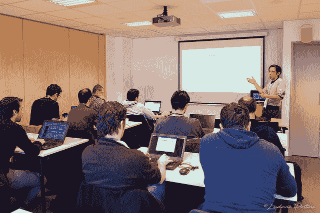
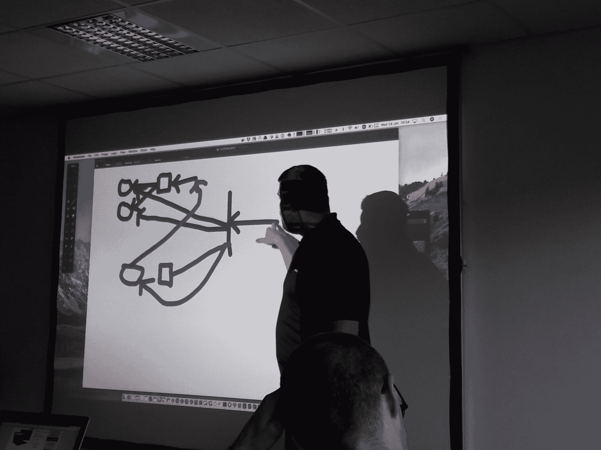
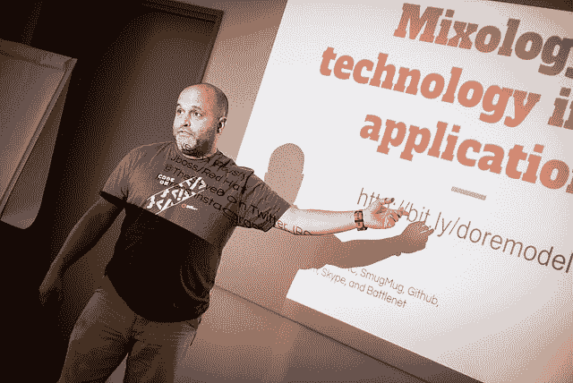
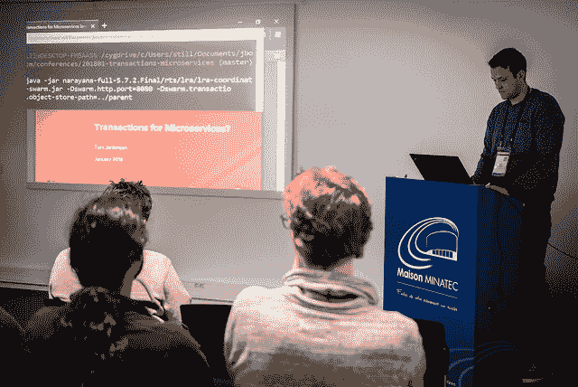

# 雪地营 2018 旅行报告

> 原文：<https://developers.redhat.com/blog/2018/02/06/snowcamp-2018>

Last week, Red Hat was present at the SnowCamp conference in Grenoble, France. The [SnowCamp](http://snowcamp.io/en/) is a technical conference that includes a unique combination of deep dive sessions (universities), technical talks, and a final day on the ski slopes. With around 400 attendees and 70 sessions, this third edition of the SnowCamp was a great opportunity to meet the developers from the Grenoble area, in the most innovative city in the world (Source: [Forbes](http://digital-grenoble.com/2014/03/forbes-positionne-grenoble-5e-ville-innovante-au-monde)  and [Mashable](http://mashable.com/2013/11/09/grenoble-tech/)). Red Hatters presented 2 universities and 7 talks covering many projects and products, such as OpenShift, Infinispan, Monitoring, and Containers. Let’s have a look to them.  [caption id="attachment_452957" align="alignright" width="565"] Simon explaining Prometheus[/caption]

## 大学-普罗米修斯&朋友-西蒙·帕斯奎尔

During this workshop, Simon explained what Prometheus is, which use cases it can address, and how to use it. Strongly integrated with Kubernetes, and part of the Cloud Native Computing Foundation, Prometheus is an open-source tool used to collect, store, explore, and create alerts on your metrics. First, Simon presented the concepts and architecture, as well as the installation of the different components to monitor a local machine. Then Simon explained how alerting works, and how existing applications can be instrumented for Prometheus. Finally, Simon discussed more advanced use cases like high-availability and federation.

*   [幻灯片](https://drive.google.com/open?id=1zb0XrhvAK5PAYjhUtvarjGsGX8XbMaZ0) | [代码](https://github.com/simonpasquier/prometheus_workshop)

[caption id="" align="alignleft" width="526"] When @laurentvaills asks a question to @marek_jelen, Marek designs a US Football tactics! @SnowCampIO #GoChampions #docker #Kubernetes #openshift[/caption]

## 面向 Java 开发人员的大学- Docker、Kubernetes 和 open shift-Marek Jelen

This lab prepares web and application developers for building applications with containers, Kubernetes, and OpenShift. After a short introduction to containers and Kubernetes (which are the foundation of OpenShift), the attendees walk through a variety of applications and use cases for OpenShift. Just a give you a sampling of what the attendees have discovered in this lab, things like deploying existing containers, health check, building application containers, and scalability patterns.  And all of this is presented from a developer point of view.

*   [实验室说明](https://gist.github.com/marekjelen/3c50f92579c0ad77ef24957f1b5b3861)

## open shift——Kubernetes 为工程师带来的力量——Marek Jelen

In this talk, Marek explains how operations tools like Kubernetes can be useful for engineers.  This talk presents OpenShift and Kubernetes from the engineer’s perspective, including what benefits you can get and what features you can expect.

## 应用中的技术组合——Steven Pousty

Our industry has grown up with some pretty ridiculous assumptions about our technology, the rapid pace of change, and how we deal with our tools. In this talk, Steven dispels some of the myths, and helps you embrace a healthier approach to new technology and refactoring your work. [caption id="attachment_452967" align="aligncenter" width="464"] Steven on stage[/caption] An amazing show from Steven!

*   [幻灯片](http://bit.ly/doremodel)

## 反应式烹饪——克莱门特·埃斯科菲耶

What about freedom? Most frameworks existing today tell you how to design and implement your system. Of course, these are “good practices”. But, every single application is slightly different, and pretty quickly these frameworks get in your way. In this talk, Clement shows how Eclipse Vert.x lets you shape your system as YOU want – because YOU know better about your application than any of the developers involved on the framework. To illustrate the versatility of the Eclipse Vert.x, two very different applications were live coded during the talk.  The first was a microservice-based API, and the second was an IoT platform mixing MQTT, Apache Kafka, and web sockets. Let’s be back in charge!

*   [幻灯片](https://docs.google.com/presentation/d/1GxDSh5pVm3wiHHi5C48cSj6PpGDt1Y9wYsHfgsNSAps/edit?usp=sharing) | [代码](https://github.com/cescoffier/various-vertx-demos)

## 当需要分发锁时——Katia Aresti

This talk is a myth buster. Lots of people forget that distributed systems are **HARD**. In this talk, Katia shows how to implement a distributed lock, a quite simple structure isn’t it?  This presentation looks under the hood and shows with live-coding style how this new API has been created with already existing and production-ready functionalities in Infinispan. The Vert.x example uses Vert.x - Infinispan cluster manager, powered by JBoss Infinispan 9.2\. Infinispan 9.2 has a new ClusteredLock API to solve concurrency problems between Infinispan nodes.

*   [幻灯片](https://speakerdeck.com/karesti/creating-and-using-a-distributed-lock)

## 融合地理数据、大数据和 Web 应用——Steven Pousty

For the longest time, web development and statistical/big data analysis lived in separate worlds. Due to some recent developments in technology and software, this restriction no longer applies. In this talk, Steven demonstrates some of the cool applications we can now start to build. The demo shows Spark, Node.JS, and Python, all spun up in a consistent manner on Kubernetes.

*   [幻灯片](http://bit.ly/convergedata)

## 微服务交易–汤姆·简金森

This session is a great introduction to the topic of how to realize the practical application of transactions in your microservices architecture. During the session Tom explores some of the considerations when selecting the appropriate transactional model, and the impact this will have on the system.

*   [幻灯片](https://github.com/jbosstm/conferences/blob/master/201801-transactions-microservices/presentation/Transactions%20for%20Microservices%20January%202018.pdf)

[caption id="attachment_452987" align="aligncenter" width="480"] Tom demoing transactions in microservices[/caption]

## 集装箱模式——Mario Loriedo

Containers have become popular in the last two years, and new ways to use them are now emerging. Mario has done a catalog about the different and sometimes crazy ways people are using containers, identifying 14 patterns divided on 3 categories: development, runtime, and delivery.

*   [幻灯片](https://l0rd.github.io/containerspatterns)

## 还没完呢！

Because talks are not the only way we share, Red Hat also had a booth at SnowCamp. We had discussions with many attendees about containers, OpenShift, middleware, IDEs, and tooling. And of course, the *bravest* went on the slopes on Saturday! *Pictures have been taken by Ludovic Poitou, Bruno Lavit* and *Chris Laprun.* *Last updated: May 13, 2021*