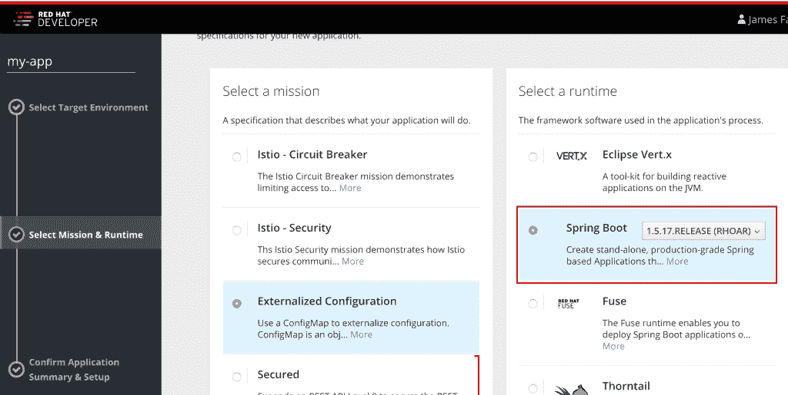
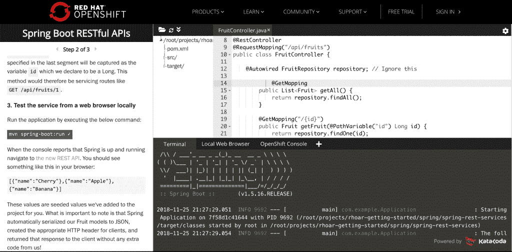

# 扩展对 Spring Boot Red Hat open shift 应用程序运行时的支持

> 原文：<https://developers.redhat.com/blog/2018/11/26/spring-boot-red-hat-openshift-application-runtimes>

## 红帽提供了什么

[Red Hat OpenShift 应用运行时](https://developers.redhat.com/products/rhoar/overview/) (RHOAR)是一套推荐的产品、工具和组件，用于在 [Red Hat OpenShift](https://www.openshift.com/) 平台上开发和维护云原生应用。作为该产品的一部分，Red Hat 正在扩展其对 Spring Boot 和相关框架的支持，以构建现代的、生产级的、基于 Java 的云原生应用。

Spring Boot 让你创建基于 Spring 的独立应用程序。Spring Boot 运行时还与 OpenShift 平台集成，允许您的服务将它们的配置外部化，实现健康检查，提供弹性和故障转移，等等。要了解更多有关 Spring Boot 应用程序如何与更广泛的 Red Hat 产品组合集成的信息，请查看下面由 Thomas Qvarnstrom 撰写的 OpenShift Commons 简报:

[https://www.youtube.com/embed/wQ9QSvc0qi8?autoplay=0&start=0&rel=0](https://www.youtube.com/embed/wQ9QSvc0qi8?autoplay=0&start=0&rel=0)

## 版本控制

红帽最初在红帽 OpenShift 上支持 Spring Boot **1.5.17** 。计划在 2019 年初支持 Spring Boot 2.1。Spring Boot 2.1 增加了额外的功能和框架，但许多 Spring Boot 1.5.x 应用程序仍在生产中，因此支持这两者对我们现有的客户和更广泛的开发社区至关重要。

## 支持详细信息

Spring 生态系统包含许多用于构建各种应用程序类型的流行框架。当与 RHOAR 一起使用时，Red Hat 的支持仅限于那些主要针对现代云原生[微服务](https://developers.redhat.com/topics/microservices/)应用的框架，以及源自 Red Hat 积极参与或领导的上游开源社区的框架。该文档页面上的列表准确显示了包含的内容，并将在未来几周内更新到 1.5.17。Red Hat 客户还可以参考客户门户网站上的 [Spring Boot 支持页面，了解更多详细信息。](https://access.redhat.com/articles/3710221)

下面是此产品包含的支持类型的简要概述:

*   **配置支持**。Red Hat 将帮助客户进行 Spring Boot 配置，以便在 OpenShift 上正常运行。这和帮客户正确配置红帽产品没什么区别。
*   **工作区支持**。与任何产品一样，如果一个 Spring Boot 应用程序没有像开发人员设想的那样工作，但实际上，它实际上是按照定义工作的，那么在这些情况下，Red Hat 将与客户合作，帮助找到实现解决方案的另一种方法。
*   **产品集成支持**。RHOAR 的 Spring Boot 支持包括对许多 Red Hat 领导的开源框架和平台的支持。一些例子包括 [OpenShift](https://openshift.com) 、 [Tomcat](https://tomcat.apache.org) 、[under flow](http://undertow.io/)和 [Red Hat 单点登录/键盘锁](https://access.redhat.com/products/red-hat-single-sign-on)。随着红帽继续将 Spring Boot 与红帽的更多产品组合相结合，这个列表还会继续增长。
*   **新功能请求**。Red Hat 将接受 Red Hat 产品功能请求，以优化 Spring Boot 应用程序对 Red Hat 产品的使用。在合理的情况下，Red Hat 将在 Spring 社区中上游工作，代表客户倡导所请求的 Spring Boot 功能。
*   **Bug 修复**。当 Spring 代码中的错误被识别出来后，Red Hat 将致力于解决这些错误。对于非关键问题，Red Hat 将在上游 Spring 社区中解决该问题。当某个问题在 Spring 社区中得到解决时，该修复可能会在未来的 Spring 更新中提供。对于 Red Hat 可以立即解决的关键 [*严重性 1*](https://access.redhat.com/support/policy/severity/) 问题，Red Hat 可能会立即为客户提供修复方案，让他们尽快启动并运行，同时还会努力在 Spring 社区中解决该问题。红帽希望保持对春季社区分布的真实。对于在 Spring 社区中无法解决的问题，Red Hat 提供了*解决方法支持*(见上文)。

### 其他注意事项

Red Hat 只为它领导和分发的那些 Spring 框架提供二进制文件(例如 Undertow、Hibernate、embedded Tomcat、Keycloak 和 Apache CXF)。其他组件仍然通过正常渠道分发(例如 Maven Central)。这些组件通过 Spring Boot *启动器*消耗。

## 启动 OpenShift

下图显示了将 Spring Boot 应用程序启动到 OpenShift 中:

[](https://developers.redhat.com/blog/wp-content/uploads/2018/11/Screen-Shot-2018-11-25-at-4.17.25-PM.png)

使用[developers.redhat.com/launch](https://developers.redhat.com/launch)你可以立即创建一个 Spring Boot 应用并直接部署到 [Red Hat OpenShift Online](http://openshift.com/) 或你自己的本地 OpenShift 集群。它提供了一种创建名为*加速器*的示例应用程序的简单方法，以及一种构建和部署这些加速器到 OpenShift 的简单方法。

支持者可以展示开发人员如何使用 Spring Boot 来构建云原生应用和服务的基本构建块，如创建安全的 RESTful APIs、实现健康检查、外部化配置或与基于 [Istio](https://developers.redhat.com/topics/service-mesh/) 项目的 OpenShift 服务网格集成。

## 使用 Spring Boot 测试一个示例应用程序

Spring Boot 是一个 Java 框架，因此，它可以使用 [OpenJDK](https://developers.redhat.com/products/openjdk/overview/) 运行。让我们在 OpenShift 上试驾一款 Spring Boot 助推器。(这里我使用的是 [Red Hat 容器开发工具包](https://developers.redhat.com/products/cdk/overview/)，但是任何 OpenShift 集群都可以。)下面是一组命令，您可以使用这些命令将 OpenJDK 映像拖到您的本地系统，以便与 Spring Boot 一起使用:

```
oc new-project spring-boot
oc import-image java:8 --from=registry.access.redhat.com/redhat-openjdk-18/openjdk18-openshift --confirm
```

然后，可以使用以下命令来构建 Spring Boot 应用程序并将其部署到 Red Hat OpenShift:

```
oc new-app --name rest-example 'java:8~https://github.com/snowdrop/spring-boot-http-booster#1.5.17-4-redhat'
oc expose svc/rest-example
```

您可以观看构建过程:

```
oc logs -f bc/rest-example
```

构建完成后，等待部署完成:

```
oc rollout status -w dc/rest-example
```

然后访问示例应用程序的用户界面:

```
open http://$(oc get route rest-example -o jsonpath='{.spec.host}{"\n"}')
```

使用 OpenJDK 发行版运行 Spring Boot 应用程序的 Red Hat 客户将能够保持最新的更新、安全建议，了解容器更新的时间和原因，并保持最新的可用标记 OpenJDK 映像。

## 证明文件

RHOAR 团队一直在为开发 Spring Boot 应用程序的开发人员增加和改进官方文档。这包括发行说明、入门指南和新的 Spring Boot 运行时指南中的更新。(请注意，该指南正在更新为最新版本。)

## 开发者互动学习场景

这些[自定进度场景](https://learn.openshift.com/middleware/courses/middleware-spring-boot/)为您提供了一个预配置的 OpenShift 实例，无需任何下载或配置即可从您的浏览器访问。使用它来试验在 OpenShift 上构建 Spring Boot 应用程序，以及使用各种 Spring 框架和 Red Hat 技术构建应用程序。下图是 learn.openshift.com 上的互动学习场景:

[](http://learn.openshift.com)

## 为 Spring Boot 争取支持

Red Hat 客户可以通过订阅 [Red Hat OpenShift 应用运行时](https://developers.redhat.com/products/rhoar/overview/)来获得对 Spring Boot 的支持。请联系您当地的 Red Hat 代表或 [Red Hat 销售部](https://www.redhat.com/en/about/contact/sales)，了解如何享受 Red Hat 及其全球合作伙伴网络提供的世界级支持。

展望未来，根据 [Red Hat 产品更新和支持生命周期](https://access.redhat.com/support/policy/updates/jboss_notes/)，客户可以期待对 Spring Boot 和其他 RHOAR 运行时的支持。

## Spring Boot 支持的下一步是什么？

RHOAR Spring Boot 团队不断从客户和更广泛的开源开发者社区获得反馈，同时跟踪上游 Spring Boot 发布的版本。他们正在根据反馈对 RHOAR 进行更新，并考虑支持来自 Red Hat 和非常大的 Java 社区的其他模块。

## 红帽的 Spring Boot 支持者背后的人

该产品由 Red Hat 的 RHOAR 产品和工程团队开发，涉及许多小时的开发、测试、编写文档、测试以及与更广泛的 Red Hat 客户、合作伙伴和 Spring 开发人员社区合作，以整合大大小小的贡献。我们很高兴你选择使用它，并希望它达到或超过你的期望！

## Spring Boot 资源公司

*   [Red Hat OpenShift 应用运行时开发者主页](https://developers.redhat.com/products/rhoar/overview/)
*   [Spring Boot 运行时指南](https://access.redhat.com/products)
*   [Spring Boot 问题跟踪者](https://issues.jboss.org/projects/SB/issues/SB-344?filter=allopenissues)
*   [open shift 上的 Spring Boot 互动学习场景](https://learn.openshift.com/middleware/courses/middleware-spring-boot/)
*   [RHOAR 发射器](https://developers.redhat.com/launch)

*Last updated: October 20, 2022*