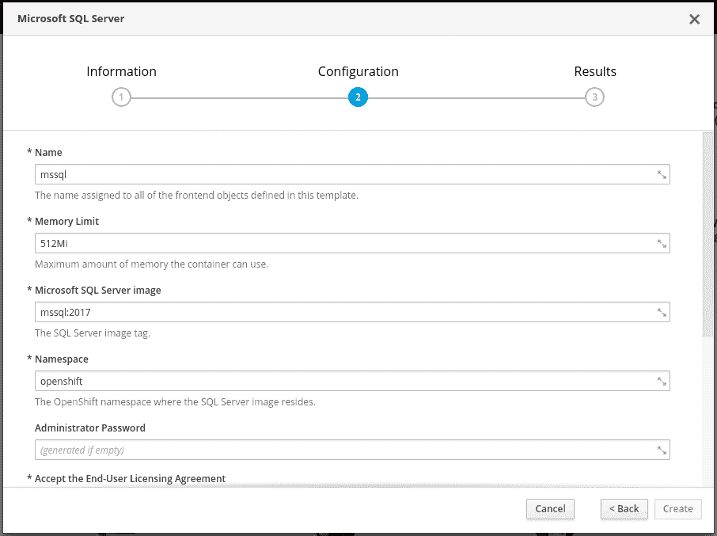
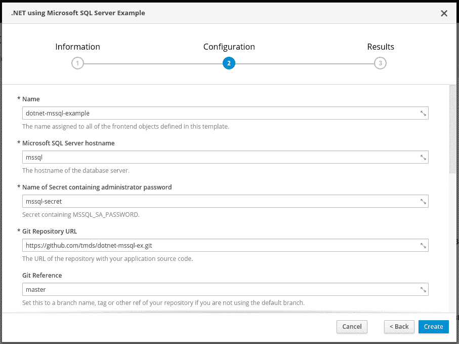
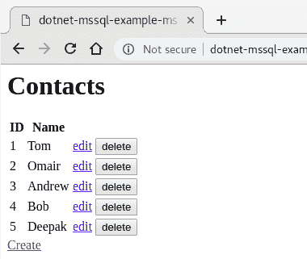
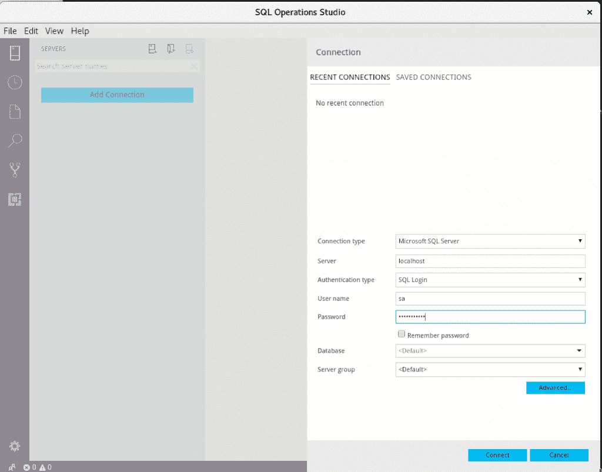
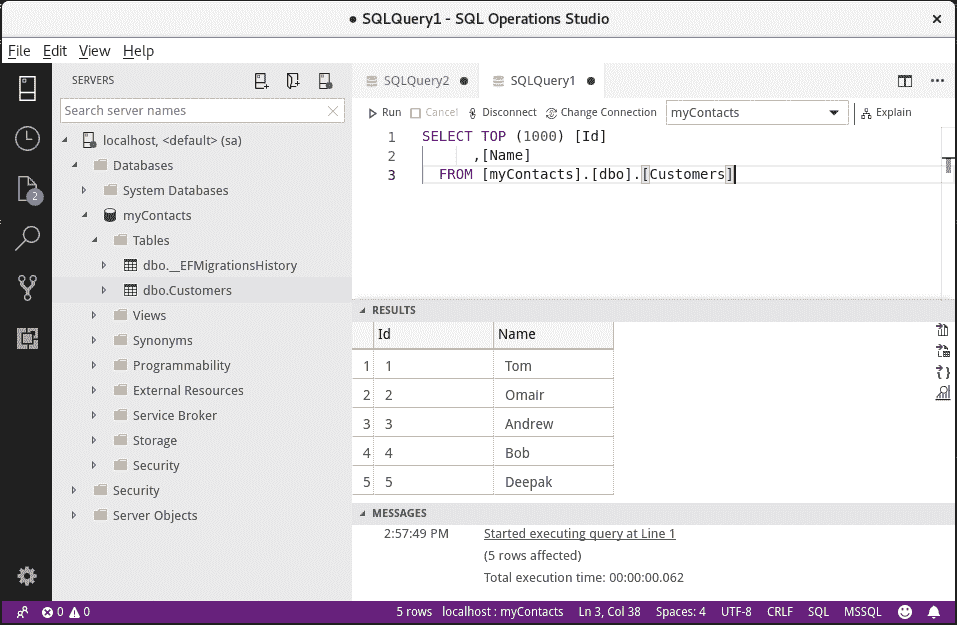

# 在 Red Hat OpenShift 上运行 Microsoft SQL Server

> 原文：<https://developers.redhat.com/blog/2018/09/25/sql-server-on-openshift>

在这篇博文中，我们将在 [Red Hat OpenShift](http://openshift.com/) 上设置 Microsoft SQL Server。我们将使用 SQL Server 为一个简单的[ASP.NET 核心](https://developers.redhat.com/products/dotnet/overview/)应用程序存储数据，该应用程序运行在部署在 OpenShift 上的一个管理联系人列表的容器中。设置好之后，我们将使用 SQL Operation Studio 从我们的开发人员机器连接到运行在 OpenShift 上的服务器。

## 安装和配置 CDK

为此，我们将使用 [Red Hat 容器开发工具包](https://developers.redhat.com/products/cdk/overview/) (CDK)。CDK 为您提供了开发基于容器的应用程序的所有工具。使用 CDK，您将在一个 VM 中运行 OpenShift(和 Kubernetes ),该 VM 包括您的 Windows、macOS 或 Linux 机器上的单节点 OpenShift 集群。

要使用 CDK，您需要免费订阅。当你从[developers.redhat.com](https://developers.redhat.com)下载 CDK 时，一个免费的开发者订阅将自动添加到你的帐户中。按照[这些说明](https://developers.redhat.com/products/cdk/hello-world/)安装 CDK。

接下来，我们将更新。在我们的 minishift 实例上可用的 NET Core 版本。(如果您还没有这样做，请启动 minishift。)我们将在`openshift`项目中这样做，这将使。NET 核心可用于我们所有的 OpenShift 项目。为此，以管理员身份登录，然后切换到`openshift`项目。如果`oc`二进制文件不在您的路径上，请执行`minishift oc-env`中描述的步骤。

```
oc login -u system:admin
oc project openshift
```

现在我们已经切换到了`openshift`项目，更新您的。按照[安装镜像流](https://access.redhat.com/documentation/en-us/net_core/2.1/html/getting_started_guide/gs_dotnet_on_openshift#install_imagestreams)中的步骤安装. NET Core 版本。

最后一步，我们将添加 SQL Server 2017 支持(`mssql:2017` image)和两个模板，以便于设置 SQL Server 和我们的。NET 核心应用程序。

```
oc create -f https://raw.githubusercontent.com/tmds/dotnet-mssql-ex/master/openshift/imagestreams.json
oc create -f https://raw.githubusercontent.com/tmds/dotnet-mssql-ex/master/openshift/template.json
oc create -f https://raw.githubusercontent.com/tmds/dotnet-mssql-ex/master/app/RazorPagesContacts/dotnet-template.json
```

现在，我们将切换回开发人员用户帐户:

```
oc login -u developer
```

## 部署 SQL Server

通过运行`minishift console`打开 OpenShift web UI。如果您以前没有打开过它，您需要接受使用自签名证书。

现在使用`developer` / `developer`登录。

使用右上角的**创建项目**按钮创建一个项目，并将项目命名为`mssqldemo`。

UI 将切换到新项目，我们将通过单击**浏览目录**并选择 **Microsoft SQL Server** 来添加我们的 SQL Server。默认值将创建一个名为`mssql`的 SQL server 实例。您需要通过在相应的文本框中键入 **Y** 来接受 EULA。然后点击**创建**来部署 SQL Server。

[](https://developers.redhat.com/blog/wp-content/uploads/2018/09/fig1-1.png)

如果您使用左上角的 **Overview** 按钮移动到项目概述，您将看到运行我们的 SQL Server 的 pod。你可以点击右侧的 **1 舱**，这将为你提供关于该舱的更多信息。点击顶部的**日志**将显示 SQL server 日志。如果您滚动日志，您会看到我们在 [Red Hat Enterprise Linux](https://developers.redhat.com/products/rhel/download/) 上运行 SQL Server，它在 1433 端口监听我们。

作为我们部署的一部分，创建了两个有趣的资源:一个名为`mssql-secret`的秘密，它存储我们的 SQL Server 密码，另一个名为`mssql-pcc`的永久卷声明(PVC ),它代表来自我们数据库服务器的永久存储。你可以分别在**资源>秘密**和**存储**下看到这些资源。看看里面储存的秘密和密码。

## 从使用 SQL Server。网络核心

回到**概述**。现在在右上角选择**添加到项目>浏览目录**。我们将使用**。NET 这次用的是微软 SQL Server** 模板。您可以使用默认参数。注意，我们传递了 SQL 服务器的名称(`mssql`)和包含密码的秘密名称(`mssql-secret`)。

[](https://developers.redhat.com/blog/wp-content/uploads/2018/09/fig2.png)

SQL Server 名称和密码作为环境变量(`MSSQL_SERVER`和`MSSQL_SA_PASSWORD`)传递给。NET 核心应用程序作为模板的一部分。此外，该模板将`DB_PROVIDER`设置为`mssql`，以配置应用程序使用 SQL Server 作为后端。如果你看一下 [template.json](https://raw.githubusercontent.com/tmds/dotnet-mssql-ex/master/app/RazorPagesContacts/dotnet-template.json) 文件，你就可以看到这一点。

我们的应用程序中使用这些变量的代码如下所示:

```
enum DbProvider
{
  Mssql,
  Memory
}

public void ConfigureServices(IServiceCollection services)
{
  DbProvider? dbProvider = Configuration.GetValue<DbProvider?>("DB_PROVIDER");
  if (dbProvider == null && !IsOpenShift)
  {
    dbProvider = DbProvider.Memory;
  }
  switch (dbProvider)
  {
    case DbProvider.Mssql:
      string server = Configuration["MSSQL_SERVER"] ?? "localhost";
      string password = Configuration["MSSQL_SA_PASSWORD"];
      string user = "sa";
      string dbName = "myContacts";
      string connectionString = $@"Server={server};Database={dbName};User Id={user};Password={password};";
      Logger.LogInformation($"Using SQL Server: {server}");
      services.AddDbContext(options => options.UseSqlServer(connectionString));
      break;
    case DbProvider.Memory:
      Logger.LogInformation("Using InMemory database");
      services.AddDbContext(options => options.UseInMemoryDatabase("name"));
      _migrateDatabase = false;
      break;
    default:
      throw new Exception($"Unknown db provider: {dbProvider}");
  }
  services.AddMvc();
}
private static bool IsOpenShift => !string.IsNullOrEmpty(Environment.GetEnvironmentVariable("OPENSHIFT_BUILD_NAME"));
```

```
当我们的应用程序第一次启动时，它将创建数据库来存储我们的联系人。
这是使用[实体框架迁移](https://docs.microsoft.com/en-us/ef/core/managing-schemas/migrations/)完成的。创建数据库的代码是我们项目的一部分，是使用`dotnet ef migrations add Initial`生成的。
为了在启动时应用迁移，我们的项目有以下代码:

```
public void Configure(IApplicationBuilder app)
{
  if (_migrateDatabase)
  {
    MigrateDatabase(app);
  }
  app.UseMvc();
}
private static void MigrateDatabase(IApplicationBuilder app)
{
  using (var serviceScope = app.ApplicationServices
                               .GetRequiredService()
                               .CreateScope())
  {
    using (var context = serviceScope.ServiceProvider.GetService())
    {
      context.Database.Migrate();
    }
  }
}
```

在**概述**中，我们可以看到我们的应用程序正在构建和部署。应用程序窗格启动并运行后，单击 URL 打开网站。使用**创建**链接向数据库添加几个名字。
[](https://developers.redhat.com/blog/wp-content/uploads/2018/09/fig3.png)
使用 SQL Operations Studio 管理 SQL Server
SQL Operations Studio 是一个用于管理 SQL Server 的跨平台工具。你可以在找到[中的安装说明。](https://docs.microsoft.com/en-us/sql/sql-operations-studio/download?view=sql-server-2017)
SQL Server 只能在 OpenShift 群集中访问。为了能够从我们的机器连接到它，我们将端口转发到 SQL Server pod。
首先，我们找出运行 SQL Server 的 pod 的名称:

```
$ oc get pod | grep mssql | grep Running
dotnet-mssql-example-1-gmdvf   1/1       Running     0          43m
mssql-1-l7wn8                  1/1       Running     0          1h

```

该命令的输出显示我们的 SQL Server pod 名为`mssql-1-l7wn8`,我们的。NET 核心应用命名为`dotnet-mssql-example-1-gmdvf`。
现在我们可以设置端口转发:

```
oc port-forward mssql-1-l7wn8 1433:1433
```

现在打开 SQL Operations Studio，使用来自`mssql-secret`的密码为用户`sa`添加一个到本地主机的连接。
[](https://developers.redhat.com/blog/wp-content/uploads/2018/09/fig4.png)
成功连接后，我们可以看到服务器上的数据库及其表。导航到 **myContacts** 数据库中的 **Customers** 表。
要查看数据库中的数据，右键单击并单击**选择前 1000 个**。查询运行，我们使用 ASP.NET 核心应用程序输入的数据显示在查询结果中。
[](https://developers.redhat.com/blog/wp-content/uploads/2018/09/fig5.png)
结论
在这篇博文中，您了解了如何在 OpenShift 上部署 Microsoft SQL Server，以及如何在 OpenShift 上运行的 ASP.NET 核心应用程序中使用它。您还看到了如何使用 SQL Operations Studio 连接到数据库服务器。

																*Last updated:
							September 3, 2019*

```