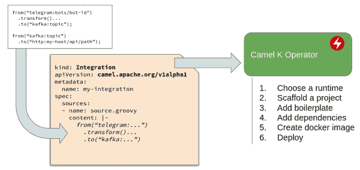
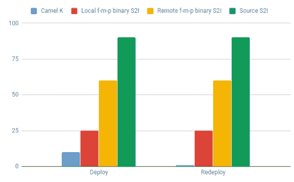
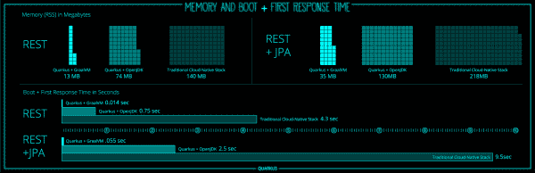

# Apache Camel 应用程序的亚秒级部署和启动

> 原文：<https://developers.redhat.com/blog/2019/05/20/subsecond-deployment-and-startup-of-apache-camel-applications>

整合空间是不断变化的。许多开源项目和闭源技术没有经受住时间的考验，已经从中间件栈中消失了。然而，十年之后， [Apache Camel](https://camel.apache.org/) 仍然在这里，并且在下一个十年的整合中变得更加强大。在本文中，我将提供一些 Camel 的历史，然后描述 Apache Camel 现在的两个变化(以及后来的 [Red Hat Fuse](https://developers.redhat.com/products/fuse/overview/) )以及为什么它们对开发人员很重要。我将这些变化称为 Camel 应用程序的*次秒部署*和*次秒启动*。

### “四人帮”的整合

Apache Camel 最初是作为《企业集成模式》()一书的实现而存在的。今天，这些模式相当于面向对象的[四人组设计模式](https://www.amazon.com/Design-Patterns-Elements-Reusable-Object-Oriented/dp/0201633612/ref=sr_1_3?crid=S8G9XY6IXKGL&keywords=gang+of+four+design+patterns&qid=1557951062&s=books&sprefix=gang+of+four%2Cstripbooks%2C168&sr=1-3)，但是用于消息传递和集成领域。它们与编程语言、平台、体系结构无关，并提供了一种通用语言、符号和围绕基本消息传递原语的描述。

但是骆驼群落并没有止步于这些模式；他们不断发展，并从面向服务的架构(SOA)、微服务、云原生和无服务器范例中添加更新的模式。结果，Camel 变成了一个通用的基于模式的集成框架，适用于多种架构。

### 通用图书馆消费模型

尽管这些模式给了 Camel 最初的灵感，但它的端点很快变得流行起来，并变成了使用基于 Java 的集成库作为连接器的通用协议。今天，有数百个 Java 库可以使用 Camel 端点符号作为 Camel 连接器。需要一段时间才能意识到，没有 EIP 和路由引擎也可以使用 Camel。它可以充当一个连接器框架，在这个框架中，所有的库都作为通用 URIs 使用，而不需要理解特定于库的工厂和配置，这些工厂和配置在 Java 库中变化很大。

### 正确的抽象层次

一些开发人员会告诉你，没有 Camel 也可以进行集成，他们对大约 80%的简单用例是正确的，但对另外 20%的可能将项目变成多年令人沮丧的体验的用例是错误的。他们没有意识到的是，如果没有 Camel，有多种手动方法可以做同样的事情，但是没有一种方法被数百名开源开发者的经验所验证。而且，没有 Camel，一个集成项目可能很快变成一个定制的、自己开发的框架，没有人愿意参与其中。

进行集成是容易的，但是由许多团队进行多年发展和成长的好的集成是困难的。 Camel 通过通用模式和连接器，结合经过时间考验的专注于集成的[DSL](https://developers.redhat.com/blog/2017/12/21/camel-dsl-choose/)，解决了这一挑战。

如果你认为你不需要 Camel，你要么是在考虑短期收益，要么是你还没有意识到集成会变得多么复杂。

### 拥抱变化

只需要在大型集成项目中经历几次痛苦的经历，就可以开始欣赏 Camel。但是 Camel 之所以伟大，不仅仅是因为它建立在伟大思想的基础上，还因为它的发展得益于世界的知识，通过开源模式及其网络效应共享的知识。Camel 在 SOA 时期开始作为企业服务总线(ESB)的路由层，主要关注 XML、WS、JBI、OSGI 等。，但它很快被改编为休息，招摇，断路器，传奇和微服务时代的 Spring Boot。

而且，它并没有就此停止。有了容器和 Kubernetes，以及现在的无服务器架构，Camel 一直在拥抱变化。那是因为 Camel 是为整合不断变化的环境而写的，Camel 本身也在变化中成长、发光。Camel 是一个支持变化的集成库。

### 幕后引擎

Camel 的秘密武器之一是它是一个非侵入性、非个人化、小型(5MB 并且越来越小)的集成库，与您在哪里以及如何使用它没有任何关系。如果你注意到，这是 ESB 的反义词，Camel 通常会因为其广泛的功能而与 ESB 混淆。多年来，Camel 一直被用作项目的内部发动机，例如:

*   Apache ServiceMix ESB
*   Apache ActiveMQ
*   Talend ESB
*   JBoss 开关站
*   JBoss 保险丝维修厂
*   红帽保险丝
*   [在线融合/合成设计](https://syndesis.io/)
*   还有很多其他框架在这里提到了。

你可以单独用 Camel，嵌入阿帕奇 Tomcat，有 Spring Boot 首发，JBoss WildFly，阿帕奇 Karaf，Vert.x， [Quarkus](https://quarkus.io/extensions/) ，你说得出的。Camel 不在乎，每次都会给你的项目带来超能力。

## 展望未来

我无法预测十年后理想的集成堆栈会是什么样子——没人能预测。但是我可以告诉你现在 Apache Camel 中的两个新特性(以及稍后的红帽融合)以及为什么它们会对开发者和业务产生显著的积极影响。我将这些变化称为 Camel 应用程序的*次秒部署*和*次秒启动*。

### 次秒部署到 Kubernetes

曾经有一段时间，云原生意味着不同的技术。今天，经过几年的自然选择和行业整合，云原生意味着为基于容器的环境创建的应用程序，如 Kubernetes 及其在[云原生计算基金会](https://www.cncf.io/)内的项目生态系统。即使有了这个定义，云原生也有许多不同之处，从在容器中运行单一的不可扩展的应用程序，到触发完全包含云原生开发和管理实践的功能。

Camel 社区已经意识到 Kubernetes 是下一代[应用程序运行时](https://developers.redhat.com/blog/2018/06/28/why-kubernetes-is-the-new-application-server/)，并且它正在稳步致力于使 Camel 成为 Kubernetes 的本地集成引擎。就像 Camel 是 [OSGi](https://www.osgi.org/developer/architecture/) 容器、 [Java EE](https://www.oracle.com/technetwork/java/javaee/overview/index.html) 应用服务器和其他 fat-jar 运行时的一等公民一样，Camel 正在成为 Kubernetes 上的一等公民，深度集成并受益于该平台提供的弹性和可伸缩性。

以下是在这个方向上进行的许多增强工作中的一些:

*   **更深层次的 Kubernetes 集成** — Kubernetes API 连接器、针对 Camel 子系统的全面健康检查 API 实施、通过新服务呼叫 EIP 的服务发现、使用 ConfigMaps 的配置管理。然后是一套在 Kubernetes 上有特殊处理的应用模式，比如:集群化的[单体路由](https://www.nicolaferraro.me/2017/10/17/creating-clustered-singleton-services-on-kubernetes/)、[可扩展的 XA 事务](https://access.redhat.com/documentation/en-us/red_hat_fuse/7.2/html/fuse_on_openshift_guide/camel-spring-boot_xa)(因为有时候，你不得不)，传奇模式[实现](https://www.nicolaferraro.me/2018/04/25/saga-pattern-in-apache-camel/)等。
*   **云原生集成** —支持其他云原生项目，如为普罗米修斯展示[骆驼度量、](https://brunonetid.github.io/2017/11/27/camel-prometheus-openshift.html)[通过 Jaeger 追踪骆驼路线](https://medium.com/jaegertracing/using-jaeger-to-trace-an-apache-camel-application-2b8118efbb4d)、用于日志聚合的 JSON 格式日志记录等。
*   **不可变运行时** —无论你使用极简的不可变 Apache Karaf 包装还是 Spring Boot，Camel 都是准备放入容器映像的一等公民。还有针对所有 Camel 连接器的 Spring Boot 启动器实现，集成了路由、属性、转换器等等。
*   骆驼 3 号——阿帕奇骆驼 3 号[是事实](https://medium.com/@davsclaus/work-on-apache-camel-3-has-finally-started-e6a4276a95d5)并且正在积极进展中。Camel 3 的一个大主题是让它更加模块化，更小，启动时间更快，反应式，无阻塞，三重真棒。这是为未来的云工作负载重组 Camel 所需的基础工作。
*   Knative integration——[Knative](https://cloud.google.com/knative/)是谷歌发起的一项努力，旨在为亚马逊 Lambda 主导的无服务器世界带来一些秩序和标准化。Camel 是[将](https://www.nicolaferraro.me/2018/12/10/camel-k-on-knative/)与早期的 Knative 原语相集成的项目之一，并通过数百个连接器作为通用[事件源](https://knative.dev/development/eventing/samples/apache-camel-source/)来增强 Knative 生态系统。

这里有一个真正改变游戏规则的举措: [**Camel K**](https://www.nicolaferraro.me/2018/10/15/introducing-camel-k/) (又称深度 Kubernetes 整合为 Camel)。

我们已经看到，Camel 通常嵌入到最新的现代运行时中，它在幕后充当开发人员友好的集成引擎。就像过去 Camel 从热部署、配置管理、事务管理等 Java EE 服务中受益一样。现在，Camel K 允许 Camel runtime 从 Kubernetes 的高可用性、弹性、自我修复、自动伸缩和基本分布式应用程序管理特性中受益。

Camel K 通过一个 CLI 和一个[操作符](https://coreos.com/operators/)来实现这一点，其中后者能够理解 Camel 应用程序、其构建时依赖性、运行时需求，并从底层 Kubernetes 平台及其附加功能(来自 Knative、Istio、OpenShift 以及未来的其他功能)中做出明智的选择。它可以自动化集群上的一切，比如挑选最适合的容器映像和运行时管理模型，并在需要时更新它们。CLI 可以自动执行开发人员机器上的任务，比如观察代码更改，将这些更改流式传输到 Kubernetes 集群，打印运行 Pods 中的日志，等等。

Camel-K operatorCamel route auto-deployment to Kubernetes with Camel K.">

Camel K 操作符理解两个域:Kubernetes 和 Camel。通过结合这两个领域的知识，它可以自动完成通常需要人工操作的任务。

真正强大的部分是，使用 Camel K，可以在不到一秒钟的时间内从源代码到 Kubernetes 上运行的骆驼路线建立和部署骆驼路线。

Camel-K deployment timesTime to deploy and run a Camel integration(in seconds).">

在使用 Camel K 构建和部署 Camel route 时，忘记制作咖啡，甚至喝一小口，只要您更改源代码并打开浏览器，Camel route 就会在 Kubernetes 中运行。这将对开发人员编写 Camel 代码、编译、喝咖啡、部署和测试的方式产生显著的影响。除了改变开发实践和习惯之外，这个工具集将显著减少开发周期，这也会被业务涉众注意到。对于现场演示，请查看来自从事 Camel K 项目的 Fuse 工程师的这个精彩的[视频](https://www.youtube.com/watch?v=51x9BewGCYA)。

### Camel 应用的亚秒级启动

典型的企业集成环境由无状态服务、有状态服务、集群应用、批处理作业、文件传输、消息传递、实时集成，甚至可能是基于[区块链-](https://techcrunch.com/2019/02/05/blockchain-as-integration-evolution/) 的业务流程组成。对于这种混合，今天，我们还必须添加无服务器工作负载，这最适合事件驱动的用例。

从历史上看，与 Go、Javascript 和无服务器领域的其他轻量级运行时相比，沉重而缓慢的 Java 运行时有着明显的缺点。这是 Oracle 创建 [GraalVM/Substrate VM](https://github.com/oracle/graal/tree/master/substratevm) 的主要动机之一。Substrate VM 是一个框架，支持提前(AOT)将 Java 应用程序编译成轻量级和快速的本地可执行文件。然后，Red Hat 最近的一项努力导致了 [Quarkus 项目](https://developers.redhat.com/blog/2019/03/07/quarkus-next-generation-kubernetes-native-java-framework/)的创建，它进一步改善了 Java 应用程序的资源消耗、启动和响应时间，令人震惊(这个术语在这里并不常用)。

Supersonic subatomic Java with Quarkus.">

从上面的指标可以看出，Quarkus 结合 SubstrateVM 并不是一个渐进的演变。这是一个突变和革命性的飞跃，突然改变了 Java 在云原生工作负载中的足迹和速度。它使 Java 对无服务器架构变得友好。考虑到开发人员和库的巨大 Java 生态系统，它甚至将 Java 变成了最适合无服务器应用程序的语言。而且，它使得 Camel，[结合了](https://quarkus.io/extensions/)和 Quarkus，这是这个领域中放置得最好的集成库。

## 摘要

随着微服务架构的爆发，服务的数量增加了十倍，这催生了支持 Kubernetes 的架构。这些体系结构本质上是高度动态的，最强大的是轻量级和快速运行时，支持即时扩展和更高的部署密度。

Camel 是填补不同系统和服务之间空白的框架。它提供数据一致性保证、可靠的通信、故障转移、故障检测和恢复等等，以一种使开发人员高效的方式。现在，想象一下 2020 年同样强大的基于 Apache Camel 的集成，它在 20 毫秒内部署到 Kubernetes，20 毫秒内启动，需要 20MB 内存，消耗 20MB 磁盘空间。不管它是作为容器中的无状态应用程序运行，还是作为 Knative 上的函数运行。这意味着部署到 Kubernetes 的速度提高了 100 倍，启动时间加快了 100 倍，资源消耗减少了 10 倍，允许实时扩展、缩减和扩展到零。

这些变化是开发人员在开发过程中会注意到的，用户在使用系统时会注意到的，企业会注意到基础设施成本和整体交付速度。那才是我们一直在等待的真正的云原生时代。

*Last updated: September 3, 2019*