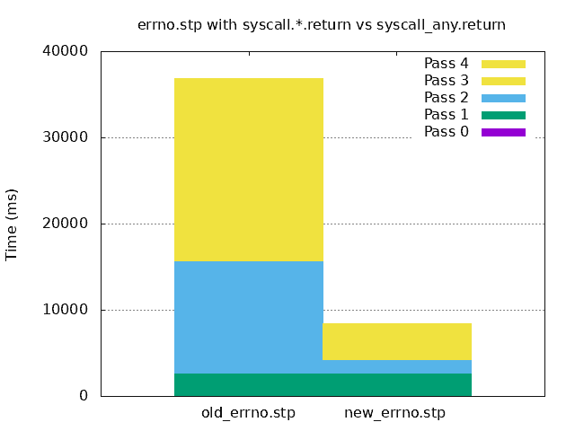

# 使用 syscall_any tapset 减少 SystemTap 监控脚本的启动开销

> 原文：<https://developers.redhat.com/blog/2018/11/08/systemtap-reduced-startup-syscalls>

Fedora 28 和 29 中新发布的 SystemTap 4.0 中的许多 [SystemTap](https://developers.redhat.com/blog/tag/systemtap/) 脚本示例通过使用`syscall_any` tapset 减少了将脚本转换为运行工具所需的时间。

本文讨论了脚本中所做的特殊更改，以及如何使用这个新 tapset 来使监视系统调用的工具变得更小、更有效。(本文是我上一篇文章的后续:[分析并降低 SystemTap 的脚本启动成本](https://developers.redhat.com/blog/2018/10/30/analyzing-reducing-systemtaps-startup-cost/#more-524657)。)

触发创建`syscall_any` tapset 的关键观察是许多不使用`syscall`参数的脚本。脚本经常使用`syscall.*`和`syscall.*.return`，但是它们只关心特定的`syscall`名称和返回值。所有系统调用的这类信息都可以从`sys_entry`和`sys_exit`内核跟踪点获得。因此，与其为实现各种系统调用的每个函数创建数百个 kprobes，还不如用几个跟踪点来代替它们。

让我们具体看看在 Fedora 28 机器上用`errno.stp`例子中的`syscall_any.*.return`代替`syscall.*.return`的影响。这个`errno.stp`脚本提供了关于返回错误代码的系统调用的系统范围的信息。它为 PID、系统调用和错误的每个组合打印一个单独的行。在每一行的末尾是这个特定组合被看到的次数。下面是一个使用`syscall.*.return`的脚本版本。

```
#!/usr/bin/stap
#
# Copyright (C) 2010, 2018 Red Hat, Inc.
# By Dominic Duval, Red Hat Inc.
# dduval@redhat.com
#
# Monitors errors returned by system calls.
#
# USAGE: stap errno.stp
#

global execname, errors

probe syscall.*.return {
  errno = retval
  if ( errno < 0 ) {
    p = pid()
    execname[p]=execname();
    errors[p, errno, name] <<< 1
  }
}

probe end {
  printf("\n")
  printf("%8s %-32s %-16s %-12s %8s\n",
    "PID", "Syscall", "Process", "Error", "Count")
  foreach ([pid, error, thissyscall] in errors- limit 20) {
    printf("%8d %-32s %-16s %-12s %8d\n",
      pid,
      thissyscall, 
      execname[pid],
      error ? errno_str(error) : "",
      @count(errors[pid, error, thissyscall])
    )
  }
}

global prom_arr

probe prometheus {
  foreach ([p, errno, name] in errors- limit 20) {
    prom_arr[p, errno, name] = @count(errors[p, errno, name])
  }

  @prometheus_dump_array3(prom_arr, "count", "pid", "errno", "name")
  delete prom_arr
}

```

我们可以使用我在[以前的 SystemTap 文章](https://developers.redhat.com/blog/2018/10/30/analyzing-reducing-systemtaps-startup-cost/)中讨论的`stap_time.stp`脚本来记录 SystemTap 各个阶段所需的时间。`stap_time.stp`脚本将在另一个窗口中运行。

下面是一段使用`syscall.*.return`探测点检测系统调用的`old_errorno.stp`脚本。命令行有`-m old_error`来保存生成的内核模块`old_errno.ko`，保留临时文件(`-k`)选项，这样我们可以查看用于创建插装的文件的大小，还有`-T 0.25`来运行插装四分之一秒。

```
$ stap -m old_errno -k old_errno.stp -T 0.25

     PID Syscall                          Process          Error           Count
    8489 read                             pulseaudio       EAGAIN             50
    9016 recvmsg                          Timer            EAGAIN             16
    9223 recvmsg                          firefox          EAGAIN             11
    9016 futex                            Timer            ETIMEDOUT           7
    8386 recvmsg                          gnome-shell      EAGAIN              7
   25430 recvmsg                          Web Content      EAGAIN              6
    2196 futex                            pmdaperfevent    ETIMEDOUT           2
   16278 read                             stapio           EAGAIN              1
   25430 futex                            Web Content      ETIMEDOUT           1
    9792 recvmsg                          hexchat          EAGAIN              1
Keeping temporary directory "/tmp/stapUfJ9KC"

```

现在我们将脚本中的`syscall.*.return`替换为`syscall_any.return`。新的改进版本具有类似的输出:

```
$ stap -m new_errno -k new_errno.stp -T 0.25

     PID Syscall                          Process          Error           Count
    8489 read                             pulseaudio       EAGAIN             50
    9016 recvmsg                          Web Content      EAGAIN             40
    9016 futex                            Web Content      ETIMEDOUT          10
    8386 recvmsg                          gnome-shell      EAGAIN              9
   11884 recvmsg                          Web Content      EAGAIN              8
    9792 recvmsg                          hexchat          EAGAIN              4
    2196 futex                            pmdaperfevent    ETIMEDOUT           3
   10336 read                             gnome-terminal-  EAGAIN              2
   16840 read                             stapio           EAGAIN              1
    5262 read                             qemu-system-x86  EAGAIN              1
    1863 recvmsg                          gsd-color        EAGAIN              1
     811 openat                           systemd-journal  ENOENT              1
   11884 futex                            Web Content      ETIMEDOUT           1
Keeping temporary directory "/tmp/staprI6U1R"

```

`stap_time`脚本为生成工具的各个阶段提供了以下输出:

```
$ stap stap_time.stp 
old_errno.stp 80 2592 13033 807 20384
new_errno.stp 96 2594 1593 22 4125

```

通过一些小的工作，Gnuplot 可以生成一个数据图，如下所示。通道 2(精化)和通道 4(编译)是使用`syscall.*.return`探测点在`old_errno.stp`中花费大部分时间的那些。我们看到在使用`syscall_any.return`探测点的`new_errno.stp`中，这些时间大大减少:第二遍从 13，033 毫秒减少到 1，593 毫秒，第四遍从 20，384 毫秒减少到 4，125 毫秒。我们还看到，图中几乎不存在 pass 3 代码生成(从 807 ms 减少到 22 ms)。

[](https://developers.redhat.com/blog/wp-content/uploads/2018/11/errno.png)

`new_errno.ko`脚本不到`old_errno.ko`脚本的 1/3 大小:

```
$ ls -ls *.ko
 472 -rw-rw-r--. 1 wcohen wcohen  481016 Nov  1 11:07 new_errno.ko
1528 -rw-rw-r--. 1 wcohen wcohen 1564360 Nov  1 11:06 old_errno.ko

```

查看临时目录`/tmp/stapUfJ9KC/`和`/tmp/staprI6U1R/`中的`*src.c`文件，我们可以看到`old_errno_src.c`大约比`new_errno_src.c`大四倍。这解释了 pass 3 代码生成和 pass 4 编译的额外开销以及更大的`old_errno.ko`。

```
$ ls -l /tmp/stapUfJ9KC/*src.c /tmp/staprI6U1R/*src.c
-rw-rw-r--. 1 wcohen wcohen  967746 Nov  1 11:07 /tmp/staprI6U1R/new_errno_src.c
-rw-rw-r--. 1 wcohen wcohen 4119779 Nov  1 11:06 /tmp/stapUfJ9KC/old_errno_src.c

```

## 结论

如果您的 SystemTap 脚本只需要关于系统调用名和所有系统调用的返回值的信息，那么您应该考虑使用`syscall_any` tapset 来代替`syscall.*`以使插装编译更快，并产生更小的插装。

## 额外资源

参见[我关于红帽开发者的其他文章](https://developers.redhat.com/blog/author/wcohen2013/):

*   [用 SystemTap 使代码的操作更加透明和明显](https://developers.redhat.com/blog/2018/05/14/making-the-operation-of-code-more-transparent-and-obvious/)
*   [“使用动态追踪工具，卢克”](https://developers.redhat.com/blog/2018/05/11/use-the-dynamic-tracing-tools-luke/)
*   [了解应用程序需要哪些功能才能在容器中成功运行](https://developers.redhat.com/blog/2017/02/16/find-what-capabilities-an-application-requires-to-successful-run-in-a-container/)
*   [如何避免每次浪费几个字节的内存](https://developers.redhat.com/blog/2016/06/01/how-to-avoid-wasting-megabytes-of-memory-a-few-bytes-at-a-time/)
*   [提高处理器利用率的指令级多线程](https://developers.redhat.com/blog/2016/05/04/instruction-level-multithreading-to-improve-processor-utilization/)
*   [“不要过河”:光速下的线程安全和内存访问](https://developers.redhat.com/blog/2016/04/06/dont-cross-the-streams-thread-safety-and-memory-accesses-at-the-speed-of-light-2/)

Red Hat Developer 还有很多关于 [SystemTap](https://developers.redhat.com/blog/tag/systemtap/) 和[性能](https://developers.redhat.com/blog/category/performance/)的文章。