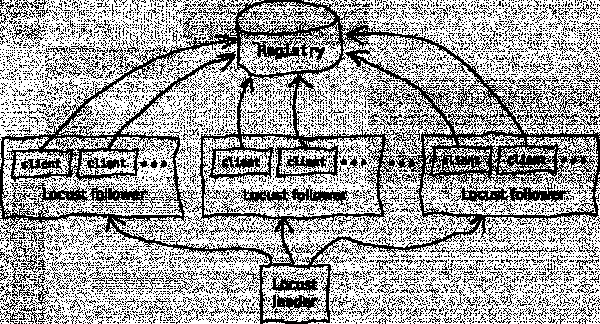

# 测试 Apicurio Registry 的性能和可扩展性

> 原文：<https://developers.redhat.com/blog/2021/04/05/testing-apicurio-registrys-performance-and-scalability>

[Apicurio Registry](https://www.apicur.io/registry/) 是[红帽集成](/integration)的服务注册组件的上游项目。开发人员使用 Apicurio Registry 来管理像 [API 定义](/topics/api-management)和数据结构模式这样的工件。

Apicurio Registry 可以维护大量的工件，它需要一种方法来存储它们。注册表支持几个存储选项，包括 [Apache Kafka](/topics/kafka-kubernetes) 、Infinispan 和 PostgreSQL。了解每个存储选项的性能特征有助于开发人员为不同的使用情形选择合适的存储。

最近，Red Hat 的 Performance & Scale 团队分析了 Apicurio Registry 在各种存储配置下的表现。在本文中，我们分享了我们在 Apicurio Registry 上进行的性能和可伸缩性测试的结果。

**注**:参见 [*红帽集成服务注册中心 1.1 GA*](/blog/2020/12/09/new-features-and-storage-options-in-red-hat-integration-service-registry-1-1-ga/) 中的新特性和存储选项，了解红帽集成和服务注册中心组件的更多信息。

## Apicurio 注册表和测试设置概述

Apicurio Registry 管理诸如 API 定义或数据结构模式之类的工件，比如我们在这些测试中使用的 [Apache Avro](http://avro.apache.org/docs/current/) 。作为开发人员，您可以在异步消息传递应用程序中使用 API 定义和数据结构模式来验证它们正在生成和消费的消息。Apicurio Registry 帮助您将数据结构从应用程序中分离出来。

图 1 显示了使用 Apicurio Registry 和 Kafka 的典型工作流。

Figure 1: A typical application workflow using Apache Kafka and Apicurio Registry.

模式注册中心内最常见的操作是对其 API 的一个简单的`GET`请求，以检索给定模式的最新版本。更改或更新模式的频率较低。因此，我们在测试中使用的调用相当简单:

*   列出所有的工件:`GET <registry_host>/api/artifacts`。(注意没有分页。如果需要，使用`search`。)
*   获取模式的最新版本:`GET <registry_host>/api/artifacts/<artifact_id>`。
*   用 JSON 数据创建一个新模式:`POST <registry_host>/api/artifacts`。
*   使用 JSON 数据添加新版本的模式:`PUT <registry_host>/api/artifacts/<artifact_id>`。
*   删除一个模式:`DELETE <registry_host>/api/artifacts/<artifact_id>`。

**注意**:当使用 Apache Kafka 传输 Avro 消息时，默认的 Apicurio 注册表客户端库不会在每次请求时加载 Avro 模式。它们只在应用程序启动时加载模式(或者，对于消费者来说，当模式改变时)，所以注册中心的性能不会影响生成和使用消息的速度。

## 性能测试 Apicurio 注册表

我们的性能测试是基本的，但是每一步都包含多个变量来捕捉各种 Apicurio 注册表配置:

1.  清理注册表数据库以获得一个干净的起点。
2.  用给定数量的模式填充注册表。
3.  使用上一步中创建的随机模式，用最新版本的`GET`请求淹没注册表。

### 我们如何测试

我们使用 Python 脚本向注册表生成了一个`GET` s 的负载，并使用 [Locust](https://locust.io/) 作为我们的负载测试工具。对于我们的用例来说，这种设置可能有些过分，因为我们只调用一个带有随机模式 ID 的端点，但是总体来说这是一个很好的测试设置。

在我们的自定义工具中，我们使用 Locust 作为库。我们的定制工具有一个额外的好处，那就是可以生成 JSON 文件，其中包含您以后可以轻松分析的结果和附加数据。这里也可以使用 Locust 的默认命令行界面工具。

我们的部署环境是运行在亚马逊 Web 服务弹性计算云上的 [Red Hat OpenShift 4](/products/openshift/overview) 集群。我们使用由 Apicurio 注册管理机构创建的安装进行了一些测试；其他测试是作为自定义部署配置进行的，以获得更多控制。PostgreSQL 数据库和负载生成脚本都可以在同一个集群的 pod 中运行。为了监控我们的 pod，我们使用了来自 OpenShift 的 Prometheus 中的数据。

### 水平缩放蝗虫脚本

扩展蝗虫脚本是我们在测试中必须解决的问题之一。当我们提高 registry pod 的 CPU 资源时，我们注意到大约每秒 925 个请求的上限。这表明应用程序超过了两个 CPU，这是意料之外的。当我们监控数据时，并没有显示注册表或数据库上的资源已经饱和，所以我们水平地扩展了测试脚本，将负载分布到更多的单元上。当我们水平扩展脚本时，我们能够生成更多的请求。

图 2 显示了水平缩放 Locust 脚本的流程。

Figure 2: Horizontally scaling the Locust script allows for more requests to the system under test.

图 3 显示了一个 Locust follower 节点对不同 CPU 资源的每秒请求数(RPS)。

[ (PostgreSQL)")](/sites/default/files/blog/2020/12/RPS-for-different-CPU-resources-with-1300Mi-PostgreSQL.png)

Figure 3: Requests per second for different CPU resources with one Locust follower node.

图 4 显示了 10 个 Locust follower 节点扩展后的每秒请求数。

[ (PostgreSQL)(1)")](/sites/default/files/blog/2020/12/RPS-for-different-CPU-resources-with-1300Mi-PostgreSQL1.png)

Figure 4: Requests per second for different CPU resources with 10 Locust follower nodes.

## 结论

我们从测试 Apicurio Registry 的性能和可伸缩性中发现了以下结果:

*   Apicurio Registry 工作稳定，不受数据库中工件数量的影响。我们用一百万个模式测试了注册中心，每个模式有 10 个版本，每个版本平均有 345 字节的序列化 JSON。
*   Apicurio Registry 的性能随着我们分配更多的 CPU 资源而线性增长。
*   随着更多注册表单元的启动，Apicurio Registry 的性能呈线性增长。我们测试了 10 个 pod，它们以每秒 4，201 个请求的速度提供模式。

我们的结论是，Apicurio Registry 能够处理广泛的部署。我们总是可以测试更多，但当前的结果表明，具有 PostgreSQL 存储后端的 Apicurio Registry 是未来部署的一个好选择。

*Last updated: October 7, 2022*