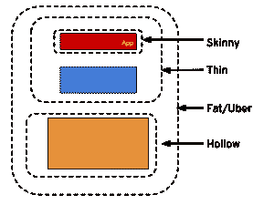

# 胖子、瘦子、空壳和优步

> 原文：<https://developers.redhat.com/blog/2017/08/24/the-skinny-on-fat-thin-hollow-and-uber>

*“我用 wildly[Swarm](http://wildfly-swarm.io)把我的应用从 **45 兆字节**缩减到只有 **2243 字节**。”*

我最近尝试了各种技术来打包 Java 微服务，并使用各种运行时和框架在 OpenShift 上运行，以说明它们的差异(WildFly Swarm vs. WildFly，Spring Boot vs the world，等等)。大约在我这么做的同时，一个内部邮件列表引发了对一些差异的讨论，并使用了诸如优步罐、瘦战争、瘦战争等术语。一些人强调了每种方法的优缺点，尤其是与 docker 图像层结合使用时瘦战争方法的优势。

我心想:这不是每个人都在做的事情吗？开发者真的需要考虑这些东西吗？但在此之前，我想先定义一下我听到的各种术语，至少让我自己搞清楚。

## 限定符(按照逻辑大小的递增顺序)



*   **Skinny** -只包含您在代码编辑器中输入的部分，没有其他内容。
*   **Thin** -包含上述所有内容以及应用程序对应用程序的直接依赖(数据库驱动程序、实用程序库等)。
*   空心的(Thin 的反义词)只包含运行应用程序所需的部分，但不包含应用程序本身。基本上是一个预打包的“应用服务器”,您可以稍后将您的应用部署到该服务器，与传统的 Java EE 应用服务器的风格相同，但有一些重要的区别，我们稍后会谈到。
*   **Fat/优步**——包含你自己编写的代码，加上你的应用程序的直接依赖关系，以及运行你的应用程序所需的代码。

现在让我们定义限定符如何映射到 Java 应用程序和包类型(JAR、WAR 等)。

### 脂肪/优步罐

Maven 特别是 [Spring Boot](https://projects.spring.io/spring-boot/) 推广了这种众所周知的打包方法，它包括在标准 Java 运行时环境下运行整个应用程序所需的一切(也就是说，你可以用 java -jar myapp.jar 运行应用程序)。Uberjar 中包含的额外运行时内容的数量(及其文件大小)取决于应用程序使用的框架和运行时特性。

### 瘦战

如果您是 Java EE 开发人员，那么您可能已经在这样做了。这是你十多年来一直在做的事情，所以恭喜你仍然很酷！thin WAR 是一个 Java EE web 应用程序，它只包含您编写的 web 内容和业务逻辑，以及第三方依赖项。它不包含 Java EE 运行时提供的任何东西，因此它是“瘦”的，但它不能“独立”运行——它必须部署到 Java EE 应用服务器或 Servlet 容器，其中包含在 JVM 上运行应用所需的“最后一英里”位。

### 薄罐子

除了使用 JAR 打包格式之外，与瘦 WAR 相同。通常，这是由专门的应用程序/插件架构使用的，这些架构将 JAR 打包格式用于专门构建的插件或运行时工件。例如，在。kjar 格式来自 [Drools](https://www.drools.org/) 。

### 小规模战争

虽然没有它的兄弟们那么出名，但瘦战争比瘦战争更瘦，因为它不包括应用程序所依赖的任何第三方库。它只包含开发人员在编辑器中输入的(字节)代码。这在分层容器图像的 docker 世界中很有意义，其中层的大小对于 DevOps 的健全性很重要，而 Adam Bien 已经做了一项出色的工作来演示和解释这一点。稍后将详细介绍。

### 瘦罐子

除了使用 JAR 打包和围绕它构建的框架(如 WildFly Swarm 和 Spring Boot)之外，与一场瘦战争相同。这对 CI/CD 健全性(以及你的 AWS 账单)也有很大的意义——[问问 Hubspot](http://product.hubspot.com/blog/the-fault-in-our-jars-why-we-stopped-building-fat-jars) 就知道了。在这里，您采取了一个瘦战争，并删除所有的第三方依赖。你只剩下最小的应用程序原子单元(试图变得更小听起来是一个可怕的想法，但是用 Java 9/JPMS 是可能的)，并且它必须被部署到一个运行时，该运行时期待它并且具有运行应用程序所需的所有其他位(比如一个空心的罐子)

### 空心罐子

这是一个 Java 应用程序运行时，它包含“刚好够”运行应用程序的应用服务器，但它本身不包含任何应用程序。它可以独立运行，但当它独立运行时就没什么用了，因为它不包含应用程序，除了初始化自己之外不会做任何事情。一些像 WildFly Swarm 这样的项目允许你定制多少才算“够用”，而另一些项目(像 [Paraya Micro](https://www.payara.fish/payara_micro) 或 [TomEE](http://www.tomitribe.com/products/apache-tomcat-and-tomee/) )提供流行的运行时组件组合的预构建发行版，比如那些由 [Eclipse MicroProfile](http://microprofile.io) 定义的。

## 其他组合

*   空洞警告——理论上，你可以打包一些应用程序在另一个应用服务器上运行，然后将应用程序部署到内层。祝你好运！
*   Fat/优步战争——用 java-jar 运行 Fat/Ubers 的一般想法是没有意义的。
*   EAR 文件——根据定义，EAR 文件不能是空的、胖的或瘦的，所以你只能创建一个瘦耳朵(根据定义，它已经是瘦耳朵了)。继续，这里什么也看不到，除了 EAR 文件[可能是为 EAR 中的小型战争提供依赖的载体](http://maven.apache.org/plugins/maven-war-plugin/examples/skinny-wars.html)。

## 何必呢？

租赁计算的兴起以及 devops 进程、Linux 容器和微服务架构的流行使得应用占用空间(构成应用的字节数)再次变得重要。当您一天多次部署到开发、测试和生产环境时(有时每小时数百次，甚至每周[20 亿次](https://www.infoq.com/news/2014/06/everything-google-containers))，最小化您的应用程序大小会对整体开发运维效率和您的运营健全性产生巨大影响。你不必最小化你的应用程序中的代码行，但是你应该减少你的应用程序和它的应用程序依赖项必须通过网络、移入或移出磁盘或者被程序处理的次数。这意味着将你的应用程序分成不同的打包部分，这样它们就可以被正确地分离和处理(如果你愿意，甚至可以进行版本控制)。

对于云原生微服务，这意味着使用分层的 Linux 容器映像。如果你可以将应用程序的组件分成不同的层，将应用程序中变化最频繁的部分放在“顶部”，将变化最不频繁的部分放在“底部”，那么每次你重新构建新版本的应用程序时，你实际上只接触到了最高的层。全面节省存储、运输和处理新版应用的时间。

## 太好了。告诉我用哪个就行了！

看情况。各自的利弊已经被其他人讨论过了[这里](http://andymrb.blogspot.co.uk/2017/03/uber-jars-vs-thin-wars-pros-and-cons.html)、[这里](https://www.reddit.com/r/java/comments/36nt73/war_vs_containerless_spring_boot_etc/)和[这里](https://blog.codecentric.de/en/2015/06/real-jars-have-curves/)。fat/优步 jar 之所以吸引人，是因为它们的可移植性、易于在 ide 中执行以及它的“你需要什么就是什么”的特性。但是，您越是能够将这些层分开(分成瘦层/瘦层)，您就越能在网络/磁盘/cpu 上节省更多。还有一个额外的好处是能够独立地修补所有层，例如，订阅安全漏洞的修补程序并将其快速分发到所有正在运行的应用程序。所以，你必须在权衡中做出决定。

## 例子:野生蜂群

WildFly Swarm 是一种打包 Java 应用程序的机制，其中包含“刚好足够”运行应用程序的功能。它有一个叫做分数的抽象概念，每个分数都包含了应用程序需要的一些功能。您可以选择您需要的片段，并只将这些片段与您的应用程序一起打包，以便为您的应用程序生成一个最小化和专门的可运行映像。

WildFly Swarm 有能力创建许多上述类型的打包应用程序。让我们看看它能做什么和各种打包选项的最终大小，以及它如何应用于分层的 Linux 容器映像。我们将从脂肪/优步罐子开始，一步步往下。[抓取代码](https://github.com/jamesfalkner/wfswarm-packaging-demo)并跟随:

```
$ git clone https://github.com/jamesfalkner/wfswarm-packaging-demo
```

## 脂肪/优步罐

示例应用程序是一个简单的 JAX-RS 端点，它返回一条消息。它直接依赖于 Joda 时间，我们稍后会用到它。现在，让我们使用 fat-thin/文件夹中的代码制作一个胖罐子(这是 WildFly Swarm 的默认模式):

```
$ cd fat-thin; mvn clean package
$ du -hs target/*.jar
45M target/weight-1.0-swarm.jar

```

你可以用`java -jar target/weight-1.0-swarm.jar`测试它，然后在一个单独的终端窗口中用`curl http://localhost:8080/api/hello`测试。

不坏- 45M 大小的完全独立的脂肪罐。你可以在每次重建的时候将它填充到 docker 图像层中，但是当你实际实现一个真实世界的应用程序时，这个 4500 万将会增加。让我们看看我们是否能做得更好。

## 稀薄战争

作为上面胖罐子构建的一部分，野蜂群也创造了一场瘦战争，所以没有必要重建。看一看这场薄薄的战争:

```
$ du -hs target/*.war
512K target/weight-1.0.war

```

现在我们有进展了。这个 512K 的瘦 WAR 可以部署到任何应用服务器上(比如 WildFly 本身)。因此，如果你将这个小得多的文件放入你的上层 docker 层，而你的很少改变的应用服务器放在下层(如[亚当比恩](http://adam-bien.com/roller/abien/) [演示](http://www.adam-bien.com/roller/abien/entry/think_wars_high_productivity_and) [多次](http://www.adam-bien.com/roller/abien/entry/launching_java_ee_thin_wars) [次](http://www.adam-bien.com/roller/abien/entry/java_ee_7_thin_wars))，你将在多次构建中节省相当多的时间和精力。我们继续吧。

## 小规模战争

您可能已经在演示应用程序中注意到，它超级简单——只有几行代码。那么为什么要 512K 才能守住呢？Thin WAR 中的 5 . 12 亿大部分被我们的直接依赖项占用了——在这种情况下， [Joda 时间库](http://www.joda.org/joda-time/):

```
% unzip -l target/*.war
Archive: target/weight-1.0.war
Length Date Time Name
-------- ---- ---- ----
0 08-03-17 01:14 META-INF/
134 08-03-17 01:14 META-INF/MANIFEST.MF
0 08-03-17 01:14 WEB-INF/
0 08-03-17 01:14 WEB-INF/classes/
0 08-03-17 01:14 WEB-INF/classes/com/
0 08-03-17 01:14 WEB-INF/classes/com/test/
0 08-03-17 01:14 WEB-INF/classes/com/test/rest/
0 08-03-17 01:14 WEB-INF/lib/
746 08-03-17 01:14 WEB-INF/classes/com/test/rest/HelloEndpoint.class
402 08-03-17 01:14 WEB-INF/classes/com/test/rest/RestApplication.class
634048 08-03-17 01:14 WEB-INF/lib/joda-time-2.9.9.jar  <------ This one
0 08-03-17 01:14 META-INF/maven/
0 08-03-17 01:14 META-INF/maven/com.test/
0 08-03-17 01:14 META-INF/maven/com.test/weight/
2954 08-03-17 01:14 META-INF/maven/com.test/weight/pom.xml
97 08-03-17 01:14 META-INF/maven/com.test/weight/pom.properties
-------- -------
638381 16 files

```

如果我们继续添加直接的依赖项(比如数据库驱动程序和几乎每个生产应用程序都需要的其他东西)，我们的瘦战争也会随着时间的推移而增长。虽然 512K 还不错，但我们可以做得更好。

### 瘦战争:移除直接依赖

使用 Maven，您可以通过声明必须提供直接依赖来从结果 Thin WAR 中删除它，这意味着运行时(在本例中是 WildFly)应该提供这种依赖。由于应用服务器和 WildFly 的模块化类加载器的性质，要让 WildFly 在部署应用时提供这种依赖性，您需要在 Wildfly 配置中创建自定义 [JBoss 模块](https://jboss-modules.github.io/jboss-modules/manual/)定义，并在应用中声明对该模块的依赖性。

WildFly Swarm 提供了一种更好的方式，它根本不需要你接触应用服务器。我们可以创建一个名为 Fraction 的自定义模块。分数是 WildFly Swarm 中的一等公民，它有特殊的逻辑，在运行时将分数内部的代码与应用程序代码链接起来。通过这样做，我们的应用程序真正没有了依赖性，变成了一场瘦战争。

我在示例应用程序的源代码中的`joda-fraction/`文件夹中创建了一个片段来存放 Joda 时间库。让我们构建它，并将其复制到我们的 Maven repo 中，供以后参考:

```
$ cd joda-fraction; mvn clean package install

[INFO] --- maven-install-plugin:2.4:install (default-install) @ joda ---
[INFO] Installing /Users/jfalkner/ws/fat/joda-fraction/target/joda-1.2.jar to /Users/jfalkner/.m2/repository/com/jhf/joda/1.2/joda-1.2.jar
[INFO] Installing /Users/jfalkner/ws/fat/joda-fraction/pom.xml to /Users/jfalkner/.m2/repository/com/jhf/joda/1.2/joda-1.2.pom
[INFO] ------------------------------------------------------------------------
[INFO] BUILD SUCCESS
[INFO] ------------------------------------------------------------------------

```

现在片段已经构建好了，重新构建应用程序的 skinny 版本(在 skinny/文件夹中):

```
$ cd ../skinny; mvn clean package
$ ls -l target/*.war
-rw-r--r-- 1 jfalkner staff 2243 Aug 3 01:45 target/weight-1.0.war

```

现在我们有进展了！我们的瘦战是 **2243 字节**。这已经够小了，因为它实际上只包含我们的代码:

```
$ unzip -l target/*.war
Archive: target/weight-1.0.war
Length Date Time Name
-------- ---- ---- ----
99 08-03-17 01:45 META-INF/MANIFEST.MF
0 08-03-17 01:45 META-INF/
0 08-03-17 01:45 WEB-INF/
0 08-03-17 01:45 WEB-INF/classes/
0 08-03-17 01:45 WEB-INF/classes/com/
0 08-03-17 01:45 WEB-INF/classes/com/test/
0 08-03-17 01:45 WEB-INF/classes/com/test/rest/
0 08-03-17 01:45 WEB-INF/lib/
402 08-03-17 01:45 WEB-INF/classes/com/test/rest/RestApplication.class
746 08-03-17 01:45 WEB-INF/classes/com/test/rest/HelloEndpoint.class
-------- -------
1247 10 files

```

然而，它本身是完全不可用的。它不仅需要一个支持 JAX 遥感的应用服务器，还需要一个能够提供直接 Joda 时间依赖的服务器。WildFly Swarm 提供了另一个工具来创建这样一个服务器运行时，它将包含足够的应用服务器和我们新分离的 Joda 时间依赖。它叫做*空心罐子*。

## 空心罐子

要构建一个适用于运行我们的示例应用程序的空心 JAR，我们可以使用 WildFly Swarm 属性来指示 Maven 插件构建它:

```
$ mvn clean package -Dswarm.hollow=true
$ du -hs target/*.jar target/*.war
44M target/weight-1.0-hollow-swarm.jar
4.0K target/weight-1.0.war

```

中空服务器重 44M，我们的瘦 WAR 重 2243 字节(Linux [du 实用程序](http://www.unix.com/man-page/All/1b/du/)报告以文件系统的块大小为单位分配的磁盘空间，这在我的系统上是 4K，但请放心，瘦 WAR 实际上是 2243 字节，当通过网络传输时，只会发送 2243 字节)。

现在，您可以将空心罐子填充到 Linux 容器层中，然后在上面填充瘦战争。当您用新代码重新构建项目时，假设您没有向应用服务器添加更多的依赖项，那么只有您的 skinny WAR 将被重新构建，从而在您每周进行的 20 亿次容器重建中节省时间、磁盘空间、树和您的理智。

要运行您的 skinny 应用程序并验证它是否仍能与您刚刚创建的 hollow 服务器协同工作:

```
$ java -jar target/weight-1.0-hollow-swarm.jar target/weight-1.0.war

```

而在另一个终端中:

```
$ curl http://localhost:8080/api/hello
hello, the date is 2017-08-03

```

## Spring Boot 怎么样？

Spring Boot 的开箱即用默认设置也是为了构建一个胖罐子，所以让我们来看看示例引导应用程序:

```
$ cd spring-boot-fat; mvn clean package
$ du -hs target/*.jar
14M target/greeting-spring-boot.jar

```

比 WildFly Swarm 的 45M 好多了。但我们将何去何从？对一个 hello world 应用程序来说还是 14M。

虽然可以将应用程序代码从 Spring 代码中分离出来，并产生类似 WildFly Swarm 的 hollow JAR / skinny WAR duo 的效果，但这需要您突破第四道墙[并了解 Spring Boot Uberjar 的内部，并在生成的 FAT jar 上编写脚本外科手术，以沿着 Boot 定义的应用程序边界拆分其内容。结果是一个非常紧密耦合和不可移植的应用程序和应用程序服务器，几乎没有升级的希望，也没有能力部署除了从中产生应用程序之外的任何东西。可运行的空心罐子在春天的世界里不被认为是一等公民。](https://en.wikipedia.org/wiki/Fourth_wall)

## 摘要

我们使用 WildFly Swarm 将我们的应用从 45M → 512K → 2243 字节缩小。通过这种方法，我们可以将我们的应用程序与其运行时依赖项分离，并将它们放在单独的 Linux 容器映像层中。这将使您的 CI/CD 管道更快，但也使您的开发人员在编辑/构建/测试方面更快，并确保您使用将在生产中使用的相同位进行测试。在我看来是三赢。

要构建您的 Java EE 微服务 **请访问** [**野生蜂群**](https://developers.redhat.com/promotions/wildflyswarm-cheatsheet/) **并下载备忘单。**

*Last updated: January 21, 2022*