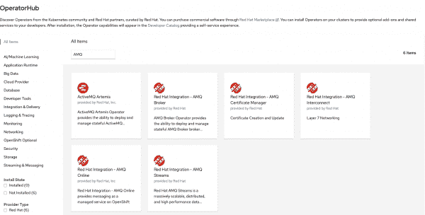
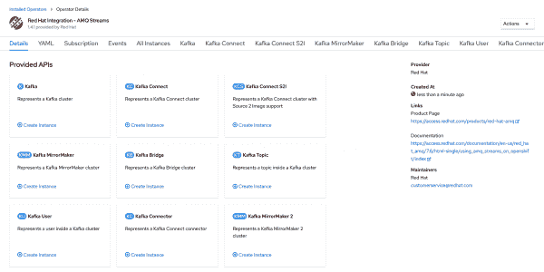
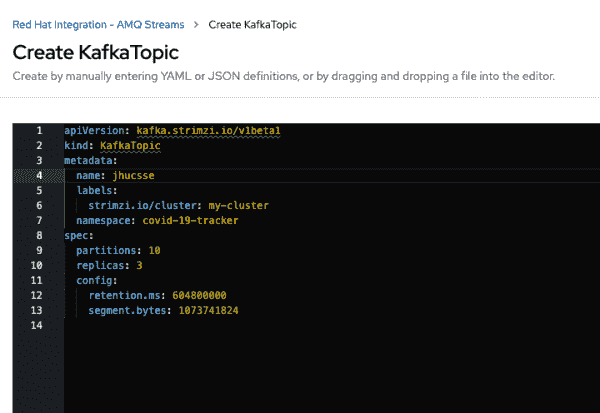
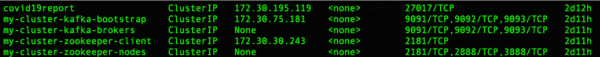
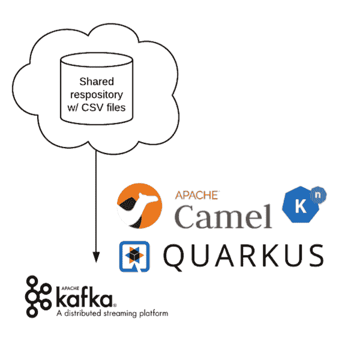
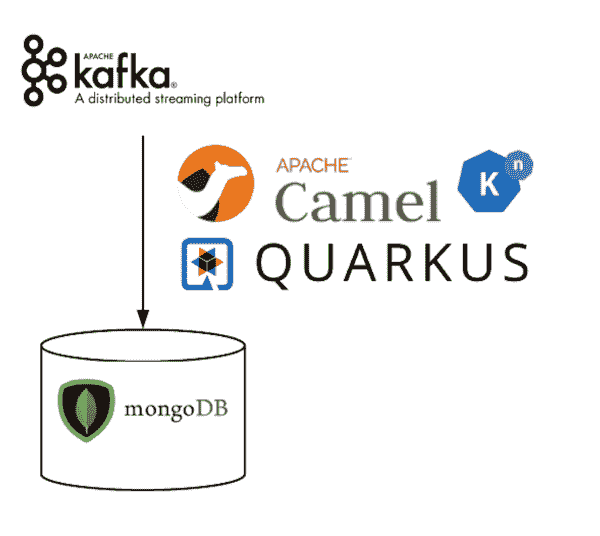
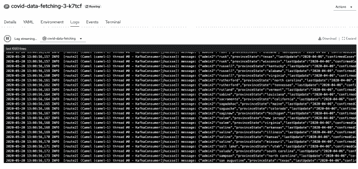
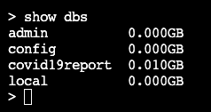
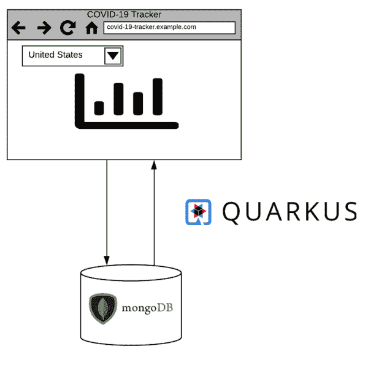
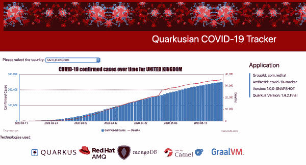

# 在 OpenShift 上使用夸库、AMQ 流和骆驼 K 追踪新冠肺炎

> 原文：<https://developers.redhat.com/blog/2020/06/15/tracking-covid-19-using-quarkus-amq-streams-and-camel-k-on-openshift>

仅仅几周的时间，我们熟悉的世界就永远改变了。新冠肺炎疫情来势迅猛，对我们的医疗保健系统和当地企业造成了巨大破坏，使世界经济陷入混乱。冠状病毒迅速成为影响所有人的危机。随着研究人员和科学家急于弄清楚这一点，并找到消除或减缓感染率的方法，各国开始收集统计数据，如确诊病例数、报告的死亡人数等。约翰·霍普金斯大学的研究人员已经汇总了来自许多国家的统计数据并公之于众。

在这篇文章中，我们演示了如何建立一个网站，显示一系列新冠肺炎图。这些图表反映了每个国家在给定时间段内的累计病例数和死亡数。我们使用 Quarkus 的 [Red Hat build、](https://developers.redhat.com/products/quarkus/overview) [Apache Camel K](https://camel.apache.org/camel-k/latest/index.html#) 和 [Red Hat AMQ Streams](https://developers.redhat.com/products/amq/overview) 来获取 Johns Hopkins 大学的数据，并用它填充 MongoDB 数据库。部署构建在 [Red Hat OpenShift 容器平台(OCP)](https://developers.redhat.com/products/openshift/getting-started) 上。

为本次演示开发的两个应用程序适用于许多其他场景，例如报告公司销售数字、报告来自物联网(IoT)连接设备的数据，或者跟踪费用或库存。只要有存储有用数据的存储库，您就可以对代码进行微小的修改，并使用这些应用程序以更有意义的方式收集、转换和向用户呈现数据。

## 我们将使用的技术

本文中我们的重点是下一代[Kubernetes-native](https://developers.redhat.com/blog/2020/04/08/why-kubernetes-native-instead-of-cloud-native/)[Java 框架](http://developers.redhat.com/blog/2020/04/24/ramp-up-on-quarkus-a-kubernetes-native-java-framework/)、 [Quarkus](https://developers.redhat.com/products/quarkus/overview) 。我们还利用现有的框架，如 Apache Camel K 和 Kafka (AMQ 流)来减少我们需要编写的代码量。

### 夸库斯是什么？

Quarkus 是一个 Kubernetes-native Java 框架，采用了最佳的 Java 库和标准。我们有时也称 Quarkus 为*超音速、亚原子 Java* ，这是有充分理由的:Quarkus 在像 [Kubernetes](https://developers.redhat.com/topics/kubernetes/) 这样的容器编排平台中提供了快速启动时间和低 RSS 内存(不仅仅是堆大小)。Quarkus 允许开发人员创建与 [Node.js](https://developers.redhat.com/blog/category/node-js/) 占用空间相似或更小的 Java 应用程序。

在这次演示中，我们选择在 OCP 上运行我们的 Quarkus 应用程序。在 OpenShift 容器平台上运行意味着我们的演示应用可以在 OpenShift 运行的任何地方运行，包括裸机、亚马逊 Web 服务(AWS)、Azure、谷歌云、IBM 云、vSphere 等等。

### 什么是红帽 OpenShift？

[Red Hat OpenShift](https://www.openshift.com/products/container-platform) 为构建和扩展容器化应用提供一致的混合云基础。OpenShift 提供了一个企业级的、基于容器的平台，没有供应商限制。Red Hat 是第一批与 Google 在 Kubernetes 上合作的公司之一，甚至在发布之前，并且已经成为 Kubernetes 上游项目的第二大贡献者。使用 OpenShift 简化了应用程序的部署，因为我们只需在终端输入几个命令就可以轻松地创建资源(比如我们在本演示中使用的 MongoDB 数据库)。OpenShift 还提供了一个通用的开发平台，无论我们使用什么基础设施来托管应用程序。

### 什么是红帽 AMQ 溪流？

[AMQ 流](https://access.redhat.com/products/red-hat-amq-streams)是一个企业级的阿帕奇 Kafka ( [事件流](https://developers.redhat.com/blog/category/stream-processing/))解决方案，使系统能够以高吞吐量和低延迟交换数据。使用队列是确保我们的应用程序松散耦合的一个好方法。Kafka 是一款优秀的产品，提供了高度可伸缩的容错消息队列，能够相对轻松地处理大量数据。

### 什么是阿帕奇骆驼 K？

Apache Camel K 是一个轻量级云集成平台，原生运行在 Kubernetes 上，支持自动化云配置。Camel K 基于著名的 Apache Camel，针对无服务器和微服务架构进行了设计和优化。Camel 提供了数百个连接器，为许多现有的应用程序、框架和平台提供连接。

## 先决条件

对于本演示，您需要在您的开发环境中设置以下技术:

1.  具有集群管理员访问权限的 OpenShift 4.3+环境
2.  安装有`JAVA_HOME`的 JDK 11 被适当地配置
3.  Openshift CLI ( `oc`)
4.  Apache 胃 3.6.2+

我们将构建两个独立的 Quarkus 应用程序，并将它们部署到我们的 OpenShift 环境中。第一个应用程序从一个在线存储库(约翰霍普金斯大学 GitHub 存储库)中检索所有数据，并使用这些数据填充一个名为`covid19report`的 MongoDB 集合。第二个应用程序托管 Quarkusian 新冠肺炎追踪器网站，该网站根据所选国家动态生成图表。这个应用程序使用 REST 调用来查询 MongoDB 集合，并返回相关数据。

## 向 OpenShift 环境添加资源

在开始使用这两个应用程序之前，我们需要向 OpenShift 集群添加所需的资源。我们将首先添加一个 MongoDB 数据库；然后，我们将添加 Kafka 集群，并创建 Kafka 主题来发布。

使用`oc`，登录到您的 OpenShift 环境，并创建一个名为`covid-19-tracker`的新项目。然后，将 MongoDB 数据库添加到该名称空间:

```
$ oc new project covid-19-tracker
$ oc new-app -n covid-19-tracker --docker-image mongo:4.0 --name=covid19report

```

接下来，登录到 OpenShift 控制台，转到 OperatorHub，搜索 AMQ 流操作符。图 1 显示了 OperatorHub 中所有可用的 AMQ 安装。

[](/sites/default/files/blog/2020/06/OperatorHub-AMQ.png)

Figure 1\. Search for the AMQ Streams Operator in the OpenShift OperatorHub.

安装**红帽集成- AMQ 流**操作器。操作器安装成功后，进入**已安装操作器**，点击。您应该会看到类似于图 2 的屏幕。

[](/sites/default/files/blog/2020/06/RedHatIntegration-AMQStreams.png)

Figure 2\. A listing of available APIs for the Red Hat Integration - AMQ Streams Operator.

选择 Kafka 图块并单击**创建实例**。使用默认设置创建 Kafka 实例。创建这个实例将启动七个 pod:一个 pod 用于 Kafka 集群实体 Operator，Kafka 集群和 Zookeeper 集群各有三个 pod。

一旦所有七个 pod 都在运行，返回到**已安装操作符**页面，并再次选择**红帽集成- AMQ 流操作符**。这一次，选择**卡夫卡主题**磁贴，点击**创建实例**。您将看到为我们的演示创建和配置 Kafka 主题的选项，如图 3 所示。

[](/sites/default/files/blog/2020/06/CreateKafkaTopic.png)

Figure 3\. Create a Kafka topic by manually entering the required YAML or JSON definitions.

在这种情况下，我们只需要对 YAML 文件做一处修改。将题目名称(`metadata: name`)改为:`jhucsse`。

将文件中的其他内容保留为默认值，然后创建主题。现在 Kafka 环境已经准备好接受来自 Quarkus 应用程序的数据。

为了让我们的 Quarkus 应用程序连接到 Kafka 和 MongoDB，我们需要记下这些服务的集群 IP 地址。从命令行运行以下命令，您将看到一个服务列表及其对应的内部 IP:

```
$ oc get services

```

图 4 显示了可用服务列表和每个服务的内部 IP 地址:

[](/sites/default/files/blog/2020/06/oc_get_services-3.png)

Figure 4\. Available services in the cluster.

记下`my-cluster-kafka-bootstrap`和`covid19report`的 IP 地址。稍后，我们将把这些值添加到每个 Quarkus 应用程序的`application.properties`文件中。

## 准备 quartus 应用程序

在继续下一步之前，您应该下载并解压缩这两个演示应用程序，或者将它们克隆到您的本地机器上。源代码可从以下网址获得:

*   **应用 1(`covid-data-fetching)`**:[https://github.com/gmccarth/covid-data-fetching](https://github.com/gmccarth/covid-data-fetching)
*   **申请二(`covid-19-tracker)`**:[https://github.com/gmccarth/covid-19-tracker](https://github.com/gmccarth/covid-19-tracker)

提取代码后，您需要修改每个应用程序的`application.properties`文件，以确保 Quarkus 应用程序可以连接到我们之前设置的 MongoDB 数据库和 Kafka 集群。

### 修改应用程序 1 的 application.properties

在应用程序 1 ( `covid-data-fetching`)的`application.properties`中，找到以`quarkus.mongodb`开头的两行。将`mongodb://`之后的 IP 地址替换为我们的 MongoDB pod ( `covid19report`)的 IP 地址，您在前面已经注意到了。确保包含正确的端口，即 27017:

```
quarkus.mongodb.connection-string=mongodb://*<the IP for covid19report>*:27017
quarkus.mongodb.hosts=mongodb://*<the IP for covid19report>*:27017

*For example:*
quarkus.mongodb.connection-string=mongodb://172.30.195.119:27017
quarkus.mongodb.hosts=mongodb://172.30.195.119:27017
```

同样，找到`camel.component.kafka.brokers`行，用`my-cluster-kafka-bootstrap` IP 地址替换 IP 地址。对此服务使用端口 9092:

```
camel.component.kafka.brokers=*<the IP for my-cluster-kafka-bootstrap>*:9092

```

### 修改应用程序 2 的 application.properties

现在打开应用程序 2 ( `covid-19-tracker`)并找到`quarkus.mongodb.connection-string`。将 IP 地址替换为我们的 MongoDB pod 的 IP 地址:

```
quarkus.mongodb.connection-string=mongodb://*<the IP for covid19report>*:27017

```

同样，找到`camel.component.kafka.brokers`行，用`my-cluster-kafka-bootstrap` IP 地址替换 IP 地址。对此服务使用端口 9092。

## 设置并运行第一个应用程序

对于我们的第一个应用程序，我们使用 Apache Camel 直接从 Johns Hopkins 大学 GitHub 存储库 URL 检索文件。Camel 将 CSV 文件转换成单独的记录，我们将这些记录放入 Kafka 主题中。第二条骆驼路线则消耗了卡夫卡主题的信息。它将每条记录转换成一个数据库对象，并将该数据插入 MongoDB 集合。我们将详细介绍每个阶段。

### 阶段 1:从存储库中检索数据，转换数据，并将其发布到 Kafka 主题

图 5 显示了从 GitHub 存储库中检索 CSV 文件并放置在 Kafka 主题中的流程图。

[](/sites/default/files/blog/2020/06/Phase1.png)

Figure 5\. Retrieve the data from the repository, transform it, and publish it to a Kafka topic.

您可以在`JhuCsseExtractor.java`文件中找到该阶段的代码:

1.  首先，我们使用骆驼路线从约翰霍普金斯大学获得 CSV 文件来源:

    ```
    from("timer:jhucsse?repeatCount=1")
    .setHeader("nextFile", simple("02-01-2020"))
    .setHeader("version", simple("v1"))
    .loopDoWhile(method(this, "dateInValidRange(${header.nextFile})"))
      .setHeader("nextFile", method(this,      "computeNextFile(${header.nextFile})"))
      .setHeader("version", method(this, "getVersion(${header.nextFile})"))
      .toD("https:{{jhu.csse.baseUrl}}/${header.nextFile}.csv?httpMethod=GET")
      .log(LoggingLevel.DEBUG,"after setHeader:nextFile=${header.nextFile}")
      .split().tokenize("\n", 1, true)
      .log(LoggingLevel.DEBUG,"version=${header.version}")
      .choice()
        .when(header("version").isEqualTo("v1"))
        .unmarshal().bindy(BindyType.Csv, JhuCsseDailyReportCsvRecordv1.class)
        .marshal().json(JsonLibrary.Jackson)
        .to("kafka:jhucsse")
      .otherwise()
        .unmarshal().bindy(BindyType.Csv, JhuCsseDailyReportCsvRecordv2.class)
        .marshal().json(JsonLibrary.Jackson)
        .to("kafka:jhucsse")
    .end();

    ```

2.  接下来，我们使用一个`loopDoWhile`来获取指定日期范围内的所有 CSV 文件。
3.  此时，CSV 格式发生变化，包括从`03-22-2020.csv`开始的附加数据。我们使用一种`choice`方法来处理数据格式的变化。`choice`方法确保所有的数据都被正确地插入到 Kafka 主题中。

### 阶段 2:使用 Kafka 主题中的消息，并将它们写入 MongoDB 集合

图 6 显示了放置在 MongoDB 集合中的转换记录的流程图。

[](/sites/default/files/blog/2020/06/Phase2.png)

Figure 6\. Consume the messages in the Kafka topic and write them to the MongoDB collection.

1.  在不同的 bean ( `MongoDbPopulator.java`)中，我们配置了另一个 Camel route 来使用我们在阶段 1 中开发的 Kafka 主题中的消息。Camel route 会将这些消息写入我们的 MongoDB 数据库:

    ```
    fromF("kafka:jhucsse?brokers=%s",brokers)
            .log("message: ${body}")
            .toF("mongodb:mongoClient?database=%s&collection=%s&operation=insert", database, collection);

    ```

2.  要运行 Quarkus 应用程序，在我们的终端中，我们需要位于`../covid-data-fetching/`目录中。在终端中键入以下内容，开始构建和部署 Quarkus 应用程序:

    ```
    ./mvnw clean package -Dquarkus.kubernetes.deploy=true -DskipTests=true -Dquarkus.kubernetes-client.trust-certs=true -Dquarkus.s2i.base-jvm-image=fabric8/s2i-java:latest-java11

    ```

3.  当您看到`BUILD SUCCESS`消息时，转到您的 OpenShift 控制台，在那里`covid-data-fetching`应用程序应该开始运行。要查看运行中的骆驼路线，请转到`covid19report`窗格的**日志**选项卡，在这里您应该会看到类似于图 7 的内容，这是消息流入 Kafka 的截图。
    [](/sites/default/files/blog/2020/06/KafkaStreamingLogs.png)

    图 7。应用程序日志显示一个消息流流入 Kafka。

4.  要确认记录正在被写入 MongoDB，请转到`covid19report`窗格的**终端**选项卡，并在终端窗口中键入`Mongo`。这个命令启动 MongoDB shell。在 shell 中键入`show dbs`来查看数据库列表，其中应该包括`covid19report`。图 8 显示了数据库列表。
    [](/sites/default/files/blog/2020/06/MongoShowDbs.png)

    图 8。数据库列表应包括 covid19report。

    

## 设置并运行第二个应用程序

应用程序 2 是 Quarkusian 新冠肺炎追踪器 web 应用程序。它使用对 MongoDB 数据库的 REST 调用来动态检索请求的数据集，然后启动网站。图 9 显示了新冠肺炎跟踪器的流程图。

[](/sites/default/files/blog/2020/06/Application2Architecture.png)

Figure 9\. A COVID-19 data set is dynamically retrieved from the MongoDB database.

关于此应用程序的说明:

*   当我们运行 Quarkus 时，会启动一个 web 服务器，可以通过端口 8080 访问它。
*   我们的 Quarkus 项目包括 RESTEasy JAX-RS。这允许我们为 MongoDB 查询创建多个 REST 端点。
*   Quarkus 还支持依赖注入，所以我们可以很容易地将一个伙伴 bean 注入到我们的主类中。
*   我们的`index.html`页面(在`resources/META-INF`文件夹中)有一个下拉列表，用于选择我们想要使用的特定的、基于国家的数据集。下拉列表是从对 MongoDB 数据库的查询中填充的。提交时，页面在一个`GET`请求中将国家代码发送给`TrackerResource` bean。bean 使用 [Panache](https://quarkus.io/guides/mongodb-panache) 来查询 MongoDB 数据库。然后，它将响应返回给 web 页面，web 页面根据收到的 JSON 响应生成一个图表。

要运行 Quarkus 应用程序，我们需要在`../covid-19-tracker/`目录中。在终端中键入以下内容，开始构建和部署这个 Quarkus 应用程序:

```
$ ./mvnw clean package -Dquarkus.kubernetes.deploy=true -DskipTests=true -Dquarkus.kubernetes-client.trust-certs=true -Dquarkus.s2i.base-jvm-image=fabric8/s2i-java:latest-java11

```

看到`BUILD SUCCESS`消息后，进入 OpenShift 控制台，确认`covid-19-tracker`应用程序开始运行。一旦 pod 开始运行，您就需要公开服务，这样您就可以从互联网上获得到它的路由。在终端中，键入:

```
$ oc expose svc/covid-19-tracker
```

在你的 OpenShift 控制台中，以管理员的视角，去**联网**->-**路由**获取应用 URL。单击 URL，这将带您进入应用程序。尝试从不同国家选择数据集。您应该会看到类似于图 10 中的屏幕截图，其中图表发生了变化，以显示您所选择的国家的新冠肺炎数据。

[](/sites/default/files/blog/2020/06/Website.png)

Figure 10\. The COVID-19 Tracker shows data results from whatever country is selected.

## 结论

在本文中，我们演示了如何相对容易地从外部存储库中提取有意义的可视化，并且只需要很少的几行代码。我们使用现有的、可靠的框架来降低构建可重用应用程序所需的复杂性和时间。将应用程序部署到 OpenShift 减少了开发、构建和部署演示应用程序所需的时间。此外，Quarkus 比标准的 Java 应用程序需要更少的内存。因此，我们构建了具有更快启动时间和更快响应的应用程序，从而改善了开发人员、最终用户以及最终企业的体验。

你有兴趣尝试夸夸其谈吗？查看我们的自定进度[quar kus](https://developers.redhat.com/courses/quarkus/getting-started/)实验室入门！查看[完整目录](https://developers.redhat.com/summit/2020/self-paced/)了解更多开发者实验室。

**注**:我要感谢 Mary Cochran、Claus Ibsen 和 Josh Reagan，他们帮助我解决了问题，并为我指出了撰写本文的正确方向。还要特别感谢我的 Hackfest 团队成员:Jochen Cordes 和 Bruno Machado，他们帮助构建了骆驼路线并配置了 MongoDB 数据库。

*Last updated: June 25, 2020*