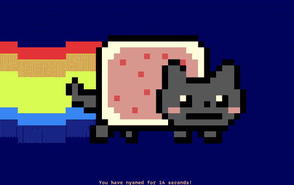
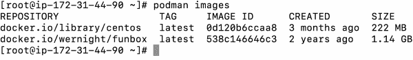
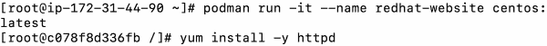
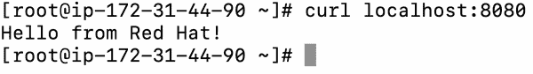

# 从码头工人到搬运工的转变

> 原文：<https://developers.redhat.com/blog/2020/11/19/transitioning-from-docker-to-podman>

当您需要增加安全性、使用名称空间的唯一标识符(UID)分离以及与`systemd`的集成时，Podman 是 Docker 容器的一个很好的替代品。在本文中，我使用真实的例子向您展示如何安装 Podman，使用它的基本命令，以及从 Docker 命令行界面(CLI)过渡到 Podman。您还将看到如何使用 Podman 运行现有映像，以及如何设置端口转发。

## 关于波德曼

Podman 是一个无后台、[开源、](https://developers.redhat.com/topics/open-source)、 [Linux、](https://developers.redhat.com/topics/linux)的本地工具，旨在开发、管理和运行[开放容器倡议](https://opencontainers.org/)、【OCI】容器和 pod。它的目录结构类似于 [Buildah](https://access.redhat.com/documentation/en-us/red_hat_enterprise_linux/8/html/building_running_and_managing_containers) 、 [Skopeo](https://www.redhat.com/sysadmin/how-run-skopeo-container) 和 [CRI-O](https://docs.openshift.com/container-platform/3.11/crio/crio_runtime.html) 。Podman 不需要活动的容器引擎来运行命令。

## 安装 Podman

如果您运行的是[Red Hat Enterprise Linux 8](https://developers.redhat.com/topics/linux)(RHEL 8)，请输入命令:

```
$ yum -y install podman
```

如果你是 Fedora 用户，用`dnf`替换`yum`:

如果 Linux 不可用，可以使用 [Podman online 配合 Katacoda](https://www.katacoda.com/courses/containers-without-docker/running-containers-with-podman) 。

## 过渡到 Podman CLI

Podman 最大的优势之一就是完全兼容 Docker 的 CLI。事实上，在构建 Podman 时，Docker 用户无需任何重大更改即可适应。例如，您可以使用`alias`命令为 Podman 创建一个`docker`别名:

```
$ alias docker=podman
```

您可以使用 Podman 运行熟悉的命令，如`pull`、`push`、`build`、`commit`、`tag`等。

你也可以使用 Podman 来运行安全的、无根的容器。通过加入一个用户名称空间并在其中设置 root 访问权限，您可以让 Podman 挂载某些文件系统，并在不提升权限的情况下设置容器。

## 使用 Podman 运行现有映像

幸运的是，Docker 和 Podman 创建的图像符合 OCI 标准。这意味着，Podman 可以从集装箱注册中心，如 [Docker Hub](https://hub.docker.com/) 和 [Quay.io](https://quay.io/) 进行推送和拉取。

例如，让我们测试一下 [Funbox](https://github.com/wernight/docker-funbox) 容器，它结合了终端命令和 ASCII 艺术。首先，用下面的`git`命令在本地目录中克隆存储库:

```
$ git clone https://github.com/wernight/docker-funbox.git
```

一旦下载了必要的文件，就可以提取基本映像和附加需求来构建和运行容器:

```
$ docker run --rm -it wernight/funbox
```

在这种情况下，我们在`docker run`命令中使用了以下标签:

*   标签在容器退出后移除它。
*   标签将容器连接到终端，这样您就可以与它交互。

我们现在有了一个活动的、正在运行的容器(我的运行在 Debian Jessie 之上)。让我们添加一个参数来查看 Funbox 的运行情况:

```
$ docker run --rm -it wernight/funbox nyancat

```

[](/sites/default/files/blog/2020/10/Screen-Shot-2020-11-16-at-9.22.24-PM.png)

图 1:你看到一只 Nyan 猫了吗？">

如果您在控制台屏幕上看到一只 Nyan 猫，那么您已经准备好使用 Podman 部署容器并与之交互。

## 使用 Podman 进行端口转发

有几十个容器可供下载并与 Podman 一起使用。对于这个例子，让我们在一个 [CentOS 容器](https://www.centos.org/centos-stream/)中设置一个简单的 [Apache HTTP Server 2.4](https://httpd.apache.org/docs/2.4/) 。首先，从 Docker hub 中拉出您想要使用的基本映像:

```
$ podman pull centos:latest
```

一旦创建了基础映像，使用`podman images`检查容器是否可以使用。您应该会看到类似于图 2 所示的输出:

[](/sites/default/files/blog/2020/10/Screen-Shot-2020-11-16-at-9.26.09-PM.png)

图 2:容器已经可以使用了。">

要使用您的基本映像运行新容器，请使用带有特定标记的`podman run`命令(如`-it`)将其附加到 CLI。使用`--name`定义一个自定义名称。最后，定义容器应该运行的基本映像:

```
$ podman run -it --name redhat-website centos:latest
```

当容器运行时，自动在里面设置 root 权限来运行所有命令。

### 创建 Apache HTTP 服务器

要创建一个 Apache web 服务器，我们可以用默认的包安装程序安装 [httpd](https://httpd.apache.org/docs/2.4/programs/httpd.html) 程序。对于 CentOS，它是`yum`:

```
$ yum install -y httpd
```

图 3 显示了该命令的控制台输出。

[](/sites/default/files/blog/2020/10/Screen-Shot-2020-11-16-at-9.27.27-PM.png)

图 yum install 命令的控制台输出。">

现在，您可以将容器中的内容提供给服务器的公共 IP 地址。

### 创建网页

接下来，我们将向容器的`var/www/html`目录中的`index.html`文件添加文本。请随意自定义您的消息，或在下面添加默认消息:

```
$ echo 'Hello from Red Hat!' > /var/www/html/index.html
```

完成后，键入`exit`关闭或关闭容器电源。

使用`podman commit`提交您的更改。使用标签为自定义容器定义名称和自定义版本:

```
$ podman commit redhat-website redhat-website:v1
```

最后，启动容器，然后将对服务器公共 IP 地址 8080 端口的所有请求转发到容器的 80 端口。使用 Podman 标签`-p`进行端口转发，并指定要运行的容器。确保`httpd`作为前台进程运行:

```
$ podman run -p 8080:80 redhat-website:v1 /usr/sbin/httpd -D FOREGROUND
```

要从主机设备查看网页，请在指定端口 8080 的同时运行`curl`命令。您应该会看到如图 4 所示的屏幕。

[](/sites/default/files/blog/2020/10/Screen-Shot-2020-11-16-at-9.44.47-PM.png)

图 4:使用 Podman 进行端口转发的成功例子。">

## 如何停止和移除容器

您可以使用`podman stop`命令来停止指定的容器:

```
$ podman stop redhat-website
```

使用`podman rm`移除容器:

```
$ podman rm redhat-website
```

## 结论

我在本文中演示的每个命令都与 Docker CLI 兼容。波德曼通过`systemd`有很大的集成特性。你可以用它来运行无根容器，它是在 RHEL 8 上运行 OCI 容器的一个强大的容器映像。

你可以通过设置[这个 Katacoda 场景](https://www.katacoda.com/courses/containers-without-docker/running-containers-with-podman)来继续试验 Podman，它直接在你的浏览器中提供一个交互环境。

如果需要容器编排，可以用 Podman 搭配 [Kubernetes](https://developers.redhat.com/topics/kubernetes) 或者[红帽 OpenShift](https://developers.redhat.com/products/openshift/overview) 。要开始使用这些平台，请参见 kubernetesbyexample.com 和 learn.openshift.com[的](https://learn.openshift.com/)[。](https://kubernetesbyexample.com/)

要获得更多交互式演示，请观看本文附带的视频。

No video provider was found to handle the given URL. See [the documentation](https://www.drupal.org/node/2842927) for more information.

## 资源

如果您想继续了解 Podman，请从 Red Hat Developer 上的这些文章开始:

*   波德曼的无根容器:基础知识
*   [针对 Docker 用户的 Podman 和 Buildah】(威廉·亨利，2019)](https://developers.redhat.com/blog/2019/02/21/podman-and-buildah-for-docker-users/)
*   [波德曼基础小抄](https://developers.redhat.com/blog/2019/04/25/podman-basics-cheat-sheet/)(道格·泰德韦尔，2019 年)
*   [波德曼简介(红帽企业版 Linux 7.6 测试版)](https://developers.redhat.com/blog/2018/08/29/intro-to-podman/) (Alessandro Arrichiello，2018)

*Last updated: January 7, 2022*