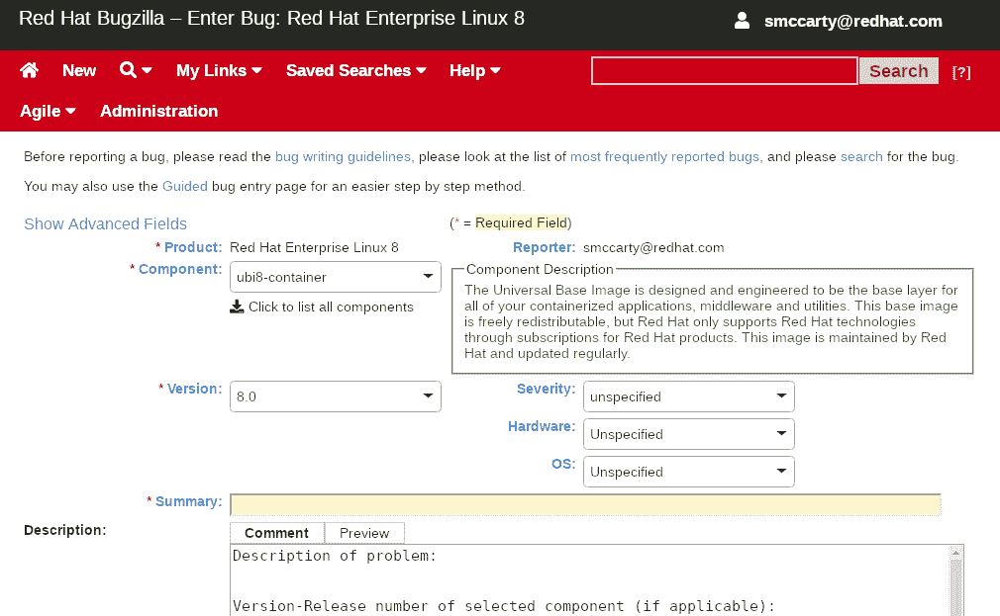

# 常见问题解答-通用基本图像

> 原文：<https://developers.redhat.com/articles/ubi-faq>

## 介绍

### 1.红帽宣布了什么？

某些版本的 Red Hat Enterprise Linux 将通过三个 Red Hat Universal Base Images (UBI)提供其内容的子集。该内容子集旨在使客户、合作伙伴和社区成员能够为他们所有的容器化应用程序标准化企业级[容器映像](https://developers.redhat.com/blog/2018/02/22/container-terminology-practical-introduction/#h.dqlu6589ootw)(通常称为[基础映像](https://developers.redhat.com/blog/2018/02/22/container-terminology-practical-introduction/#h.hc7hn0blfovy))。这些通用基础映像可以自由地重新发布，因此任何人都可以部署到 Red Hat 或非 Red Hat 平台上。

### 2.什么是红帽通用基础映像(UBI)？

Red Hat Universal Base Images (UBI)是符合 OCI 标准的基于容器的操作系统映像，带有补充的运行时语言和可自由再分发的软件包。像以前的基本映像一样，它们是从 Red Hat Enterprise Linux 的一部分构建的。UBI 映像可以从 [Red Hat 容器目录](https://access.redhat.com/containers/)中获得，并且可以在任何地方构建和部署。

### 3.红帽通用基础映像(UBI)包括哪些内容？

红帽通用基础图像包括三件事:

1.  提供了一组三个基本映像(最小、标准和多服务),为各种使用情形提供最佳起点。
2.  一组语言运行时映像(PHP、Perl、Python、Ruby、Node.js)使开发人员能够像 Red Hat 构建的容器映像一样充满信心地开始编码。
3.  一组相关的 YUM 存储库/通道包括 RPM 包和更新，允许用户随时添加应用程序依赖项和重建 UBI 容器映像。

根据 [UBI 最终用户许可协议(EULA)](https://www.redhat.com/licenses/EULA_Red_Hat_Universal_Base_Image_English_20190422.pdf) 的条款，所有这些内容均可使用和自由再分发。以上未包括的其他 Red Hat Enterprise Linux 软件包不属于 UBI EULA。

### 4.红帽为什么要创建红帽通用基础映像(UBI)？

在 UBI 之前，开发人员必须为他们需要部署的每个目标打包他们的容器化应用程序。考虑到这一点，容器并不像现在的 zip 或 gif 文件那样具有可移植性。为了实现真正的可移植性，业界需要一种事实上的方法来构建和共享容器化的应用程序，这些应用程序可以安全地部署在任何地方——而且只部署一次。这种方法必须是企业级的，以确保在任何地方都能安全地部署和管理。

UBI 允许开发人员创建一次映像，并使用企业级软件包部署到任何地方。另一种方法是使用不可信的、不可靠的和/或劣质的包，这些包不能满足企业级的需求。

### 5.红帽通用基础映像(UBI)有什么好处？

从根本上说，容器时代已经改变了人们构建和共享应用程序的方式。容器使得查找、运行、构建、共享和部署应用程序变得容易。这种打包格式使协作达到了一个新的水平。

Red Hat Universal Base Images 使用户能够使用高度可支持的企业级容器基础映像在任何他们想要的地方(无论是 Red Hat 平台还是非 Red Hat 平台)查找、运行、构建、共享和部署容器化的应用程序，从而使构建者能够随时随地满足他们的客户。

Red Hat 已经建立了 UBI，与其他基础映像相比，它在稳定性、生命周期和支持方面为开发人员提供了更好的选择。

### 6.UBI 术语和术语

**UBI 之前的基础映像**是已经存在多年的 Red Hat Enterprise Linux 7 的原始容器基础映像。它不符合 UBI EULA，并且不可再分发。它将继续仅适用于 Red Hat Enterprise Linux 7。

**UBI 基础映像**是 Red Hat Enterprise Linux 8 的新的事实上的容器基础映像，它在 Red Hat Enterprise Linux 7 上作为 UBI 之前的映像的可选和替代提供。在 UBI EULA 下，UBI 基础映像可以自由再分发。

**非 UBI** 指不受 UBI EULA 管理的包裹。

## UBI 详情

### 7.UBI 之前的基础映像和 UBI 基础映像之间有什么区别？

与 UBI 之前的基本映像一样，UBI 源自 Red Hat Enterprise Linux。它在许多方面不同于 UBI 之前的 Red Hat Enterprise Linux 7 基本映像，最明显的是它可以根据 Red Hat 通用基本映像最终用户许可协议(EULA)的条款自由再分发。在 Red Hat Enterprise Linux 8 中，所有基本映像都由 UBI EULA 管理。参见 UBI 文档部分，“[UBI 映像有何不同？](https://access.redhat.com/documentation/en-us/red_hat_enterprise_linux/8/html-single/building_running_and_managing_containers/index#how_are_ubi_images_different)

当部署在 OpenShift 和/或 Red Hat Enterprise Linux 上时，开发人员可以使用通过他们的 Red Hat 订阅可访问的任何包。在非 Red Hat 平台上部署时，开发人员只能使用标有 UBI-EULA 的精简包。

“UBI 内容”和“非 UBI 内容”的区别主要在于 EULA。前者可以自由再分配；后者则不然。

### 8.基于 UBI 构建的应用程序是否可以访问与基于非 UBI 基础映像构建的映像相同的内容？

是的，但是访问非 UBI 内容需要订阅 Red Hat，并且使用非 UBI 内容构建的容器不可再发行。

### 9.用户如何区分非 UBI 和 UBI 内容和/或包？

在某些情况下，区别很容易。在其他情况下，就没那么严重了。在名称中带有“ubi”的 [Red Hat 目录中找到的图像显然是 UBI 内容，可以自由再分发。这些映像包括基本容器映像和运行时语言。](https://access.redhat.com/containers/#/search/ubi)

要查看安装在标准 ubi 或 ubi-init 容器中的 RPM 软件包列表，请键入:

`rpm -qa`

要查看标准 ubi 或 ubi-init 容器中所有可用的 RPM 包，请键入:

`yum list all`

请注意，yum 命令在 ubi-minimal 映像中不可用。

### 10.用户如何验证他们想要使用的软件包是 UBI 和可再发行的？

为了避免意外使用不符合 UBI 的软件包，用户应该按照 UBI [将软件添加到 UBI 用户文档](https://access.redhat.com/documentation/en-us/red_hat_enterprise_linux/8/html-single/building_running_and_managing_containers/index#adding_software_inside_the_standard_ubi_container)中描述的 disableplugin 命令，确保他们没有订阅 Red Hat 订阅。另一种选择是在 Fedora 的基础上构建。

### 11.3 种 UBI 基础图像有何不同？

| UBI 选项 | 最小的 | 标准 | 多种服务 |
| 映像名 | ubi-极小 | 在那里 | ubi-初始化 |
| 简要描述 | 最小基础图像 | “标准”基础图像 | 通过 init 的多个基本服务 |
| 关键特征 | -最小化预安装内容集-No suid binaries-最小软件包管理器(安装、更新和删除)[UBI 最小文档](https://access.redhat.com/documentation/en-us/red_hat_enterprise_linux/8/html-single/building_running_and_managing_containers/index#using_minimal_red_hat_base_images) | -统一的 OpenSSL 加密堆栈-完整的 YUM 堆栈-包括有用的基本操作系统工具(tar、gzip、vi 等)。) [UBI 标准文档](https://access.redhat.com/documentation/en-us/red_hat_enterprise_linux/8/html-single/building_running_and_managing_containers/index#using_standard_red_hat_base_images) | -在同一容器中并排运行 mysql 和 httpd-启动时在容器中运行 systemd-允许您在构建时启用服务[UBI 多服务文档](https://access.redhat.com/documentation/en-us/red_hat_enterprise_linux/8/html-single/building_running_and_managing_containers/index#using_init_red_hat_base_images) |
| 获得基于 UBI 的软件包？ | 是—完全可再分配 | 是—完全可再分配 | 是—完全可再分配 |
| 访问非 UBI 软件包？ | 可以，但只能部署在 Red Hat 平台上 | 可以，但只能部署在 Red Hat 平台上 | 可以，但只能部署在 Red Hat 平台上 |

### 12.UBI 运行时语言是什么，对它们有什么计划？

|  | 在那里 | 非 UBI |
| 构建 Python 应用程序 | 是的，2.7 和 3.6 都有 | 是的，2.7 和 3.6 都有 |
| 构建 Ruby 应用程序 | 是的，Ruby 2.5 | 是的，Ruby 2.5 |
| 构建 Perl 应用程序 | 是(2 个版本) | 是 |
| 构建 PHP 应用程序 | 是 | 是 |
| 使用 PostgreSQL | 是 | 否—需要 RH 订阅 |

一组语言运行时映像(PHP、Perl、Python、Ruby、Node.js)立即成为 UBI 兼容的。这些运行时将定期更新，其他运行时将随着时间的推移而增加。没有额外运行时的路线图。

此表说明了 UBI 与非 UBI 部署的区别。

UBI 运行时语言来源于软件集合(红帽企业 Linux 7)和应用流(红帽企业 Linux 8)。

### 13.有哪些符合 UBI 的 RPM 包可用？

一组相关的 YUM 存储库/通道包括 UBI 兼容的 RPM 包。这些允许用户随时添加应用程序依赖和重建 UBI 容器映像。

### 14.如何找到图像、运行时和其他的 UBI BOMs？

在名称中带有“ubi”的 [Red Hat 目录中找到的图像显然是 UBI 内容，可以自由再分发。这些映像包括基本容器映像和运行时语言。](https://access.redhat.com/containers/#/search/ubi)

要查看安装在标准 ubi 或 ubi-init 容器中的 RPM 软件包列表，请键入:

`rpm -qa`

要查看标准 ubi 或 ubi-init 容器中所有可用的 RPM 包，请键入:

`yum list all`

请注意，yum 命令在 ubi-minimal 映像中不可用。

### 15.我需要订阅才能使用 UBI 吗？

不，Red Hat 通用基础映像和所有相关内容可用于开发和部署，无需订阅 Red Hat。然而，为了获得完全支持的操作体验和对扩展的非 UBI 工具列表的访问，基于 UBI 构建的容器必须部署在 Red Hat 平台上，如 OpenShift 或 Red Hat Enterprise Linux。

访问非 UBI 内容需要订阅红帽。

### 16.我需要一个 Red Hat Enterprise Linux 环境来构建 UBI 吗？

不，您可以在任何 Linux、Windows、MacOS 或其他 OCI 兼容的环境中基于 UBI 构建您的应用程序。

当在订阅和支持的 Red Hat 平台(OpenShift 或 Red Hat Enterprise Linux)上构建时，构建环境将得到完全支持。当建立在非红帽平台(Fedora、CentOS、Ubuntu、Debian、云提供商 Kubernetes 等)上时，您将可以访问 UBI 图像和 YUM 内容。红帽不支持非红帽平台。

在符合 OCI 标准(如 Docker)的 Windows 或 Mac 平台上构建符合 UBI 标准的映像是可行的，但必须验证用例。

### 17.我需要一个红帽企业 Linux 环境来部署 UBI 吗？

不，你可以在任何你喜欢的地方部署基于 UBI 的应用。根据您在何处运行 UBI，将提供不同级别的支持，例如，在 Red Hat 平台上部署时，您将获得全面支持。请参见支持部分，了解支持在 Red Hat 和非 Red Hat 部署中的不同之处。

### 18.其他红帽产品会用 UBI 吗？

是的，随着红帽企业版 Linux 8 的发布，UBI 8 成为红帽提供的唯一基础镜像。所有为红帽企业 Linux 8 设计的容器化红帽产品都将建立在 UBI 之上。请记住，只有通过 UBI 发布的内容才受 UBI EULA 的管辖。其他红帽产品，即使是基于 UBI 构建的，也有自己的 EULA。有关基于 UBI 的产品，请咨询特定的 EULA。

### 19.在 Red Hat Enterprise Linux 7 上，我可以将我的应用程序保留在 RHEL 非 UBI 基础映像上吗？

是的，使用非 UBI 7 作为基础映像的合作伙伴和客户不需要迁移到 UBI 7。非 UBI 7 映像将一直受到支持，直到 Red Hat Enterprise Linux 7 停产。在 Red Hat Enterprise Linux 7 上完成的所有合作伙伴认证仍然有效，并通过 Red Hat 容器目录分发。

## 重新分配

### 20.我可以自由发布基于 UBI 的应用吗？

是的，根据 UBI EULA 的规定，基于 Red Hat Universal 基本映像构建的应用程序以及 UBI 兼容的工具和软件包可以与基本映像中嵌入的 UBI 内容一起分发。基于 UBI 构建的软件供应商和社区项目可能有适用于其分层软件的附加 EULAs。

### 21.我可以在不使用 Red Hat 的注册表的情况下分发我的基于 UBI 的容器映像吗？

是的。用户可以选择自己的注册表。

### 22.我可以将非 UBI RPMs 添加到 UBI 映像中，并且仍然在非 Red Hat 平台上重新分发生成的容器映像吗？

不，只有分配给 UBI EULA 的红帽包可以重新分配。管理 UBI 的 EULA 允许用户分发作为 UBI 的一部分交付的一组容器图像和 rpm。不同 EULA 覆盖的容器映像和 rpm 具有不同的权利和限制。当然，总的来说，你可以期望任何社区开源技术都是可再分发的。

## 社区

### 23.UBI 与 EPEL 兼容吗？

部分地，Red Hat Universal 基础映像遵循 Red Hat Enterprise Linux 发布时钟和版本。所以，UBI 7 兼容红帽企业版 Linux 7，UBI 8 将兼容 EPEL 8。用户和客户都可以在容器构建时连接这些内容，但是没有完整的 Red Hat Enterprise Linux 订阅，并不是 EPEL 的每个包都能工作。EPEL 的许多包依赖于完整的 Red Hat Enterprise Linux 内容集中的包，所以 UBI 中可能缺少许多依赖项。

为了确保与 EPEL 软件一起运行，包含 EPEL 内容的 UBI 容器应该在订阅的红帽平台(OpenShift 或红帽企业 Linux)上运行。

### 24.UBI 是否推荐用于社区项目？

当然可以。与 CentOS 映像相比，UBI 为合作伙伴和客户提供了支持 UBI 位的途径。如果一个社区项目正在使用 CentOS，他们应该考虑 UBI。如果社区需要访问最新的包并获得社区支持，建议他们使用 Fedora 基础映像。

## 集装箱认证

### 25.UBI 如何影响集装箱认证？

Red Hat container 认证适用于基于非 UBI 和 UBI 构建的商业软件应用程序，因此部署受支持配置的客户可以从一个可信的堆栈中受益，该堆栈包括 Red Hat 和应用程序供应商提供的容器映像和协作支持。

认证可通过 Red Hat Partner Connect 计划获得。软件供应商可以免费加入，并利用容器构建、认证和分发服务，以及技术和营销资源。

容器图像的认证可用于图像，并通过 Red Hat registry 分发。参见:[红帽伙伴连接](https://connect.redhat.com/)和本[指南](https://redhat-connect.gitbook.io/partner-guide-for-red-hat-openshift-and-container/certify-your-application/containers-with-red-hat-universal-base-image-ubi)。

### 26。其他 红帽企业版 Linux包(非 UBI)可以使用或再分发吗？

是的，更新后的 T & Cs 现在支持 Red Hat Partner Connect 成员在基于 UBI 的容器映像中包含任何 Red Hat Enterprise Linux 用户空间包，并通过官方 Red Hat 和第三方容器注册中心重新分发它们。了解更多红帽伙伴连接[伙伴指南](https://redhat-connect.gitbook.io/partner-guide-for-red-hat-openshift-and-container/program-on-boarding/containers-with-red-hat-universal-base-image-ubi)。

### 27。我如何引用这些构建在 UBI 上的容器映像？

当构建 UBI 时，ISV 可以根据他们对红帽生态系统的承诺程度做出几种不同的声明。这些级别中的每一个都包含了更低级别的承诺:

构建在红帽通用基础映像上——任何在 UBI 上构建和部署的应用都可以公开称为“构建在红帽通用基础映像上”。

红帽认证容器——成功完成容器认证的基于 UBI 构建的商业应用可以称为“红帽认证容器”访问[红帽伙伴连接](https://connect.redhat.com/explore/red-hat-container-certification)。

### 28.我在哪里可以了解红帽容器认证？

访问[红帽合作伙伴连接](https://connect.redhat.com/explore/red-hat-container-certification)。

## 支持、生命周期和更新

### 29.UBI 会收到更新吗？

是的，红帽通用基础映像内容将遵循红帽企业 Linux 时间表。每次有红帽企业版 Linux 的新发布，都会有新的红帽通用基础镜像和支持包作为新的版本号发布。基于 UBI 构建是一个安全的选择，因为您将收到底层 Red Hat Enterprise Linux 内容生命周期的更新。

新的容器映像将由 [Red Hat 映像更新策略](https://access.redhat.com/articles/2208321)管理。这包括发布期间关键和重要 CVE 的映像重建。此外，YUM 存储库将为任何给定的版本提供一组最新的 rpm。这将允许用户在重建期间更新容器映像，确保获得并应用最新的勘误表(安全性、错误修复、增强)。

在发布时，只有每个 RPM 的最新版本将被提供在公共可用的 YUM 存储库中。

### 30。如何用 UBI 搭配 红帽企业版 Linux订阅内容？

在订阅了 红帽企业版 Linux主机上构建你的容器，你将自动拥有访问所有 红帽企业版 Linux内容的权限。

建立在 OpenShift 上。所有 OpenShift 订阅包含一个 红帽企业版 Linux订阅。要使用收录的 红帽企业版 Linux订阅参见 OpenShift 文档:[在构建中使用红帽订阅](https://access.redhat.com/documentation/en-us/openshift_container_platform/4.6/html/builds/running-entitled-builds)

您可以使用激活密钥将容器直接连接到 Red Hat Portal 或卫星:[知识库文章:如何将 RHEL 的软件包安装到运行在非 RHEL 主机上的 UBI 容器中？](https://access.redhat.com/solutions/5558771)

### 31。UBI 如何支持 ？

红帽通用基地形象可以两种方式部署。每一款都带有不同的支持预期:

1.  在红帽支持的容器平台上，比如 OpenShift，或者在红帽企业 Linux 上。当在以下所有条件下运行时，使用 UBI 构建的应用程序作为完整的 Red Hat Enterprise Linux 堆栈受到支持:
    1.  在红帽支持的容器平台上(OpenShift 或 红帽企业版 Linux)
    2.  带着红帽运过来支援[集装箱发动机](https://developers.redhat.com/blog/2018/02/22/container-terminology-practical-introduction/#h.6yt1ex5wfo3l)(红帽提供 CRI-O、波德曼等。)
    3.  带红帽发货并支持[容器运行时](https://developers.redhat.com/blog/2018/02/22/container-terminology-practical-introduction/#h.6yt1ex5wfo55)(红帽提供 runc 等)。)
2.  在任何其他容器平台上，或使用任何其他容器引擎或运行时—包括上游 Kubernetes、基于云提供商的 Kubernetes 服务、其他 Linux 发行版、任何其他非Red Hat Enterprise LinuxLinux 发行版，或非 Red Hat 提供的容器引擎或运行时—用户将收到更新，但 Red Hat 不提供支持。除了红帽容器平台(OpenShift、 红帽企业版 Linux)之外，无法在任何平台上购买支持。Red Hat 不会在任何非 Red Hat 软件堆栈上执行任何 UBI 测试或验证。任何问题都应提交给各自的上游社区或产品。如果问题在 Red Hat 支持的平台上重现。

### 32。我构建在 UBI 上的应用会得到支持吗？

当容器映像部署在订阅的 Red Hat Enterprise Linux 主机或 OpenShift 集群上时，Red Hat 将支持容器映像中包含的所有 Red Hat 组件。部署在任何其他主机上的基于 UBI 的容器映像将只接收 UBI 生命周期的更新，但不受 Red Hat 支持。

### 34.什么是 UBI 生命周期？

UBI 将遵循与底层 Red Hat Enterprise Linux 内容相同的生命周期和支持日期。当在订阅的 Red Hat Enterprise Linux 或 OpenShift 节点上运行时，它将遵循与底层 Red Hat Enterprise Linux 内容相同的支持策略。将会有一个 UBI 7，它映射到 Red Hat Enterprise Linux 7 内容，一个 UBI 8 Dev Preview 映射到 Red Hat Enterprise Linux 8 Beta 内容。

### 35.如何在 UBI 中请求新功能？

Red Hat 合作伙伴和客户可以通过标准方法提交支持票来请求新功能，包括软件包请求。非 Red Hat 客户不接受支持，但可以通过 Red Hat Enterprise Linux 下的标准 Red Hat Bugzilla 和适当的 ubi7 或 ubi8 产品组件提交请求。参见示例截图:

参见:[红帽 Bugzilla 队列](https://red.ht/2UmqzEH)

### 36.如何为 UBI 提交支持案例？

在受支持的红帽平台(OpenShift/RHEL)上运行 UBI 时，红帽合作伙伴和客户可以通过标准方法提交支持票据。Red Hat 支持人员将指导合作伙伴和客户

另请参见:[打开支持案例](https://access.redhat.com/support/cases/#/case/new?intcmp=hp%7Ca%7Ca3%7Ccase&)

### 37.UBI 会有 EUS 插件吗？

是的，但只能通过 Red Hat 订阅。UBI 使用户能够在容器用例中分发/再分发来自 Red Hat Enterprise Linux 频道的内容子集——不会为这个特定的内容集提供 EUS 插件。如果需要扩展支持，用户需要在受支持的 Red Hat 平台上运行 UBI，并订阅有效的扩展更新支持(EUS)。这些可以通过 RHEL 的标准机制购买。

注意:现在有一个 bug 阻止使用 micro dnf(BZ 1591627)来消耗 EUS，所以这不能用于最小(ubi-minimal)图像。

## 法律和许可

### 38.什么是 UBI 最终用户许可协议(EULA ),在哪里可以找到它？

红帽通用基础映像 EULA 是一个新的红帽许可证，专门用于使 UBI 组件可以自由再分发。受 EULA 管辖的 Red Hat 内容必须贴上此许可证和/或“ubi”标签，才能归入 UBI T & Cs。

### 39.UBI EULA 会影响我申请的 EULA 吗？

UBI EULA 适用于作为 UBI 一部分的容器映像和 YUM 存储库。这包括在基于 UBI 发布图像时允许使用 Red Hat 商标。用户仍然保证所有的权利，并且仍然必须遵守 UBI (Apache、BSD、GPL 等)中组件的所有底层软件许可证的责任。).这与基于自由软件的任何其他容器映像的分发非常相似。

### 40.在 UBI 上构建我的产品需要哪些法律协议？

Red Hat Universal Base Images 受个人开源许可证和 UBI EULA 条款的约束。基于 UBI 构建的 ISV 和软件开发人员可以使用 UBI 中提供的内容，并根据这些条款将其分发给他们的客户，无论最终用户环境是否是受支持的 Red Hat 环境。

另请参阅:Q20 我可以免费分发基于 UBI 构建的应用程序吗？

### 41.UBI 允许我在任何地方发布我的容器图片吗？

是的。建立在 UBI 之上意味着 Red Hat 永远不会告诉你在哪里或者如何分发你的图片。你可以在任何地方以任何方式发布你的图片。

### 42.如果 UBI 中缺少某些东西，我可以添加非 UBI 包吗？

是的，但如果你想自由地重新发布这些图片，那就不行。一旦您将 the Red 添加到 UBI 映像中，您就可以重新分发在 Red Hat Enterprise Linux 最终用户许可证下发布的内容。如果你是一个付费的红帽客户，这将打破你和红帽之间的协议。此外，这些图片的接收者不会收到您添加的 rpm 的更新，除非他们订阅了 Red Hat。这使得那些没有订阅 Red Hat 的最终用户处于不利地位。

如果需要额外的包，就不要加红帽企业 Linux 包了(因为是受限的)。此外，不要添加 CentOS 包(因为它们会删除可支持性)。添加 CentOS 包会将映像变成一个科学怪人。红帽和社区都不想支持它。你最好拥有所有 UBI 或 CentOS 内容。不要混搭。

### 43.UBI 许可证是开源的吗？

UBI 不是软件许可证；这是嵌入在我们 RPM 内容中的 Red Hat 商标的最终用户许可协议(EULA)。

### 44.UBI EULA 和红帽企业 Linux EULA 有什么区别？

UBI EULA 允许你重新分配 UBI 基础镜像和 RPMs 红帽企业版 Linux 不支持。

## 资源

### 45.在哪里可以找到 UBI 的公开资料？

*   关于集装箱认证，请访问[Red Hat Connect for Technology partners](http://connect.redhat.com)(connect.redhat.com)
*   UBI 社区邮件列表
*   通过电子邮件向 ubi@redhat.com 发送 UBI 问题和/或反馈
*   [加入](https://www.redhat.com/mailman/listinfo/ubi)UBI 社区邮件列表，关注 UBI 讨论
*   文档:
    *   [UBI 标准](https://access.redhat.com/documentation/en-us/red_hat_enterprise_linux/8/html-single/building_running_and_managing_containers/index#using_standard_red_hat_base_images)
    *   [UBI 最小值](https://access.redhat.com/documentation/en-us/red_hat_enterprise_linux/8/html-single/building_running_and_managing_containers/index#using_minimal_red_hat_base_images)
    *   [UBI 多业务](https://access.redhat.com/documentation/en-us/red_hat_enterprise_linux/8/html-single/building_running_and_managing_containers/index#using_init_red_hat_base_images)

*Last updated: April 7, 2022*