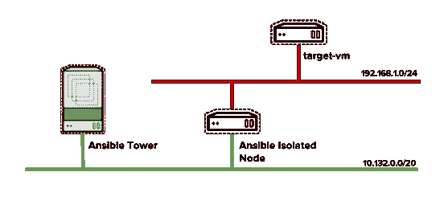
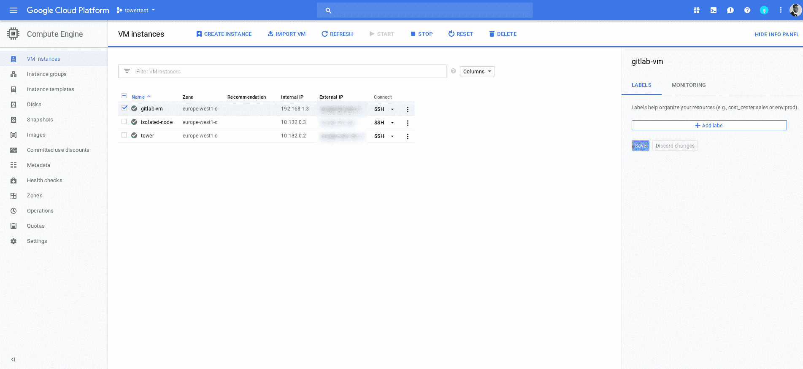
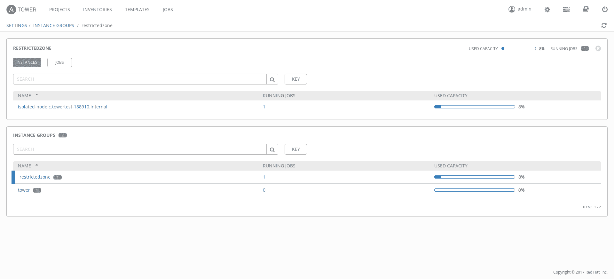
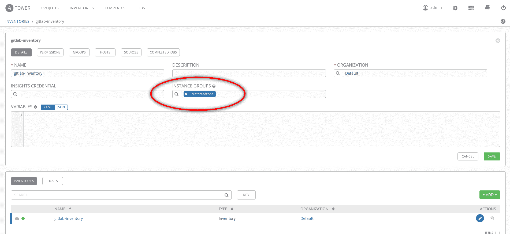
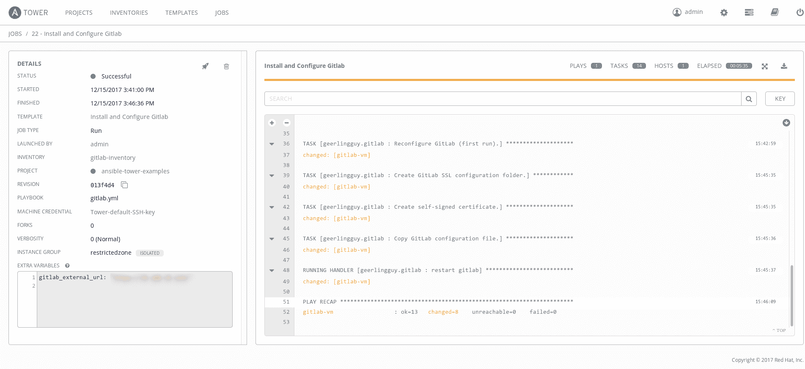
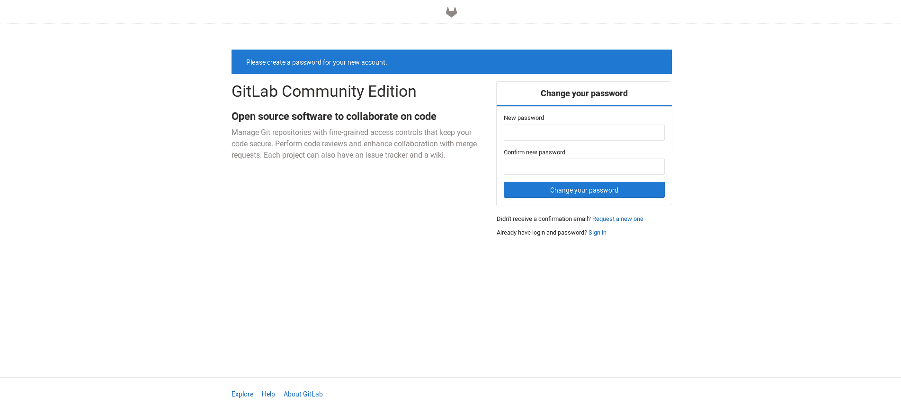

# 了解易变塔式孤立节点

> 原文：<https://developers.redhat.com/blog/2017/12/20/understanding-ansible-tower-isolated-nodes>

今天我想谈谈 Ansible Tower 在 3.2 版本中引入的一个伟大的全新特性:Ansible Tower 隔离节点。

由于这个特性，你可以在一个受限的网络中创建一个独立的(Ansible-Tower)节点来管理主塔的自动化作业，并报告结果！

引用发布声明:

> “塔式隔离节点是一种无头的可互换塔式节点，可用于本地执行能力，既可以在 DMZ 或 VPC 等受限网络环境中使用，也可以在远程数据中心使用本地执行能力。唯一的先决条件是从塔式集群到独立节点之间存在 SSH 连接。塔式集群会将相关清单的所有作业发送到隔离节点，在那里运行它们，然后将作业详细信息拉回到 Ansible Tower 中进行查看和报告。”

在本文中，我将指导您正确配置 Ansible Tower，以便通过 Ansible Tower 隔离节点管理隔离网络上的目标机器。

为了进入一个真实的场景，我们将通过 Ansible Tower 在一个不能被 Tower 直接到达的 VM 上安装 Gitlab Community Edition。

我在谷歌云上创建了以下网络架构:



然后，我开始创建三台虚拟机(我还创建了一个 VPC 网络以使用两个不同的网络):



之后，我只是按照 Ansible 塔式安装指南来设置环境:

```
# curl https://releases.ansible.com/ansible-tower/setup/ansible-tower-setup-latest.tar.gz -o ansible-tower-setup-latest.tar.gz 
# tar -vxf ansible-tower-setup-latest.tar.gz 
# cd ansible-tower-setup-3.2.2/
```

然后，我开始为安装行动手册配置基本*库存*:

```
[tower]
localhost ansible_connection=local

[database]

[all:vars]
admin_password='******'

pg_host=''
pg_port=''

pg_database='awx'
pg_username='awx'
pg_password='******'

rabbitmq_port=5672
rabbitmq_vhost=tower
rabbitmq_username=tower
rabbitmq_password='******'
rabbitmq_cookie=cookiemonster

# Needs to be true for fqdns and ip addresses
rabbitmq_use_long_name=false

[isolated_group_restrictedzone]
isolated-node.c.towertest-188910.internal

[isolated_group_restrictedzone:vars]
controller=tower
```

如您所见，我已经添加了名为“ *restrictedzone* ”的 *isolated_group* 的定义，并且在该部分中定义了将在该区域中调度作业的主机。然后我还在*变量*中为那个*隔离 _ 组*定义了控制器*实例 _ 组*:塔。

万一您在集群中有多台塔式机器，您可以选择这些机器的一个子集，创建一个专用的*实例组*，并将您可能创建的那个*实例组*的名称指定为控制器。

为了确保 Ansible Tower 虚拟机能够进入隔离节点，我创建了一个 ssh-keypair，并将其分发给隔离节点:

```
# ssh-keygen
# cat .ssh/id_rsa.pub
```

最后，我启动了设置:

```
# ./setup.sh
```

Ansible Tower 安装完成后，您可以导航到设置页面查找“实例组”,进入后，查看“restrictedzone”实例组。



正如您在前面的图片中看到的，我找到了隔离节点虚拟机。

好了，接下来您可能会问:我如何才能在目标虚拟机和行动手册上使用这个受限区域？我将在下面的段落中解释这一点。

首先，我将跳过创建/添加主机、凭证、行动手册项目和模板所需的所有步骤。我想你能做到。如果不是这样，您可以在 Ansible Tower 文档中搜索大量的例子。

使用隔离节点有两种选择:

1.  在库存级别定义关联。
2.  在模板级别定义关联。

因为我的目标机器只能通过隔离的节点到达(塔没有机会连接到它)，所以我在目录级别添加了关联。



正如您在前面的屏幕截图中看到的，我已经定义了与 gitlab-inventory 关联的“ *restrictedzone* 实例组”。

然后，在添加、项目和凭证等之后，我只需运行 Ansible 模板:

如您所见，工作已成功完成，我们的 Gitlab 社区版已正确安装:



暂时就这样吧！

PS:你对我在这个例子中使用的剧本很好奇吗？你可以看看[https://github.com/alezzandro/ansible-tower-examples](https://github.com/alezzandro/ansible-tower-examples)。

再见

## 关于亚历山德罗

Alessandro Arrichiello 是 Red Hat Inc .的解决方案架构师。他从 14 岁开始就对 GNU/Linux 系统充满热情，这种热情一直持续到今天。他使用自动化企业 IT 的工具:配置管理和通过虚拟平台的持续集成。他现在致力于分布式云环境，涉及 PaaS (OpenShift)、IaaS (OpenStack)和流程管理(CloudForms)、容器构建、实例创建、HA 服务管理、工作流构建。

* * *

**利用您的红帽开发者会员资格和** [**免费下载红帽企业版 Linux**](http://developers.redhat.com/products/rhel/download/) **。**

*Last updated: September 3, 2019*