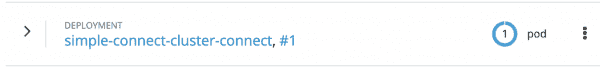
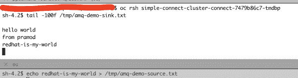
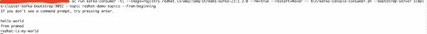
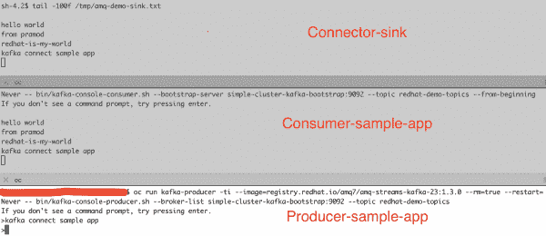
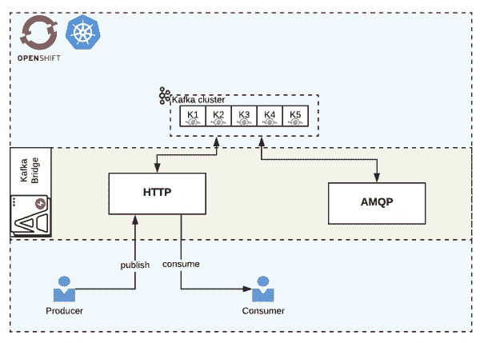
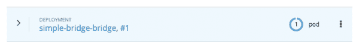
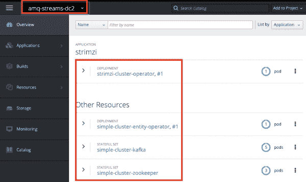
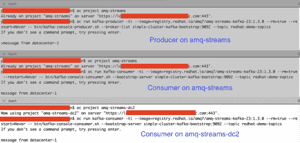

# 了解 OpenShift 和 Kubernetes 的红帽 AMQ 流组件:第 2 部分

> 原文：<https://developers.redhat.com/blog/2019/12/05/understanding-red-hat-amq-streams-components-for-openshift-and-kubernetes-part-2>

[在本系列](https://developers.redhat.com/blog/2019/12/04/understanding-red-hat-amq-streams-components-for-openshift-and-kubernetes-part-1/)的上一篇文章中，我们在[红帽 OpenShift](http://developers.redhat.com/openshift/) 上讨论了[红帽 AMQ 流](https://access.redhat.com/products/red-hat-amq)的基础知识。在我们继续之前，请记住以下几点:

*   AMQ 溪流是基于阿帕奇卡夫卡。
*   OpenShift 容器平台的 AMQ 流基于 Strimzi 项目。
*   容器上的 AMQ 流有多个组件，如集群运算符、实体运算符、镜像生成器、Kafka connect 和 Kafka Bridge。

现在，让我们继续设置 Kafka Connect、Kafka Bridge 和 Mirror Maker。

## 卡夫卡连接

Kafka Connect 主要用于将 Kafka 集群的数据*流入*和*流出*；例如，获取一个 Twitter feed，然后将其推送到集群。在继续之前，我们需要理解 Kafka Connect 的概念:

*   连接器定义了数据应该从哪里复制*到*或者从复制到*。*
*   任务是实际复制数据的参与者。
*   工人用来为*连接器*和*任务*安排工作单元。
*   *任务单元*使用转换器来改变数据格式。
*   *连接器*单元使用转换来进行简单的数据调整、路由和链转换。

**注:**关于基本概念的更多细节，我推荐阅读[卡夫卡连接概念](https://docs.confluent.io/current/connect/concepts.html#connect-concepts)。

### 创建简单的 Kafka Connect 实例

OpenShift 中的 KafkaConnect 实例可以使用两个不同的 Kube 对象创建:Kafka Connect 和 KafkaConnectS2I。默认情况下，Kafka Connect 包括两个内置连接器:FileStreamSourceConnector 和 FileStreamSinkConnector。然而，在构建新连接器之前，首先检查现有连接器的[目录。](https://www.confluent.io/hub/)

让我们设置一个简单的 Kafka Connect 实例，然后执行 source 和 sink 操作。然后，我们可以添加一个默认的生产者示例应用程序和一个消费者示例应用程序。这个过程将显示多个发布者和多个消费者，如图 1 所示:

[](/sites/default/files/blog/2019/11/img_5dca1fbebd0d0.png)

Figure 1: The overall structure for this example.

首先创建 Kafka 连接配置`amq-kafka-connect.yml`。`examples/kafka-connect/kafka-connect.yml`中的示例文件用作该配置文件的参考:

```
apiVersion: kafka.strimzi.io/v1beta1
kind: KafkaConnect
metadata:
  name: simple-connect-cluster
spec:
  version: 2.3.0
  replicas: 1
  bootstrapServers: simple-cluster-kafka-bootstrap:9093
  tls:
    trustedCertificates:
      - secretName: simple-cluster-cluster-ca-cert
        certificate: ca.crt
```

接下来，执行 YAML:

```
$ oc create -f amq-kafka-connect.yml
```

您可以在图 2 中看到结果:

[](/sites/default/files/blog/2019/11/img_5dc9fc4d92849.png)

Figure 2: The new deployment is in place.

### 准备测试您的新 Kafka Connect 实例

让我们通过执行以下操作来设置测试新实例:

1.  创建一个新的配置，它将*从`redhat-demo-topics`主题内容中的*下沉到文件`amq-demo-sink.txt`中:

```
$ oc rsh simple-cluster-kafka-0
sh-4.2$ curl -X POST -H "Content-Type: application/json" --data '{"name": "redhat-file-sink-demo", "config": {"connector.class":"FileStreamSinkConnector", "tasks.max":"1", "file":"/tmp/amq-demo-sink.txt", "topic":"redhat-demo-topics", "value.converter.schemas.enable" : "false", "value.converter" : "org.apache.kafka.connect.storage.StringConverter", "value.converter.schemas.enable" : "false", "key.converter" : "org.apache.kafka.connect.storage.StringConverter", "key.converter.schemas.enable" : "false"}}' http://simple-connect-cluster-connect-api.amq-streams.svc:8083/connectors
```

以下是输出:

```
{"name":"redhat-file-sink-demo","config":{"connector.class":"FileStreamSinkConnector","tasks.max":"1","file":"/tmp/amq-demo-sink.txt","topics":"redhat-demo-topics","value.converter.schemas.enable":"false","value.converter":"org.apache.kafka.connect.storage.StringConverter","key.converter":"org.apache.kafka.connect.storage.StringConverter","key.converter.schemas.enable":"false","name":"redhat-file-sink-demo"},"tasks":[],"type":"sink"}
```

2.  创建一个新的配置，将*源*从文件`amq-demo-source.txt`导入到`redhat-demo-topics`主题内容中:

```
$ oc rsh simple-cluster-kafka-0
sh-4.2$ curl -X POST -H "Content-Type: application/json" --data '{"name": "redhat-file-source-demo", "config": {"connector.class":"FileStreamSourceConnector", "tasks.max":"1", "file":"/tmp/amq-demo-source.txt", "topic":"redhat-demo-topics", "value.converter.schemas.enable" : "false", "value.converter" : "org.apache.kafka.connect.storage.StringConverter", "value.converter.schemas.enable" : "false", "key.converter" : "org.apache.kafka.connect.storage.StringConverter", "key.converter.schemas.enable" : "false"}}' http://simple-connect-cluster-connect-api.amq-streams.svc:8083/connectors
```

以下是输出:

```
{"name":"redhat-file-source-demo","config":{"connector.class":"FileStreamSourceConnector","tasks.max":"1","file":"/tmp/amq-demo-source.txt","topic":"redhat-demo-topics","value.converter.schemas.enable":"false","value.converter":"org.apache.kafka.connect.storage.StringConverter","key.converter":"org.apache.kafka.connect.storage.StringConverter","key.converter.schemas.enable":"false","name":"redhat-file-source-demo"},"tasks":[],"type":"source"}
```

3.  在新的终端中，启动 producer 示例应用程序:

```
$ oc run kafka-producer -ti --image=registry.redhat.io/amq7/amq-streams-kafka-23:1.3.0 --rm=true --restart=Never -- bin/kafka-console-producer.sh --broker-list simple-cluster-kafka-bootstrap:9092 --topic redhat-demo-topics
```

4.  在新终端中启动消费者示例应用程序:

```
$ oc run kafka-consumer -ti --image=registry.redhat.io/amq7/amq-streams-kafka-23:1.3.0 --rm=true --restart=Never -- bin/kafka-console-consumer.sh --bootstrap-server simple-cluster-kafka-bootstrap:9092 --topic redhat-demo-topics --from-beginning
```

### 测试您的新 Kafka Connect 实例

要测试实例，请执行以下操作:

1.  登录 Kafka Connect pod 并观看`/tmp/amq-demo-sink.txt`文件:

```
$ oc get po | grep connect
simple-connect-cluster-connect-7479b86c7-tmdbp 1/1 Running 0 3h
$ oc rsh simple-connect-cluster-connect-7479b86c7-tmdbp
sh-4.2$ tail -100f /tmp/amq-demo-sink.txt

hello world
from pramod
```

在这里，您可以看到连接器已经将两条消息放入文件中。

2.  在不同的终端中登录 Kafka Connect pod，然后将内容添加到`/tmp/amq-demo-source.txt`:

```
$ oc rsh simple-connect-cluster-connect-7479b86c7-tmdbp
sh-4.2$ echo redhat-is-my-world > /tmp/amq-demo-source.txt
```

这组命令在`/tmp/amq-demo-sink.txt`中写入一条消息，并写入消费者示例应用程序。图 3 显示了连接器源推送和接收器输出:

[](/sites/default/files/blog/2019/11/img_5dca293c7946a.png)

Figure 3: The connector source pushing the message redhat-is-my-world in the second terminal.

图 4 显示了使用消息的示例应用程序:

[](/sites/default/files/blog/2019/11/img_5dca2a45c034c.png)

Figure 4: The results on the consuming side.

3.  现在，从生产者示例应用程序发送消息。图 5 显示了这个消息如何通过系统的三个部分。从上到下，分别是连接器接收器、消费者示例应用程序，然后是生产者示例应用程序推送消息`kafka connect sample app`:

[](/sites/default/files/blog/2019/11/img_5dca2be40e1d3.png)

Figure 5: The message kafka connect sample app passing through each stage.

## 卡夫卡桥

桥组件帮助我们使用 HTTP 或 AMQP 协议连接到 Kafka 集群。在本文中，我们演示了 HTTP 的用法，如图 6 所示:

[](/sites/default/files/blog/2019/11/img_5dcb330887257.png)

Figure 6: How the Kafka Bridge fits in through the HTTP protocol.

Kafka Bridge 为 HTTP 协议提供了一个 REST API，通过它可以提供多种操作，例如:

*   发送消息。
*   订阅主题。
*   接收信息。
*   提交偏移量。
*   求具体职位。

### 创造你的卡夫卡桥

1.  创建`kafka-bridge`配置文件`amq-kafka-bridge.yml`。`examples/kafka-bridge/kafka-bridge.yaml`中的示例文件用作以下配置的参考:

```
apiVersion: kafka.strimzi.io/v1alpha1
kind: KafkaBridge
metadata:
  name: simple-bridge
spec:
  replicas: 1
  bootstrapServers: simple-cluster-kafka-bootstrap:9092
  http:
    port: 8080
```

2.  在 OCP 建造桥梁:

```
$ oc create -f amq-kafka-bridge.yml
```

您可以在图 7 中看到结果:

[](/sites/default/files/blog/2019/11/img_5dcb36ae26e05.png)

Figure 7: Your new Kafka Bridge.

3.  创建一个路由，以便我们可以从群集外部访问网桥:

```
$ oc expose svc simple-bridge-bridge-service --name=simple-bridge-route
```

### 测试基于 HTTP 协议的 Kafka 桥

1.  创建 Kafka 主题配置`amq-kafka-topic.yml`并将其应用于集群:

```
apiVersion: kafka.strimzi.io/v1beta1
kind: KafkaTopic
metadata:
  name: simple-topic
  labels:
    strimzi.io/cluster: simple-cluster
spec:
  partitions: 5
  replicas: 1
  config:
    retention.ms: 7200000
    segment.bytes: 1073741824
oc create -f amq-kafka-topic.yml
```

2.  获取桥端点的路由 URL:

```
#get the route to do the curl command

oc get route

NAME HOST/PORT PATH SERVICES PORT TERMINATION WILDCARD
simple-bridge-route simple-bridge-route-amq-streams.apps.redhat.demo.com simple-bridge-bridge-service rest-api None
```

3.  在`simple-topic`上发布消息:

```
curl -X POST \
http://simple-bridge-route-amq-streams.apps.redhat.demo.com/topics/simple-topic \
-H 'content-type: application/vnd.kafka.json.v2+json' \
-d '{
"records": [
{
"value": "all hail the shadowman"
}
]
}'
```

以下是输出:

```
{"offsets":[{"partition":0,"offset":0}]}
```

4.  创建消费者组`simple-rh-bridge-consumer-group`和实例`simple-rh-bridge-consumer`。对于这个任务，我们将消息格式设置为 JSON:

```
curl -X POST \
http://simple-bridge-route-amq-streams.apps.redhat.demo.com/consumers/simple-rh-bridge-consumer-group \
-H 'content-type: application/vnd.kafka.v2+json' \
-d '{
"name": "simple-rh-bridge-consumer",
"auto.offset.reset": "earliest",
"format": "json",
"enable.auto.commit": false,
"fetch.min.bytes": 512,
"consumer.request.timeout.ms": 30000
}'
```

5.  为第一步中创建的`simple-topic`创建一个订户:

```
curl -X POST http://simple-bridge-route-amq-streams.apps.redhat.demo.com/consumers/simple-rh-bridge-consumer-group/instances/simple-rh-bridge-consumer/subscription \
-H 'content-type: application/vnd.kafka.v2+json' \
-d '{
"topics": [
"simple-topic"
]
}'
```

6.  使用消息(注意，第一个请求将注册，后续调用将提供消息数组):

```
curl -X GET http://simple-bridge-route-amq-streams.apps.redhat.demo.com/consumers/simple-rh-bridge-consumer-group/instances/simple-rh-bridge-consumer/records \
-H 'accept: application/vnd.kafka.json.v2+json'
```

以下是输出:

```
[]
curl -X GET http://simple-bridge-route-amq-streams.apps.redhat.demo.com/consumers/simple-rh-bridge-consumer-group/instances/simple-rh-bridge-consumer/records \
-H 'accept: application/vnd.kafka.json.v2+json'
```

和附加输出:

```
[{"topic":"simple-topic","key":null,"value":"all hail the shadowman","partition":0,"offset":0}]
```

## 镜子制造商

Kafka Mirror Maker 将数据从一个 Kafka 集群复制到另一个集群。通常的用例是跨不同的数据中心。

出于演示的目的，我们使用两个不同的名称空间和项目，即`amq-streams`和`amq-streams-dc2`。这样做相当于拥有多个同名的数据中心。这个设置如图 8 所示:

[](/sites/default/files/blog/2019/11/img_5dcb7b940409f.png)

Figure 8: Replicating multiple data centers with Kafka Mirror Maker.

Kafka Mirror maker 从活动 Kafka 集群进行消费，并向镜像(备份)Kafka 集群进行生产。

### 为示例设置

为了演示 Kafka Mirror Maker，我们需要创建另一个名称空间和 Kafka 集群。首先，创建新的名称空间`amq-streams-dc2`:

```
$ oc new-project amq-streams-dc2
```

接下来，创建一个新的 Kafka 集群:

```
$ sed -i 's/namespace: .*/namespace: amq-streams-dc2/' install/cluster-operator/*RoleBinding*.yaml
```

在 macOS 上，请改用以下代码:

```
$ sed -i '' 's/namespace: .*/namespace: amq-streams-dc2/' install/cluster-operator/*RoleBinding*.yaml
$ oc apply -f install/cluster-operator -n amq-streams-dc2
$ oc apply -f amq-kafka-cluster.yml -n amq-streams-dc2
```

您可以在图 9 中看到结果:

[](/sites/default/files/blog/2019/11/img_5dcc8dd449192.png)

Figure 9: All of the pieces are in place so far.

### 用 Kafka Mirror Maker 制作镜子

创建一个`kafka-mirror-maker`配置`amq-kafka-mirror-maker.yml`。在这个文件中，为了更快的响应，我们将消费者流增加到两个，并为消费者使用组 ID `simple-source-group-id`。此外，我们使用通配符将所有主题列入白名单。`examples/kafka-mirror-maker/kafka-mirror-maker.yaml`中的示例文件用作配置的参考:

```
apiVersion: kafka.strimzi.io/v1beta1
kind: KafkaMirrorMaker
metadata:
  name: simple-mirror-maker
spec:
  version: 2.3.0
  replicas: 1
  consumer:
    bootstrapServers: simple-cluster-kafka-bootstrap:9092
    groupId: simple-source-group-id
    numStreams: 2
  producer:
    bootstrapServers: simple-cluster-kafka-bootstrap.amq-streams-dc2.svc:9092
  whitelist: ".*"
```

Create the Mirror Maker in the `amq-streams` namespace:

```
$ oc create -f amq-kafka-mirror-maker.yml -n amq-streams
```

您可以在图 10 中看到结果:

[](/sites/default/files/blog/2019/11/img_5dcc8df7977ec.png)

Figure 10: Your new Mirror Maker instance.

### 测试 Kafka 镜子制造商

为了测试镜像生成器，创建以下两个名称空间:`amq-streams`和`amq-streams-dc2`。`amq-streams`名称空间将包含生成新消息的生产者示例应用程序，以及消费新消息的消费者示例应用程序。`amq-streams-dc2`名称空间将包含消费者示例应用程序，因此它可以消费新消息，因此它可以显示消息正在被推送到 DC2 集群。

1.  在`amq-streams`名称空间中创建生产者示例应用程序和消费者示例应用程序:

```
$ oc project amq-streams
$ oc run kafka-producer -ti --image=registry.redhat.io/amq7/amq-streams-kafka-23:1.3.0 --rm=true --restart=Never -- bin/kafka-console-producer.sh --broker-list simple-cluster-kafka-bootstrap:9092 --topic redhat-demo-topics
$ oc run kafka-consumer -ti --image=registry.redhat.io/amq7/amq-streams-kafka-23:1.3.0 --rm=true --restart=Never -- bin/kafka-console-consumer.sh --bootstrap-server simple-cluster-kafka-bootstrap:9092 --topic redhat-demo-topics
```

2.  在`amq-streams-dc2`名称空间中创建一个消费者示例应用程序

```
$ oc project amq-streams-dc2
$ oc run kafka-consumer -ti --image=registry.redhat.io/amq7/amq-streams-kafka-23:1.3.0 --rm=true --restart=Never -- bin/kafka-console-consumer.sh --bootstrap-server simple-cluster-kafka-bootstrap:9092 --topic redhat-demo-topics
```

3.  从生成器示例应用程序发送消息。

镜像制造者在工作吗？您应该在两个名称空间中的消费者应用程序中看到该消息，如图 11 所示:

[](/sites/default/files/blog/2019/11/img_5dcc92af84135.png)

Figure 11: Your message flowing from the producer to both the consumer and the backup consumer.

## 结论

在本文中，我们探索了红帽 AMQ 流组件，如 Kafka Connect、Kafka Bridge 和 Mirror Maker。在本系列的第三部分，也是最后一部分，我们将讨论监控和管理。

### 参考

*   [卡夫卡连线](https://docs.confluent.io/current/connect/index.html)
*   [在 OpenShift 上使用 AMQ 流](https://access.redhat.com/documentation/en-us/red_hat_amq/7.5/html-single/using_amq_streams_on_openshift/index)
*   [AMQP 卡夫卡演示](https://github.com/ppatierno/amqp-kafka-demo)
*   [使用 Strimzi(最新)](https://strimzi.io/docs/latest/)

*Last updated: February 16, 2022*