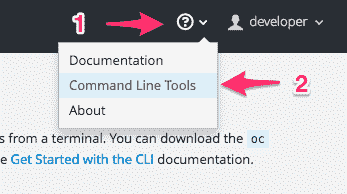
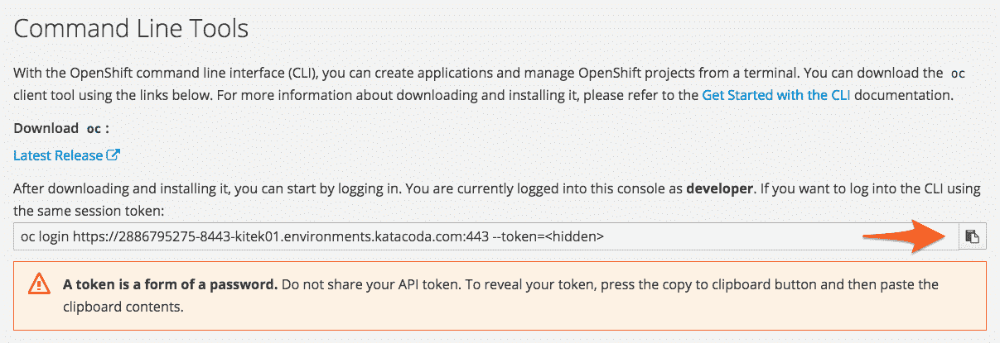

# 从命令行登录时，我使用什么 URL？

> 原文：<https://developers.redhat.com/openshift/url-logging-command-line>

如果您不知道从命令行登录时使用什么 URL，但是已经登录到 web 控制台，您可以通过访问帮助菜单下的*命令行工具*选项找到 URL。

显示的页面将为您提供 URL，以及登录时运行的命令。这个命令将包含一个访问令牌，您可以使用它来代替提供您的用户名和密码。

您可以单击剪切和粘贴图标，将带有隐藏标记的命令自动复制到您的粘贴缓冲区中。然后，您可以将该命令粘贴到终端窗口中。

[在 OpenShift 上开发应用](https://developers.redhat.com/openshift)

**红帽 OpenShift 集装箱平台**

【OpenShift 和 Kubernetes 有什么区别？

[有哪些关于 OpenShift 的书籍？](https://developers.redhat.com/openshift/openshift-books/)

在哪里可以试用 OpenShift，看看它是什么样的？

[如何在自己的电脑上运行 OpenShift 进行开发？](https://developers.redhat.com/openshift/local-openshift/)

[有哪些使用 OpenShift 的托管服务？](https://developers.redhat.com/openshift/hosting-openshift/)

*Last updated: November 19, 2020*