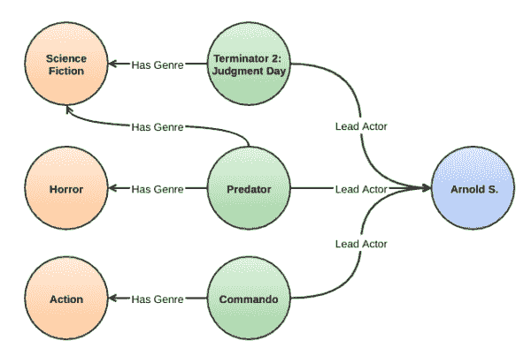
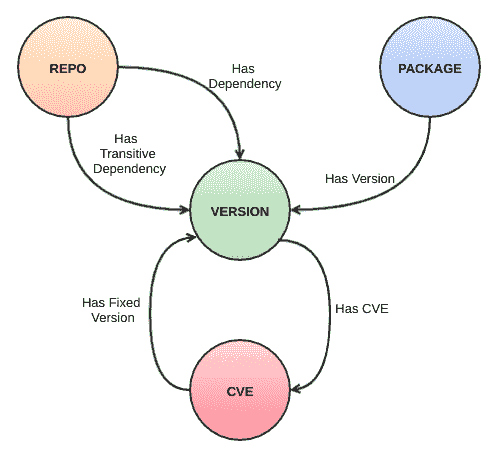

# 使用知识图发现开源包漏洞

> 原文：<https://developers.redhat.com/blog/2021/05/10/use-knowledge-graphs-to-discover-open-source-package-vulnerabilities>

技术和基础设施每天都会产生大量的数据。从各种现实世界的数据中构建知识可能是一个巨大的挑战。本文描述了如何从数据中获得简明而精确的知识，并使用它来跟踪软件栈中的漏洞。它提出了与包安全性和漏洞相关的挑战，以及如何使用知识图来解决这些挑战。阅读完本文后，您将理解知识图的概念以及如何将它应用到您的领域中。

## 为什么开源包会引入漏洞

大多数大型组织使用开源库和组件来构建内部和外部使用的软件。虽然[开源](/topics/open-source/)有助于解决许多问题，但开发者需要了解如何[追踪他们使用的所有软件中的安全漏洞](/topics/security)。安全漏洞可以通过它所依赖的库和工具带入主机软件。随着包含越来越多的依赖项，问题越来越严重。

确保使用最安全版本的软件依赖项是一件乏味且耗时的事情。尽管开放源码包漏洞数据库经常更新，但在中等规模和大规模的软件开发过程中，每天跟踪这些数据库，甚至跟踪每个版本都是困难的。

您需要考虑的问题包括:

*   哪些直接依赖易受攻击？
*   对于依赖项，推荐使用哪个版本？
*   基于当前的依赖关系，哪些漏洞对软件栈是危险的？
*   常见漏洞和披露(CVE)列表中最近增加的内容对应用程序有何影响？需要修改哪些依赖项来降低风险？
*   组织中有多少项目受到新报告的漏洞的影响？
*   有没有可以用来降低安全风险的配套包？
*   传递性包进入软件会造成哪些安全风险？

知识图表可以帮助您以快速、自动化的方式找到这些问题的答案。

## 什么是知识图？

真实世界的域由许多对象和它们之间的关系组成。因为每个对象都与其他对象有关系，而其他对象又与其他对象有关系，所以出现了一个复杂的互连对象(或*实体*)网。在软件设计中，我们可以用图形结构来表示实体之间的这些复杂关系。

一个*知识图*将一个知识领域的数据表示为一个图形结构，该结构揭示了每对实体之间的关系。知识图可以以一种有意义的方式组织庞大、复杂的数据，使数据更容易理解和使用。人类的大脑是由知识图表组成的，它允许我们以一种有效的方式(准确而快速地)将概念联系起来并提取所需的信息。

### 知识图表的优势

为了理解知识图的概念，让我们考虑一个简单的例子。假设一家公司提供点播电影作为服务。其业务挑战之一是根据观众的观看历史提供更准确的推荐。这种学习必须是动态的，因此推荐可以随着观众偏好的改变而改变。

该公司可以通过将其所有数据安排到顺序数据存储中并获取推荐来应对这一挑战，推荐是通过根据观众观看历史的属性(如类型、演员、制片厂等)过滤电影来创建的。

但是，这种平面数据挖掘存在一些问题:

*   这非常耗时，因为我们需要搜索整个数据库来查找每一条推荐。
*   按重要性从高到低的顺序排列结果可能很复杂。
*   随着电影和观众数量的增长，它的规模也不太好。

或者，我们可以在一个图形结构中安排这个电影数据，用*节点*表示实体，如流派、主要演员、制片人、上映日期等。，和*的边缘*代表着关系。图 1 显示了三部电影的主角和类型。

Figure 1: Movie data arranged in knowledge graph format.

假设一个观众在公司的平台上只看过一部电影(例如*终结者 2:审判日*)，我们的知识图中只有前面的信息。该系统可以找到具有相同主角的其他电影(在这种情况下，*掠夺者*和*突击队)。*为了内置用户偏好，系统还可以考虑流派信息。我们看到*终结者 2:审判日*和*捕食者*都属于科幻类型。鉴于这个观众的数据有限，推荐系统可以很容易地对他们可能喜欢的其他电影进行排名——*捕食者*，其次是*突击队*。

这是一个说明这个概念的基本例子。事实上，通常会有许多节点和边将它们相互连接起来。这种复杂的图形结构的优点是，图形遍历不会像顺序数据那样随着数据大小呈指数增长。在每个横断面上，我们从扫描中剔除大量无效数据，从而提供高效快速的信息检索。

知识图用于许多知识领域，以服务于现实世界的应用，例如:

*   搜索引擎，为用户提供更合适的内容。
*   电子商务、娱乐、健康等推荐系统。
*   定向广告系统。
*   电子商务的优惠和促销。
*   用户行为分析。

知识图带来的优势包括:

*   语义数据表示。
*   显性知识表示。
*   关于数据的见解。
*   持续更新的数据。
*   自学习和自适应系统。
*   与机器学习和人工智能的集成。

现在让我们看看知识图如何帮助我们解决软件依赖中的漏洞。

## 评估软件包漏洞时管理数据

包漏洞的知识图需要该领域中涉及的数据的深度和广度的布局。如果应用程序只有几个依赖项，大多数安全问题可以通过扫描源库和漏洞数据库来解决。要找到没有已知漏洞的依赖项，您需要将依赖项与没有漏洞的版本进行匹配。然而，当您有许多依赖项时，问题会变得复杂得多，每个依赖项又有自己的依赖项(传递性依赖项)。今天的现代软件解决方案直接依赖于其他开发者开发的其他包或模块，而这些依赖反过来又建立在其他包之上。

许多包有 100 个或更多的版本，有许多针对这些版本的 cv。私营供应商提供的安全和漏洞数据增加了更多需要分析的数据。这些不同来源的可能组合会产生大量数据，需要对这些数据进行扫描，以确定漏洞最少或没有漏洞的正确版本组合。

因为存储的数据不是静态的，而是随时间变化的，所以增加了额外的负担。可能会为旧版本发现新的 CVE，可能会对现有的 CVE 进行修复，等等。因此，管理员需要大量的时间来使他们的系统保持最新和最准确的信息。

漏洞评估经常被软件开发人员忽视或轻视为琐碎的工作。评估需要浏览大量数据，以便找到每个漏洞。当漏洞评估没有被完全忽略时，它通常被推迟到发布日期，在发布日期，包会被安全扫描软件或安全团队捕获和阻止。然后，开发人员必须努力找到正确的依赖项，并更新他们的版本。

## 从数据到知识

本文提出的解决方案是将各种来源的关于软件包版本和漏洞的大量数据组织到一个知识库中，可以根据需要进行查询。知识库可以立即提供最新的准确信息。其他优势包括:

*   开发人员检查漏洞的更简单、更快速的方法。
*   关于依赖关系的更明智和准确的决策。
*   在软件栈开发周期的早期进行安全和漏洞检查。
*   持续的漏洞扫描，例如通过夜间作业，或者在每个代码提交到存储库时。

## 软件漏洞知识图的要素

知识图将实体和关系组织成一个正式的结构。软件包依赖性和漏洞的实体有:

*   **源代码库(repo)** :托管一个或多个包的实体。
*   **包**:提供可重用软件的模块或子模块。
*   **Version** :一个与 repo 或 package 相关联的标签，用于标识源代码的唯一实例或版本。
*   **CVE** :与回购或打包版本相关的安全缺陷。

实体之间的关系如下:

*   **有版本**:包和版本的一对多关系。
*   **有 CVE** :版本和 CVE 的一对多关系。
*   **有固定版本**:CVE 和固定版本(如果有)一一对应的关系。
*   **有依赖关系**:回购/打包与版本一对多关系。
*   **有传递依赖**:回购和版本一对多关系。

图 2 显示了实体及其关系。

Figure 2: The package dependencies and entities.

数据建模的这一练习表明，软件包的漏洞信息可以用图形结构来表达。对真实的软件包数据进行分析可以形成一个知识图，您可以用它来保护您自己的软件。许多图形数据库，包括开源数据库，都可以用来表示你的知识图。

通过访问 *repo* 节点，系统可以找到所有易受攻击的软件包版本(直接版本和传递版本)。它可以构建与这些包版本相关联的 CVE 列表。此外，对于每个 CVE，该图还可以提供解决漏洞的软件包的固定版本(如果有的话)。这些数据和许多数据都可以从常见漏洞数据的简单知识图中检索到。

## 结论

知识图的概念可以应用于包含许多实体和实体间关系的任何领域。您可以将数据整理成一个紧凑的知识图表，轻松提供正确的信息，更加准确、快速和高效。此外，知识图的动态性质使其保持新鲜和相关。根据您的业务需求选择合适的数据库引擎将使该解决方案更加健壮，并允许它随着时间的推移而扩展。

## 相关文章

以下是关于这种方法的相关文章:

*   [Red Hat 依赖分析的新功能](https://developers.redhat.com/blog/2019/10/15/whats-new-in-red-hat-dependency-analytics/)
*   [利用 Red Hat CodeReady 依赖分析和 Snyk Intel 进行漏洞分析](https://developers.redhat.com/blog/2020/08/28/vulnerability-analysis-with-red-hat-codeready-dependency-analytics-and-snyk/)

*Last updated: October 14, 2022*