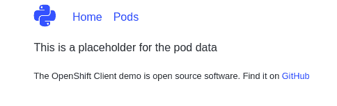
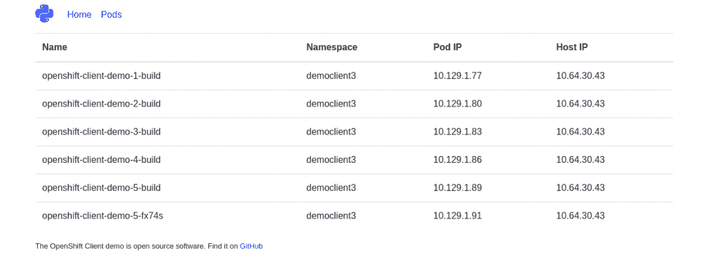

# 从您正在运行的 Red Hat OpenShift pods 使用 Kubernetes Python 客户端

> 原文：<https://developers.redhat.com/blog/2019/05/14/use-the-kubernetes-python-client-from-your-running-red-hat-openshift-pods>

[Red Hat OpenShift](https://developers.redhat.com/openshift/) 是云计算本地计算基金会(CNCF) [认证计划](https://www.cncf.io/certification/software-conformance/#logos)的一部分，确保您的[容器](https://developers.redhat.com/blog/category/containers/)工作负载的可移植性和互操作性。这也允许您使用 [Kubernetes](https://developers.redhat.com/topics/kubernetes/) 工具与 OpenShift 集群(如`kubectl`)进行交互，并且您可以放心，您所知道和喜爱的所有 API 就在您的指尖。

Kubernetes [Python](https://developers.redhat.com/blog/category/python/) 客户端是另一个与 OpenShift 集群交互的优秀工具，允许您使用 Python 代码对 Kubernetes 资源执行操作。它在集群中也有应用程序。我们可以配置一个运行在 OpenShift 上的 Python 应用程序来使用 OpenShift API，并列出和创建资源。例如，我们可以从正在运行的应用程序或定制的服务监视器中创建容器化的批处理作业。这听起来有点像“OpenShift inception”，使用 OpenShift API 创建的服务中的 OpenShift API。

在本文中，我们将创建一个运行在 OpenShift 上的 [Flask](https://developers.redhat.com/blog/2019/02/18/containerized-python-flask-development-environment-red-hat-codeready-workspaces/) 应用程序。这个应用程序将使用 Kubernetes Python 客户端与 OpenShift API 进行交互，列出项目中的其他 pod，并向用户显示它们。

你需要做几件事情:

*   开放式移位集群
*   Python 的实用知识

我们开始吧！

## 设置

我已经创建了一个模板来减少大量的样板文件，所以让我们把它复制下来:

```
git clone https://github.com/shaneboulden/openshift-client-demo
cd openshift-client-demo

```

您可以使用提供的模板在 OpenShift 集群上创建一个新的应用程序，并查看应用程序的运行情况:

```
oc new-app openshift_deploy/ocd.yaml

```

如果你做一个`oc get routes`，你将能够看到已经创建的路线。现在，如果你选择*窗格*菜单项，你只会得到一些占位符文本。我们将很快修复此问题:)

[](https://developers.redhat.com/blog/wp-content/uploads/2019/05/Screenshot-from-2019-05-06-21-46-12.png)

## 配置 Kubernetes Python 客户端

一旦我们配置了客户端，列出 pods 就变得简单了，幸运的是，我们可以使用一点 Kubernetes Python 客户端的魔力，通过正确的服务帐户令牌轻松地进行配置。

通常，我们会使用一个 kubeconfig 文件配置一个 Kubernetes 客户机，该文件具有创建 API 请求所需的令牌和主机名。Kubernetes Python 客户端还提供了一个方法`load_incluster_config()`，它替换了正在运行的 pod 中的 kubeconfig 文件，而不是使用可用的环境变量和挂载点来查找服务帐户令牌，并根据 pod 中可用的信息构建 API URLs。

使用`load_incluster_config()`还有另一个巨大的好处——我们的代码现在是可移植的。我们可以将这个应用程序应用到任何 Kubernetes 集群中，不需要任何关于主机名或网络地址的假设，使用这个非常棒的小方法就可以轻松地构造 API 请求。

让我们配置我们的应用程序来使用`load_incluster_config()`方法。首先，我们需要导入客户端和配置对象，您可以在`ocd.py`文件中验证这一点:

```
from kubernetes import client, config

```

我们现在可以使用这个神奇方法来配置客户端:

```
config.load_incluster_config()
v1 = client.CoreV1Api()

```

就是这样！这是我们需要能够从运行 pod 与 OpenShift API 交互的所有代码。

## 使用 Kubernetes 向下 API

我要在这里介绍一些新的东西，是的，这是另一个“OpenShift-inception”的概念。我们将使用`list_namespaced_pod`方法来列出 pod 细节；你可以在[文档](https://github.com/kubernetes-client/python/blob/master/kubernetes/docs/CoreV1Api.md)中找到所有可用的方法。要使用这个方法，我们需要将当前的名称空间(项目)传递给 Kubernetes 客户端对象。但是，等等，我们如何从正在运行的 pod 内部获取 pod 的名称空间呢？

这是另一个令人敬畏的 Kubernetes API 发挥作用的地方。它被称为[向下 API](https://kubernetes.io/docs/tasks/inject-data-application/environment-variable-expose-pod-information/#the-downward-api) ，允许我们从正在运行的 pod 内部访问关于我们的 pod 的元数据。为了向我们的 pod 公开来自向下 API 的信息，我们可以使用环境变量。如果您查看模板，您会在“env”部分看到以下内容:

```
- name: POD_NAMESPACE
  valueFrom:
    fieldRef:
      apiVersion: v1
      fieldPath: metadata.namespace

```

## 把所有的东西放在一起

现在让我们回到`ocd.py`文件中的`/pods`路线。我们需要做的最后一件事是将应用程序的名称空间传递给 Kubernetes 客户端。我们已经将环境变量配置为使用向下 API，所以让我们将它传入:

```
pods = v1.list_namespaced_pod(namespace=os.environ["POD_NAMESPACE"])

```

确保您位于顶级项目目录中(即，您可以看到自述文件),并从本地目录开始构建:

```
oc start-build openshift-client-demo --from-dir=.

```

当您下次访问路线并选择*窗格*菜单时，您将能够看到当前名称空间的所有窗格:

[](https://developers.redhat.com/blog/wp-content/uploads/2019/05/Screenshot-from-2019-05-06-21-36-36.png)

我希望您喜欢这个关于 Kubernetes Python 客户端的简短介绍。如果你想探索得更深入一点，你可以看看创建资源。这里有一个例子，它着眼于从 API POSTs 创建容器化的批处理作业。

*Last updated: September 3, 2019*